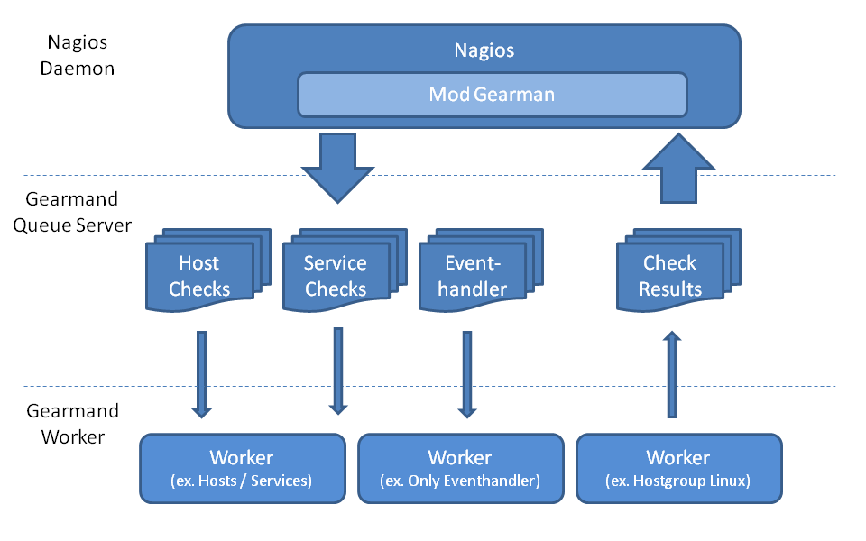
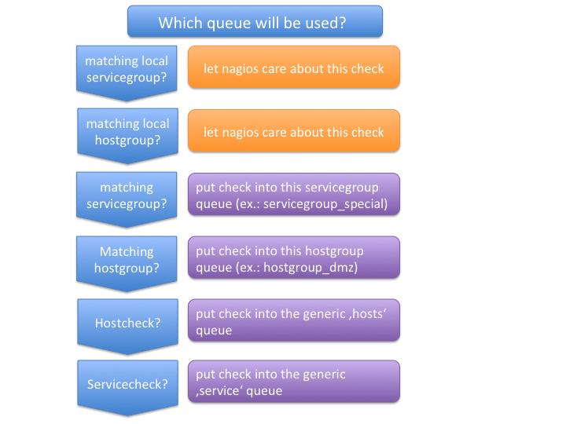
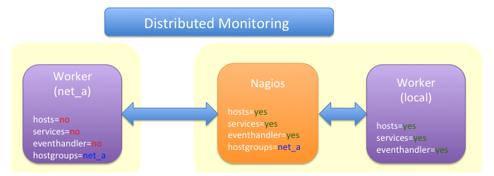
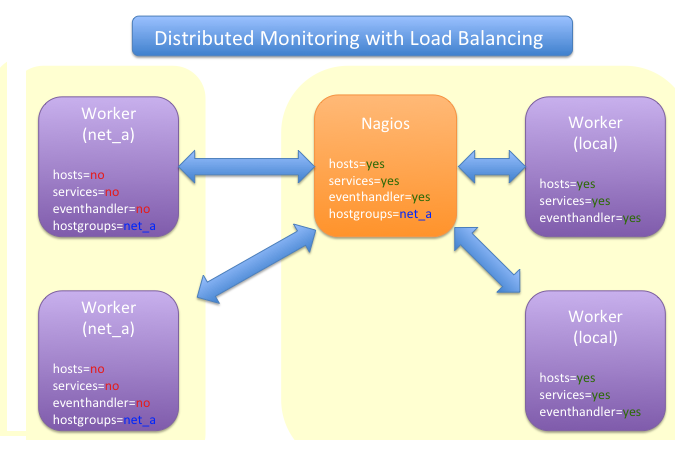
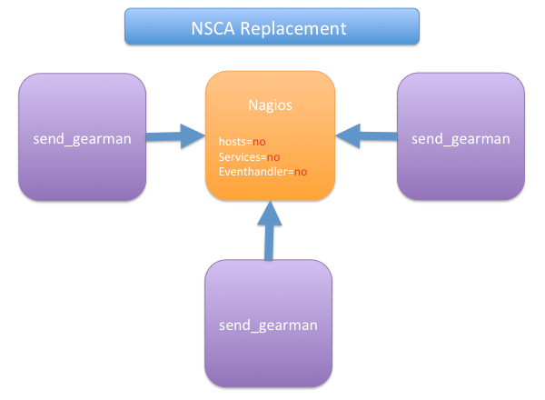
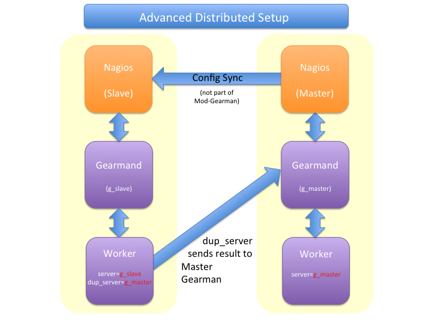
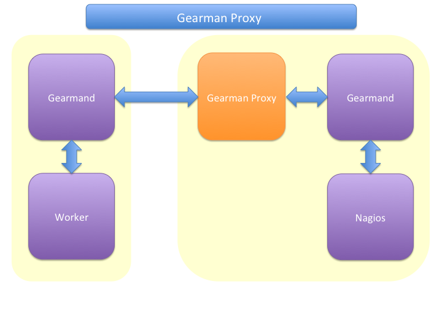
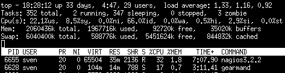
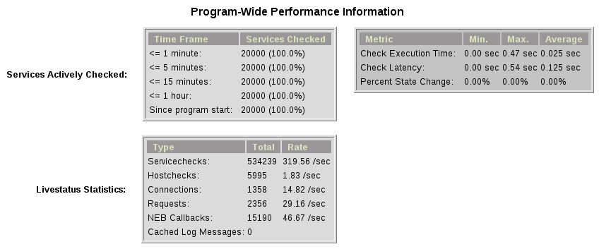

## How does it work

When the Mod-Gearman broker module is loaded, it intercepts all
servicechecks, hostchecks and the eventhandler events. Eventhandler
are then sent to a generic 'eventhandler' queue. Checks for hosts
which are in one of the specified hostgroups, are sent into a seperate
hostgroup queue. All non matching hosts are sent to a generic 'hosts'
queue.  Checks for services are first checked against the list of
servicegroups, then against the hostgroups and if none matches they
will be sent into a generic 'service' queue. The NEB module starts a
single thread, which monitors the 'check_results' where all results
come in.



A simple example queue would look like:

| Queue Name        | Worker Available | Jobs Waiting | Jobs Running |
|-------------------|------------------|--------------|--------------|
| **check_results** | 1                | 0            | 0            |
| **eventhandler**  | 50               | 0            | 0            |
| **host**          | 50               | 0            | 1            |
| **service**       | 50               | 0            | 13           |

There is one queue for the results and two for the checks plus the
eventhandler queue.

The workflow is simple:

 1. Naemon wants to execute a service check.
 2. The check is intercepted by the Mod-Gearman neb module.
 3. Mod-Gearman puts the job into the 'service' queue.
 4. A worker grabs the job and puts back the result into the
    'check_results' queue
 5. Mod-Gearman grabs the result job and puts back the result onto the
    check result list
 6. The Naemon reaper reads all checks from the result list and
    updates hosts and services

You can set some host or servicegroups for special worker. This
example uses a seperate hostgroup for Japan and a seperate
servicegroup for resource intensive selenium checks.

It would look like this:

| Queue Name                | Worker Available | Jobs Waiting | Jobs Running |
|---------------------------|:-----------------|:-------------|:-------------|
| **check_results**         | 1                | 0            | 0            |
| **eventhandler**          | 50               | 0            | 0            |
| **host**                  | 50               | 0            | 1            |
| **hostgroup_japan**       | 3                | 1            | 3            |
| **service**               | 50               | 0            | 13           |
| **servicegroup_selenium** | 2                | 0            | 2            |

You still have the generic queues and in addition there are two queues
for the specific groups.

The worker processes will take jobs from the queues and put the result
back into the check_result queue which will then be taken back by the
neb module and put back into the Naemon core. A worker can work on one
or more queues. So you could start a worker which only handles the
'hostgroup_japan' group.  One worker for the 'selenium' checks and one
worker which covers the other queues. There can be more than one
worker on each queue to share the load.



## Common Scenarios

### Load Balancing


The easiest variant is a simple load balancing. For example if your
single Naemon box just cannot handle the load, you could just add a
worker in the same network (or even on the same host) to reduce your
load on the Naemon box. Therefor we just enable hosts, services and
eventhandler on the server and the worker.

Pro:
 * reduced load on your monitoring box

Contra:
 * no failover

### Distributed Monitoring



If your checks have to be run from different network segments, then
you can use the hostgroups (or servicegroups) to define a hostgroup
for specific worker. The general hosts and services queue is disabled
for this worker and just the hosts and services from the given
hostgroup will be processed.

Pro:
 * reduced load on your monitoring box
 * ability to access remote networks

Contra:
 * no failover

### Distributed Monitoring with Load Balancing



Your distributed setup could easily be extended to a load balanced
setup with just adding more worker of the same config.

Pro:
 * reduced load on your monitoring box
 * ability to access remote networks
 * automatic failover and load balancing for worker

Contra:
 * no failover for the master

### NSCA Replacement



If you just want to replace a current NSCA solution, you could load
the Mod-Gearman NEB module and disable all distribution features. You
still can receive passive results by the core send via
send_gearman / send_multi. Make sure you use the same encryption
settings like the neb module or your core won't be able to process the
results or use the 'accept_clear_results' option.

Pro:
 * easy to setup in existing environments

### Distributed Setup With Remote Scheduler



In case your network is unstable or you need a gui view from the
remote location or any other reason which makes a remote core
unavoidable you may want this setup. Thist setup consists of 2
independent Mod-Gearman setups and the slave worker just send their
results to the master via the 'dup_server' option. The master
objects configuration must contain all slave services and hosts.
The configuration sync is not part of Mod-Gearman.

Pro:
 * independent from network outtakes
 * local view

Contra:
 * more complex setup
 * requires configuration sync

### Gearman Proxy



Sometimes you may need to reverse the direction of the initial
connection attempt. Usually the worker and the neb module open the
initial connection so they need to access the gearmand port. In cases
where no direct connection is possible use ssh tunnel or the Gearman
proxy. The Gearman proxy just puts jobs from one gearmand into another
gearmand and vice versa.

gearman_proxy.pl can be found at [here](https://github.com/sni/gearman-proxy).

Pro:
 * changes direction of initial connection setup
 * buffers network outages

Contra:
 * two more daemon to monitor and maintain

## Installation

### OMD

Using OMD is propably the easiest way of installing and using
Mod-Gearman. You just have to run 'omd config' or set Mod-Gearman
to 'on'.

OMD is available for Debian, Ubuntu, Centos/Redhat and SLES.

    OMD[test]:~$ omd config set MOD_GEARMAN on

## Configuration

All config parameters for Mod-Gearman can be found [here](../configuration/).

## Queue Names

You may want to watch your gearman server job queue. The shipped
gearman_top does this. It polls the gearman server every second
and displays the current queue statistics.

| Name                      | Worker | Avail | Queue | Running |
|---------------------------|--------|-------|-------|---------|
| **check_results**         | 1      | 1     | 0     | 0       |
| **host**                  | 3      | 3     | 0     | 0       |
| **service**               | 3      | 3     | 0     | 0       |
| **eventhandler**          | 3      | 3     | 0     | 0       |
| **servicegroup_jmx4perl** | 3      | 3     | 0     | 0       |
| **hostgroup_japan**       | 3      | 3     | 0     | 0       |

**check_results**

this queue is monitored by the neb module to fetch results from the
worker. You don't need an extra worker for this queue. The number of
result workers can be set to a maximum of 256, but usually one is
enough. One worker is capable of processing several thousand results
per second.

**host**

This is the queue for generic host checks. If you enable host checks
with the hosts=yes switch. Before a host goes into this queue, it is
checked if any of the local groups matches or a seperate hostgroup
machtes. If nothing matches, then this queue is used.

**service**

This is the queue for generic service checks. If you enable service
checks with the `services=yes` switch. Before a service goes into this
queue it is checked against the local host- and service-groups. Then
the normal host- and servicegroups are checked and if none matches,
this queue is used.

**hostgroup_\<name\>**

This queue is created for every hostgroup which has been defined by
the hostgroups=... option. Make sure you have at least one worker for
every hostgroup you specify. Start the worker with `--hostgroups=...`
to work on hostgroup queues. Note that this queue may also contain
service checks if the hostgroup of a service matches.

**servicegroup_\<name\>**

This queue is created for every servicegroup which has been defined by
the `servicegroup=...` option.

**eventhandler**

This is the generic queue for all eventhandler. Make sure you have a
worker for this queue if you have eventhandler enabled. Start the
worker with `--events` to work on this queue.

**perfdata**

This is the generic queue for all performance data. It is created and
used if you switch on `--perfdata=yes`. Performance data cannot be
processed by the gearman worker itself. You will need [PNP4Nagios](https://github.com/pnp4nagios/pnp4nagios) (it's also included in [OMD](/docs/omd/)).

## Performance

While the main motivation was to ease distributed configuration, this
plugin also helps to spread the load on multiple worker. Throughput is
mainly limited by the amount of jobs a single Naemon instance can put
onto the Gearman job server. Keep the Gearman job server close to the
Naemon box. Best practice is to put both on the same machine. Both
processes will utilize one core. Some testing with my workstation
(Dual Core 2.50GHz) and two worker boxes gave me these results. I used
a sample Nagios installation with 20.000 Services at a 1 minute
interval and a sample plugin which returns just a single line of
output. I got over 300 Servicechecks per second, which means you could
easily setup 100.000 services at a 5 minute interval with a single
Nagios box. The amount of worker boxes depends on your check types.



Load in `top`



Overview in Thruk

## Exports

Exports export data structures from the Naemon core as JSON data. For
each configurable event one job will be created. At the moment, the
only useful event type is the logdata event which allows you to create
a json data job for every logged line. This can be very useful for
external reporting tools.

**exports**

Set the queue name to create the jobs in. The return code will be sent
back to the core (Not all callbacks support return codes). Callbacks
are a list of callbacks for which you want to export json data.

    export=<queue>:<returncode>:<callback>[,<callback>,...]
    export=log_queue:1:NEBCALLBACK_LOG_DATA

## Embedded Perl

Since 1.2.0 Mod-Gearman has builtin embedded Perl support which means
generally a big performance boost when you have lots of perl plugins.

To enable embedded Perl you need to run configure with
--enable-embedded-perl

    $ ./configure --enable-embedded-perl otheroptions...

The `--with-perlcache configure` option has been replaced by a runtime configure option `use_perl_cache`.

NOTE: Not all perl plugins support EPN. You can fix them, add '#
naemon: -epn' in the first 10 lines of the script or set
'use_embedded_perl_implicitly=off' so all scripts without the explicit
tag are run without embedded Perl.

The default configuration of Mod-Gearman enables embedded Perl, but
only uses it for Perl scripts which explicitly set '# naemon: +epn'.
This is a very safe way of using embedded Perl but you probably miss
some plugins which do not set the header and still would run with EPN.
You may want to use the 'mini_epn' from your Naemon installation to
verify if a plugin works with EPN or not.

General EPN documentation is valid for Mod-Gearman as well:

 * [Embedded Perl](https://www.naemon.io/documentation/usersguide/embeddedperl.html)
 * [Plugin Guidelines](https://www.naemon.io/documentation/usersguide/epnplugins.html)

NOTE: Mod-Gearman does not fix all of the memory leaks introduced with
Naemon and Embedded Perl, but it moves the leaks away from the core.
And they do not affect Mod-Gearman at all, as they are only in the
preforked worker processes which will be restarted automatically from
time to time (see 'max-jobs').

## How To

### How to Monitor Job Server and Worker

Use the supplied check_gearman to monitor your worker and job server.
Worker have a own queue for status requests.

    $ ./check_gearman -H <job server hostname> -q worker_<worker hostname> -t 10 -s check
check_gearman OK - localhost has 10 worker and is working on 1 jobs|worker=10 running=1 total_jobs_done=1508

This will send a test job to the given job server and the worker will
respond with some statistical data.

Job server can be monitored with:

    $ ./check_gearman -H localhost -t 20
check_gearman OK - 6 jobs running and 0 jobs waiting.|check_results=0;0;1;10;100 host=0;0;9;10;100 service=0;6;9;10;100

### How to Submit Passive Checks

You can use send_gearman to submit active and passive checks to a
gearman job server where they will be processed just like a finished
check would do.

    $ ./send_gearman --server=<job server> --encryption=no --host="<hostname>" --service="<service>" --message="message"

### How to build send_gearman.exe

After installing strawberry perl, you need to install the
'PAR::Packer' module and run pp:

    $ pp -l zlib1__.dll -l ssleay32__.dll -l libeay32__.dll -x -z 9 -o send_gearman.exe send_gearman.pl

### How to Submit check_multi Results

check_multi is a plugin which executes multiple child checks.

You can pass such child checks to Naemon via the mod_gearman
neb module:

    $ check_multi -f multi.cmd -r 256 | ./send_multi --server=<job server> --encryption=no --host="<hostname>" --service="<service>"

If you want to use only check_multi and no other workers, you can
achieve this with the following neb module settings:

    broker_module=/usr/local/share/naemon/mod_gearman_naemon.o server=localhost encryption=no eventhandler=no hosts=no services=no hostgroups=does_not_exist config=.../module.conf

NOTE: encryption is not necessary if you both run the check_multi checks
and the Naemon check_results queue on the same server.

### How to Set Queue by Custom Variable

Set 'queue_custom_variable=worker' in your Mod-Gearman NEB
configuration. Then adjust your Naemon host/service configuration and
add the custom variable:

```
  define host {
    ...
    _WORKER    hostgroup_test
  }
```

The test hostgroup does not have to exist, it is a virtual queue name
which is used by the worker.

Adjust your Mod-Gearman worker configuration and put 'test' in the
'hostgroups' attribute. From then on, the worker will work on all jobs
in the 'hostgroup_test' queue.

## Notifications

Starting with version 3.0.2 Mod-Gearman does distribute Notifications as well.
All Notifications (except bypassed by local groups) are send into the notifications
queue and processed from there.

Mod-Gearman does not support environment macros, except two plugin output related
ones.

It does set

    - NAGIOS_SERVICEOUTPUT
    - NAGIOS_LONGSERVICEOUTPUT

for service notifications and

    - NAGIOS_HOSTOUTPUT
    - NAGIOS_LONGHOSTOUTPUT

for host notifications.

## Hints
 - Make sure you have at least one worker for every queue. You should
   monitor that (check_gearman).
 - Add Logfile checks for your gearmand server and mod_gearman
   worker.
 - Make sure all gearman checks are in local groups. Gearman self
   checks should not be monitored through gearman.
 - Checks which write directly to the Naemon command file (ex.:
   check_mk) have to run on a local worker or have to be excluded by
   the localservicegroups.
 - Keep the gearmand server close to Naemon for better performance.
 - If you have some checks which should not run parallel, just setup a
   single worker with --max-worker=1 and they will be executed one
   after another. For example for cpu intesive checks with selenium.
 - Make sure all your worker have the Monitoring-Plugins available under
   the same path. Otherwise they could'nt be found by the worker.
