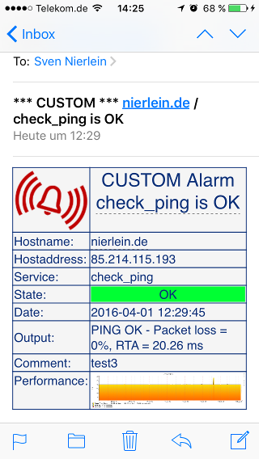

## Notifications

Notifications are part of every standard monitoring installation. But OMD makes it very easy to customize the layout of your email notifications by using templates.

By default, you will have the 2 standard notifications templates in your site folder at:

``` bash
    OMD[site]:~$ ls -la etc/mail-templates/
    total 12
    drwxr-xr-x 1 site site  166 Mar 30 14:37 ./
    drwxr-xr-x 1 site site  754 Mar 26 14:21 ../
    -rw-r--r-- 1 site site  867 Jun 12  2014 notify-by-email.host.tpl
    -rw-r--r-- 1 site site  937 Jun 12  2014 notify-by-email.service.tpl
```

with the corresponding commands `host-notify-by-email` and `service-notify-by-email` defined in **etc/nagios/conf.d/notification\_commands.cfg**

If you just want to change the default layout of your email notifications, just edit
the templates from the path above.


## HTML E-Mail Notifications

<p class="hint">
Starting with OMD 2.20 the html mail commands and templates are included already and can directly be used by assigning the <code>host- and service-notify-by-email-html</code> commands.
</p>

In order to send HTML emails we need to add a template  for html mails and create two
new commands. The changed parts are bold.

<pre>
define command {
    command_name service-notify-by-email<b>-html</b>
    command_line /usr/bin/perl $USER1$/notify-by-email.pl \
        <b>--template=$USER4$/etc/mail-templates/notify-by-email.service.html.tpl</b> \
        <b>--mail=/usr/sbin/sendmail \</b>
        <b>-o BASEURL="http://`hostname -f`/$USER3$/"</b> \
        -o NOTIFICATIONTYPE='$NOTIFICATIONTYPE$' \
        -o NOTIFICATIONCOMMENT='$NOTIFICATIONCOMMENT$' \
        -o HOSTNAME='$HOSTNAME$' \
        <b>-o HOSTALIAS='$HOSTALIAS$' \</b>
        -o HOSTSTATE='$HOSTSTATE$' \
        -o CONTACTEMAIL='$CONTACTEMAIL$' \
        -o HOSTADDRESS='$HOSTADDRESS$' \
        -o SHORTDATETIME='$SHORTDATETIME$' \
        -o SERVICEDESC='$SERVICEDESC$' \
        -o SERVICESTATE='$SERVICESTATE$' \
        -o SERVICEOUTPUT='$SERVICEOUTPUT$' \
        -o LONGSERVICEOUTPUT='$LONGSERVICEOUTPUT$' \
        -o SERVICEPERFDATA='$SERVICEPERFDATA$' \
        -o ACKAUTHOR='$SERVICEACKAUTHOR$' \
        -o ACKCOMMENT='$SERVICEACKCOMMENT$' \
        -o DURATION='$SERVICEDURATION$' \
        -o SERVICEEVENTID='$SERVICEEVENTID$' \
        -o LASTSERVICEEVENTID='$LASTSERVICEEVENTID$'
}
</pre>

It is important to use /usr/sbin/sendmail as mailer, otherwise you will get errors like<br>
`Ignoring header field "MIME-Version: 1.0"`.

Now do the same for the host command.

Last step is to configure your contacts to use the new html commands.

You can also download the prepared files:

```
cd ~/etc/mail-templates/ && wget https://labs.consol.de/omd/data/notify-by-email.host.html.tpl
cd ~/etc/mail-templates/ && wget https://labs.consol.de/omd/data/notify-by-email.service.html.tpl
cd ~/etc/nagios/conf.d   && wget https://labs.consol.de/omd/data/notification_commands_html.cfg
```

### Troubleshooting

If it doesn't work as expected, make sure you:

- have /usr/sbin/sendmail installed
- have configured the html commands for your contact
- try to run the command manually:

        ./lib/nagios/plugins/notify-by-email.pl \
                --template=etc/mail-templates/notify-by-email.service.html.tpl \
                --mail=/usr/sbin/sendmail \
                --verbose \
                -o CONTACTEMAIL='your@email.com'

    Of course you need to insert a valid email address.


### Result

If everything worked, you should receive notifications in html format including
the pnp performance graphs.


