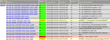
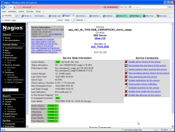

Es gibt ein neues Mitglied in der check_&lt;datenbank&gt;_health-Familie. Nach Oracle, MS SQL und MySQL habe ich mir DB2 vorgenommen und ein Plugin geschrieben, das leicht erweiterbar ist und grundlegende Anforderungen out of the box abdeckt.

<!--more-->Das Plugin setzt die Installation von DBD::DB2 voraus, das man bei IBM herunterladen kann: <a href="http://www.ibm.com/software/data/db2/perl" target="_blank">http://www.ibm.com/software/data/db2/perl</a>

&nbsp;

&nbsp;

&nbsp;

&nbsp;

&nbsp;

&nbsp;

&nbsp;

&nbsp;

&nbsp;

&nbsp;

&nbsp;

&nbsp;

Zur Speicherung von Zwischenergebnissen wird das Verzeichnis /var/tmp/check_db2_health angelegt. Es ist darauf zu achten, dass der Nagios-Benutzer die dazu nötigen Privilegien besitzt.
