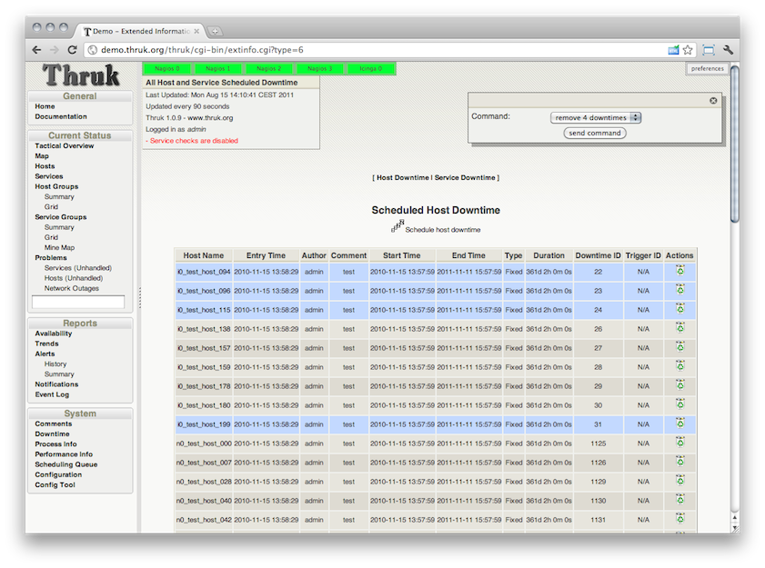
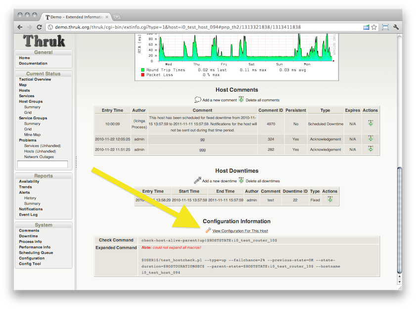

<a href="http://www.thruk.org/">Thruk</a> 1.0.9 has just been released and contains a couple of cool new features. This version will also be in the next OMD release. Besides the release itself, new documentation about <a href="http://www.thruk.org/plugins.html">plugins</a> and <a href="http://www.thruk.org/themes.html">themes</a> has been published.

<!--more-->
Changes in detail:

## New Mine Map
The Mine Map can give you a quick overview over your overall status. It is best used with service/hostgroups which contain lots of common services otherwise it will be a litte bit cluttered. There are better views for those service/hostgroups. Views can be switched through the selection in the filter panel without loosing the current filter. This makes it very easy to try different views on your hosts and services.

## Delete Comments and Downtimes
Another often requested feature: It is now possible to delete comments and downtimes directly from the comments/downtime list.

## Easy Themes Management
Themes can be enabled or disabled just like plugins through the themes/themes-enabled folder. This should make it easier to add new own themes or disabled unwanted themes. Read more about [themes][2].

## Configuration Information
There is now a link to the configuration information from the host or service details. The config information now contains contact information so you can see who is responsible for this host/service with just one click.

## Command Reschedule Alias
A new config option 'command_reschedule_alias' has been added. It allows you to forward reschedule requests from one service to another. This is extremly helpful if you have lot of passive services which get feed by an active agent check. When there is for example a critical passive check on your problems page which cannot be rescheduled because it has no useful check command defined, you could use this option to forward the reschedule request to the active agent which then does the active check and updates the passive checks too.

An example for check_mk:
<pre>
command_reschedule_alias = ^check_mk\-(?!inventory);Check_MK
</pre>

So whenever you reschedule a passive check with a command matching the pattern above, not the passive check will be rescheduled but the active agent check. The pattern above matches all check_commands like check_mk-* except the inventory check.

## Changelog
Here is the combined changelog for the last 2 releases:
<pre>
Enhancments:
 - delete multiple comments from the comments page
 - delete multiple downtimes from the downtimes page
 - themes: themes can be enabled/disabled by themes/themes-enabled
   directory (just like plugins)
 - pnp preview: save graph state between reloads
 - shinken features: save status of businessview on reload
 - Thruk theme: layout/design cleanup
 - moved mobile plugin to extra branch (not finished yet)
 - added excel export for all logfile pages
 - added "view configuration" link in host/service extinfo page
 - added contacts to host/service config page
 - added icons to command seletion
 - added mine map plugin
 - improved input validation for date fields in quick commands
 - new option command_reschedule_alias to redirect reschedule requests
   to agent services
</pre>

<pre>
Bugfixes:
 - fixed undefined value in shinken-features plugin
 - fixed "select all with downtime" button for hosts (fixes #39)
 - fixed calendar not showing up in status filter (fixes #42)
 - fixed authorization for service downtimes (fixes #43)
 - added IE9 compatibility mode (Joerg Linge)
 - added description to init script (fixes #32)
 - fixed scheduling downtimes on mutliple backends (fixes #33)
 - fixed custom icons in Nuvola theme
 - fixed problem with writing cgi.cfg
 - fixed header toggle icon
</pre>

## Download
The download is available on [thruk.org][0].

## Comments

[0]: http://www.thruk.org/
[1]: http://www.thruk.org/plugins.html
[2]: http://www.thruk.org/themes.html