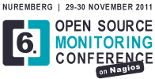

<a href="http://www.jolokia.org">Jolokia</a> and Jmx4Perl will go on tour this autumn. Roland Huss will talk about both projects in November at <a href="http://wwww.devoxx.com">Devoxx</a>, Antwerp, which is the biggest independent Java community conference in the world and at the <a href="http://www.netways.de/en/osmc/y2011/">Open Source Monitoring Conference</a>, Nuremberg.

<!--more-->

<em>Meet us in Paradise</em> at Devoxx 2011 ! "<a href="http://www.devoxx.com/display/DV11/Jolokia+-+JMX+on+Capsaicin">Jolokia - JMX on Capsaicin</a>" will be presented on November 14th 2011 in Antwerp, Belgium. I'm really excited to have the chance to bring some chili pepper to this superb premium conference which I greatly enjoyed as visitor in the past. 30 minutes are surely not long enough for getting in every feature, so please le me know whether you have a favourite one.

The second conference where Jolokia will play its role this autumn is at the Open Source Monitoring Conference "<a href="http://www.netways.de/en/osmc/y2011/programm/v/nagios_java_monitoring_mit_jmx4perl_und_jolokia/">Nagios Java monitoring with Jmx4Perl and Jolokia</a>" in Nuremberg on November 30th 2011. It's a quite different talk with focus on Jmx4Perl, discovery of relevant monitoring metrics and it's configuration in a Nagios environment. Not much Java here, but tooling en masse. I'm really looking forward to this home play, too.

If you intend to participate in one of those conference and would like some discussion about Jolokia, Jmx4Perl, JMX, Chili pepper growing, the world, you can contact me on various channels. Jolokia can be found at twitter (<a href="http://twitter.com/jolokia_jmx">@jolokia_jmx</a>), the <a href="http://www.jolokia.org/forum.html">forum</a> or on IRC at the Freenode channel <code>#jolokia</code>. For a simple chat you can use also the new <a href="http://www.jolokia.org/irc.html">webchat</a> on this site. I would really like to hear from you !