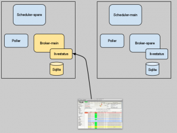
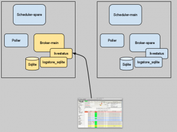
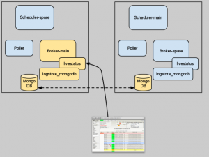

In the early days of the <a href="http://www.shinken-monitoring.org" title="Shinken Monitoring" target="_blank">Shinken</a> monitoring system you were quite limited in how many web user interfaces you could use. There was the old CGI-based Nagios-Webinterface or (thanks to the merlin-mysql broker module) the <a href="http://www.op5.org/community/plugin-inventory/op5-projects/ninja" title="Ninja GUI" target="_blank">Ninja GUI</a> from OP5.
At the same time, two Projects, <a href="http://www.thruk.org/images/screenshots/screenshots.html" title="Thruk" target="_blank">Thruk</a> and <a href="http://mathias-kettner.de/check_mk_multisite_screenshots.html" title="Multisite" target="_blank">Multisite</a>, became very popular. The success of these two web guis was mainly based on the way they communicated with the Nagios core.

<!--more-->
Where the CGI-Gui and Ninja were reading the host and service status from a flat file or a database, Thruk and Multisite had direct access to the internal data structures of Nagios. This was possible through Mathias Kettner's new MK Livestatus addon, which is listening on a unix socket and responds to queries (in it's own livestatus query language) within a fraction of a second.

It was clear that Shinken needed an interface like this, too. In order to compete with Nagios it was an advantage if Shinken could be used with the state-of-the-art guis.
In the beginning of 2010 i started to re-engineer MK Livestatus and as a result Thruk soon became the default web interface. It was very comfortable for users to evaluate Shinken and keep their familiar look-and-feel.

After a year it became more and more difficult to keep up with the numerous changes in the original MK Livestatus. Shinken-Livestatus started more as a proof of concept than as a well-designed addon. That's why in the first weeks of 2012 the code was whipped into shape. But not only maintainable code was the goal. The redesign also aimed at performance. There are more and more installations of Shinken which handle thousands of hosts where the response times of the gui became too annoying.
A comparison of the old code and the redesigned livestatus broker module is here:
<table>
<tr><th>test</th><th>old</th><th>new</th><th>speedup</th></tr>
<tr><td>multisite_alert_statistics         </td><td>0.0936</td><td> 0.1556</td><td>0.60x</td></tr>
<tr><td>multisite_all_hosts                </td><td>0.3859</td><td> 0.4218</td><td>0.91x</td></tr>
<tr><td>multisite_all_services             </td><td>0.4525</td><td> 0.4207</td><td>1.08x</td></tr>
<tr><td>multisite_events                   </td><td>0.0826</td><td> 0.1339</td><td>0.62x</td></tr>
<tr><td>multisite_host_detail              </td><td>1.1978</td><td> 0.1468</td><td>8.16x</td></tr>
<tr><td>multisite_service_detail           </td><td>0.1857</td><td> 0.0816</td><td>2.28x</td></tr>
<tr><td>multisite_servicegroups_grid       </td><td>0.0190</td><td> 0.0039</td><td>4.90x</td></tr>
<tr><td>multisite_servicegroups_summary    </td><td>0.0613</td><td> 0.0012</td><td>50.28x</td></tr>
<tr><td>multisite_services_by_group        </td><td>0.8250</td><td> 0.4314</td><td>1.91x</td></tr>
<tr><td>multisite_tac                      </td><td>0.9613</td><td> 0.5440</td><td>1.77x</td></tr>
<tr><td>thruk_alert_history                </td><td>0.0117</td><td> 0.0052</td><td>2.26x</td></tr>
<tr><td>thruk_all_hosts                    </td><td>0.1288</td><td> 0.0865</td><td>1.49x</td></tr>
<tr><td>thruk_all_services                 </td><td>0.2312</td><td> 0.1159</td><td>2.00x</td></tr>
<tr><td>thruk_host_detail                  </td><td>0.0830</td><td> 0.0358</td><td>2.32x</td></tr>
<tr><td>thruk_host_status_detail           </td><td>0.1377</td><td> 0.0692</td><td>1.99x</td></tr>
<tr><td>thruk_service_detail               </td><td>0.2663</td><td> 0.1034</td><td>2.58x</td></tr>
<tr><td>thruk_servicegroups_grid           </td><td>7.3882</td><td> 9.4271</td><td>0.78x</td></tr>
<tr><td>thruk_servicegroups_summary        </td><td>7.2259</td><td> 9.0320</td><td>0.80x</td></tr>
<tr><td>thruk_tac                          </td><td>3.9522</td><td> 3.7910</td><td>1.04x</td></tr>
</table>

While this may look a bit disappointing, you should keep in mind that only by cleaning up and rearranging the code the performance roughly doubled. I already have several things in mind where this can be further optimized.

Another critical point in the past was the handling of the log data, which were stored in a SQLite database. Installations with thousands of hosts appeared and the amount of log data became a problem. This could be solved reasonably good by splitting the database into multiple smaller fractions. But these big projects had the need for a distributed setup, one of the strengths on Shinken. In such an environment you usually have a broker at a central location and a spare broker at a failover site. Now when your primary broker (which writes logs into it's local SQLite database) fails and the spare broker takes over, the spare database will be the backend for log data. This means, you have no access to historic logs in this moment. This also means, you have to manually resync the two SQLite databases.

With a small to medium installation, where you run the whole Shinken system on a single host, the SQLite method is still ok, don't worry.
But in very large installations there have to be alternatives to the local database. In order to be able to exchange the storage backend, also the configuration looks a bit different now.

Instead of writing in your <i>shinken-specific.cfg</i>
<pre>define module{
       module_name      Livestatus
       module_type      livestatus
       host             *       ; * = listen on all configured ip addresses
       port             6557   ; port to listen
       socket           /usr/local/shinken/var/rw/live
       database_file    /usr/local/shinken/var/livelogs.db
       max_logs_age     3m ; three months. Other time intervals are d=days, w=weeks, y=years
}</pre>

from now on you have to write:

<pre>define module{
       module_name      Livestatus
       module_type      livestatus
       host             *       ; * = listen on all configured ip addresses
       port             6557   ; port to listen
       socket           /usr/local/shinken/var/rw/live
       modules          logsqlite
}
define module{
       module_name      logsqlite
       module_type      logstore_sqlite
       database_file    /usr/local/shinken/var/livelogs.db
       max_logs_age     3m ; three months. Other time intervals are d=days, w=weeks, y=years
}</pre>

Modifying the configuration means a little inconvenience to you, but looking at the image to the left it should be clear that it opens the livestatus module up to a broader range of database backends.
          

One of the big advantages a Shinken monitoring system has over a Nagios system is the built-in clustering. This means you can have multiple instances of each component. If one fails, it's spare counterpart immediately takes over. Only the SQLite based storage of log data was a weakness here. (Because the contents of the database file would not be replicated to the spare).

In a high availability Shinken installation you probably already have a MongoDB cluster for the shared retention data. I though the most obvious thing would be, to use this database for the log data, too. So here is the alternative livestatus backend module <b>logstore_mongodb</b>.
           
The configuration follows the same rules as the sqlite module:
<pre>define module{
       module_name      Livestatus
       module_type      livestatus
       host             *       ; * = listen on all configured ip addresses
       port             6557   ; port to listen
       socket           /usr/local/shinken/var/rw/live
       modules          mongologs
}
define module{
       module_name      mongologs
       module_type      logstore_mongodb
       mongodb_uri      mongodb://127.0.0.1:27017
}</pre>

I don't have any experience yet when it comes to handle massive amounts of data, but that's what NoSQL can do best. There is one Shinken installation which produces half a gigabyte of logs per day and it works with an SQLite database, although a bit slow. So with a MongoDB backend it can only get better.