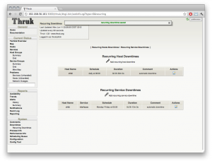

Every now and then some of our 7x24 hosts / services need a daily or weekly maintmode for regular restarts. Normally you would have to create 2 new timeperiods because you don't want both hosts in a cluster to be restarted at the same time. This is not just way to much work, it also adds unnecessary complexity because
nobody can see the maintmode unless you look into the config files.

Thats where recurring downtimes will become handy and latest <a href="/docs/thruk">Thruk</a> Version includes this new feature.
<!--more-->

              

With recurring downtimes everybody will see directly when there is a planned restart or maintmode and you don't have to create a new timeperiod for every restart time window. Recurring downtimes will be listed on the hosts page and in a seperate downtimes list where they can be adjusted easily.

From technical aspect, the downtime will be scheduled by a cronjob, so it doesn't matter if your webserver hosting <a href="/docs/thruk">Thruks</a> fastcgi server is running or not. You just have to make sure thruk is able to connect to the core by livestatus.