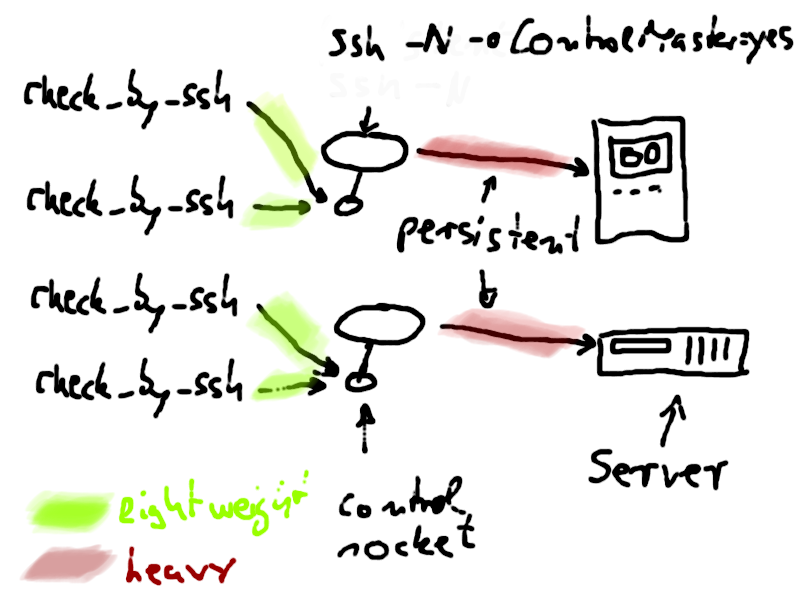

Monitoring Unix clients is very easy with the check_by_ssh plugin. The only prerequisite is public-key-based access and installation of some plugins on the remote side. Then, running a check is as easy as:

```bash
check_by_ssh --host 10.177.3.39 --logname nagios \
    --command "lib/nagios/plugins/check_swap -w 15% -c 8%"
```

The drawback of this method is extra load on the nagios server. With every check, a ssh process is forked which has to do a complete handshake with the remote side. With newer ssh implementations it is possible to have a persistent connection which requires only one handshake at startup. All the following ssh connects use the already established connection, which saves a lot of cpu cycles.
Here are the instructions to combine check_by_ssh with such a persistent tunnel.

<!--more-->
When ssh is called with the extra option -oControlMaster=yes it will open a socket in the filesystem which can be used by other ssh commands which are called with -oControlMaster=no. These other ssh commands&#39;
 communication with the remote side will then use the already established connection of the controlmaster. This reduces the necessity of lots of ssh handshakes. If we make the process with ControlMaster=yes persistent (ssh knows the option -N for that) and send it in the background, then we will never have to handshake (an expensive operation which includes exchange of public keys, hashing, well...a lot of math) again. All future ssh commands will simply connect to the existing socket in the filesystem.


What i do is to add these two services for every host, _check_controlmaster and _check_shell:
```text
define service {
  service_description             os_linux_default_check_controlmaster
  use                             os_linux_default
  host_name                       lxsrv1
  max_check_attempts              1
  check_interval                  15
  check_command                   check_ssh_controlmaster
}
define service {
  service_description             os_linux_default_check_shell
  use                             os_linux_default
  host_name                       lxsrv1
  max_check_attempts              5
  check_interval                  60
  check_command                   check_ssh_login!$HOSTADDRESS$!60!22
}
define servicedependency {
   name                             dependency_os_linux_default_check_controlmaster_uc_lxsrv1.muc
   host_name                        lxsrv1
   service_description              os_linux_default_check_controlmaster
   execution_failure_criteria       u,w,c,p
   notification_failure_criteria    u,w,c,p
   dependent_service_description    os_linux_.*,\
                                    !os_linux_default_check_shell,\
                                    !os_linux_default_check_controlmaster
}
define servicedependency {
 name                             dependency_os_linux_default_check_shell_uc_lxsrv1.muc
 host_name                        lxsrv1
 service_description              os_linux_default_check_shell
 execution_failure_criteria       u,w,c,p
 notification_failure_criteria    u,w,c,p
 dependent_service_description    os_linux_default_check_controlmaster,\
                                  !os_linux_default_check_shell
}
define service {
  service_description             os_linux_default_check_ntp
  use                             os_linux_default
  host_name                       lxsrv1
  check_interval                  121
  retry_interval                  10
  check_command                   check_by_ssh!\
                                  60!$USER10$/local/lib/nagios/plugins/check_ntp_health
}
...
```
Thanks to the servicedependencies, check_shell will be the first service to run. It makes sure that a ssh login is possible and we get a prompt (this is done with the perl Expect module).

Then, if successful,  check_controlmaster will run and establish a persistent ssh connection to client lxsrv1 by sending a demon to the background. The command definition is:
```text
define command {
  command_name    check_ssh_controlmaster
  command_line    $USER2$/check_ssh_controlmaster \
      -H $HOSTADDRESS$ -l nagios -p 22 -d $USER4$/tmp/ssh
  # $USER4$/tmp/ssh is a directory for the controlmaster sockets
}
```

All the other services use a check_by_ssh command which connects locally to the controlmaster socket.
```text
define command {
  command_name    check_by_ssh
  command_line    $USER2$/check_by_ssh \
      --host $HOSTADDRESS$ \
      --port 22 \
      --logname nagios \
      --timeout $ARG1$ \
      --ssh-command $USER4$/ssh/local/bin/ssh \
      --ssh-option "ControlPath=$USER4$/tmp/ssh/controlpath/ssh-%r@%h" \
      --ssh-option "ControlMaster=no" \
      --ssh-option "UserKnownHostsFile=$USER4$/tmp/ssh/known_hosts" \
      --ssh-option "IdentityFile=$USER4$/.ssh/id_rsa" \
      --ssh-option "IdentitiesOnly=yes" \
      --ssh-option "StrictHostKeyChecking=no" \
      --ssh-option "PasswordAuthentication=no" \
      --skip-stderr 1 \
      --command "$ARG2$"
}
```

And that&#39;s how the check_ssh_controlmaster plugin looks like:
```bash
#! /bin/sh

REMUSER=
REMPORT=22
REMHOST=
CMDIR=
MUSTRESTART="n"
EXPLANATION=""
SSHBIN="/usr/bin/ssh"

while getopts "l:H:p:c:d:" opt; do
    case $opt in
    l)
        REMUSER=$OPTARG
        ;;
    H)
        REMHOST=$OPTARG
        ;;
    p)
        REMPORT=$OPTARG
        ;;
    d)
        CMDIR=$OPTARG
        ;;
    c)
        SSHBIN=$OPTARG
        ;;
    :)
        echo "argment required"
        exit 3
        ;;
    esac
done

if [ -z $REMHOST -a -z $REMUSER ]; then
    echo "usage:"
    exit 3
fi


CMOPTS="-o ControlPath=${CMDIR}/controlpath/ssh-%r@%h \
        -o ControlMaster=yes \
        -o UserKnownHostsFile=${CMDIR}/known_hosts \
        -o IdentityFile=${HOME}/.ssh/id_rsa \
        -o IdentitiesOnly=yes \
        -o StrictHostKeyChecking=no \
        -o PasswordAuthentication=no"
CMCOPTS="-o ControlPath=${CMDIR}/controlpath/ssh-%r@%h \
        -o ControlMaster=no \
        -o UserKnownHostsFile=${CMDIR}/known_hosts \
        -o IdentityFile=${HOME}/.ssh/id_rsa \
        -o IdentitiesOnly=yes \
        -o StrictHostKeyChecking=no \
        -o PasswordAuthentication=no"


CONTROLPATH=${CMDIR}/controlpath/ssh-${REMUSER}@${REMHOST}

if [ ! -S "$CONTROLPATH" ]; then
    if [ ! -d "$CMDIR" ]; then
        mkdir -p "$CMDIR"/controlpath
        EXPLANATION="$EXPLANATION mkdir"
    fi
    MUSTRESTART="y"
else
    # test if the connection is working
    home=$($SSHBIN -vvv -t -l $REMUSER -p $REMPORT $CMCOPTS $REMHOST id 2>&1 </dev/null)
    if [[ "$home" =~ .*mux_client_request_session.* ]]; then
        # ...session: session request failed: Session open refused by peer
        # maybe kill longrunning processes
        MUSTRESTART="n"
        EXPLANATION="$EXPLANATION mux_client_request_session"
    elif [[ "$home" =~ .*Control.*socket.*connect.*Connection.*refused.* ]]; then
        MUSTRESTART="y"
        EXPLANATION="$EXPLANATION Connectionrefused"
    elif [[ "$home" =~ .*Shared.*connection.*closed.* ]]; then
        MUSTRESTART="n"
        EXPLANATION="$EXPLANATION Connectionclosed"
    elif [[ "$home" =~ .*uid.*\(${REMUSER}\).* ]]; then
        # good response
        MUSTRESTART="n"
    else
        MUSTRESTART="y"
    fi
fi
if [ "$MUSTRESTART" = "y" ]; then
    pid=$(pgrep -U $UID -f ".*-l ${REMUSER}.*-p 22.*ControlMaster=yes.*-N $REMHOST")
    if [ -n "$pid" ]; then
        test -e $CONTROLPATH && mv $CONTROLPATH ${CONTROLPATH}old
        kill -9 $pid
        sleep 1
        EXPLANATION="$EXPLANATION killed"
    else
        EXPLANATION="$EXPLANATION nopid"
    fi
else
    echo "ssh session established"
    exit 0
fi

if [ "$MUSTRESTART" = "y" ]; then
    nohup $SSHBIN \
        -t -l $REMUSER -p $REMPORT $CMOPTS -N $REMHOST >/dev/null 2>&1 &
    sleep 1
    EXPLANATION="$EXPLANATION started"
    if ! kill -0 $! > /dev/null 2>&1; then
        echo "could not start controlmaster"
        exit 1
    fi
fi

home=$($SSHBIN -vvv -t -l $REMUSER -p $REMPORT $CMCOPTS $REMHOST id 2>&1 </dev/null)
if [[ "$home" =~ .*\(${REMUSER}\).* ]]; then
    if [ "$MUSTRESTART" = "y" ]; then
        echo "$EXPLANATION controlmaster restarted"
    else
        echo "controlmaster running"
    fi
    exit 0
elif [[ "$home" =~ .*ssh_exchange_identification.* ]]; then
    echo "remote sshd refuses connection"
    exit 2
elif [[ "$home" =~ .*Connection.*timed.*out.* ]]; then
    echo "remote sshd connection timed out"
    exit 2
else
    echo "controlmaster hangs"
    exit 2
fi
```

With such a configuration i am able to run a 50000-services installation (~30000 of them in a 5-minute interval) with a latency of 0.0x seconds.