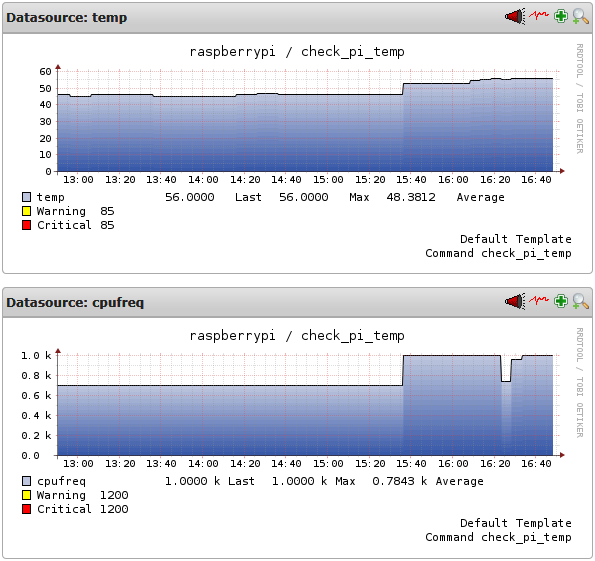

Während der letzten Wochen habe ich viel Geduld aufgebracht, um auf meinem neuen <a href="http://www.raspberrypi.org/">Raspberry Pi</a> die <a href="http://omdistro.org">Open Monitoring Distribution</a> zu bauen und zuletzt ein Debian-Install-Paket zu erstellen. Geduld deshalb, weil ein "make" schon mal einen Tag und mehr läuft. Wenn dann immer wieder Anpassungen im Build-Prozess für diese spezielle Hardware nötig sind, zieht sich das ganze Unternehmen ordentlich in die Länge. Aber nun ist es überstanden und die Version 0.56 von OMD kann auf dem Raspberry Pi installiert werden.
<!--more-->
Wer es selber mal erleben möchte, wie zäh sich das Bauen von OMD anfühlt, kann sich das Ergebnis meiner Portierung von <a href="https://github.com/lausser/ompistro">https://github.com/lausser/ompistro</a> herunterladen und den Compiler anschmeissen.
Alle anderen können OMD einfach per deb-Paket installieren. Dazu wird (in Anlehnungen an die Anweisungen von Sven auf der Seite des <a href="/docs/omd/">ConSol-OMD-Repositories</a>) erstmal das zuständige Repository registriert.
<pre>echo 'deb http://labs.consol.de/repo/stable/debian wheezy main' >> /etc/apt/sources.list
</pre>

Anschliessend muss Svens GPG-Key installiert und die Paketliste neu eingelesen werden:
<pre>root@raspberrypi:~# gpg --keyserver keys.gnupg.net --recv-keys F8C1CA08A57B9ED7
gpg: directory `/root/.gnupg' created
gpg: new configuration file `/root/.gnupg/gpg.conf' created
gpg: WARNING: options in `/root/.gnupg/gpg.conf' are not yet active during this
run
gpg: keyring `/root/.gnupg/secring.gpg' created
gpg: keyring `/root/.gnupg/pubring.gpg' created
gpg: requesting key A57B9ED7 from hkp server keys.gnupg.net
gpg: /root/.gnupg/trustdb.gpg: trustdb created
gpg: key A57B9ED7: public key "Sven Nierlein <sven.nierlein@consol.de>" imported
gpg: Total number processed: 1
gpg:               imported: 1  (RSA: 1)
root@raspberrypi:~# gpg --armor --export F8C1CA08A57B9ED7 | apt-key add -
OK
root@raspberrypi:~# aptitude update
Ign http://labs.consol.de wheezy InRelease
Hit http://mirrordirector.raspbian.org wheezy InRelease
Get: 1 http://labs.consol.de wheezy Release.gpg [316 B]
Hit http://archive.raspberrypi.org wheezy InRelease
Hit http://labs.consol.de wheezy Release
Hit http://mirrordirector.raspbian.org wheezy/main armhf Packages
Hit http://archive.raspberrypi.org wheezy/main armhf Packages
Hit http://labs.consol.de wheezy/main armhf Packages
Hit http://mirrordirector.raspbian.org wheezy/contrib armhf Packages
Hit http://mirrordirector.raspbian.org wheezy/non-free armhf Packages
Hit http://mirrordirector.raspbian.org wheezy/rpi armhf Packages
Ign http://labs.consol.de wheezy/main Translation-en
Ign http://archive.raspberrypi.org wheezy/main Translation-en
Ign http://mirrordirector.raspbian.org wheezy/contrib Translation-en
Ign http://mirrordirector.raspbian.org wheezy/main Translation-en
Ign http://mirrordirector.raspbian.org wheezy/non-free Translation-en
Ign http://mirrordirector.raspbian.org wheezy/rpi Translation-en
Fetched 316 B in 1s (312 B/s)
</pre>

Nun sind wir soweit, dass OMD in den registrierten Repositories gefunden werden kann:
<pre>
root@raspberrypi:~# aptitude search omd
p   customdeb                       - Modfies binary Debian package
p   isomd5sum                       - ISO9660 checksum utilities
p   libtemplate-provider-fromdata-p - module to load templates from your __DATA_
p   omd-0.56                        - Open Source Monitoring Distribution, conta
p   python-pyisomd5sum              - ISO9660 checksum Python module
v   python2.6-pyisomd5sum           -
v   python2.7-pyisomd5sum           -
root@raspberrypi:~#
</pre>

Die Installation von OMD-0.56 dauert dann wieder eine Weile...
<pre>
root@raspberrypi:~# aptitude install omd-0.56
The following NEW packages will be installed:
  omd-0.56
0 packages upgraded, 1 newly installed, 0 to remove and 7 not upgraded.
Need to get 92.3 MB of archives. After unpacking 284 MB will be used.
Get: 1 http://labs.consol.de/repo/stable/debian/ wheezy/main omd-0.56 armhf 0.wh
eezy [92.3 MB]
Fetched 92.3 MB in 7min 9s (215 kB/s)
Preconfiguring packages ...
Selecting previously unselected package omd-0.56.
(Reading database ... 78890 files and directories currently installed.)
Unpacking omd-0.56 (from .../omd-0.56_0.wheezy_armhf.deb) ...
Processing triggers for man-db ...
Setting up omd-0.56 (0.wheezy) ...
update-alternatives: using /omd/versions/0.56 to provide /omd/versions/default (
omd) in auto mode
Enabling module rewrite.
To activate the new configuration, you need to run:
  service apache2 restart
Starting all OMD monitoring sites  using omd version 0.56:
root@raspberrypi:~#
</pre>

Die Installation hat geklappt und eine OMD-Site kann nun angelegt werden:
<pre>root@raspberrypi:~# omd create pipi
Adding /omd/sites/pipi/tmp to /etc/fstab.
Creating temporary filesystem /omd/sites/pipi/tmp...OK
Created new site pipi with version 0.56.

  The site can be started with omd start pipi.
  The default web UI is available at http://raspberrypi/pipi/
  The admin user for the web applications is omdadmin with password omd.
  Please do a su - pipi for administration of this site.

root@raspberrypi:~# omd start pipi
Starting dedicated Apache for site pipi...OK
Starting rrdcached...OK
Starting npcd...OK
Starting nagios...OK
Initializing Crontab...OK
root@raspberrypi:~#
</pre>

Damit man auch was zu sehen bekommt, beschreibe ich eine kleine Konfiguration und ein Plugin, mit dem die Temperatur des BCM2835 System-on-a-chip sowie die aktuelle CPU-Frequenz ausgelesen werden.
Neuerdings ist es möglich, den Raspberry Pi (mittels des Tools raspi-config) auch mit dem Segen des Herstellers zu übertakten. Die defaultmässigen 700MHz können damit bis auf 1000MHz erhöht werden. Allerdings wird dadurch nur die Maximalfrequenz auf diesen Wert gesetzt.
In der Datei /sys/devices/system/cpu/cpu0/cpufreq/scaling_governor findet man den String "ondemand". Dieser besagt, dass die tatsächliche CPU-Frequenz erst dann erhöht wird, wenn Bedarf danach besteht.
Bei Erreichen einer Temperatur von 85 Grad Celsius wird die CPU-Frequenz automatisch wieder heruntergeregelt, um Schäden am Gerät zu vermeiden.

Die Konfiguration in der Datei etc/nagios/conf.d/pi.cfg lautet wie folgt:
<pre>define command {
  command_name             check_pi_temp
  command_line             $USER2$/check_pi_temp
}

define host {
  host_name                raspberrypi
  use                      generic-host
}

define service {
  use                      generic-service,srv-pnp
  host_name                raspberrypi
  service_description      check_pi_temp
  check_command            check_pi_temp
  check_interval           5
  retry_interval           1
}
</pre>

Das Plugin, mit dem die Temperatur und CPU-Frequenz ausgelesen werden, sieht folgendermassen aus:
<pre>#! /bin/bash
temp=$(($(&lt;/sys/class/thermal/thermal_zone0/temp) / 1000))
freq=$(($(&lt;/sys/devices/system/cpu/cpu0/cpufreq/scaling_cur_freq) / 1000))
echo-n "BCM2835 SoC temperature is $temp deg.(C) "
echo "| temp=$temp;85;85;0;100 cpufreq=$freq;1200;1200;0;1200"
</pre>

Und ein paar Stunden später bekommt man dann einen Graphen, der den Temperaturverlauf zeigt. Was man auch noch schön sieht, ist das automatische Hochtakten von 700 auf 1000MHz.

