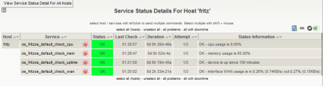

Mittlerweile ist check_nwc_health recht verbreitet und wird von vielen Admins dem Sammelsurium von Plugins vorgezogen, das man früher einsetzen musste, um unterschiedliche Typen von Netzwerkkomponenten zu überwachen. Doch nicht nur für die grossen Kisten kann man check_nwc_health einsetzen. Am Wochenende habe ich mir meine FRITZ!Box genauer angesehen.
<!--more-->
Unverständlicherweise spricht die FRITZ!Box nicht SNMP, jedenfalls nicht im Originalzustand. Eine alternative Firmware, die das kann, wollte ich mir auch nicht installieren. Daher habe ich check_nwc_health beigebracht, über das UPnP-Protokoll (für interface-usage und uptime) und HTTP (für cpu-load und memory-usage) mit der FRITZ!Box zu kommunizieren und sich so die gewünschten Messwerte zu besorgen.
  
Herausgekommen ist die <a href="/docs/plugins/check_nwc_health/" target="_blank">Version 1.9</a>, mit der folgende Abfragen möglich sind:
  
   
     <pre><tt>check_nwc_health --hostname 192.168.1.1 --port 49000 --mode uptime
OK - device is up since 146 minutes | 'uptime'=146.02;15:;5:

check_nwc_health --hostname 192.168.1.1 --port 49000 --mode interface-usage
OK - interface WAN usage is in:0.08% (0.23KB/s) out:0.51% (0.28KB/s) | 'WAN_usage_in'=0.08%;80;90 'WAN_usage_out'=0.51%;80;90 'WAN_traffic_in'=0.23KB 'WAN_traffic_out'=0.28KB

check_nwc_health --hostname 192.168.1.1 --port 49000 --mode cpu-load --community gehe1m
OK - cpu usage is 8.00% | 'cpu_usage'=8%;40;60

check_nwc_health --hostname 192.168.1.1 --port 49000 --mode memory-usage --community gehe1m
OK - memory usage is 65.00% | 'memory_usage'=65%;80;90
</tt></pre>
  

   Zu beachten ist hier, dass --port 49000 angegeben wird. Auf diesem Port lauscht der UPnP-Server. Das Passwort der FRITZ!Box wird benötigt, um an die HTML-Seite mit CPU- und Memory-Messwerten zu kommen. Dafür wird der Parameter --community missbraucht.

Und so sieht's dann in Thruk aus: 

&#160;

&#160;

&#160;

&#160;

&#160;

Achtung: das Plugin funktioniert hier bei mir mit einer FRITZ!Box Fon WLAN 7390 mit Firmware-Version 84.05.50
   Andere Modelle oder ältere Firmwarestände werden nicht unterstützt.
