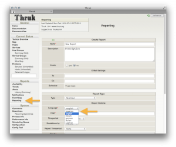

There won't be general multi-language support in <a href="http://thruk.org" target="_blank">Thruk</a>, but you may now choose different languages for your reports. The brand new release v1.64 comes with 5 built-in languages and it's
super easy to add a new one.

<!--more-->

All you have to do is to copy one of the existing language files into your user templates directory.

<h4>1. edit /etc/thruk/thruk_local.conf and add</h4>
<pre>
user_template_path = /etc/thruk/user_templates
</pre>

<h4>2. create that folder including the reports subfolder</h4>
<pre>
mkdir -p /etc/thruk/user_templates/reports/locale
</pre>

<h4>3. copy existing language file into locale folder and translate it</h4>
<pre>
cp /usr/share/thruk/plugins/plugins-available/reports2/templates/reports/locale/de.tt \
 /etc/thruk/user_templates/reports/locale/xyz.tt
</pre>

your path may vary unless you used packages.

<h4>4. finally restart Thruk and create a new report with your new language</h4>
<pre>
 #> /etc/init.d/thruk reload
 Stopping thruk.....OK
 Starting thruk........(775) OK
</pre>

                 