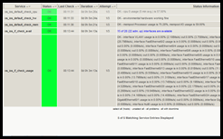
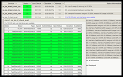

Mit dem neuen Feature <i>interface-availability</i> von check_nwc_health überwacht man die Anzahl noch verfügbarer Ports an einem Router oder Switch.      Als besonderes Gimmick gibt es eine Übersicht über alle vorhandenen Ports und deren Verfügbarkeitsstatus dazu.
<!--more-->
Ein Port gilt als verfügbar, wenn: 
  <ul>   <li>AdminStatus ist "up", OperStatus ist seit einiger Zeit nicht mehr "up"      </li>    <li>AdminStatus ist "down" </li> </ul>  
Der Zeitdauer, während der ein Port im OperStatus "down" o.ä. sein muss, um als nicht mehr produktiv zu gelten, beträgt defaultmäßig 30 Minuten (1800 Sekunden), kann aber durch Verwendung des Parameters <i>--lookback</i> geändert werden. (Das Argument von <i>--lookback</i> wird in Sekunden angegeben) 
  
Die normale Ausgabe von check_nwc_health –mode interface-availability liefert eine zahlenmäßige Übersicht über insgesamt vorhandene, per AdminStatus aktivierte und für weitere Verwendung freie Ports.
  

  
&#160;
  
&#160;
  
&#160;
  
&#160;
  
&#160;
  
&#160;
  
Klickt man nun in das Ausgabefeld, so klappt eine Liste auf, die alle Ports und ihre Namen, Speed, Status und Verfügbarkeit anzeigt.
  

  
&#160;
  
&#160;
  
&#160;
  
&#160;
  
&#160;
  
&#160;
  
Keine große Sache, aber ganz praktisch für den schnellen Überblick.
