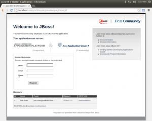

[Infinispan](http://www.jboss.org/infinispan) is included in the [JBoss AS 7](https://www.jboss.org/jbossas) distribution as the default second level cache for [Hibernate](http://www.hibernate.org).
For my presentation on the [JBoss One Day Talk 2013](http://onedaytalk.org),
I was looking for the most simple example to be used in a demo.
<strong>This post shows how to get Infinispan Hibernate 2nd Level Caching up and running in five minutes.</strong>
It should also work with the upcoming [WildFly Application Server](http://www.wildfly.org).

<!--more-->
Step 1: Example Project from Maven Archetype
----------------------------------------------

JBoss have prepared a maven archetype that can be used to create a simple JEE web application.
We use this application as a a starting point:

    mvn archetype:generate \
        -DarchetypeArtifactId=jboss-javaee6-webapp-archetype \
        -DarchetypeGroupId=org.jboss.spec.archetypes \
        -DarchetypeVersion=7.1.2.Final \
        -DgroupId=de.consol.research \
        -DartifactId=infinispan-jpa-example \
        -Dversion=1.0-SNAPSHOT \
        -Dname="Infinispan JPA Example" \
        -DarchetypeCatalog=http://search.maven.org/remotecontent?filepath=archetype-catalog.xml \
        -DinteractiveMode=false

The generated application has the JBoss AS 7 Maven Plugin included in its `pom.xml`, and can be run from the command line as follows:

    cd infinispan-jpa-example
    mvn clean verify jboss-as:run

This will download and run the JBoss Application Server and deploy the example application. The application will become available on [http://localhost:8080/infinispan-jpa-example](http://localhost:8080/infinispan-jpa-example).

The application maintains a list of _Members_ in an *SQL database*. Each member has the following attributes:

  * Name
  * Email
  * Phone number

There is a JSF page that can be used to add new members to the list, and there is a *REST interface* that can be used to query members by ID:

  * [http://localhost:8080/infinispan-jpa-example/rest/members/0](http://localhost:8080/infinispan-jpa-example/rest/members/0)
  * [http://localhost:8080/infinispan-jpa-example/rest/members/1](http://localhost:8080/infinispan-jpa-example/rest/members/1)
  * [http://localhost:8080/infinispan-jpa-example/rest/members/2](http://localhost:8080/infinispan-jpa-example/rest/members/2)
  * etc.

Step 2: Enable Database Logging
--------------------------------

In order to see the effect of the L2 caching, we need to enable logging on the database level to see the SQL queries performed.

As part of the example project, the file `src/main/resources/import.sql` was created. Hibernate will execute this file when the application is deployed. This is used to populate the database with an example _Member_ when the application starts up.

As we know that JBoss uses [H2](http://www.h2database.com) as its default database, we can add an H2 specific command to `import.sql` in order to enable logging of SQL commands on the database level:

    SET TRACE_LEVEL_SYSTEM_OUT 2;
    insert into Member (id, name, email, phone_number) values (0, 'John Smith', 'john.smith@mailinator.com', '2125551212');

When the application is re-started, we can now observe in the console output that each request to [http://localhost:8080/infinispan-jpa-example/rest/members/0](http://localhost:8080/infinispan-jpa-example/rest/members/0) triggers an SQL query on the database.

Step 3: Enabling Infinispan L2 Cache
----------------------------

To enable Infinispan as a 2nd Level Cache for [JPA](http://jcp.org/aboutJava/communityprocess/final/jsr220) applications, two lines need to be added to `persistence.xml`. First, directly after the `jta-data-source` and before the `properties`, the `shared-cache-mode` needs to be set:

    <shared-cache-mode>DISABLE_SELECTIVE</shared-cache-mode>

Secondly, an additional property must be added to the `properties` list:

    <property name="hibernate.cache.use_second_level_cache" value="true"/>

The shared cache mode [DISABLE_SELECTIVE](http://docs.oracle.com/javaee/7/tutorial/doc/persistence-cache002.htm) means that all JPA entities are cached unless caching is explicitly disabled via annotations. That way, all the _Member_ entities in the example application become subject to caching.

The property simply enables caching for hibernate.

After restarting the application, we can see in the console output that only the first access to the REST interface [http://localhost:8080/infinispan-jpa-example/rest/members/0](http://localhost:8080/infinispan-jpa-example/rest/members/0) triggers a query on the database level, all subsequent queries are served from the cache.

Where to go from here
---------------------

This post showed how to get Infinispan up and running as a 2nd level Hibernate cache in a simple JPA application. The next steps would be to:

  * [Use JEE 7 annotations to specify which entities should be cached.](http://docs.oracle.com/javaee/7/tutorial/doc/persistence-cache.htm)
  * [Configure Infinispan as a Distributed Cache in Clustered Applications.](http://www.jboss.org/infinispan)