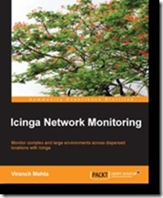

&#160;
  

  
Der Verlag <a href="http://www.packtpub.com/">Packt Publishing</a> ist an mich herangetreten und hat mich gebeten, eine Rezension zum soeben erschienenen Buch <a href="http://bit.ly/1iruLcU">Icinga Network Monitoring von Viranch Mehta</a> zu schreiben.
  
Eigentlich hatte ich keine Zeit, aber wenn mir jemand mit „<em>Keeping in mind your knowledge in this subject and having looked at your contributions, I feel you'd make an excellent reviewer of this book</em>.“ kommt, dann werde ich natürlich schwach.
  
Das Buch richtet sich an eine Leserschaft, die bisher keinen Kontakt zur Icinga (bzw. Nagios, Naemon oder Shinken) hatte. Linux-Kenntnisse werden aber dennoch vorausgesetzt. Ziel des Autors war es, eine nachvollziehbare (im Sinne von: sofort am Rechner umsetzbar) und möglichst vollständige Anleitung zu erstellen, anhand derer ein Icinga-Neuling (mit ein bisschen Hirnschmalz sind die Schritte aber auch auf die o.g. Geschwister von Icinga anwendbar) in kurzer Zeit ein Basis-Monitoring für seine IT-Landschaft aufsetzen kann.
<!--more--><h3>Kapitel 1 - Installation und Inbetriebnahme</h3>  
Im ersten Kapitel wird gezeigt, wie man Icinga-Pakete für die wichtigsten Linux-Distributionen installiert und ein Monitoringsystem mit einer minimalen Starterkonfiguration in Betrieb nimmt. Wer es nicht ganz so bequem haben und immer auf die allerneuesten Versionen zurückgreifen möchte, der findet auch eine Anleitung für das Herunterladen und Kompilieren des Icinga-Source-Codes, ja sogar wie man daraus seine eigenen RPM-Pakete baut.
  <h3>Kapitel 2 - Konfiguration</h3>  
Bevor ein Icinga-Neuling seine Server und Applikationen ins Monitoring aufnehmen kann, muss er lernen, welche Sicht ein System der Nagios-Familie auf die zu überwachende IT-Landschaft hat bzw. wie man letztere in Konfigurationsdateien abbildet. Im zweiten Kapitel werden die grundlegenden Objekte Host, Service, Command, Template etc. vorgestellt und gezeigt, wie man erste Checks für localhost einrichtet. Auch die Alarmierung und die dafür nötige Konfiguration von Contact-Objekten wird kurz, aber für das Verständnis ausreichend beschrieben.     Dieses Kapitel dürfte für Anfänger anhand der einleuchtenden Beispiele leicht nachvollziehbar sein, so dass der steilste Teil der Lernkurve schnell erklommen ist.
  <h3>Kapitel 3 - Remote Checks</h3>  
Nach den ersten Gehversuchen mit localhost wird auf die Überwachung von entfernten Servern und Diensten eingegangen. In sehr kompakter Form stellt der Autor check_by_ssh, check_nrpe und check_snmp vor, jeweils erläutert mit einem Beispiel aus der Praxis. Auch auf passive Checks wird eingegangen.
  <h3>Kapitel 4 - Spezifische Checks</h3>  
Basierend auf den Mechanismen des vorangegangen Kapitels zählt der Autor die gebräuchlichen Filesystem-, Swap-, Memory- und Load-Checks auf, jeweils für Linux- und Windows-Systeme. Mit dem bis hier erworbenen Wissen kann man bereits eine entsprechende Serverlandschaft monitoren.     Ein wenig rudimentär ist der Abschnitt über Switch-Monitoring ausgefallen. Hier hätte der Autor besser eines der gängigen Netzwerkdevice-Plugins anstelle von check_snmp heranziehen sollen.      Den Abschluss dieses Kapitels bildet eine sehr detaillierte Beschreibung von Parent-Beziehungen und Service-Abhängigkeiten.
  <h3>Kapitel 5 - Notifications</h3>  
In diesem Kapitel wird noch einmal genauer auf die Alarmierung eingegangen. Neben den bereits bekannten Contacts werden Timeperiods und Escalations sowie die Optionen beschrieben, mit denen der Versand von Notifications feingranular geregelt werden kann. Der Autor geht hier ziemlich in die Tiefe, weitaus mehr als im sehr wichtigen nächsten Kapitel.
  <h3>Kapitel 6 - Plugins</h3>  
Die Stärke von Icinga sind die Vielzahl der bereits vorhandenen Plugins für alle möglichen Anwendungsfälle. Sollten diese nicht ausreichen, kann man eigene Plugins schreiben. Leider wird dies nur angedeutet. Auch das Thema Performancedaten hätte hierher gehört.
  <h3>Kapitel 7 - Weboberflächen</h3>  
Für die Bedienung von Icinga und die Visualisierung von Fehlerzuständen gibt es verschiedene alternative Weboberflächen. Mit Screenshots von Icinga Classic und Icinga Web wird aufgezeigt, wo sich die wichtigsten Sichten eines Monitoring-Admins befinden. Auch hier geht es nicht zu sehr in die Details, allerdings lernt man die Bedienung per GUI sowieso eher durch Ausprobieren und im Tagesgeschäft.     Erfreulicherweise fehlt auch die moderne Weboberfläche Thruk nicht. Sie braucht man z.B. um mehrere Icinga-Instanzen unter einer einzigen GUI zu vereinen. Es wird gezeigt, wie man so ein verteiltes System anbindet.
  
<strong>Fazit</strong>: Viranch Mehta hat auf 100 Seiten einen umfassenden Leitfaden zum Thema Monitoring mit Icinga geschaffen. Es ersetzt nicht die Standardwerke, welche auch dem erfahrenen Admin als Nachschlagewerk dienen, aber es ist ideal, um einen Neuling beim erfolgreichen Aufsetzen seiner ersten Icinga-Installation zu begleiten.
