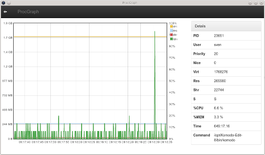

Usually we monitor processes with Nagios or Naemon but sometimes you want to have really detailed graphs of resource usage of single processes in realtime resolution. Maybe to find and visualize memory leaks or to watch resource usage over time. Nagios based solutions are not worth the effort since you probably just want to nail down a specific single problem. So i used this opportunity to write a small desktop application with node-webkit.

<!--more-->

## Node-Webkit
<a href="https://github.com/rogerwang/node-webkit" target="_blank">Node-Webkit</a> is a great tool, especially if you are used to write web applications and therefor html, javascript and css are well known already. You just create a normal webapplication in javascript which can be deployed later as standalone desktop application.

Another advantage is the huge amount of web libraries which can be used. In this case we make use of <a href="http://jquery.com/" target="_blank">jQuery</a>, <a href="http://getbootstrap.com/" target="_blank">Bootstrap</a> and the <a href="http://www.flotcharts.org/" target="_blank">Flot</a> graphing library.

## ProcGraph
This little tool runs <i>top</i> in the background to display a list of current processes. It's possible to log into remote hosts via ssh and watch those processes too. After selecting the process of choice, procgraph will draw a realtime graph of the cpu and memory usage of this process.

 * Downloads are available on github: <a href="https://github.com/sni/procgraph/releases" target="_blank">https://github.com/sni/procgraph/releases</a>
 * As well as more details and the source: <a href="https://github.com/sni/procgraph
" target="_blank">https://github.com/sni/procgraph</a>

   