This blog post shows how to set up the <a href="http://blog.jetbrains.com/idea/2015/03/docker-support-in-intellij-idea-14-1/">new Docker plugin for Intellij IDEA 14.1</a> on <a href="http://www.ubuntu.com/">Ubuntu Linux 14.10</a>.
**1. Install Docker
If you haven't installed <a href="https://www.docker.com/">Docker</a> already, use the following command to install it:
```sh
wget -qO- https://get.docker.com/ | sudo sh
```
<!--more-->
**2. Enable the HTTP-based Docker Management API
The standard Docker installation on Linux uses a Unix Socket for providing the management API. However, the Intellij Docker plugin requires a HTTP interface for communicating with the Docker server. In order to enable the HTTP-based management API, edit the file */etc/init/docker.conf* and update the *DOCKER_OPTS* environment variable:
*DOCKER_OPTS='-H tcp://0.0.0.0:2376 -H unix:///var/run/docker.sock'*

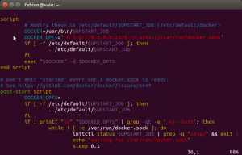

Then restart Docker with the following command
**sudo service docker restart**

**3. Open the Example Project in Intellij IDEA
Like the <a href="http://blog.jetbrains.com/idea/2015/03/docker-support-in-intellij-idea-14-1/">Intellij IDEA Blog</a>, we use the <a href="https://github.com/wildfly/quickstart/tree/master/helloworld">Wildfly Hello World Quickstart</a> as an example application. Clone the quickstarts with <a href="http://git-scm.com/">git</a>:
**git clone https://github.com/wildfly/quickstart.git**
and open the *quickstart/helloworld* project in Intellij IDEA.

**4. Install the Intellij Docker Plugin
In the *Plugins* dialog, click the *Install JetBrains Plugins* button.
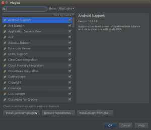
Search for the *Docker* Plugin and install it.
Restart Intellij.

**5. Add Docker Cloud Settings
In the *Settings* dialog, search for *Cloud*, and use the + button to add a *Docker* cloud setting.


The *API URL* setting corresponds to the configuration from *Step 2*, which is <a href="http://localhost:2376">http://localhost:2376</a> (not https). The certificates folder is empty.
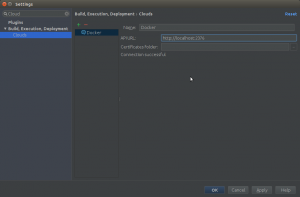

If everything is alright, the dialog shows *Connection successful</em> under the *Certificates folder.

**6. Create a Dockerfile
Create a directory *docker-dir* in the project root, and create a file named *Dockerfile* with the following content:
```text
FROM jboss/wildfly
ADD wildfly-helloworld.war /opt/jboss/wildfly/standalone/deployments/
```

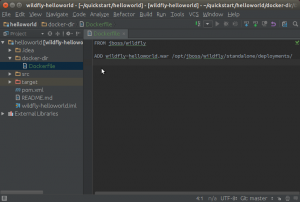

**7. Configure Target Directory for the WAR File
The file <code>wildfly-helloworld.war</code> must be created in the same directory where the <code>Dockerfile</code> is located. In order to do so, open the *Project Structure</em> dialog and configure the *Output directory</em> for <code>wildfly-helloworld.war</code>.
<div>
<a href="project-structure.png">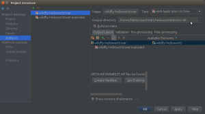</a>
</div>
**8. Create Run Configuration
In the *Run/Debug Configurations</em> dialog, add a new *Docker Deployment</em> configuration
<div>
<a href="run-configuration-01.png">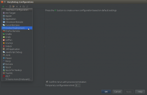</a>
</div>
Set the *Name</em> to *Docker deploy</em>, and the *Container name</em> to *docker-deploy</em>.
<div>
<a href="run-configuration-02-container-name.png">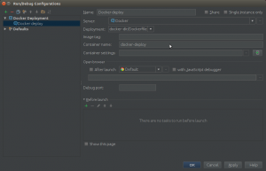</a>
</div>
Click the button to the right of *Container settings</em> to auto-generate a <code>container_settings.json</code> file. Create the file in a new directory called *docker-settings</em>.
<div>
<a href="run-configuration-03-container-settings.png">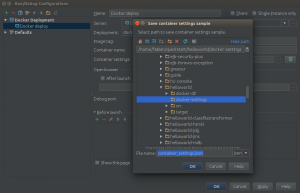</a>
</div>
As *Before launch</em>, add a step to build the artifact <code>wildfly-helloworld.war</code>.
<div>
<a href="run-configuration-04-build-artifact-before-launch.png.png"></a>
</div>
**9. Run the Docker Container
When run for the first time, the startup may take a long time, because Docker needs to pull the <a href="https://registry.hub.docker.com/u/jboss/wildfly/">jboss/wildfly</a> image from the Docker hub.
<div>
<a href="running.png">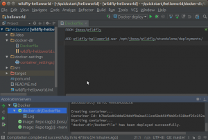</a>
</div>
**10. Find Out the Container's IP Address
Run the <code>docker inspect</code> command by right-clicking on the running container. The output includes the container's IP address.
<div>
<a href="inspect.png">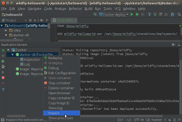</a>
</div>
**11. View in Browser
The hello world application can now be accessed with a Web browser on <a href="http://172.17.0.2:8080/wildfly-helloworld/HelloWorld">http://172.17.0.2:8080/wildfly-helloworld/HelloWorld</a> (depending on the container's IP address).
<div>
<a href="browser.png">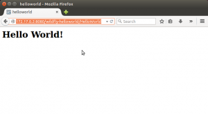</a>
</div>