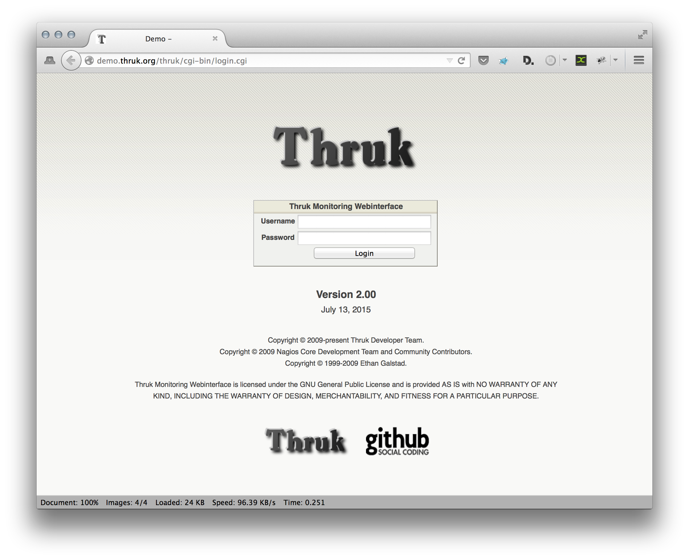

 Today [Thruk][1] has released version 2.00 wich is a great milestone and a huge step forward. Instead of adding lots of things, we tried to remove unnecessary dependencies. Version 2.00 comes without the Catalyst framework and many performance improvements, especcially on larger setups.

<!--more-->

## Performance Improvements
While working on the new release, we constantly monitored the effectivity of our changes with a small perl script and the apache benchmark toolkit.

As you can see, in this example setup, the used memory is divided by half and the initial startup delay is almost gone. Besides that, a lot of dependencies have been removed. The thruk_libs have been moved into a separate package and the number of modules required has dropped from 225 to 95. This includes indirect and optional dependencies.

## Form based Cookie Authentication
Seeing that apaches basic authentication is not quite state of the art anymore, we changed the default authentication to a form and cookie based authentication method. This has existed before already, but now it's the default. Besides the optical improvement, this also has the huge advantage of providing the possibility to logout the current user.

In case you don't want this feature, just comment the include in this file:

    /etc/apache2/conf.d/thruk_cookie_auth_vhost.conf

On Debian/Ubuntu you have to comment the include also in

    /etc/apache2/sites-available/default*

On SLES and Centos your apache path is probably /etc/httpd.

## Packaging Changes
The default packages are now split into 4 smaller packages to separate the library from the base files. This makes our builds faster, because the librarys usually don't change very often but took the most time to build. And while on that, we moved the reporting plugin into a separate package too because it comes with additional dependencies on xlibs and xvfb which not all people want on their servers, so now its your choice if you want the reporting module or not.

## Changelog

Next to those major changes, there were made lots of small improvements too which can be found in the [Changelog][2].

## Download

The latest version can be downloaded for free at [www.thruk.org][1].
There is also a [demo system][3] available if you just want to have a look first.

[1]: http://www.thruk.org
[2]: http://thruk.org/changelog.html
[3]: http://demo.thruk.org