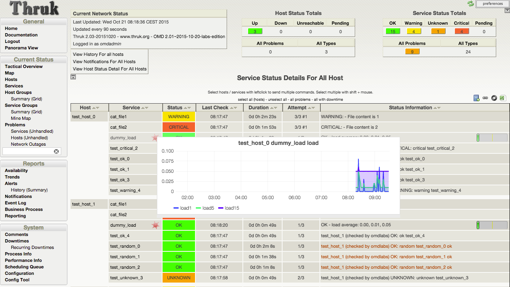
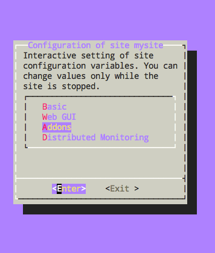
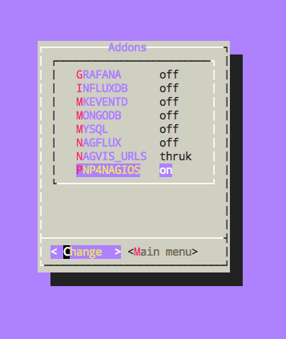
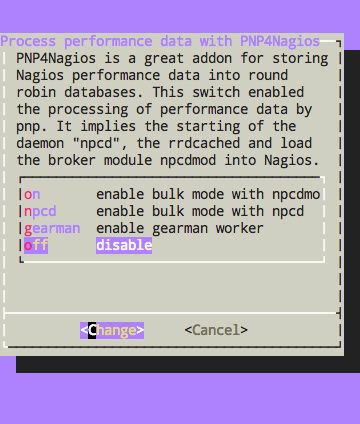
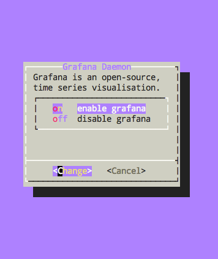
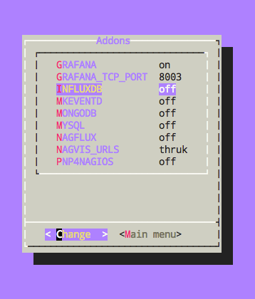
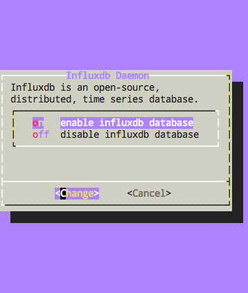
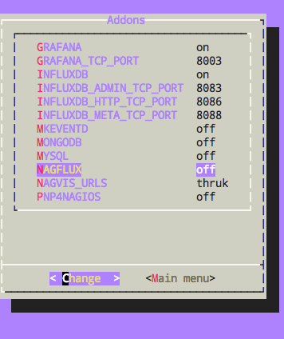
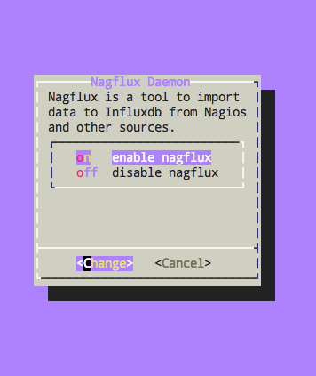
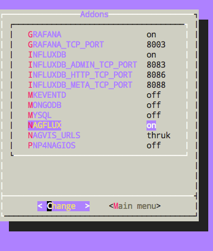

In der [__OMD Labs Edition__](https://labs.consol.de/de/omd/) gibt es seit kurzem die Möglichkeit, die Performance-Daten in einer [__InfluxDB__](https://influxdb.com/) zu speichern. Die Daten werden dabei von der Komponente [__Nagflux__](https://github.com/Griesbacher/nagflux) in die InfluxDB geschrieben, [__Histou__](https://github.com/Griesbacher/histou) übernimmt das Erzeugen der Graphen auf Basis von Templates und [__Grafana__](http://grafana.org/) übernimmt die eigentliche Anzeige.

Einen ausführlichen [Vortrag](https://www.netways.de/?id=3200) vom Autor von Nagflux und Histou, Philip Griesbacher, wird es auf der diesjährigen OSMC geben.

Das Aktivieren des kompletten Gespanns ist ab der Version __omd-2.01.20151021-labs-edition__ aus unserem [Testing-Repository](https://labs.consol.de/repo/testing/) in einer OMD site sehr einfach möglich. Erfahrene OMD-Benutzer verwenden die folgenden Kommandos, für OMD-Einsteiger gibt es die ausführlichere bebilderte Anleitung weiter unten.

```bash
omd config set PNP4NAGIOS off
omd config set GRAFANA on
omd config set INFLUXDB on
omd config set NAGFLUX on
```
<!--more-->

Zuletzt müssen ggf. noch die verwendeten Templates der eigenen Konfiguration von `host-pnp` bzw. `srv-pnp` auf `host-perf` bzw. `srv-perf` geändert werden, damit die neuen `action_url`-Einstellungen (siehe weiter unten) der neuen Graphen angezogen werden, z.B:
```text
define service {
   # ALT
   use	 srv-pnp,...
   ...
   # NEU
   use   srv-perf,...
   ...
 }
```


Nach kurzer Zeit sollten die ersten Graphen mithilfe von InfluxDB, Nagflux, Histou und Grafana gezeichnet werden.




Bei OMD mitgelieferte `action_url`-Einstellungen für Nagios/Icinga/Naemon/Shinken in `~/etc/nagios/conf.d/nagflux.cfg`:
```text
define host {
   name                 host-perf
   process_perf_data    1
   action_url           /OMD_SITE/grafana/dashboard/script/histou.js?host=$HOSTNAME$&theme=light
   register             0
}

define service {
   name                 srv-perf
   process_perf_data    1
   action_url           /OMD_SITE/grafana/dashboard/script/histou.js?host=$HOSTNAME$&service=$SERVICEDESC$&theme=light
   register             0
}
```

Bei OMD mitgelieferte `action_url`-Einstellungen für Icinga2 in `~/etc/icinga2/conf.d/histou.conf`:
```text
template Host "host-perf" {
  action_url = "/OMD_SITE/grafana/dashboard/script/histou.js?host=$host.name$"
}

template Service "srv-perf" {
  action_url = "/OMD_SITE/grafana/dashboard/script/histou.js?host=$host.name$&service=$service.name$"
}
```

Zum Abschluß noch die ausführliche bebilderte Anleitung für OMD-Einsteiger, wie man die oben gezeigten Einstellungen per Dialog aktiviert:

```text
[root@omdlabs]# omd create mysite
[root@omdlabs]# su - mysite
OMD[mysite]:~$ omd config
```




















Zuletzt noch die OMD site starten...

```text
OMD[mysite]:~$ omd start
```