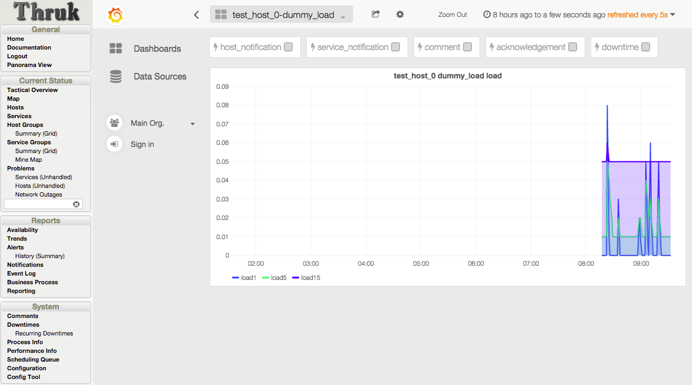

[__OMD Labs Edition__](/docs/omd/) 2.10 in has been released today. The OMD Labs Edition is based on the standard [__OMD__](http://omdistro.org/) but adds some
more useful addons like [__Grafana__](http://grafana.org/) and [__Influxdb__](http://influxdb.org/) or additional cores like [__Icinga 2__](http://icinga.org/) and
[__Naemon__](http://naemon.org/). Todays release is a great milestone because it introduces grafana based graphing out of the box in the usual easy OMD way.
<!--more-->

## Whats new

### Grafana / Influxdb based graphing
As new alternative to the well-known PNP4Nagios graphs a new way of graphing has been implemented in this release.
It's easy to [__enable grafana graphing__](/docs/omd/packages/grafana/) with the `omd config` menu. It's even possible
to use both in parallel to make a smooth migration.

A few highlights of this solution are:

  - interactive graphs
  - annotations of downtimes and notifications
  - user designed dashboards

### Coshsh
Another new component in OMD Labs is the [__Coshsh__](/docs/omd/packages/coshsh/) configuration generator which create
nagios objects based on CMDB data or excel sheets.

### SLES 12 and Fedora Support
This OMD release comes with prebuild packages for Fedora 22 and SLES 12.

## Updates
All components have been updated to their latest stable releases including

 - [__Thruk__](http://thruk.org/) 2.0.4
 - [__Icinga 2__](http://icinga.org/) 2.3.11
 - [__Naemon__](http://naemon.org/) 1.0.3
 - [__Mod-Gearman__](http://mod-gearman.org/) 2.1.5

## Changes

The only necessary change was to remove the shared apache mode. The default mode was the `own` mode already and the
shared mode causes trouble in various ways, so it was better to remove it completely.

## Download

Please use the [__Consol Labs Repository__](/repo/stable/) for an easy and painless intallation.