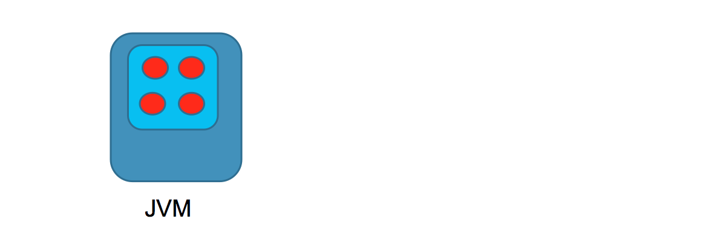
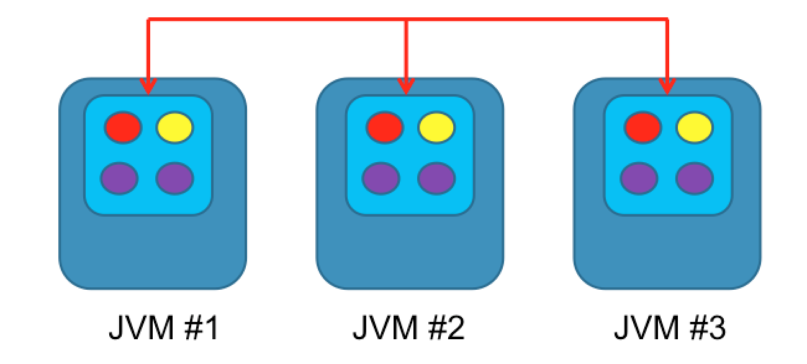
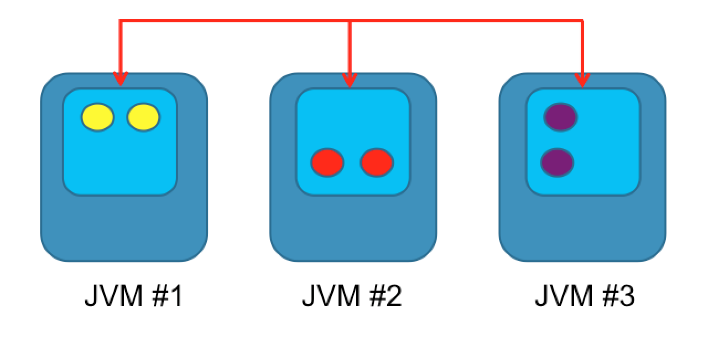
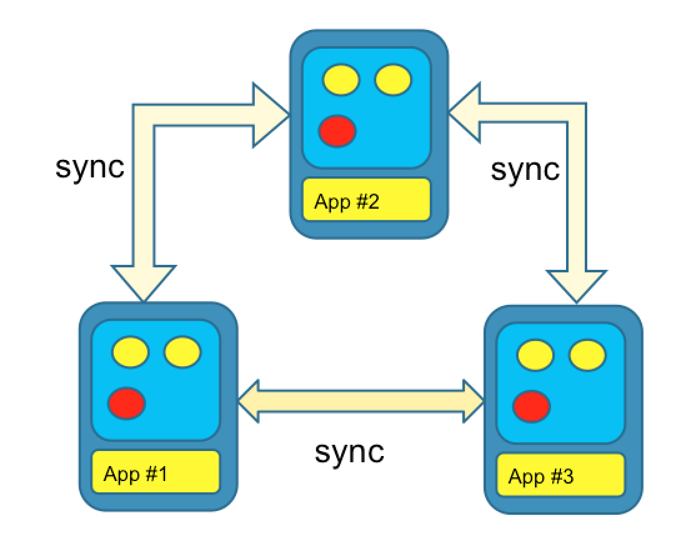
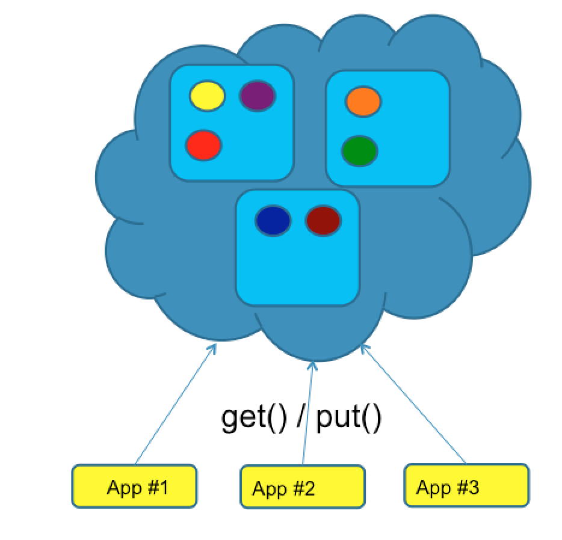
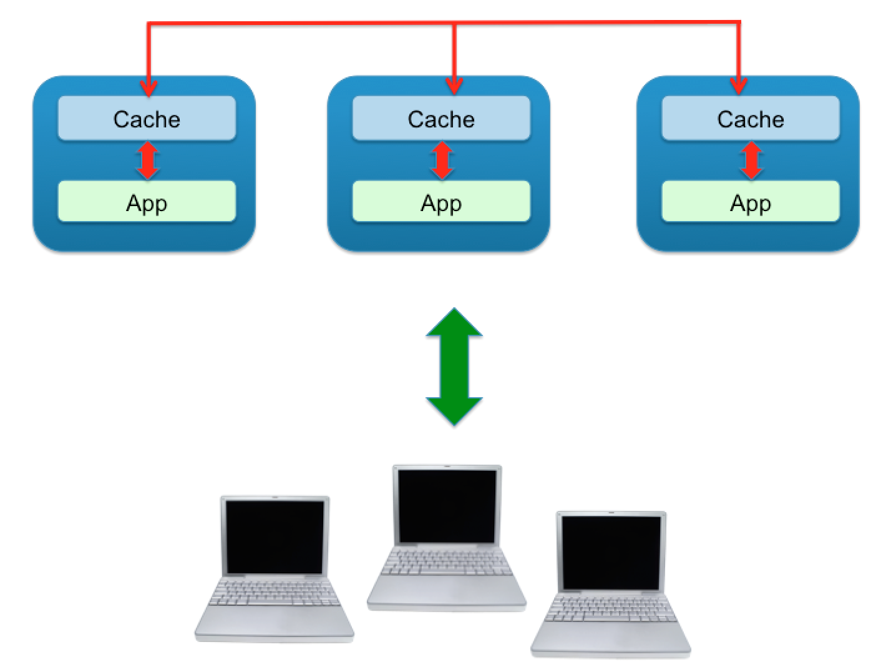
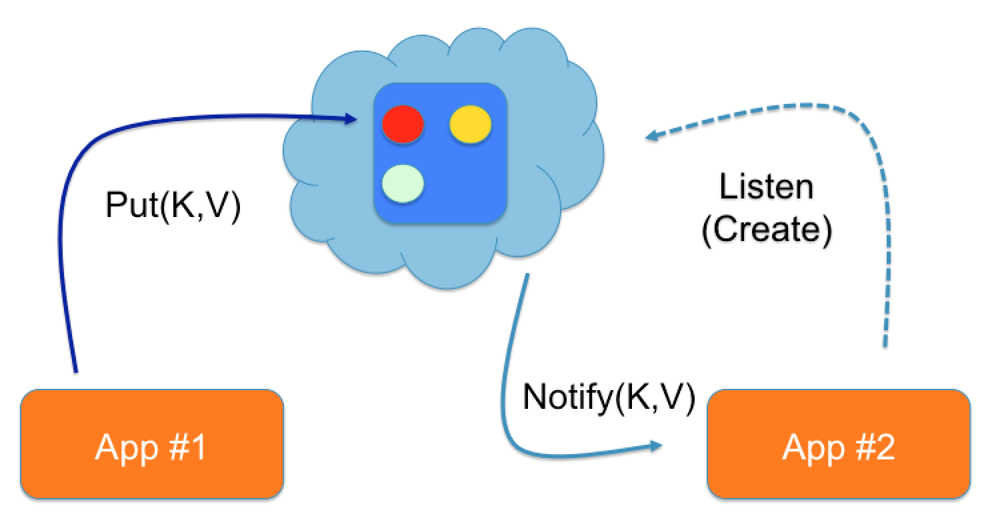
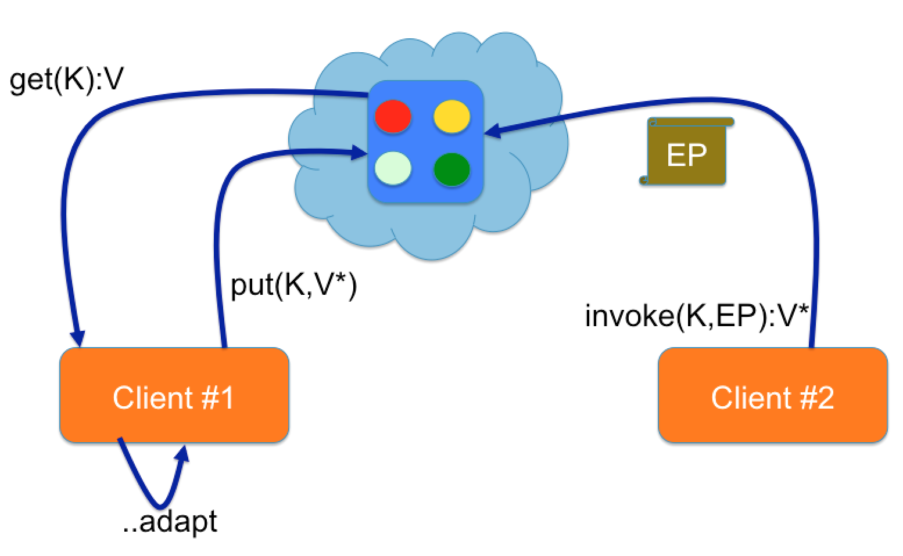
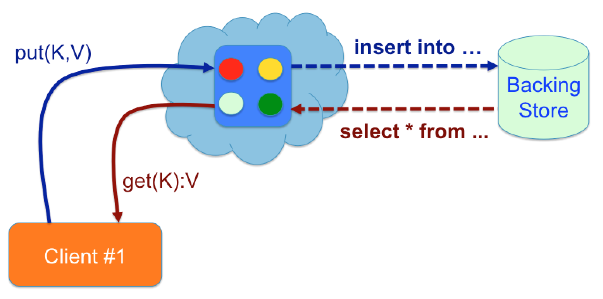

## Introduction
A couple of years have passed since we last looked into in-memory Java caches here at ConSol. In that time a bunch of things have happened:

* Probably the most significant thing that happened was that the oldest Java Service Request [JSR 107](https://jcp.org/en/jsr/detail?id=107), also known as JCache, finally reached 'Release’ status. This JSR was a long time in the making taking a whole 13 years since the initial proposal back in 2001.

* [Grid Gains](http://www.gridgain.com/) In-memory Data Fabric became an open source project and is now available under the Apache Foundation Project and known as [Apache Ignite](https://ignite.apache.org/).

* The existing In-memory caches providers, like [Hazelcast](https://hazelcast.org/), have received a whole host of new features including things like support for distributed transactions, a new Map-Reduce API, interceptors for executing business logic, when the cache entries change, to mention just a few.

<!--more-->

This inspired us at ConSol to take a second look at caching to see how things have progressed, since we last got our feet wet. We set out with 2 primary goals:

1. To have a look at the released JSR 107 specification and get familiar with the new API. 
2. To check out one or two of the leading distributed in-memory cache providers, to see what direction they have taken, what new features exist and how well JCache is supported, now that the specification has been finalised.

After having a quick glance at the JCache specification table of contents we decided we'd try to write a simple application to showcase most of the features of the spec (even if somewhat contrived) and came up with the idea of a basic web chat application that manages chat-rooms and users with the help of a distributed cache. To justify using a cache we decided that the web application should be scalable and robust so that even if an instance crashes, no chat rooms or user sessions are lost.

Before we dive into the sample application, lets go over some of the basic caching concepts and briefly introduce the JCache API.

## What is Caching?
A cache is basically a temporary data-structure used for storing data in-memory that is typically expensive to compute or retrieve, to mention just a few use cases. From an API point of view a Cache is very similar to java’s Map data structure. You can put entries into the cache and get them later using a key. However unlike a Map in java

* the entries in the cache may expire,
* the entries may be evicted,
* the entries may be stored outside the JVM,
* and for that reason an entry’s key and value should be serializable.

## Cache Types
Now that we’ve covered the basics of what caching is, lets have a look at the different types of caches.

<div align="center">

</div>

The most trivial type of cache is a standalone or local cache. This type of cache is not aware of any other caches and acts on its own. The advantage is its simplicity. It does not have to synchronize with other cache instances and as a result is easy to use and fast. The downside is that the maximum storage size of the cache is restricted to the size of the java heap. Also if the cache instance fails, then all data is lost.

<div align="center">

</div>

The second type of cache is a replicated cache. This is a clustered cache where data within the cache is replicated to all other members within the cluster. Reads are very fast and can be processed by any member within the cluster. However write performance is poor, as changes have to be propagated to all cluster members.  Since all nodes have a copy of the data, this is a very robust type of cache; if all cache nodes fail, bar one, no data is lost. The cache storage size is constant; adding additional nodes will not have any impact on the aggregate storage size.

<div align="center">

</div>

The third type of cache is a partitioned or distributed cache. This is a clustered type of cache, where data is partitioned or spread out across all nodes within the cluster. Adding additional nodes increase the overall storage size of the cache. Read and write performance is linear. To make this cache type more resilient to failure a backup node can be used for storing a copy of the cache data; in the event of a node failing no data is lost.

## Cache Topologies
Now that we’ve introduced the main types of caches lets have a look at the different types of caching topologies. You’re probably asking: wait didn’t we just cover caching topologies above? Yes, we did; we introduced the three main types of caching topologies: standalone, synchronized and partitioned. However there is one aspect that we didn’t focus on and that was how the application interacts with the cache or cache cluster.

So lets have a look at the two basic ways in which an application can interact with a cache:

<div align="center">

</div>

In the peer-to-peer topology the cache node and the application run in the same JVM. The example above shows a peer-to-peer topology with a replicated cache. With this setup the application can get data from the cache very fast as it does not involve any network I/O. However adding new or modifying existing cache entries would involve synchronizing the changes across all cache nodes. These are the types of trade-offs that have to be considered when designing the architecture of the application. We could just have easily used a partitioned cache, rather than a replicated cache, which would have had entirely different implications.

The other type of topology we want to mention is the client-server topology:

<div align="center">

</div>

The example above shows a client-server topology using a distributed cache. Using this setup, reads and writes always involve network I/O, so you might ask yourself what is the main advantage of this topology. Well it allows the cache and the application to have independent release cycles; a new version of the application can be rolled out without having to touch the cache cluster.

When designing a caching architecture, topology matters. You need to consider the trade offs and pick the best fit according to your requirements. In some cases it might even make sense to mix topologies.

This is by no means an exhaustive list of all cache types or topologies, but we hope it provides at least a good insight.

## JSR 107 / JCache
Now that we’ve covered the basic caching topics, lets dive into JSR 107, also known as JCache.

What is [JCache](https://jcp.org/en/jsr/detail?id=107) all about or what hole does it try to fill? We mentioned earlier, that there are many scenarios or use-cases, where the use of a cache can optimize application performance and reduce latency. As a result, lots of different caching solutions were developed over time from the simplest libraries with in-memory object maps, to the more advanced caching libraries with support for high-available, distributed, fault-tolerant, cross-JVM caching solutions. It was great to have such a wide variety of caching solutions but changing from one caching provider to another involved significant effort. Also for application frameworks like the spring framework, trying to create a generic caching API to encapsulate the underlying caching provider was no easy task. So to make life easier for application and framework developers, the JCache API was developed to provide a common interface for interacting with caching systems. In the same way [JDBC](https://en.wikipedia.org/wiki/Java_Database_Connectivity) standardises access to databases, JCache attempts to do the same for caches. The API is surprisingly compact and relatively simple to use, as we will see below.

## JCache API

<div align="center">

</div>

Here we can see the high level interfaces which make up the core of the JCache API:

* CacheProvider - The cache provider is the entry point into the JCache API. Each cache provider implements this interface and getting an instance of a CacheProvider allows the application to interact with that provider’s cache.
* CacheManager – The cache manager allows application to create, use and destroy caches.
* Cache – The cache interface is a wrapper around the cache data structure, which allows applications to create, read, update and delete (CRUD) cache entries.
* Cache.Entry – A cache entry is an abstraction on top of a key-value pair, resembling java’s Map.Entry.

## Getting Started with JCache
Getting started with JCache is a piece of cake, as you’ll see below.

The first thing you need is to add the JCache dependencies to your project.

```xml
<dependency>
  <groupId>javax.cache</groupId>
  <artifactId>cache-api</artifactId>
  <version>1.0.0</version>
</dependency>

<dependency>
  <groupId>com.hazelcast</groupId>
  <artifactId>hazelcast</artifactId>
  <version>3.5.4</version>
</dependency>
```
The first dependency is for the JCache API. Then you need to add the dependency for your favourite caching provider. In the above example we use [Hazelcast](https://hazelcast.org/).

Then fire up your IDE and add the following lines to get access to the cache manager.

```java
// get default cache provider
CachingProvider provider = Caching.getCachingProvider();

// get default cache manager
CachingManager manager = provider.getCacheManager();
```
Because Hazelcast is the only caching provider on the classpath we can just request the default. With the cache provider we can access the CacheManager, which we use below for accessing a cache.

```java
// acquire previously created cache
Cache<String, String> myCache = manager.getCache("myCache", String.class, String.class);

// put something in
myCache.put("Hello", "World");

// and get it out again
myCache.get("Hello");
```
Here we just put something into the cache and retrieve it again.

Now that you have a basic understanding of caching and the JCache API, it’s a good time to introduce our sample application.
It is also available on [GitHub](https://github.com/martinmaher/jcache-chat).


## Chat Room Application
The basic architecture of the chat room application is presented below:

<div align="center">

</div>

We have a client-server architecture, using web sockets and REST for communicating between the client and the server.

The server uses spring boot with an embedded tomcat container for handling client requests. It also uses a cache for managing the chat rooms.

The client is a very basic single-page JavaScript application that uses [SockJS](https://github.com/sockjs) and [STOMP](https://stomp.github.io/) for the [WebSocket](https://de.wikipedia.org/wiki/WebSocket) communication and [JQuery](https://jquery.com/) for handling REST requests.

Our main goal in our fictitious application (alongside developing a JCache application) was to develop an application that was responsive, highly available and scalable that could gracefully handle failure. So we opted for a peer-to-peer, partitioned cache topology. If a node fails then no chat rooms or messages should be lost and clients should not be impacted. Our application when deployed resembles the following topology:

<div align="center">

</div>

We decided to skip the load balancer for distributing requests across the application instances and detecting failure, after all it is just a sample application, but I think you can get the general gist.

The application’s entity model is very modest, using just the two entities shown below:

<div align="center">

</div>

A room contains a list of messages and the name of the user that created the room. A message contains some text and the name of the user that sent the message. That’s basically it.

The following [REST](https://en.wikipedia.org/wiki/Representational_state_transfer) operations can be sent from the client to the server:

* Join or leave the chat application
* Get the list of logged in users
* Create or remove a room
* Send a message to a room

The server can push the following notifications to connected clients using [STOMP](https://stomp.github.io/) over WebSocket:

* Notify room created or removed
* Notify chat message sent
* Notify user logged-in or logged-Out

## Starting the application
First of all make sure, that java and maven are installed and configured on your system. We developed and tested the application using the following versions:

* [Java 8 (1.8.0_40)](https://www.java.com/en/)
* [Maven 3.3.3](https://maven.apache.org/)

Before the application can be started you need to start a standalone [H2](http://www.h2database.com/html/main.html) database, which is checked in with the application sources:
* Open up a shell
* Change to the H2 directory under “../support/h2_v1.3.176/”
* Run the H2 start-up script (either h2.bat or h2.sh).
This will start H2 using the default port and database. After starting up the database, a browser window is typically opened, which you can use for testing the connection to the database and viewing the database ,content. For the moment just start the database and we’ll cover later on what this database is used for.

Now we can start the application. This can be done either from the command line or from inside your favourite IDE. The application by default starts on port 8090. You can easily override the default port by supplying the following program argument on start-up:

    --server.port=8090

To start from the command line type:

	mvn clean install spring-boot:run

This will start up one instance on port 8090. To start up an additional instance use the same command from above and append the server.port argument as shown below:

	mvn clean install spring-boot:run --server.port=8091

Alternatively you can start the application from inside your IDE by running the following main class:

    de.consol.chat.ChatApplication

Now go ahead and open the application in your browser and have fun chatting. Assuming you haven’t changed the default port use

    http://localhost:8090/

<div align="center">

</div>

You can open multiple tabs to simulate multiple users and even connect to different instances of the application, running on different ports. Each time a user joins the chat, creates a room or sends a new message then all tabs in your browser should reflect the change.

## Developing the application
Here we’ll take you through the steps we used to develop the application, introducing each JCache feature one at a time.

### Configuring and accessing the cache
We briefly touched on this above when introducing JCache but we’ll go into more details now on what possibilities exist when configuring a cache.

One way of doing this is to use the JCache API.

``` java
@Bean
public Cache<String, Long> getIdCache(JCacheCacheManager cacheManager) {
    CacheManager cm = cacheManager.getCacheManager();
    cm.createCache("id-cache", getIdCacheConfiguration());
    return cm.getCache("id-cache");
}

private MutableConfiguration getIdCacheConfiguration() {
    MutableConfiguration<String, Long> configuration =
            new MutableConfiguration<String, Long>()
                    .setStoreByValue(true);
    return configuration;
}
```
Using the API you can create a cache and configure it with all the JCache features (which we’ll cover shortly below) directly from java code. It avoids any additional XML files within your project’s code base and helps avoid misconfigurations typically associated with XML configuration, through compile time checking. In the code above a new cache “id-cache” is created using the ‘Long’ type as a key and the ‘Session’ type as a value.

The same configuration is now shown below, this time configuring the cache declaratively. In the example below we’re using Hazelcast’s XML configuration file.

``` xml
<hazelcast
    xsi:schemaLocation="http://www.hazelcast.com/schema/config
  http://www.hazelcast.com/schema/config/hazelcast-config-3.5.xsd"
    xmlns="http://www.hazelcast.com/schema/config"
    xmlns:xsi="http://www.w3.org/2001/XMLSchema-instance">
  <cache name="id">
    <key-type class-name="java.lang.String"/>
    <value-type class-name="java.lang.Long"/>
  </cache>
</hazelcast>
```
This is obviously provider dependent and you might be wondering why bother using this XML configuration when you can use the provider-independent JCache API. Well for one thing if you wish to use provider specific features not available within the JCache API then this is probably your only choice.

We also experienced some strange behaviour using the API configuration when multiple nodes of the chat application were started. The first node started up without any problems, creating and configuring a cache. The second node when it started up also tried creating and configuring the cache a second time. Since we’re using a peer-to-peer topology, re-creating and re-configuring the cache a second time resulted in runtime exceptions. One way out of this, would be checking to see, if the cache existed first before creating and configuring a new cache, but even here you could have race conditions so we decided in the end to go with the declarative configuration.

You can view the complete XML configuration file we used in our application under:

    .. /src/main/resources/hazelcast.xml

### Entry listeners
The JCache API contains classes and interfaces for registering and handling events produced by a cache.

<div align="center">

</div>

In our chat application we decided to use event listeners:
* For detecting when users logged in and out of the application and
* For detecting when chat rooms were created, removed and modified (i.e. when a chat message was added).

These events were then pushed to all connected web-clients using [STOMP](https://stomp.github.io/).

To receive event notifications a CacheEntryListener has to be registered with the cache. A listener can indicate which events it is interested in by implementing the interface associated with the event. The four interfaces that can be implemented are:

* CacheEntryCreatedListener
* CacheEntryUpdatedListener
* CacheEntryExpiredListener
* CacheEntryRemovedListener

From the interface name it’s obvious what events a listener is interested in receiving.

To get a better idea of what this looks like in java code, we’ve included a sample of our room listener below:

``` java
public class RoomEventListener implements
        CacheEntryCreatedListener<Long, Room>,
        CacheEntryUpdatedListener<Long, Room>,
        CacheEntryRemovedListener<Long, Room>,
        CacheEntryExpiredListener<Long, Room> {

    @Override
    public void onCreated(Iterable<CacheEntryEvent<? extends Long, ? extends Room>> cacheEntryEvents)

    @Override
    public void onUpdated(Iterable<CacheEntryEvent<? extends Long, ? extends Room>> cacheEntryEvents)

    @Override
    public void onRemoved(Iterable<CacheEntryEvent<? extends Long, ? extends Room>> cacheEntryEvents)

    @Override
    public void onExpired(Iterable<CacheEntryEvent<? extends Long, ? extends Room>> cacheEntryEvents)

}
```
If you’re interested in the implementation details have a closer look at our event listeners in the “de.consol.chat.config.eventlistener” package.

There’s one important configuration attribute “synchronous” that should be carefully considered when configuring listeners. If the listeners are configured to be synchronous, then the cache operation is blocked until all listeners have processed the cache event, which can adversely affect the performance of the cache. For listeners that require a significant length of time to process the event consider using asynchronous notifications, so the cache operation is not blocked unnecessarily.

### Expiry policies
If an application over time puts more and more entries into a cache, without performing any kind of house keeping, then eventually the java heap will run out of memory. To help with house keeping, the concept of an expiry policy was introduced in JCache. Using expiry policies it is possible to automatically expire cache entries based on certain criteria. JCache supports these four expiry types:

* Eternal – Cache entries will never expire.
* Access – Cache entries will expire if they have not been accessed within a configured time interval.
* Creation – Cache entries will expire after a configured time interval from when they were added to the cache.
* Update – Cache entries will expire if they have not been modified within a configured time interval.

To see expiry policies working in practice we decided to expire a chat room after one minute, if no new messages were posted.

``` java
public class RoomExpiryPolicyFactory implements Factory<ExpiryPolicy> {
    @Override
    public ExpiryPolicy create() {
        return new ModifiedExpiryPolicy(Duration.ONE_MINUTE);
    }
}

```
The expiry policy is turned off in the application by default, since it led to some unexpected behaviour within the application when using Entry Listeners. You can turn it on again by uncommenting the configuration in the XML file and restarting the application.

The problem was, if you can call it a problem, that when an entry expires it was not immediately removed from the cache. The cached value was only evicted when it was accessed next, i.e. on the next cache.get() invocation. Our assumption was that it would be immediately evicted, as was the case when we tested with [Apache Ignite](https://ignite.apache.org/), but [Hazelcast](https://hazelcast.org/) on the other hand does not guarantee this. So our web clients, that rely on event listeners for getting notifications when a room is removed (or expires) were still showing the room even though it had long been removed.

### Entry processors
Entry processors are one of the most powerful features introduced in the JCache API. They can be used to perform compound operations on cache entries in an atomic manner. Rather than fetching a cache entry, modifying it and putting it back in the cache an entry processor can be sent directly to the cache node and executed there.

<div align="center">

</div>

In our chat application we decided to use an entry processor for adding a chat message to a room. To see the benefits of this, lets consider first of all the alternative to using an entry processor (the left side of the picture above):

1. The client would have to fetch the room from the cache.
2. The client would then add the message to the room
3. Finally the client would put the modified room back into the cache.

However there are some drawbacks to doing this. What if the room contains 1000s of messages? Serializing, de-serializing and transferring the room over the wire multiple times would require a lot more I/O and computational time. Race conditions could easily occur during this time if a second client also decided to add a message to the room.

This is where entry processors (the right side of the picture) come to the rescue; the network I/O is minimal since only the entry processor is transferred over the wire and changes to the room entry are executed in an atomic manner avoiding race conditions.

To complete the picture, a sample of our AddMessage entry processor is shown below:

``` java
public class AddMessage implements EntryProcessor<Long, Room, Object>, Serializable {
    @Override
    public Object process(MutableEntry<Long, Room> entry, Object... arguments) throws EntryProcessorException {
        Room room = entry.getValue();
        room.getMessages().add((Message) arguments[0]);
        entry.setValue(room);
        return null;
    }
}


roomCache.invoke(message.getRoomId(), new AddMessage(), "some message");
```
Because our chat application is using a distributed cache, the entry processor must be serializable, since the code is executed directly on the cache node that owns the chat room.

### Loaders and Writers
With the JCache API it is possible to load cached entries from an external data source. Equally it also supports updating the external data source when the cache is modified; when a new entry is added to the cache or an existing entry is modified or deleted.

<div align="center">

</div>

This type of caching pattern is commonly referred to as the “read-through / write-through” caching pattern.

To use loaders and writers you have to implement two interfaces respectively and then configure your cache with these classes accordingly. In the chat application we decided to try this out on chat rooms. To keep things simple we decided to just persist the room to a standalone H2 database, ignore the messages in the room. To complete the picture we’ve included a snippet of both classes below.

``` java
public CacheLoader<String, Room> create() {
    return new CacheLoader<String, Room>() {
        @Override
        public Room load(String key) throws CacheLoaderException {...}

        @Override
        public Map<String, Room> loadAll(Iterable<? extends String> keys) throws CacheLoaderException {...}
    };
}
```
The loader interface contains two methods; one for loading a single entry and one for loading multiple entries from the backing store.

``` java
public class RoomCacheWriter implements CacheWriter<Long, Room>, Serializable {

    @Override
    public void write(Cache.Entry<? extends Long, ? extends Room> entry) throws CacheWriterException {...}

    @Override
    public void writeAll(Collection<Cache.Entry<? extends Long, ? extends Room>> entries) throws CacheWriterException {...}

    @Override
    public void delete(Object key) throws CacheWriterException {...}

    @Override
    public void deleteAll(Collection<?> keys) throws CacheWriterException {...}
}
```
The cache writer contains two methods for writing one or more entries to the backing store and also two methods from removing one or more entries from the backing store.

One point, that is worth mentioning, is when you use the cache.contains() method with a cache loaders configured. The method is used for checking, whether the cache contains the supplied key. You might expect the method to return true when the key exists within the backing store, but it doesn’t always. It depends on whether the entry exists in the cache of not and not if it exists in the backing store. This means, that a call of the contains() method doesn’t load the entry from the backing store.

If you’re interested in the implementation details have a look at the two classes in detail.

By default we disabled the Loader and Writer. You can just uncomment the configuration in the XML file, if you want to try it out. It works fine, but be warned, that you might run into integrity constraint errors. The application assumes that the database is empty each time the application is started. The reason being, is that an Id Entry Processor is used for generating unique IDs starting with 0. If a room already exists in the database with the ID 0 and a new room is created and becomes the same ID assigned, then you get an exception. If you get any errors, just delete all rooms from the database table and everything should work fine afterwards.

## Final impressions
Over the course of the five days we had a lot of fun writing the chat application and getting to grips with the new JCache API. Below we have captured some of the highlights and bumps we experienced along our journey.

## Lessons learned

* Topology matters. JCache does not make any presumptions with regards to the cache topology. It provides a flexible API that's designed in a cache-topology agnostic manner. However when switching from one caching topology to another you may encounter problems that require changes to your code. When we started out building our chat application initially we used the standalone topology. Everything worked fine until we decided to try out the same application using a peer-to-peer topology. We changed the XML configuration and restarted the application and during start-up got a “ com.hazelcast.nio.serialization.HazelcastSerializationException: java.io.NotSerializableException: ”. As it turns out we were using a non-serializable object inside of our CacheLoader class. This didn’t seem to bother Hazelcast until we switched topologies. If the cache providers would check this independent of the topology being used then switching topologies further down the road would be less error prone.

* JCache API. In general the API is well designed. Interacting with caches is very intuitive and with minimal code and effort you can be up and running in a short period of time.

* JCache specification. For the most part the specification is clear and well structured. At times however we had difficulties interpreting some of the documentation. To give an example: “ i.e. listeners have once across a cluster semantics, not broadcast and execute in each node semantics. ”. Rumour has that the next JCache maintenance release will address some of these issues.

* Switching between caching providers. When developing our application we tried to switch every now and then between [Hazelcast](https://hazelcast.org/) and [Apache Ignite](https://ignite.apache.org/). Our expectation was that we just add the Apache Ignite dependency to maven, create the cache configuration file and off we go. So much for the theory. First of all we had to replace the JCache CacheManager with Ignite’s Ignite class, which acts as a cache manager in the Ignite world. Starting Ignite the JCache way (CacheProvider, CacheManager etc.) unfortunately didn't work as expected; Ignite nodes, which were started as defined by the JCache specification, were not visible to each other and could not be used in a clustered manner. Also the nodes did not show up in Ignite’s monitoring GUI.

* Prefer declarative over programmatic configuration when using Hazelcast. We covered this in detail above, but just to re-cap – if you use the JCache configuration API then be careful when doing this with a clustered cache topology. We experienced some problems with Hazelcast and switched to declarative XML configuration in the end.

* Take care when using anonymous classes, especially when implementing JCache factory classes. We ran into some serialization problems here, since factory classes have to be serializable. If you use anonymous classes then you have to ensure that there are no non-serializable objects within the scope or context of the anonymous class. It took us a while to figure out what was causing problems.

* SpringBoot tries to auto-configure Hazelcast. When spring-boot detects Hazelcast on the classpath then it automatically creates a HazelcastInstance. We were also starting via the JCache provider a HazelcastInstance and couldn’t figure out why there were two caching nodes per JVM always created. In the end we figured it out and turned off [SpringBoot](http://projects.spring.io/spring-boot/)s auto-configuration.

* Hazelcast and EventListeners. Our chat application works fine when one or two application instances or cache nodes are executing. However over time as more and more instances are started Hazelcast goes bananas and starts sending multiple events for a single modification. This appears to be a bug in Hazelcast, which will be most fixed in a later release.

## What’s next
The list of JCache compliant cache providers continues to grow. Most of the big players are already on board including:

* [Apache Ignite](https://ignite.apache.org/)
* [Hazelcast](https://hazelcast.org/)
* [Coherence](https://www.oracle.com/middleware/coherence/index.html)
* [Infinispan](http://infinispan.org/)
* [Ehcache](http://www.ehcache.org/)

So the million-dollar question is – what’s next. Is it going to take another 13 years for the next JCache specification to come out? We hope not. It’s a nice specification but there were some gaps that we hope will be filled in the next version. Things like:

* Support for transactions. This was included in some of the draft JCache specifications, but was dropped in favour of Entry Processors. We think entry processors are great, but only guarantee that changes to a single entry are atomic. If you want to modify multiple entries in a single transaction, then you have to probably use proprietary feature from your caching provider.

* java.util.stream.Stream support. This was something that we missed whilst developing our chat application. Wouldn’t it be great if we could use filter(), map(), sort() etc. with JCache’s cache.