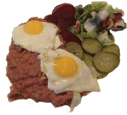

Kiel, 24 Grad, 50 Mann an Bord. Bei unerwartet schönstem Sommerwetter wurde in der Kieler Fachhochschule am 7. und 8. September der elfte Workshop der Monitoring-Community veranstaltet. Das ConSol-Monitoringteam trug mit acht Vorträgen zum Gelingen der Veranstaltung bei. Eine kurze Zusammenfassung:

Bereits mit dem erstem Vortrag nach der Begrüßung, __"E2E-Monitoring mit Sakuli"__, sorgte Simon Meggle für einen würdigen und technisch anspruchsvollen Auftakt der Veranstaltung. Die Möglichkeit, Sakuli in Docker-Containern einzusetzen und End-to-End-Tests somit praktisch beliebig zu parallelisieren, sorgte für viel Gesprächsstoff.

Damit es jeder zu Hause nachmachen kann, führte Simon dann am zweiten Tag die Teilnehmer in einer Live-Demo durch sein Tutorial __"Sakuli-Tests im Docker-Container"__.
<!--more-->

Root-Cause-Analyse ohne graphische Daten ist wie die Kieler Förde ohne Wasser. Und so hat Philip Griesbacher mit seinem Vortrag __["Performancedaten-Visualisierung mit Grafana/InfluxDB"](http://www.slideshare.net/PhilipGriesbacher/monitoring-workshop-kiel-2016-performancedaten-visualisierung-mit-grafana-influxdb)__ die versammelte Community über die Neuerungen und Fortschritte im Bereich Time Series Database vom Trockenen geholt und auf den neuesten Stand gebracht.

Nach dem Mittagessen war es dann auch Zeit, tiefer in einzelne IT Bereiche einzutauchen. __["SAP-Monitoring"](http://de.slideshare.net/lausser/checksaphealth)__ war das Thema von Gerhard Laußer, bei dem er in gewohnter Souveränität sein Plugin __check_sap_health__ durch die Monitore und MTE's des SAP CCMS schipperte.

Den letzten Vortrag des ersten Tages stellte Sven Nierlein mit seinem Vortrag über __["Thruk 2"](http://www.slideshare.net/SvenNierlein/thruk-ii-panorama-dashboards)__. Er überraschte die Zuhörer mit seinen "Slides", die - wie sich im Lauf der Präsentation herausstellte - allesamt im Thruk-Dashboard erstellt waren. Besser wäre der beeindruckende Funktionsumfang dieses Addons kaum zu zeigen gewesen.

Automatisierung ist auch unter Monitoring-Admins ein immer größer werdendes Thema. Mit __["Ansible - Einführung und Demo"](https://github.com/m-kraus/ansible-demo)__ konnte Michael Kraus am zweiten Tag auch Anhänger anderer Orchestration-Tools wie Puppet oder Chef abholen und wertvollen Lotsendienst für einen Einsatz von Ansible im Monitoring-Umfeld leisten.

Ebenfalls zum Thema "Automatisierung" zeigte Gerhard Lausser mit __["automatische Konfig-Generierung mit coshsh"](http://de.slideshare.net/lausser/coshsh)__ die automatische Erzeugung einer Nagios-Konfiguration aus einer CMDB oder vergleichbaren Quellen mittels __coshsh__ und __Jinja2__-Templates. Danach war auch der Ursprung des als _Zoschsch_ ausgesprochenen Namens klar (zumindest bei den anwesenden Kennern ausgestorbener Oberpfälzer Dialekte).

Der letzte ConSol-Vortrag war ein Blick in die Glaskugel. Er behandelte das sich rasant verbreitende Monitoring-Tool __Prometheus__, welches neuerdings Bestandteil der OMD Labs-Edition ist. Michael Kraus stellte sein Setup vor, bei dem ein Prometheus-Pod im __Kubernetes__-Cluster läuft und dessen Metriken sammelt. Mittels Federation ist es einem externen Prometheus dann möglich, Einblicke in eine von Kubernetes verwaltete Cloud zu bekommen, um sie in __OMD__ weiter zu verarbeiten.

Den Gesprächen in den Pausen, sowie den vollgeschriebenen Notizzetteln und verschlissenen Kugelschreibern nach zu urteilen war der elfte Workshop eine gelungene Veranstaltung.

Natürlich waren nicht nur ConSol-Referenten auf dem Workshop vertreten. Lenz Grimmer gab einen Überblick über das Open-Source-Storage-Managementsystem __[openATTIC](http://www.slideshare.net/LenzGr/storage-monitoring-in-openattic-monitoring-workshop-20160907)__ und dessen eingebautes Monitoring. Mark Swillus zeigte sein Projekt __MoniTutor__, welches mit Mitteln des Monitorings prüft, ob Studenten Praktikumaufgaben im Bereich der IT-Infrastruktur richtig gelöst haben. Neues von __check_mk__ hatte Marcel Schulte zu berichten. Spannend wurde es beim Vortrag der Kollegen von CONSIST. Die führten unter dem Titel __"SIEM mit Splunk"__ vor, wie man sicherheitsrelevanten Events in Echtzeit auf die Spur kommen kann. Über den Aufbau einer IK-Servicemanagement-Gruppe erzählte Daniel Klüh von der Continentale Versicherung. Unter den Tools, die sie verwenden, tauchten lauter Namen auf, die man auf dem Workshop mehrmals gehört hatte. Sakuli, Thruk, OMD ... hat uns sehr gefreut und war auch vorher nicht abgesprochen, ehrlich.

Mit dem Besuch des Computermuseums und des Mediendoms wurde die Messlatte für 2017 auch sicher noch einmal angehoben.
Die Entfernung zwang uns dazu, die Rückreise erst am Tag nach dem Workshop anzutreten. Was aber nicht schlimm war, denn so konnte uns der Organisator Kay Haase bei einer Rundfahrt durch Kiel noch die Schleuse von Holtenau zeigen, wo wir bei Meerblick, Bier und lokalen Spezialitäten den Workshop ausklingen ließen.