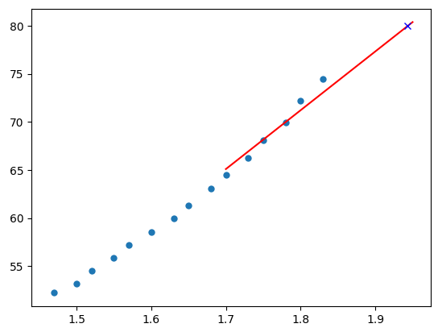
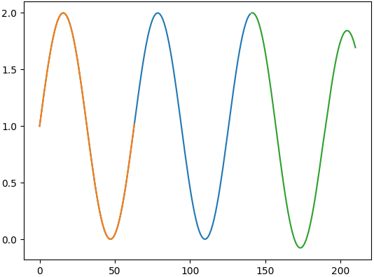
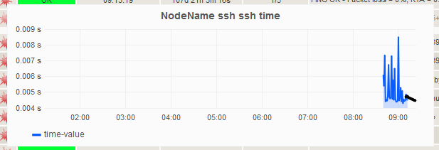
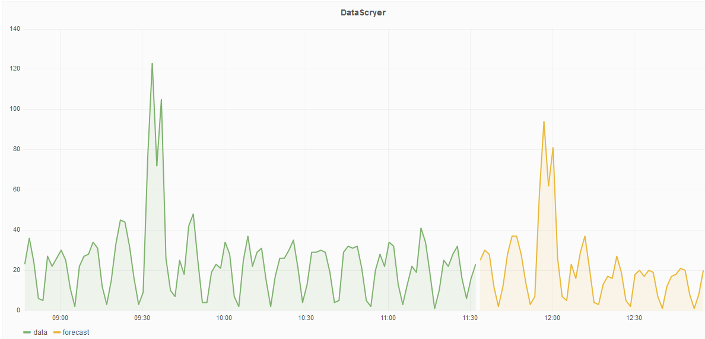

Oft kommt die Frage auf ob man mit den Performancedaten, die von Nagios und ähnlichen System erhoben werden, nicht auch Vorhersagen treffen kann, etwa wie sich die Systeme in den nächsten Tagen und Wochen entwickeln. Aus diesem Grund wird im Folgenden vorgestellt, wie man dies erreichen kann.

<!--more-->

„Wir wissen doch, wie sich die Festplatte die letzten Wochen gefüllt hat. Können wir nicht bestimmten wann die Festplatte voll ist?“ Aussagen wie diese kommen immer wieder auf, man kann jetzt sagen „das sieht man doch“, aber wenn man doch lieber konkrete Zahlen haben möchte, ist man hier doch sehr schnell aufgeschmissen.
Da es seit einiger Zeit die [Möglichkeit]( https://labs.consol.de/nagios/omd/2015/10/21/activate-nagflux.html) gibt, die Messdaten per Nagflux in eine InfluxDB zu schrieben, bietet sich dies perfekt an, das Problem anzugreifen, da man durch diese Technologie die Performancedaten in ihren ursprünglichen Werten abfragen kann und mit verschiedenen Verfahren dieses Problem lösen kann. Entscheidend ist jedoch, es eignet sich nicht jedes Verfahren für jede Datenreihe bzw. für jedes Vorhaben. Aus diesem Grund werden nachfolgend die bekanntesten vorgestellt.

### Theoretischer Blick auf die Verfahren
 
#### Lineare Regression – [Simple Linear Regression]( https://en.wikipedia.org/wiki/Simple_linear_regression)
Die Grundidee dieses Verfahrens ist es, eine Geradengleichung aufzustellen, die die bisherigen Daten repräsentiert und mit welcher die zukünftigen vorhergesagt werden. Das Ziel ist also eine Gleichung die wie folgt aussieht y = m * x + t. Was es nun durch die bestehenden Punkte zu ermitteln gilt, ist m (Steigung) und t (Y-Achsenabschnitt). Es gibt nun verschiedene Techniken diese beiden Faktoren zu bestimmen, eine der verbreitetsten ist die [Methode der kleinsten Quadrate](https://de.wikipedia.org/wiki/Methode_der_kleinsten_Quadrate). Dabei wird versucht, den Abstand der einzelnen Punkte zu der Gerade zu minieren, womit die Gerade die Punkte möglichst gut repräsentieren soll. Hat man nun diese Gerade, kann man diese nach x auflösen und kann somit in y den Füllstand der Festplatte einsetzten, um den Zeitpunkt, wann dieser erreicht wird zu erhalten.
An folgendem Bild lässt sich das Ergebnis sehr gut erkennen. Die blauen Punkte repräsentieren die bisherigen Messpunkte, die rote Linie ist die Vorhersage und das blaue Kreutz symbolisiert die Abfrage, „wann ist der Wert 80 erreicht?“, was zum Zeitpunkt 1,94 der Fall ist.

Durch die Auswahl der Daten wird die Art der Prognose beeinflusst. Das bedeutet, wenn man die Daten der letzten 10 Minuten verwendet bekommt man den aktuellen Trend und kann somit auf kurzfristige Schwankungen reagieren, um etwa einen Container zur Applikation hinzuzufügen. Betrachtet man jedoch das letzte halbe Jahr, erhält man einen langfristigen Trend und kann somit etwa neue Festplatten bestellen, wenn sich abzeichnet, dass diese voll sind. Der Größte Vorteil dieser Methode ist, dass sie unabhängig von den zugrundeliegenden Daten immer einsetzbar ist.

Vorteile:
* geringe Komplexität
* Daten unabhängig (siehe Holt-Winters)
* lang / kurzfristige Prognosen möglich

Nachteile:
* es entsteht lediglich eine Gerade
* eine Gerade kann keine regelmäßigen Schwankungen abbilden

#### Holt-Winters – Dreifach exponentielle Glättung – [Triple exponential smoothing]( https://en.wikipedia.org/wiki/Exponential_smoothing#Triple_exponential_smoothing)
Diese Technik hat den großen Vorteil gegenüber der Linearen Regression, dass sie auf saisonale Schwankungen reagieren kann und diese sich in der Vorhersage wiederfinden. Wenn etwa die Zugriffszeiten auf einen Server überwacht werden, der nur zu Werktagen genutzt wird, sind die Zugriffszahlen unter der Woche hoch und am Wochenende niedrig. Würde man in diesem Fall eine Vorhersage mit Linearer Regression anstellen, würde die Gerade das Tief nicht mit einbeziehen, da es nur eine Gerade als Grundlage hat. Bei Holt-Winters wird keine Funktionsgleichung aufgestellt, sondern die neuen Werte werden auf Grundlage der letzten Werte berechnet. Dabei wird spielen vier Größen, die vom Anwender gesteuert werden, entscheidende Rollen. Die ersten drei sind Koeffizienten, die angeben wie stark die einzelnen Komponenten des Verfahrens gewichtet werden. Dazu zählen: Wie verhält sich der Wert über die Zeit, wie verändert sich der Trend (als Trend wird die Tendenz nach „oben oder unten“ bezeichnet) und die Saisonkomponente. Die vierte benötigte Komponente ist die Saisonlänge, dies würde etwa bei den Jahreszeiten drei Monaten entsprechen. Die ersten drei Komponenten können mithilfe von Verfahren zur [nichtlinearen Optimierung]( https://de.wikipedia.org/wiki/Optimierungsverfahren#Methoden_der_globalen_nichtlinearen_Optimierung) bestimmt werden, jedoch die Saisonlänge hängt immer von den konkreten Daten ab und kann nicht ohne weiteres automatisiert bestimmt werden. Das ist der Punkt an dem sich dieses Verfahren stark von dem vorherigen unterscheidet: es muss Wissen des Benutzers einfließen, er muss sagen, wann sich das Schema der Daten wiederholt. An dem Beispiel würde dies eine Woche sein.
Abstrakt wird dies im folgendem Bild dargestellt. Orange und blau sind die bekannten Daten, wobei orange die erkannte Saison ist. Grün sind die vorhergesagten Werte.

Die Saisonlänge muss normalerweise manuell angegeben werden, da dies aber auch an diesem Beispiel nicht sehr leicht zu bestimmt ist, wird dies durch Brute-force ermittelt. Dabei muss die blaue Linie ca. zweimal so lang wie eine Saison sein. Durch diese Technik ist es möglich, dass der Benutzer die Saisonlänge nur grob angeben muss, indem er die verwendeten Daten festlegt.

Vorteile:
* Vorhersage ist nicht linear
* saisonale Schwankungen werden berücksichtigt

Nachteile:
* durch Brute-fore nicht sehr effizient
* bei falscher Saisonlänge ist die Vorhersage unbrauchbar
* die Vorhersageschrittweite ist dieselbe wie bei den gemessenen Daten

### Praktische Implementierung
Um beide oben vorgestellten Verfahren in das Monitoringumfeld zu bringen, wurde das Projekt „[DataScryer]( https://github.com/Griesbacher/dataScryer)“ ins Leben gerufen. Damit ist es möglich, mittels [Histou]( https://github.com/Griesbacher/histou)-Konfigurationen festzulegen, welche Datenreihen analysiert werden sollen und mit welchem Verfahren. Zum aktuellen Zeitpunkt sind nur die oben aufgezählten implementiert, da hier der Aspekt der Alltagstauglichkeit sehr entscheidend ist. Da das Programm „frameworkartig“ aufgebaut ist, kann es ohne weiteres um neue Methoden ergänzt werden.
Die Daten werden je nach Konfiguration aus der InfluxDB gelesen, basierend darauf eine Vorhersage getroffen, welche anschließend wieder in die InfluxDB geschrieben wird. In den Grafana-Dashboards die durch Histou erstellt werden, wird der Anzeigezeitraum so angepasst, dass der angezeigte Zeitraum um die Vorhersage erweitert wird. Diese Lösung ist so in OMD-Labs implementiert. Somit werden die Graphen, die in Thruk angezeigt werden, um eben diese Komponente erweitert, wie im folgenden Bild zu sehen.

Des Weiteren können diese Daten natürlich auch für eigene Grafana-Dashboards verwendet werden:

### Fazit
Es ist möglich die Zukunft vorherzusagen, jedoch ist dies sehr mit Vorsicht zu betrachten. Sobald man Verfahren verwendet, die nicht für die zur Verfügung stehenden Daten geeignet sind, wird auch das Ergebnis nicht passen. Auch darf man sich von seinen Vorhersagen nicht erwarten, dass es Unregelmäßigkeiten vorhersagt, die zuvor noch nicht so aufgetreten sind. Ob nun solche Verfahren das richtige Mittel zur Hardwarebestellung oder nur zur automatischen Skalierung seiner Anwendung sind muss jedoch jeder selbst entscheiden. Es bleibt ein Blick in die Kristallkugel.