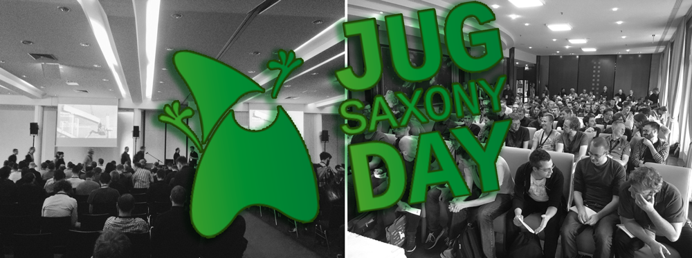

Der **[JUG Saxony Day](http://www.jug-saxony-day.org/)** fand am 30.09.2016 im Konferenzzentrum Radisson Blu Park Hotel in Dresden statt. Die von Anfang an gute und entspannte Atmosphäre beeindruckte ebenso wie die Auswahl der Vorträge. Insgesamt waren es über 30 Vorträge in 5 parallelen Tracks, die sowohl die aktuellen Trends in der Container-Technologie behandelten, Überblick über die neuesten Testing-Konzepte zeigten als auch einen Ausblick auf das zukünftige JDK 9 in petto hatten.
 
 <!--more-->
 
In dem Talk **[Containerized End-2-End Testing](http://de.slideshare.net/TobiasSchneck/containerized-end2end-testing-jug-saxony-day)** wurde über die Konzeption von End-2-End-Tests gesprochen. Die Frage, wie die Testausführung robust, reproduzierbar und skalierbar gestaltet werden kann, ist beim Aufbau einer automatisierten Testumgebung immer noch eines der größten Probleme. Einen eleganten Ausweg bieten in Container verpackte Testumgebungen. Dadurch wird es möglich, einen definierten Systemstand reproduzierbar und performant zu testen. Anhand der Open-Source­Tools **[Sakuli](https://github.com/ConSol/sakuli)** und **[Docker](https://www.docker.com/)** wurde gezeigt, wie parallele GUI-­Tests in nativen Umgebungen Web- und Rich-Client-Anwendungen performant testen und skalieren. Die Folien zum Vortrag stehen auf **[Slideshare](http://de.slideshare.net/TobiasSchneck/containerized-end2end-testing-jug-saxony-day)** zum Download bereit. 

Code-Beispiel: **[toschneck/sakuli-example-bakery-testing](https://github.com/toschneck/sakuli-example-bakery-testing)**
 
 <iframe type="opt-in" data-name="youtube" data-src="//www.slideshare.net/slideshow/embed_code/key/atxpaF7iJdylr6" width="595" height="485" frameborder="0" marginwidth="0" marginheight="0" scrolling="no" style="border:1px solid #CCC; border-width:1px; margin-bottom:5px; max-width: 100%;" allowfullscreen> </iframe> 
 <strong> <a href="//www.slideshare.net/TobiasSchneck/containerized-end2end-testing-jug-saxony-day" title="Containerized End-2-End Testing - JUG Saxony Day" target="_blank">Containerized End-2-End Testing - JUG Saxony Day</a> </strong> von <strong><a href="//www.slideshare.net/TobiasSchneck" target="_blank">Tobias Schneck</a></strong> 

 ---

For more posts about Sakuli, view [https://labs.consol.de/tags/sakuli]()