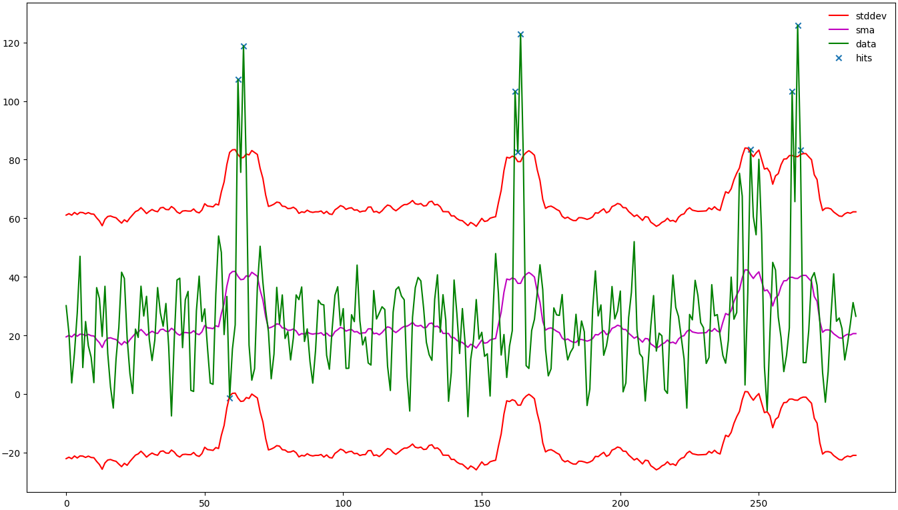
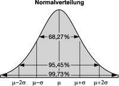
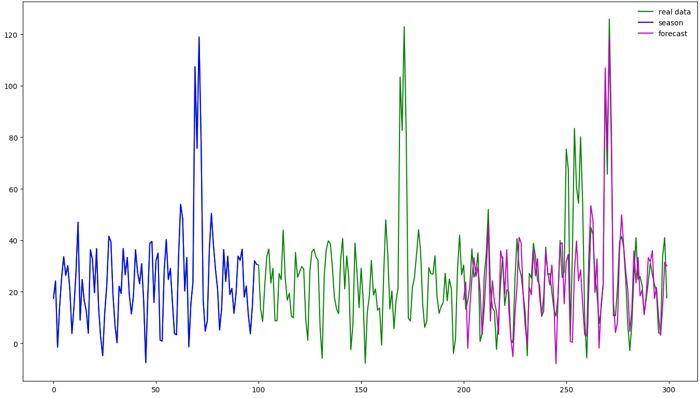
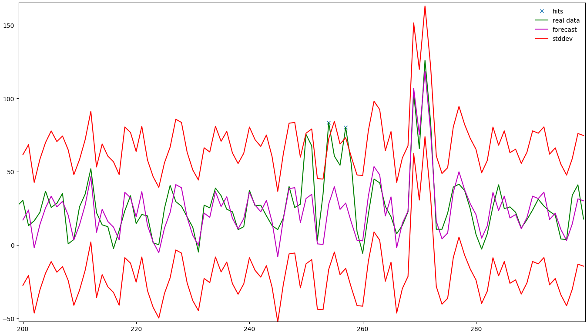

Wenn man einen Dienst überwachen möchte und man diesen nicht selbst betreut, fehlt meist die Erfahrung, wie sich dieser verhalten sollte und was als „normal" gilt. Im Folgenden wird beschrieben, wie man (Un)Regelmäßigkeiten automatisch erkennen lassen kann.

<!--more-->

Dieser Eintrag basiert auf dem Post [Vorhersage von Performancedaten]( https://labs.consol.de/monitoring/omd/nagios/2016/09/19/Vorhersage-von-Performancedaten.html), in welchem Grundlagen erklärt werden, die auch zum Verständnis dieses Artikels beitragen.

### Unbekannte Systeme analysieren
Wenn eine Anwendung oder ein Gerät in die Überwachung aufgenommen werden soll, kennt sich meist der Verantwortliche für das Gerät sehr gut damit aus. In diesem Fall weiß der Zuständige meist schon, wann ein Messwert aus der Reihe tanzt und somit alarmiert werden soll. Ist dies aber eine komplett neue Anwendung müssen diese Erfahrungen erst einmal gesammelt werden. Oft wird so vorgegangen, dass ein Check eingerichtet wird, welcher keine Alarmierung umfasst, um ein Gefühl dafür zu entwickeln, wie sich eine Anwendung verhält. Nach einer gewissen Zeit wird ein Blick auf die Performancedaten geworfen, um Schwellwerte aus diesen abzuleiten.
Bei diesen Untersuchungen kann man sich aber auch die Statistik zu Nutze machen, um Anomalien in den Daten zu finden, über die man alarmiert werden möchte. Im nachfolgendem Bild soll dies nun demonstriert werden: Die grünen Daten stellen die Messdaten dar, die das Monitoringsystem über den Dienst erhoben hat. Es ist zu sehen, dass sich diese meist zwischen 0 und 50 bewegen. Somit kann man annehmen, dass dies der Normalbereich ist. Jedoch gibt es auch Ausreißer nach oben, bis zu ca. 120. Diese können als Ungewöhnlich erkannt werden und somit als Richtschnur für Schwellwerte genutzt werden. In diesem Beispiel ist das mit bloßen Auge zu sehen, aber wie kann man das automatisiert erkennen lassen?
Dazu wurden im Bild einige Hilfslinien eingezeichnet um das Verfahren anschaulicher zu machen. Als erstes wird der [SMA](https://en.wikipedia.org/wiki/Moving_average#Simple_moving_average) der Daten berechnet, dabei wird ein Fenster der Größe x über die Daten geschoben und aus den Werten in dem Fenster der Durchschnitt berechnet, der als Wert für diesen Zeitpunkt verwendet wird. Durch die Fenstergröße lässt sich bestimmen wie stark die Daten gemittelt werden. Dieser SMA wird als Grundlinie verwendet und in der Grafik in Magenta dargestellt. In diesem Fall wurde eine Fenstergröße von 15 Messpunkten verwendet.

Es wird angenommen, dass die Daten [normal verteilt] (https://de.wikipedia.org/wiki/Normalverteilung#Definition) sind, was bedeutet, dass sich alle Werte der Messpunkte durch eine Gaußsche-Glockenkurve mit dem Flächeninhalt der Größe eins abbilden lassen. Diese Kurve wird verwendet um darzustellen wie viele Punkte wie weit vom Mittel abweichen. Im folgendem Bild wird dies dargestellt: wenn man einen Abstand von 2o verwendet, befinden sich nur noch 4,55 % der Punkte außerhalb dieses Bereiches.

[Bild Quelle + weitere Informationen](http://wirtschaftslexikon.gabler.de/Archiv/2071/normalverteilung-v11.html)

Genau dies wurde in der der Grafik der Messwerte mit den beiden roten Linien dargestellt. Dabei wurde die magentafarbene Line als „Normalline" verwendet. Diese beiden roten Linien werden nun gegen die Daten verglichen und wenn Messpunkte außerhalb des roten Bereichs auftreten, werden diese als Anomalie erkannt und mit einem blauen Kreuz dargestellt.

### Bekannte Systeme überwachen
Jedoch kann dieses Verfahren auch für andere Einsatzzwecke verwendet werden. Die erhobenen Daten könnte etwa Zugriffe auf eine Webseite für Freizeitangebote sein, die immer am Wochenende sehr hoch sind und unter der Woche relativ gering. Angenommen man hat seine Schwellwerte wie im vorigen Abschnitt beschrieben bestimmt und ist etwa zu dem Schluss gekommen, dass alle Werte über 100 alarmierungswürdig sind. Jetzt gibt es zwei Möglichkeiten mit diesem System umzugehen: entweder man wird jedes Wochenende benachrichtigt, dass das System unter Last steht - was dazu führt, dass diese Meldungen nach ein paar Wochenenden ignoriert werden. Auf der anderen Seite kann man den Schwellwert der zu einer Benachrichtigung führt, auf etwa 130 erhöhen, womit die Wochenenden abgedeckt sind, aber dadurch auch sonst kaum ein Ergebnis diesen Schwellwert reißt. Dies ist ein klassisches Problem, mit dem viele Monitoringsysteme zu kämpfen haben. Lösen kann man dieses Problem mit einer Kombination aus Vorhersage der Daten und einer Anomalieerkennung zur Alarmierung. Dazu wird zuerst eine Vorhersage basierend auf den bisher gemessenen Daten erstellt. Dabei wird hier exemplarisch Holt-Winters verwendet. Zu sehen in folgendem Bild sind dabei die bekannten Realdaten - die blauen und grünen Linien (von 0 bis 200), wobei die Blaue die Saisonlänge (100) des Holt-Winters Verfahren anzeigt. Basierend auf diesen Werten wird die magentafarbene Linie berechnet, welche die Vorhersage der Daten für den Zeitraum 200 bis 300 darstellt. Dabei deutet sich in der Grafik schon ab, dass ab dem Zeitpunkt 250 eine Spitze entsteht, die bisher so nicht aufgetreten ist. Zu erkennen ist dies daran, dass sich im übrigen Bereich die Vorhersage mit den realen Daten weitestgehend deckt. Diese Spitze würde selbst bei einem Schwellwert von 100 nicht erkannt werden, da sie nur bis ca. 80 reicht. Somit würde sie bei einer starren Schwellwertkonfiguration immer verborgen bleiben.

Nun wird selbiges Verfahren zur Bestimmung von Ausreißern verwendet - nur dient diesmal nicht der SMA als Grundlage, sondern die Vorhersage. Im folgendem Bild (eine Vergrößerung von 200 bis 300, zusätzlich zur Anomalieanalyse) ist zu sehen, wie sich dies grafisch auswirkt. Es ist nun schön zu sehen, dass die Wochenendspitzen die durch die Vorhersage sehr gut prognostiziert wurden, sich auch in den Schwellwerten wiederspiegeln. So wird in diesem Fall das Wochenende nicht mehr als Anomalie erkannt, da es ein regelmäßiges Ereignis ist. Jedoch wir das Ereignis um 250, das bisher immer unbeachtet blieb, nun erkannt.

### Implementierung
Wie auch die Vorhersage ist diese Anomalieerkennung in dem Projekt „[DataScryer]( https://github.com/Griesbacher/dataScryer)" implementiert und kann dort ausprobiert werden. Die Funktionsweise ist analog zu den Vorhersagen.

### Fazit
Mit den soeben vorgestellten Methoden lassen sich die Messdaten eines Überwachungssystems besser verstehen, (Fehl)Alarme können analysiert und Anomalien dort erkannt werden, wo die Überwachung mit festen Schwellwerten an ihre Grenzen stößt.
Jedoch sollte auch hier auf die Vor- und Nachteile, die eine Vorhersage mit sich bringt, hingewiesen werden: dies ist nicht immer ohne weiteres möglich und nicht immer sinnvoll, diese anzuwenden.
Vorstellbar ist auch mit dieser Datengrundlage Plugins zu erweitern, um somit agiler auf Probleme einzugehen und ihnen etwas mehr Intelligenz zu verleihen, etwa um Fehlalarme zu vermeiden.
