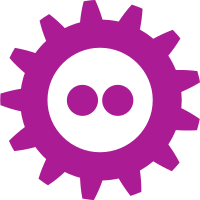


Auf der [FOSDEM 2017] gibt es zwei DevRooms, bei denen ConSol-Mitarbeiter an der Organisatoren beteiligt sind.

 * [Monitoring und Cloud Devroom]
 * [Containers und Microservices Devroom]

Für beide DevRooms gibt es einen gemeinsamen CfP, so daß die Vorschläge an einer Stelle eingereicht werden können. Erwünscht sind Vorträge zu den Themen:

 * Monitoring von containerisierten Services
 * Automatisierung von Cloud-Deployments
 * Entwicklung und Administration von Microservices
 * Container-Orchestrierung
 * Continuous Integration & Deployment
 * Prometheus, Kubernetes, Docker, CRIO, etc.
 * Neue Projekte und Technologien
 * Andere Container- und Cloud-Native-Vorträge

Bitte reicht eure Vorträge bis zum 26. November hier ein:

For [FOSDEM 2017], there are two DevRooms where ConSol employees are among the organizers.

 * [Monitoring and Cloud Devroom]
 * [Containers and Microservices Devroom]

Accordingly, the two devrooms have combined CfPs, so that you can submit your container cloud talk in just one place.  These devrooms are interested in talks about:

 * Monitoring containerized services
 * Automating cloud deployments
 * Developing and administering microservices
 * Container orchestration
 * Continuous Integration & Deployment
 * Prometheus, Kubernetes, Docker, CRIO, etc.
 * New projects and technology
 * Other container and cloud native talks

Submit Talk Proposals by November 26th on our CfP Page: 

[https://goo.gl/forms/bbfCH14ido5kMD4H3]

[FOSDEM 2017]: http://fosdem.org
[Monitoring and Cloud Devroom]: https://fosdem.org/2017/schedule/track/monitoring_and_cloud/
[Containers and Microservices Devroom]: https://fosdem.org/2017/schedule/track/linux_containers_and_microservices/
[Monitoring und Cloud Devroom]: https://fosdem.org/2017/schedule/track/monitoring_and_cloud/
[Containers und Microservices Devroom]: https://fosdem.org/2017/schedule/track/linux_containers_and_microservices/
[https://goo.gl/forms/bbfCH14ido5kMD4H3]: https://goo.gl/forms/bbfCH14ido5kMD4H3