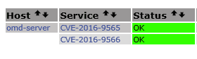

Kürzlich wurden zwei Schwachstellen von Nagios veröffentlicht, u.a. bei [heise.de]. Wir verwenden Nagios als einen von mehreren möglichen Cores innerhalb des Monitoring-Frameworks [OMD]. Eine Gefährdung liegt nicht vor. Bei besagten Schwachstellen handelt es sich um:

* *CVE-2016-9565* - Betroffen ist das Web-Frontend von Nagios. Dieses zeigt nach dem Login einen RSS-Feed des Herstellers Nagios Enterprises an, dessen Inhalt so manipuliert werden kann, daß eingeschleuste Befehle im Kontext des www-data/nagios-Benutzers ausgeführt werden können. De Angreifer muss sich dazu jedoch als www.nagios.org ausgeben (durch einen DNS-Angriff) oder den Datenstrom als Man-in-the-Middle manipulieren. Abgesehen davon, daß die original Web-Gui von Nagios seit Erscheinen weitaus modernerer Oberflächen wie [Thruk] sowieso niemand mehr ernsthaft benutzt - die RSS-Funktionalität wurde bei OMD von Anfang an abgeschaltet bzw. rausgepatcht. Sie existiert schlichtweg nicht mehr und somit auch nicht die Schwachstelle.

* *CVE-2016-9566* - Bei diesem Exploit wird ausgenutzt, daß Nagios, so denn der Prozeß unter dem root-Account gestartet wird, das Logfile */usr/local/nagios/var/nagios.log* o.ä. zunächst mit den entsprechenden root-Privilegien öffnet, bevor diese mittels des Systemcalls setgid(pid des nagios-Benutzers) aufgegeben werden. Ein Angreifer mit Zugang zum Monitoring-Server, welcher die Möglichkeit hat, das Logfile durch einen Symlink zu systemkritischen Dateien wie z.b. */etc/ld.so.preload* zu ersetzen, kann die Voraussetzungen zur deren Manipulation schaffen. Dazu muss er noch dafür sorgen, daß Nagios schadhaften Inhalt in die Datei schreibt. Eine Möglichkeit wäre, ein externes Kommando (entsprechend präpariert) in die Command-Pipe zu schicken, was einen Eintrag im Logfile (und somit in */etc/ls.so.preload*) zur Folge hat. Auch diese Form des Angriffs ist unter OMD ausgeschlossen, da ein Nagios-Prozess zu keinem Zeitpunkt mit root-Privilegien läuft. Monitoring mit OMD spielt sich ausschließlich im Kontext stinknormaler Benutzer ab.

Ergo: alles OK und grün.

[heise.de]: https://www.heise.de/newsticker/meldung/Nagios-Core-ist-angreifbar-Sicherheitsluecken-in-Server-Ueberwachungssoftware-3576359.html
[OMD]: https://labs.consol.de/omd/index.html
[Thruk]: http://www.thruk.org