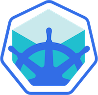

<div style="float: right; margin-left: 1em; margin-bottom: 1em;"></div>

Getting started with [Kubernetes](https://kubernetes.io) can be intimidating at first. Installing Kubernetes is not the easiest of tasks and can get quite frustrating.[^1] Luckily, there is an out-of-the box distribution called [Minikube](https://github.com/kubernetes/minikube) which makes toying around with Kubernetes a bliss.

<!--more-->

## Background

I am going to describe the setup for my local development, i.e. I focus on **MacOS** and **bash**. I try to be as brief as possible to get you started developing with Kubernetes.

For a more general and in detail documentation see the section _Official Documentation_ at the bottom.

## Basic Setup

What we need

1. The kubernetes command line tool **`kubectl`**
2. The `minikube` binary
3. A virtualization provider depending on your Host OS, e.g. VirtualBox, xhyve, KVM
4. Configure `docker` to use Minikube's Docker daemon

### Kubectl

The `kubectl` command line tool can be found [here](https://kubernetes.io/docs/user-guide/prereqs/).

If you use `homebrew` on MacOS:

```bash
$ brew install kubernetes-cli
```

### Minikube

Minikube is written in [Go](https://golang.org). So it can be run directly on any supported platform (currently MacOS and Linux). You can download the latest binary from the [Minikube release page](https://github.com/kubernetes/minikube/releases).

Alternatively, you can use [Homebrew Cask](https://caskroom.github.io):

```bash
$ brew cask install minikube
```

### Autocompletion

It's always nice to have shell autocompletion. Minikube has bash autocompletion built-in, all you need to do is to save it to the appropriate location. For me this works as follows:

```bash
$ minikube completion bash > /usr/local/etc/bash_completion.d/minikube-completion
```

### Virtualization provider

Depending on your host OS you can choose between several virtualization drivers (currently `virtualbox`, `vmwarefusion`, `xhyve`, `hyperv`, `kvm`). Since I use MacOS and have Docker for Mac installed which uses `xhyve`, I start Minikube with `xhyve`:

```bash
$ minikube start --vm-driver=xhyve
Starting local Kubernetes cluster...
Kubectl is now configured to use the cluster.
```

As you can see from the output, Minikube configures the `kubectl` CLI to use Minikube. By the way, if you look into `~/.minikube` you'll find some certificates and private keys. If you want to use any kubernetes client other than `kubectl` you need to use these to authenticate against Minikube.

### Configure Docker

In order for Minikube to find any custom built docker images we need to store those within Minikube's virtual environment. To configure your current shell to use Minikube's docker daemon ([see documentation](https://github.com/kubernetes/minikube/blob/master/docs/minikube_docker-env.md)):

```bash
$ eval $(minikube docker-env)
```

Thereafter, every docker image you build in this shell will be available inside Minikube.

**NOTE** You need to add `imagePullPolicy: IfNotPresent` to your container spec, see the [minikube documentation](https://kubernetes.io/docs/getting-started-guides/minikube/#reusing-the-docker-daemon). Otherwise, Minikube will try to download the image before looking locally.

**Example**

```yaml
spec:  # specification of the pod's contents
  containers:
  - name: some-container
    image: "some-image:latest"
    imagePullPolicy: IfNotPresent
```


### Running Minikube

Now that we have all set we try out our Minikube and open the Kubernetes Dashboard:

```bash
$ minikube start --vm-driver=xhyve
Starting local Kubernetes cluster...
Kubectl is now configured to use the cluster.
$ minikube dashboard
Opening kubernetes dashboard in default browser...
```

The dashboard looks similar to this (the screenshot already contains deployments from my installation):


## First Deployment

An empty Kubernetes cluster is better than no cluster at all but it is quite boring. Let's go ahead and deploy the _Hello World_ deployment like described on the Kubernetes [Getting Started](https://kubernetes.io/docs/tutorials/stateless-application/expose-external-ip-address-service/) page:

Create a _Hello World_ deployment:

```bash
$ kubectl run hello-world --replicas=2 --labels="run=load-balancer-example" --image=gcr.io/google-samples/node-hello:1.0  --port=8080
deployment "hello-world" created
```

Expose it as a service, so we can access it externally:

```bash
$ kubectl expose deployment hello-world --type=NodePort --name=example-service
service "example-service" exposed
```

Check the ports of our newly created service:

```bash
$ kubectl describe services example-service
Name:           example-service
Namespace:      default
Labels:         run=load-balancer-example
Selector:       run=load-balancer-example
Type:           NodePort
IP:             10.0.0.40
Port:           <unset> 8080/TCP
NodePort:       <unset> 31506/TCP
Endpoints:      172.17.0.10:8080,172.17.0.11:8080
Session Affinity:   None
No events.
```

_Within_ the Kubernetes cluster the service can be accessed via port `8080` and DNS `example-service`, so this would be `http://example-service:8080`. But since our shell runs outside of the Kubernetes cluster we need to use the `NodePort` which is `31506`.

Note that `http://localhost:31506` will **not work** as our Kubernetes lives in a virtual machine.

We have to ask Minikube for the current IP address of our Minikube VM:

```bash
$ minikube ip
192.168.99.100
```

So we can now curl the hello world example:

```
$ curl http://192.168.99.100:31506
Hello Kubernetes!
```

or even simpler (the IP is not guaranteed to be static):

```bash
$ curl http://$(minikube ip):31506
Hello Kubernetes!
```

That's it! We are now running a local Kubernetes cluster. Go an and try to run your own Docker images!

## Conclusion

As we have seen, Minikube is an easy way to try out Kubernetes and use it for local development. It is under constant development and is a great[^2] match for local Kubernetes testing. Together with the [fabric8 maven plugin] this even allows you to deploy directly from your maven build and hence simplifies development even more.

## Official Documentation

- [Getting Started with Minikube]
- [kubectl Overview](https://kubernetes.io/docs/user-guide/kubectl-overview/)
- [Kubernetes Hello World Service](https://kubernetes.io/docs/tutorials/stateless-application/expose-external-ip-address-service/)
- [How to deploy a simple NodeJS application](https://kubernetes.io/docs/tutorials/stateless-application/hello-minikube/)
- [Kubernetes Tutorials](https://kubernetes.io/docs/tutorials/)
- [fabric8 maven plugin]

## Footnotes

[^1]: As [mentioned on Twitter](https://twitter.com/toschneck/status/830073483858149377) by Roland Huß (Red Hat developer and former ConSol employee), if you are on Linux you can try [kubeadm](https://kubernetes.io/docs/getting-started-guides/kubeadm/) for a light-weight installation.
[^2]: Make Kubernetes great again!

[Getting Started with Minikube]: https://kubernetes.io/docs/getting-started-guides/minikube/
[fabric8 maven plugin]: https://github.com/fabric8io/fabric8-maven-plugin