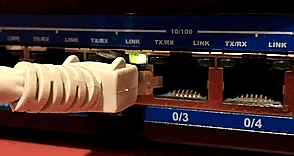

<span style="float: right"></span>SNMP-Traps und Nagios ist eins der Themen, um das man bislang gerne einen großen Bogen gemacht hat. Grundsätzlich gibt es seit etlichen Jahren die AddOns SNMPTT und Nagtrap, deren Konfiguration aber ein wenig mühsam ist. In einem Projekt, bei dem es um die Überwachung von mehreren Tausend Storage-Systemen ging, entstand eine Methode, welche ressourcenschonend und einfach automatisierbar ist.
Im ersten Teil dieses Artikels geht es um die entsprechende Vorbereitung eines OMD-Servers. Genauer gesagt darum, wie man dafür sorgt, daß ein eingehender Trap gleichzeitig an mehrere OMD-Sites (Test, Produktion, ...) zugestellt wird.
<!--more-->

Zunächst muss ein eventuell vorhandener snmptrapd-Prozeß gestoppt werden und das zugehörige Init-Script bzw. der Systemd-Service entfernt werden.
Das Lauschen auf udp/162 wird künftig ein [samplicate]-Daemon übernehmen. Das Samplicator-Projekt dient dem Duplizieren von UDP-Paketen. Trifft ein Trap ein, so wird dieser an lokale snmptrapd-Prozesse weitergeschickt, welche innerhalb von OMD-Sites laufen und auf jeweils eigenen, hohen Ports lauschen.

Eine Site wird mit folgendem Kommando für den Empfang von Traps vorbereitet:
```bash
OMD[test]:~$ omd config set SNMPTRAPD on
```
Dabei legt OMD automatisch einen Port fest. 
```bash
OMD[test]:~$ omd config show SNMPTRAPD_UDP_PORT

9162
```
Die erste Site bekommt 9162, alle weiteren werden ab hier hochgezählt. Tatsächlich braucht man sich um diese Numerierung nicht zu kümmern, OMD regelt alles automatisch im Hintergrund. Nach einem Neustart der Site oder nach dem Befehl
```bash
OMD[test]:~$ omd start snmptrapd
```
ist man hier erstmal fertig.

Jetzt muß dafür gesorgt werden, daß der samplicate-Daemon gestartet wird. Dazu ist ein manueller Schritt nötig, denn bei der Installation von OMD wird als Abhängigkeit auch ein snmptrapd-Paket installiert. Manche Distributionen starten dabei den snmptrap-Daemon. Da dies unerwünscht ist, muß wie eingangs erwähnt der Autostart-Mechanismus abgeschaltet werden.
Damit stattdessen der samplicate-Daemon läuft, führt man folgendes aus:
```bash
# /bin/cp /opt/omd/versions/default/share/samplicate/*.service \
    /etc/systemd/system
# systemctl enable samplicate_watch
# systemctl enable samplicate
# systemctl start samplicate_watch
```
Dadurch wurden zwei Dienste installiert:
* samplicate_watch - dieser schaut alle 60 Sekunden in den OMD-Sites nach, welche von ihnen unter Verwendung welcher Ports einen lokalen snmptrapd laufen haben. Bei einer Änderung sorgt der Watch-Service für einen Neustart des samplicate-Service mit einer aktualisierten Liste von Target-Ports.
* samplicate - das ist der Dienst, welcher Kopien eintreffender UDP-Pakete an die lokalen Empfänger weiterschickt.

Was passiert nun, wenn auf dem OMD-Server ein SNMP-Trap eintrifft, der z.b. folgendermaßen erzeugt wurde?
```bash
$ snmptrap -v 2c -c public 10.12.38.11 '' 1.3.6.1.4.1.8072.2.3.0.1 1.3.6.1.4.1.8072.2.3.2.1 i 12341234
```

Die lokalen snmptrapd sind so konfiguriert, daß sie den Trap in eine Logdatei $OMD_ROOT/var/log/snmp/traps.log schreiben. Dabei landet jedes Feld in einer eigenen Zeile. Abschließend folgt noch eine summary-Zeile, in der der Trap flachgeklopft wurde und die einzelnen Felder mit jeweils 4 Underscores voneinander getrennt sind.
```text
[Sun Feb 26 00:13:08 CET 2017] omd-01
[Sun Feb 26 00:13:08 CET 2017] UDP: [160.1.14.200]:44231->[127.0.0.1]:9162
[Sun Feb 26 00:13:08 CET 2017] .1.3.6.1.2.1.1.3.0 1047326123
[Sun Feb 26 00:13:08 CET 2017] .1.3.6.1.6.3.1.1.4.1.0 .1.3.6.1.4.1.8072.2.3.0.1
[Sun Feb 26 00:13:08 CET 2017] .1.3.6.1.4.1.8072.2.3.2.1 1234
[Sun Feb 26 00:13:08 CET 2017] summary: ____omd-01____UDP: [160.1.14.200]:44231->[127.0.0.1]:9162____.1.3.6.1.2.1.1.3.0 1047326123____.1.3.6.1.6.3.1.1.4.1.0 .1.3.6.1.4.1.8072.2.3.0.1____.1.3.6.1.4.1.8072.2.3.2.1 12341234
```

Im nächsten Teil wird gezeigt, wie aus einer MIB mit Hilfe von [coshsh] automatisch Trap-Services generiert werden und diese von [check_logfiles] mit Events versorgt werden, indem die Datei traps.log gescannt wird.


[samplicate]: https://github.com/sleinen/samplicator
[coshsh]: https://github.com/lausser/coshsh
[check_logfiles]: https://github.com/lausser/check_logfiles