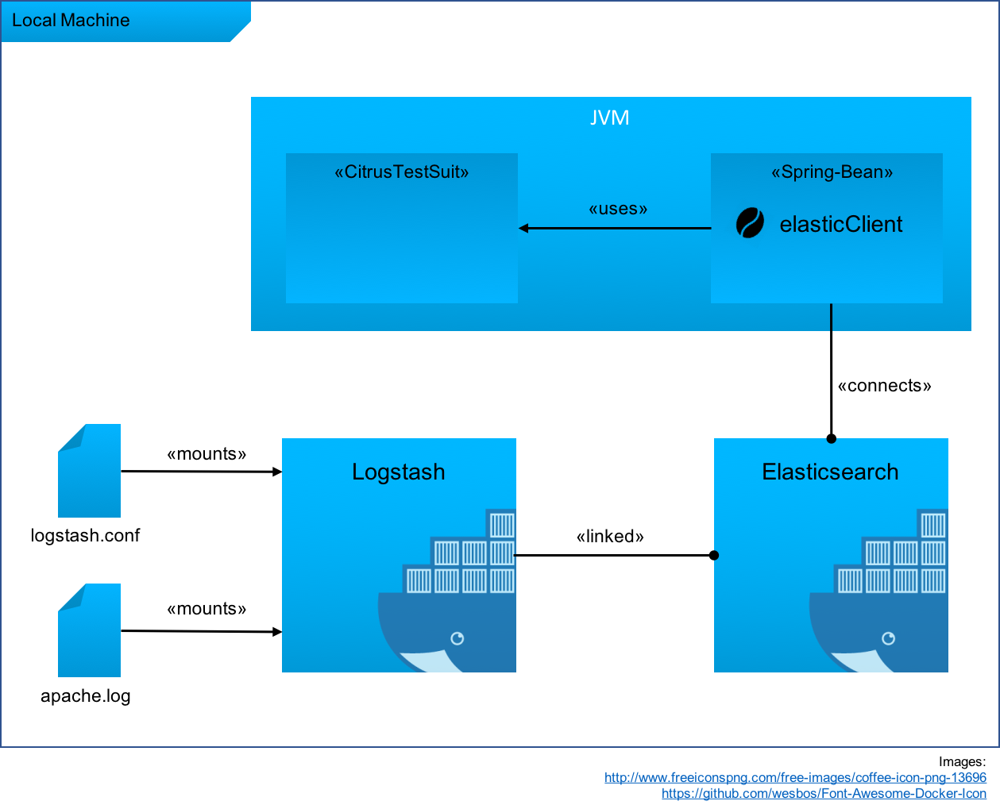

The ELK-Stack is a good option to aggregate and visualize distributed logging-data. It basically based on 

- [**L**ogstash](https://www.elastic.co/products/logstash) for extracting and distributing the data  
- [**K**ibana](https://www.elastic.co/products/kibana) as visualization frontend.

The core of the most ELK applications is the Logstash configuration. A user defines here which data ([inputs](https://www.elastic.co/guide/en/logstash/current/input-plugins.html)) is processed, how ([filter](https://www.elastic.co/guide/en/logstash/current/filter-plugins.html)) the data is processed and where it will go afterwards ([outputs](https://www.elastic.co/guide/en/logstash/current/output-plugins.html)). Especilly this configuration contains a lot of logic which is unfortunally not easy to test. In this article I want to show you how to setup a testing environment for your Logstash configuration.
  
<!--more-->
  
## The Scenario

To keep it simple we'll just focus on the setup. Therefore we neither create complex tests nor a too large szenario. Our szenario is basically to ship some apache log events to a Elasticsearch instance and verify it with Citrus.

We'll use sample data from [monitorwave.com](http://www.monitorware.com/en/logsamples/download/apache-samples.rar)

```ruby
# Just reading from a log files which are supposed to be generated by a apache webserver
input {
  file {
    path => ["/data/*.log"]
    start_position => ["beginning"]
  }
}

# Using the default grok to filter the pache log events
filter {
  grok {
    match => {
      "message" => '%{COMBINEDAPACHELOG}'
    }
  }
}

# push it to Elasticsearch and the stdout (this could be omitted but is helpful for debugging)
output {
  stdout { codec => rubydebug }
  elasticsearch {
    hosts => ["elasticsearch:9200"]
    index => "my-index"
  }
}
```
[Current Source](https://github.com/tnobody/citrus-elk-docker-example/blob/master/src/main/resources/logstash/logstash.conf)

## The Setup

The basic idea of the setup is outlined in the diagram below:



1. The Docker Maven Plugin will create and start our containers for Logstash and Elasticsearch in its __pre-integration-test__ phase.
    1. Our configuration and test data is mounted into the Logstash container
    2. The orchestration (linking, waiting) of the containers is also configured via Maven
2. As soon as the Logstash container is started it will process the log data and ship it to Elastissearch
3. In the actual __integration-test__ phase the Citrus tests are executed
    1. A Citrus [HttpClient](http://www.citrusframework.org/apidocs/com/consol/citrus/http/client/class-use/HttpClient.html) ist configured to communicate with Elasticsearchs [Rest-API](https://www.elastic.co/guide/en/elasticsearch/reference/current/docs.html)
    2. Tests can verify and validate existence and accurancy of data (very simple in this example)

Especially 3.2 is the step to customize regarding to your needs.

## Maven Docker Plugin

I use the [Maven-Docker-Plugin](https://github.com/fabric8io/docker-maven-plugin) from [fabric8io](https://github.com/fabric8io) because I made first experience with it. There is also an alternative from [Spotify](https://github.com/spotify/docker-maven-plugin). But these plugin focuses on building and deploying images rather than running images e.g. for tests.

[tl;dr](https://github.com/tnobody/citrus-elk-docker-example/blob/master/pom.xml#L44)

### Installation

If you are familiar with maven this shouldn't be a big suprise.

```xml
<!-- project/build/plugins -->
<plugin>
    <groupId>io.fabric8</groupId>
    <artifactId>docker-maven-plugin</artifactId>
    <version>0.20.0</version>
    <configuration>
        <!-- Image configuration goes here -->
    </configuration>
</plugin>
<!-- ... -->
```


### Elasticsearch

```xml
<!-- project/build/plugins/plugin/configuration/images -->
<image>
    <alias>elasticsearch</alias>
    <name>elasticsearch:alpine</name>
    <!-- Configure the run command, compareable to `docker run ...`-->
    <run>
        <ports>
            <!-- elk.elasticsearch.port is configured in project/properties element -->
            <!-- Equivalent to -p 1234:9200 -->
            <port>${elk.elasticsearch.port}:9200</port>
        </ports>
        <env>
            <!-- Passing the port as a ENV Variabel to the docker container -->
            <ELASTICSEARCH_PORT>${elk.elasticsearch.port}</ELASTICSEARCH_PORT>
        </env>
        <volumes>
            <!-- Mount points from our Project into the docker containers file system -->
            <!-- Equivalent to -v local_path:docker_path -->
            <!-- Mounting Elasticsearch data into mavens target folder makes it possible to control it with maven clean (or not if you like) -->
            <bind>
                <volume>${project.build.directory}/es-data:/usr/share/elasticsearch/data</volume>
            </bind>
        </volumes>
        <!--
            This configuration part is very cool 
            it defines a conditions to check if a container is succesfully started
            In this case it waits for a 200 response from Elasticsearch or a logline which contains `started` at most 30000 miliseconds (unfortunally sometimes it tooks this time)
        -->
        <wait>
            <http>
                <url>http://${docker.host.address}:${elk.elasticsearch.port}</url>
            </http>
            <log>started</log>
            <time>30000</time>
        </wait>
        <!--
            Redirects contaienr log into local file. Useful for debugging if the container fails to start
            Might be omitted for Production
        -->
        <log>
            <file>${project.build.directory}/elastic.log</file>
        </log>
    </run>
</image>
<!-- ... -->
```

This configuration is pretty much like executing:

```bash
docker run --name elasticsearch -p "$ES_PORT":9200 -v "$MVN_BUILD_DIR"/es-data:usr/share/elasticsearch/data ealsticsearch:alpine
```

### Logstash

```xml
<!-- project/build/plugins/plugin/configuration/images -->
<image>
    <alias>logstash</alias>
    <name>logstash:5</name>
    <run>
        <!-- Override the docker start cmd and pass the config file as a parameter (-f) to logstash which is started in the container as the entrypoint -->
        <cmd>-f /conf-dir/logstash.conf</cmd>
        <volumes>
            <!-- Mounting the Logstash config source and our test data to the container -->
            <bind>
                <volume>${project.basedir}/src/main/resources/logstash:/conf-dir</volume>
                <volume>${project.basedir}/src/test/resources/logstash:/data</volume>
            </bind>
        </volumes>
        <links>
            <!-- Linking the Elasticsearch container to this container and makes it available as a host -->
            <!-- Maven plugin recognize a dependency to this container automatically -->
            <link>elasticsearch</link>
        </links>
        <wait>
            <!-- Waiting at most 20 seconds on logline which contains `Successfully started Logstash API endpoint` -->
            <time>20000</time>
            <log>Successfully started Logstash API endpoint</log>
        </wait>
        <log>
            <!-- Like in the Elasticsearch configuration -->
            <file>
                /Users/timkeiner/Projects/consol/aerzte_der_welt/citrus-tests/target/logstash.log
            </file>
        </log>
    </run>
</image>
<!-- ... -->
```

This configuration is pretty much like executing:

```bash
docker run --name logstash --link=elasticsearch -v "$PROJECT_DIR"/src/main/resources/logstash:/conf-dir -v "$PORJECT_DIR"/src/test/resources/logstash:/data logstash:5 -f /conf-dir/logstash.conf
```

### Maven Lifecycle

In order to start and stop the container at the right time we need a little configuration to tell maven in which phase it should do it.

```xml
<!-- project/build/plugins/plugin/executions -->
<executions>
    <execution>
        <id>start</id>        
        <!-- Hook into the pre-integration-test phase -->
        <!-- Executes plugin goals `build` and `start` which build and start docker containers (suprise, suprise) -->
        <phase>pre-integration-test</phase>
        <goals>
            <goal>build</goal>
            <goal>start</goal>
        </goals>
    </execution>
    <execution>
        <id>stop</id>
        <!-- Hook into the prost-integration-test phase -->
        <phase>post-integration-test</phase>
        <!-- Executes plugin goal `stop` which stops the containers after the integration tests are executed -->
        <goals>
            <goal>stop</goal>
        </goals>
    </execution>
</executions>
<!-- ... -->
```

## Citrus Setup

### Maven

To getting started with Citrus (and Citrus Java-DSL) just add these dependencies:

```xml
<!-- project -->
<dependencies>
    <dependency>
        <groupId>com.consol.citrus</groupId>
        <artifactId>citrus-core</artifactId>
        <version>2.7</version>
        <scope>test</scope>
    </dependency>
    <dependency>
        <groupId>com.consol.citrus</groupId>
        <artifactId>citrus-java-dsl</artifactId>
        <version>2.7</version>
        <scope>test</scope>
    </dependency>
    <dependency>
        <groupId>com.consol.citrus</groupId>
        <artifactId>citrus-http</artifactId>
        <version>2.7</version>
        <scope>test</scope>
    </dependency>
    <dependency>
        <groupId>org.testng</groupId>
        <artifactId>testng</artifactId>
        <version>6.5.2</version>
    </dependency>
</dependencies>
<!-- ... -->
```

Additionally you would like to add some useful testing plugins:

```xml
<!-- project/build/plugins -->
<plugin>
    <groupId>com.consol.citrus.mvn</groupId>
    <artifactId>citrus-maven-plugin</artifactId>
    <version>2.7</version>
    <configuration>
        <author>Tim Keiner</author>
        <targetPackage>org.tnobody.citruselk</targetPackage>
    </configuration>
</plugin>
<plugin>
    <artifactId>maven-surefire-plugin</artifactId>
    <version>2.19.1</version>
    <configuration>
        <forkMode>once</forkMode>
        <failIfNoTests>false</failIfNoTests>
        <excludes>
            <exclude>**/IT*.java</exclude>
            <exclude>**/*IT.java</exclude>
        </excludes>
    </configuration>
</plugin>
<plugin>
    <groupId>org.apache.maven.plugins</groupId>
    <artifactId>maven-failsafe-plugin</artifactId>
    <version>2.19.1</version>
    <executions>
        <execution>
            <id>integration-tests</id>
            <goals>
                <goal>integration-test</goal>
                <goal>verify</goal>
            </goals>
        </execution>
    </executions>
</plugin>
<!-- ... -->
```

This is all you need to run citrus :)

### Creating a Test

[tl:dr](https://github.com/tnobody/citrus-elk-docker-example/blob/master/src/test/java/org/tnobody/citruselk/ElkTestIT.java)

Citrus offers a [Java DSL](http://www.citrusframework.org/reference/html/test-case.html#writing-test-cases-in-java). With this it's pretty simple and intuitive to create citrus-tests. 

Just create a test class which extends the [TestNgCitrusTestDesigner](http://www.citrusframework.org/apidocs/com/consol/citrus/dsl/testng/TestNGCitrusTestDesigner.html).

```java
// src/test/java/org/tnobody/citruselk/ElkTestIT.java
public class ElkTestIT extends TestNGCitrusTestDesigner {
    // ...
}
```

To communicate with the Elasticsearch instance, we need a injectable HttpClient. It must be configured in the citrus context

```xml
<?xml version="1.0" encoding="UTF-8"?>
<beans xmlns="http://www.springframework.org/schema/beans">
    <citrus-http:client id="elasticClient"
                        request-url="http://localhost:9200"/>
</beans>
```
[Complete source](https://github.com/tnobody/citrus-elk-docker-example/blob/master/src/test/resources/citrus-context.xml)

With this configuration it is possible to autowire the configured bean into the test class.

```java
@Autowired
private HttpClient elasticClient;
```

Th first test will just verify that we have a connection to the Elasticsearch instance.
Citrus tests define a series of actions. Actions are abstract communication patterns and describes the expected communication flow between systems. So in this test we define the following actions (which remains basically the same pattern for the other tests).

- send a http request
- receive and validate the subsequent response.

```java
@Test
@CitrusTest(name = "Test Connection")
public void testConnection() {
    description("Just a setup test");

    http()
            .client(elasticClient)
            .send()
            .get("/")
            .accept("application/json")
    ;

    http()
            .client(elasticClient)
            .receive()
            .response(HttpStatus.OK)
            .messageType(MessageType.JSON)
    ;

}
```

In this test we verify that the index __my-index__ is created and can be called via rest-api.
The [__request__](https://github.com/tnobody/citrus-elk-docker-example/blob/master/src/test/java/org/tnobody/citruselk/ElkTestIT.java#L79) method is just a small convinient method to describe the __send action__.

```java
@Test
@CitrusTest(name = "Test Index creation")
public void testIndexCreation() {
    request(elasticClient, "my-index")
            .accept("application/json")
    ;

    http()
            .client(elasticClient)
            .receive()
            .response(HttpStatus.OK)
            .messageType(MessageType.JSON)
    ;
}
```

At least we'll test a small piece of buisness logic / validation ;)
The test will sleep to ensure that Logstash has finished filling the index.
Since the [test data](https://github.com/tnobody/citrus-elk-docker-example/blob/master/src/test/resources/logstash/apache.log) contains 1000 events (lines) we assume to have 1000 entries in our index.

From these point you can consider creating more complex Elasticsearch queries and verify the results.

```java
@Test
@CitrusTest(name = "Test Apache Logs")
public void testApacheLog() {
    sleep(10000);

    request(elasticClient, "/my-index/_count");

    http()
            .client(elasticClient)
            .receive()
            .response(HttpStatus.OK)
            .messageType(MessageType.JSON)
            .validate("$.count", "1000")
            ;
}
```

## Run it

Just run it like every other citrus test:

```bash
mvn clean install
```

or

```bash
mvn clean integration-test
```

## Further Considerations

In this section I'll just write down some ideas. I haven't test or really verify them right now :)

### Environmental Independence

In the example the actual sources to test are Logstash configurations. Unfortnually for some circumstances the configuration might depend on your test environment (especially in-/output) even with docker :/

Fortunately Logstash can load its configuration from a file or a directory ([-f parameter](https://www.elastic.co/guide/en/logstash/current/running-logstash-command-line.html#command-line-flags)) therefore you can create special input and output configurations for the test environment.

Since __-f__ supports globs you can manage test related and production related files be naming conventions. Another or additional possibility is to compose all test realted config files into a folder using the [maven resources plugin](https://maven.apache.org/plugins/maven-resources-plugin/) and mount this folder to the container.

In smaller setups the use of [environment variables](https://www.elastic.co/guide/en/logstash/current/environment-variables.html) might also be helpful.

### Deployment

An easy way of deploying your configuration to a production server would be the use of a continuous integration server which copies (scp) the file to the target server after a successful build (or another trigger).
If Logstash is running with the flag __-r__ or __--config.reload.automatic__ Logstash detects the new config automatically. **But: Keep data migration issues in mind!**

If the logstash config inputs are not depending on a local file system (e.g. just listen to [Filebeat](https://www.elastic.co/products/beats) [inputs](https://www.elastic.co/guide/en/logstash/current/input-plugins.html)) you could create a custom docker container running Logstash with your configruation and redeploy this container every time the tests succeeded.

### Alternative Setup

Right now we test static data logs and start real instances of Logstash and Elasticsearch. You might want to test dynamic / custom logs for your (dockerized) application. To archieve this you should configure a runnable container of your application in maven. Keep in mind to make the log output available to the Logstash configuration. In citrus you would configure the endpoints for your application and send some requests to it. The application will produce some logout which is processed by Logstash. Than you can verify that the correct data is loaded into Elasticsearch. 

Another alternative is to omit the Elasticsearch container. Citrus is capable to mock the the endpoint. In your tests you can define which Logstash put requests would Elasticsearch expect.

As you might notice, the source is published on [github](https://github.com/tnobody/citrus-elk-docker-example/)