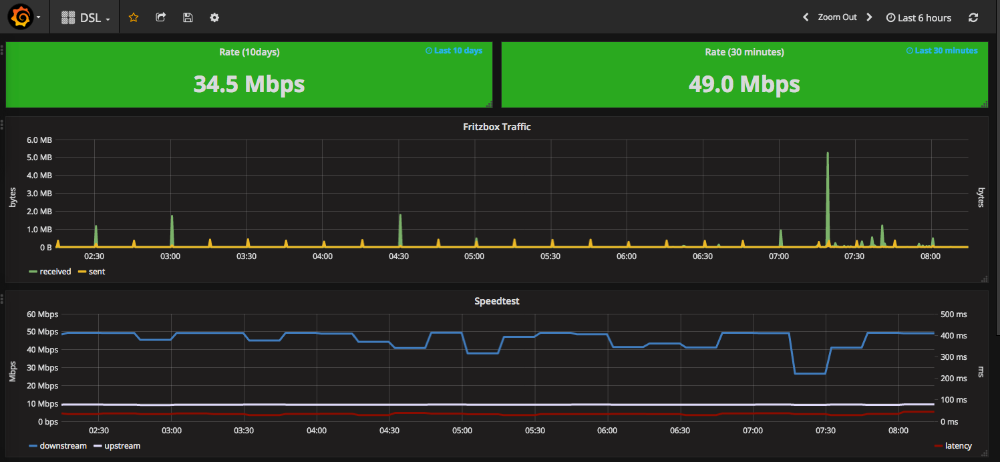

<div style="float: right; margin-left: 1em; margin-bottom: 1em;"></div>

[Prometheus] ist ein quelloffenes Monitoring- und Alarmierungs-Werkzeug. Seine Basis bildet eine Zeitreihen-Datenbank, auf deren Daten mit einer eingebauten, sehr mächtigen Abfragesprache zugegriffen werden kann.

Prometheus verfolgt den Ansatze des sogenannten "whitebox-monitoring". Anwendungen stellen hier entweder nativ Metriken zur Verfügung, oder alternativ macht ein "[exporter]" Applikations- oder Geräte-Metriken für Prometheus abfragbar.

In diesem Artikel möchte ich zeigen, wie man mit Hilfe des [fritzbox_exporter] und des [speedtest_exporter] im Zusammenspiel mit [Grafana] Einblicke in die Performance seines Heimnetzwerks und seines Internetanschlusses bekommen kann. Die Hardware-Basis für dieses Projekt stellt ein RaspberryPi.

<!--more-->

**In den folgenden Listings zeigen diese Präfixe die verwendeten Benutzer an:**
- ``$`` : ``prometheus``

# Installation der Komponenten

Ich habe für dieses Projekt einen RaspberryPi 2 mit der aktuellen Version von [Raspian Jessie Lite] verwendet.

## Voraussetzungen

Nach dem Update des RaspberryPi auf die neuesten Paketversionen, sollte man folgende benötigten Pakete installieren:

```
# apt-get install apt-transport-https git python-pip wget curl
```

## Prometheus

Prometheus holt sich ("scrape") Metriken von vorher definierten Zielen in bestimmten Zeitintervallen. Es speichert diese in seiner Zeitreihen-Datenbank und stellt eine mächtige Abfragesprache [PromQL] bereit, um auf diese Metriken zur Darstellung von Graphen und zur Alarmierung zugreifen zu können.

Zunächst erstellen wir einen neuen Benutzer unter dem Prometheus und weitere Komponenten laufen werden:

```
# adduser prometheus
```

Wir laden das aktuelle Archiv von [https://prometheus.io/download/] herunter - in der Dropdown-Box "architecture" wählen wir "armv7". Im folgenden habe ich ``wget``-Aufrufe mit den zur Zeit aktuellen Versionen verwendet:

```
# su - prometheus
$ wget https://github.com/prometheus/prometheus/releases/download/v1.5.2/prometheus-1.5.2.linux-armv7.tar.gz
$ tar xzvf prometheus-1.5.2.linux-armv7.tar.gz
```

Nun erstellen wir einige benötigte Verzeichnisse und kopieren Dateien aus dem eben entpackten Archiv an die notwendigen Stellen:

```
$ mkdir bin etc data
$ cp -r prometheus-1.5.2.linux-armv7/console* etc/
$ cp prometheus-1.5.2.linux-armv7/prometheus bin/
```

Wir kopieren auch fürs Erste die Standard-Konfiguration von Prometheus:
```
$ cp prometheus-1.5.2.linux-armv7/prometheus.yml etc/
```

Die ``service``-Datei für ``systemd`` in  ```/etc/systemd/system/prometheus.service``` erstellen wir mir dem folgenden Inhalt:

```
[Unit]
Description=Prometheus node exporter
After=network.target
Wants=network.target

[Service]
User=prometheus
Group=prometheus
ExecStart=/home/prometheus/bin/prometheus \
  -config.file=/home/prometheus/etc/prometheus.yml \
  -storage.local.path=/home/prometheus/data/ \
  -web.console.templates=/home/prometheus/etc/consoles \
  -web.console.libraries=/home/prometheus/etc/console_libraries \
  -log.level=error
ExecReload=/bin/kill -HUP $MAINPID
KillMode=process
Type=simple
Restart=always

[Install]
WantedBy=multi-user.target
```

Wir starten Prometheus und aktivieren es beim Systemstart:

```
# systemctl daemon-reload
# systemctl start prometheus.service
# systemctl enable prometheus.service
```

## Pushgateway

Das [Pushgateway] dient dazu, Metriken von z.B. batch-Läufen mit Prometheus verarbeiten zu können. Hier benutzen wir es, um den per cron gesteuerten speedtest_exporter, der nachfolgend noch beschrieben wird, anzubinden.

```
$ wget https://github.com/prometheus/pushgateway/releases/download/v0.3.1/pushgateway-0.3.1.linux-armv7.tar.gz
$ tar xzvf pushgateway-0.3.1.linux-armv7.tar.gz
$ cp pushgateway-0.3.1.linux-armv7/pushgateway bin/
```

Die ``service``-Datei für ``systemd`` in  ```/etc/systemd/system/pushgateway.service``` erstellen wir mir dem folgenden Inhalt:

```
[Unit]
Description=Prometheus pushgateway
After=network.target
Wants=network.target

[Service]
User=prometheus
Group=prometheus
ExecStart=/home/prometheus/bin/pushgateway
Type=simple
Restart=always

[Install]
WantedBy=multi-user.target
```

Wir starten das Pushgateway und aktivieren es beim Systemstart:

```
# systemctl daemon-reload
# systemctl start pushgateway.service
# systemctl enable pushgateway.service
```

## node_exporter

Der [node_exporter] kann vielerlei System-Metriken, wie z.B. CPU-Auslastung auslesen und Prometheus zur Verfügung stellen. Mit diesen Daten haben wir die Vitalwerte unseres RaspberryPi im Blick.

```
$ wget https://github.com/prometheus/node_exporter/releases/download/v0.13.0/node_exporter-0.13.0.linux-armv7.tar.gz
$ tar xzvf node_exporter-0.13.0.linux-armv7.tar.gz
$ cp node_exporter-0.13.0.linux-armv7/node_exporter bin/
```

Die ``service``-Datei für ``systemd`` in  ```/etc/systemd/system/node_exporter.service``` erstellen wir mir dem folgenden Inhalt:

```
[Unit]
Description=Prometheus node exporter
After=network.target
Wants=network.target

[Service]
User=prometheus
Group=prometheus
ExecStart=/home/prometheus/bin/node_exporter --collectors.enabled conntrack,diskstats,entropy,filefd,filesystem,loadavg,mdadm,meminfo,netdev,netstat,stat,time,vmstat
Type=simple
Restart=always

[Install]
WantedBy=multi-user.target
```

Wir starten den node_exporter und aktivieren ihn beim Systemstart:

```
# systemctl daemon-reload
# systemctl start node_exporter.service
# systemctl enable node_exporter.service
```

## fritzbox_exporter

Der [fritzbox_exporter] bereitet Metriken, die er per UPnP von der FritzBox holt, für Prometheus auf.

Ich bevorzuge, Go Programme nicht auf dem RaspberryPi zu bauen, zum einen weil cross-compiling in Go so einfach ist und zum anderen, weil es einfach schneller geht:

```
$ go get github.com/ndecker/fritzbox_exporter/
$ cd $GOPATH/src/github.com/ndecker/fritzbox_exporter
$ CGO_ENABLED=0 GOOS=linux GOARM=7 GOARCH=arm go build -o fritzbox_exporter main.go
$ scp fritzbox_exporter raspi:/home/prometheus/bin/
```

Um den ``fritzbox_exporter`` für ein normales x86_64-Linux zu bauen sieht die Kommandozeile so aus:
```
$ CGO_ENABLED=0 GOOS=linux GOARCH=amd64 go build -o fritzbox_exporter main.go
```

Wieder auf derm RaspberryPi, kann man den fritzbox_exporter mit folgendem Kommando testen:

```
$ /home/prometheus/bin/fritzbox_exporter -test
```

Es sollte eine Liste von Metriken über die FritzBox angezeigt werden.

Die ``service``-Datei für ``systemd`` in  ```/etc/systemd/system/fritzbox_exporter.service``` erstellen wir mir dem folgenden Inhalt:

```
[Unit]
Description=Prometheus fritzbox exporter
After=network.target
Wants=network.target

[Service]
User=prometheus
Group=prometheus
ExecStart=/home/prometheus/bin/fritzbox_exporter
Type=simple
Restart=always

[Install]
WantedBy=multi-user.target
```

Wir starten den fritzbox_exporter und aktivieren ihn beim Systemstart:

```
# systemctl daemon-reload
# systemctl start fritzbox_exporter.service
# systemctl enable fritzbox_exporter.service
```

## speedtest_exporter

Der [speedtest_exporter] ist ein einfaches Perl-Skript, das die Ausgabe des ```speedtest-cli``` auswertet und die erzeugten Metriken über das Pushgateway an Prometheus sendet.

**Bitte beachtet: dieses Projekt ist ein proof-of-concept. Wenn Ihr vorhabt, den speedtest_exporter über einen längeren Zeitraum hinweg oder häufig laufen zu lassen, solltet Ihr mit Speedtest klären, ob dies für sie in Ordnung ist.**

Zuerst müssen wir ```speedtest-cli``` installieren:

```
# pip install speedtest-cli

$ cd /home/prometheus/bin
$ wget https://raw.githubusercontent.com/RichiH/speedtest_exporter/master/speedtest_exporter.pl
$ chmod +x speedtest_exporter.pl
```

Um den Test automatisch alle 15 Minuten laufen zu lassen, erstellen wir als ```root``` noch einen cronjob mit folgendem Inhalt:
```
*/15 * * * * /home/prometheus/bin/speedtest_exporter.pl
```

## Grafana

[Grafana] ist der de-facto Standard zur Visualisierung von performance-Metriken. Mit seiner Hilfe werden wir ansprechende Dashboards der Messergbnisse erstellen.

Ein für den Raspberry geeignetes Grafana kann von hier installiert werden:
```
# echo "deb https://dl.bintray.com/fg2it/deb jessie main" > /etc/apt/sources.list.d/grafana.list
# curl https://bintray.com/user/downloadSubjectPublicKey?username=bintray | apt-key add -
# apt-get update
# apt-get install grafana
```

Die Installation auf einem normalen x86_64-Debian Jessie sieht so aus:
```
# echo "deb https://packagecloud.io/grafana/stable/debian/ jessie main" > /etc/apt/sources.list.d/grafana.list
# curl https://packagecloud.io/gpg.key | apt-key add -
# apt-get update
# apt-get install grafana
```

```
# systemctl daemon-reload
# systemctl start grafana-server
# systemctl enable grafana-server
```

Wir können nun auf Grafana z.B. unter ```http://raspi:3000``` zugreifen.

Nach dem ersten Start muss noch eine Prometheus-datasorce wie in der [Grafana-Dokumentation] angegeben, angelegt werden.

Als *Url* tragen wir ```http://localhost:9090``` ein und unter *Access* geben wir ```proxy``` an.

# Configuring Prometheus

Um alle vorher installierten exporter abzufragen, müssen wir die Konfigurationsdatei von Prometheus ```/home/prometheus/etc/prometheus.yml``` folgendermaßen ändern:

```
# my global config
global:
  scrape_interval:     15s # Set the scrape interval to every 15 seconds. Default is every 1 minute.
  evaluation_interval: 15s # Evaluate rules every 15 seconds. The default is every 1 minute.
  # scrape_timeout is set to the global default (10s).

  # Attach these labels to any time series or alerts when communicating with
  # external systems (federation, remote storage, Alertmanager).
  external_labels:
      monitor: 'codelab-monitor'

# Load rules once and periodically evaluate them according to the global 'evaluation_interval'.
rule_files:
  # - "first.rules"
  # - "second.rules"

# A scrape configuration containing exactly one endpoint to scrape:
# Here it's Prometheus itself.
scrape_configs:
  # The job name is added as a label `job=<job_name>` to any timeseries scraped from this config.
  - job_name: 'prometheus'
    static_configs:
      - targets: ['localhost:9090']

  - job_name: 'pushgateway'
    honor_labels: true
    static_configs:
      - targets: ['localhost:9091']

  - job_name: 'node_exporter'
    static_configs:
      - targets: ['localhost:9100']

  - job_name: 'fritzbox_exporter'
    static_configs:
      - targets: ['localhost:9133']

```
# Überwachung weiterer server

Man kann den node_exporter auf weitere Server im Heimnetzwerk installieren. Um diese dann in Prometheus aufzunehmen, genügt es, dem "node_exporter"-Job ein weiteres "target" hinzuzufügen, z.B.:

```
    ...
    static_configs:
      - targets: ['localhost:9133']
      - targets: ['myothermachine.my.net:9133']
```

# Hinzufügen von Grafana Dashboards

Um schöne und nützliche Grafana-Dashboards zu erstellen, braucht man etwas Übung. Glücklicherweise gibt es schon etliche fertige Dashboards bei [grafana.net] zum Herunterladen, zum Beispiel das sehr nützliche [node_exporter dashboard].

Ein Dashboard auf Basis der Daten dieses Tutorials könnt Ihr <a href="/assets/2017-03-08-prometheus-und-die-fritzbox/dashboard.json">hier</a> herunterladen und in Grafana importieren.

Und so sieht das Dashboard momentan bei mir aus:
<div style="float: right; margin-left: 1em; margin-bottom: 1em;"></div>

---

Mehr Posts zu Prometheus [https://labs.consol.de/tags/PrometheusIO]

[Prometheus]: https://prometheus.io
[exporter]: https://prometheus.io/docs/instrumenting/exporters/
[Raspian Jessie Lite]: https://downloads.raspberrypi.org/raspbian_lite_latest
[PromQL]: https://prometheus.io/docs/querying/basics/
[https://prometheus.io/download/]: https://prometheus.io/download/
[Pushgateway]: https://prometheus.io/docs/instrumenting/pushing/
[node_exporter]: https://github.com/prometheus/node_exporter
[fritzbox_exporter]: https://github.com/ndecker/fritzbox_exporter
[fritzbox_exporter documentation]: https://github.com/ndecker/fritzbox_exporter
[speedtest_exporter]: https://github.com/RichiH/speedtest_exporter
[Grafana]: http://grafana.org/
[Grafana Dokumentation]: http://docs.grafana.org/features/datasources/prometheus/
[grafana.net]: https://grafana.net/
[node_exporter dashboard]: https://grafana.net/dashboards/22
[https://labs.consol.de/tags/PrometheusIO]: https://labs.consol.de/tags/prometheusio/