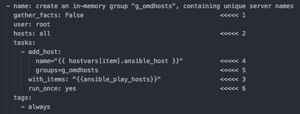

<div style="float: right; margin-left: 1em; margin-bottom: 1em;"></div>


Mit steigender Zahl der im [Ansible]-Inventory gepflegten Hosts verlängert sich die Laufzeit eines Playbooks. Ansible erkennt zwar, welche Tasks nicht ausgeführt müssen (z.B. weil bestimmte Pakete bereits installiert sind), jedoch kostet auch diese Überprüfung Zeit. Früher oder später wird man deshalb den Playbook-Parameter ``--limit|-l`` einsetzen - und sich wundern, warum Teile des Playbooks plötzlich nicht mehr funktionieren. Dieser Blogpost zeigt, in welche Probleme man laufen kann bzw. wie man sie vermeidet und löst.

<!--more-->


## Funktionsweise von --limit

In jedem "Play" eines Playbook pflegt Ansible die Liste ``ansible_play_hosts``, welche die Hosts enthält, auf die die Tasks des Plays angewendet werden (hier: alle Hosts der Gruppe ``g_webservers``):

```

---
  hosts: g_webservers
  tasks:
  - name: ensure apache is at the latest version
...
...
```

Der Parameter ``--limit`` reduziert diese Liste auf ein angegebenes Subset:

```
# nur webserverA
ansible-playbook my-playbook.yml --limit "webserverA"
# nur webserverA und webserverA
ansible-playbook my-playbook.yml --limit "webserverA,webserverD"
```

[(Ansible-Dokumenation zu --limit)](https://ansible-tips-and-tricks.readthedocs.io/en/latest/ansible/commands/#limit-to-one-or-more-hosts)

## Fallstricke

Ich beschreibe im folgenden ein Szenario aus der Praxis (Ansible-Projekt zur Installation einer verteilten Monitoring-Umgebung, bestehend aus vielen Standort-Sites und einer zentralen Site), wo mir ``--limit`` um die Ohren geflogen ist:

``inventory.ini``:

```

[g_omdsites]

[g_omdsites:children]
g_omd_central
g_omd_remote

[g_omd_central:children]
central         ansible_host=xx.xxxx.com

[g_omd_remote:children]
r_berlin1       ansible_host=monberlin.xxxx.com
r_berlin2       ansible_host=monberlin.xxxx.com
r_madrid1       ansible_host=monmadrid.xxxx.com
r_madrid2       ansible_host=monmadrid.xxxx.com
r_hongkong1     ansible_host=monhongkong.xxxx.com
r_hongkong2     ansible_host=monhongkong.xxxx.com
...
...


```


An jedem Remote-Standort sollten gemäß Kundenanforderung zwei OMD-Sites (1 und 2) auf jeweils einem Monitoring-Host laufen.

Schmankerl: "Hosts" aus Sicht von Ansible sind in diesem Inventory nicht die physikalischen Maschinen (wie *monberlin*), sondern die *OMD-Sites*. Mit der special variable ``ansible_host`` habe ich Ansible mitgeteilt, welcher "echte" Host jeweils tatsächlich hinter einer jeden Site steckt und per SSH kontaktiert werden muss. Durch diesen Trick sind nun die OMD-Sites die "configuration items", die ich über ihre Gruppe `g_omdsites` im Playbook anspreche.


### Falle 1: Plays mit Gruppen von anderem Kontext
Im folgenden Play verbindet sich Ansible auf alle Hosts (=OMD-Sites = die ``ansible_hosts`` dahinter) und erzeugt die OMD-Sites:

```
- name: create & configure OMD sites
  user: root
  hosts: g_omdsites
  roles:
     - 03_omdsite
```

Dass Ansible sich jetzt *zwei mal* auf ``monberlin`` verbindet, ist OK, da ja auch *zwei* OMD-Sites erzeugt werden müssen (``r_berlin1`` und ``r_berlin2``).

Tasks zur Installation generischer Pakete wie *vim*, *htop*, *screen* oder zur Konfiguration von NTP hingegen machen pro Host nur *einmal* Sinn (die jeweils zwete Ausführung wäre ein reiner Leerlauf...). **Es lag also nahe, für die physikalischen Hosts eine eigene Gruppe** ``g_omdhosts`` **zu erstellen...**

```

# physical hosts
[g_omdhosts]
monberlin.xxxx.com
monmadrid.xxxx.com
monhongkong.xxxx.com

```
**...und das Play auf diese Gruppe anzuwenden:**

``` jinja2

- name: OS preparation tasks
  gather_facts: True
  user: root
  hosts: g_omdhosts
  roles:
    - 00_ntp
    - 01_common_software

```

Das klappte, bis ich die Ausführung des Playbooks mit ``--limit r_berlin1`` auf eine OMD-Site beschränkte, um die Änderungen an der OMD-Config erst mal nur in einer Site nachzuvollziehen und um letztlich auch Ausführungszeit zu sparen:

```
ansible-playbook playbook.yml --limit r_berlin1
```

``--limit r_berlin1`` wirkte sich auf die ``ansible_play_hosts`` *aller* Plays aus, mit dem Ergebnis, dass

* *"create & configure OMD sites"* korrekt nur noch auf ``r_berlin1`` ausgeführt wurde
* *"OS preparation tasks"* nicht zur Ausführung kam, weil ``g_omdhosts`` nur FQDNs der Maschinen beinhaltet. Keiner der FQDNs matcht natürlich auf den Filter.
  * ``--limit r_berlin1,monberlin.xxx.com`` wäre ein schneller Workaround für das Problem. Allerdings ist es alles andere als praktisch, zu ggf. auch mehreren in "limit" angegeben OMD-Sites auch noch die richtigen Hostnamen herauszusuchen.
  * ``--limit r_berlin1,g_omdhosts`` ist keine wirkliche Lösung, denn ``g_omdhosts`` enthält ja mehr FQDNs als nur den der Site ``r_berlin1``, leitet aber schon zur Lösung über.

#### Lösung: in-memory groups

Ich habe das Problem mithilfe von sog. "in-memory groups" gelöst und folgendes Play zu Beginn des Playbooks eingefügt:  



Anstatt die Gruppe ``g_omdhosts`` wie oben im Inventory manuell zu pflegen, wird sie mit diesem Play automatisch on-the-fly erstellt:
1. Es ist nicht notwendig, Facts für dieses Play einzusammeln
2. Das Play soll ausgeführt werden, egal, nach welchen OMD-Sites mit ``limit`` (bzw. ob überhaupt) gefiltert wird
3. Aus jeder nun in ``ansible_play_hosts`` enthaltenen Site...
4. wird die Hostvariable ``ansible_host`` gelesen...
5. und der Gruppe ``g_omdhosts`` zugewiesen.
6. Die Gruppe ist nach dem Durchlauf mit der ersten OMD-Site bereits komplett, sodass das Play verlassen werden kann (``run_once``).

``g_omdsites`` enthält somit zu jeder OMD-Site den passenden Host-FQDN. Das Modul ``add_host`` arbeitet unique, d.h. jeder FQDN ist automatisch nur 1x enthalten.

Der oben gezeigte Aufruf ``--limit r_berlin1,g_omdhosts`` arbeitet mit der in-memory-group nun korrekt.    

### Falle 2: with_items auf Gruppen

Im zweiten Fall soll eine auf der zentralen OMD-Site automatisch (per Ansible) erzeugte Datei auf alle Sites in der Gruppe ``g_omdsites_remote`` per *scp* übertragen werden. Dieser Task liegt in einem Play für die zentrale OMD-Site und kommt deshalb nur *einmal* zur Ausführung. So geschrieben

``` jinja2

- name: Distribute remote_sites file to remote sites
  command: "scp {{ SITEPATH }}/etc/remote_sites {{ item }}:etc/remote_sites"
  with_items: "{{ groups['g_omdsites_remote'] }}"

```
funktioniert der Task zwar, allerdings beeinflusst die Filterung mit ``--limit`` nicht auch die Auswertung von Gruppenmitgliedschaften aus dem Inventory. Ansible wird die Datei also, unabhängig davon, ob ``--limit`` angegeben wurde oder nicht, immer auf *alle* Remote-Sites kopieren wollen.

#### Lösung: intersect
Gelöst werden kann dieses Problem durch Bildung der Schnittmenge (``intersect``) zwischen den Gruppenmitgliedern und der Menge der ``ansible_play_hosts``. Übrig bleiben dann nur noch diejenigen Mitglieder der Gruppe, die auch noch den ``--limit``-Filter passiert haben:

``` jinja2

- name: Distribute remote_sites file to remote sites
  command: "scp {{ SITEPATH }}/etc/remote_sites {{ item }}:etc/remote_sites"
  with_items: "{{ groups['g_omdsites_remote'] | intersect(ansible_play_hosts) }}"

```

## Ganz oder gar nicht

Hier noch ein Tipp aus meiner "Ansible-Grabbelkiste": Wie verhindert man, dass ein Play ausgeführt wird, wenn das Playbook mit ``--limit`` aufgerufen wurde?
Das ist z.B. erforderlich, wenn der Task aus Lösung 2 (s.o.) Facts der Hosts verarbeiten soll (z.b. in Jinja2-Templates), welche nicht aus einem fact cache stammen dürfen und nur dann bekannt sind, wenn auch alle Tasks zur Ermittlung der Facts gelaufen sind.

``` jinja2

- name: tasks on "central" site
  gather_facts: False
  hosts: central
  vars:
    remt_str: "{{ groups['g_omdsites_remote'] | sort | join(',') }}"            <<<<<< 1               
    remt_str_play: "{{ ansible_play_hosts | intersect(groups['g_omdsites_remote']) | sort | join(',') }}"  <<<<<< 2        
  roles:
    - { role: 07_site_infrastructure, when: "{{ remt_str_play == remt_str }}" } <<<<<< 3
  post_tasks:
    - debug: msg="This role is executed only on non-limited runs!"              <<<<<< 4
      when: remt_str_play != remt_str

```

Im ``vars``-Teil des Plays werden zwei Strings gebildet:
1) ``remt_str``: Alle Mitglieder der Gruppe ``g_omdsites_remote``, sortiert und als kommaseparierter String
2) ``remt_str_play``: Schnittmenge aus ``ansible_play_hosts`` und ``g_omdsites_remote``, ebenfalls sortiert und als kommaseparierter String

3) Die beiden Strings sind nur dann identisch, wenn ``--limit`` nicht verwendet wurde. Nur in diesem Fall wird die Rolle ausgeführt.
4) Die Debug-Meldung weist darauf hin, dass die Rolle übersprungen wurde.


---


[Ansible]: https://ansible.com