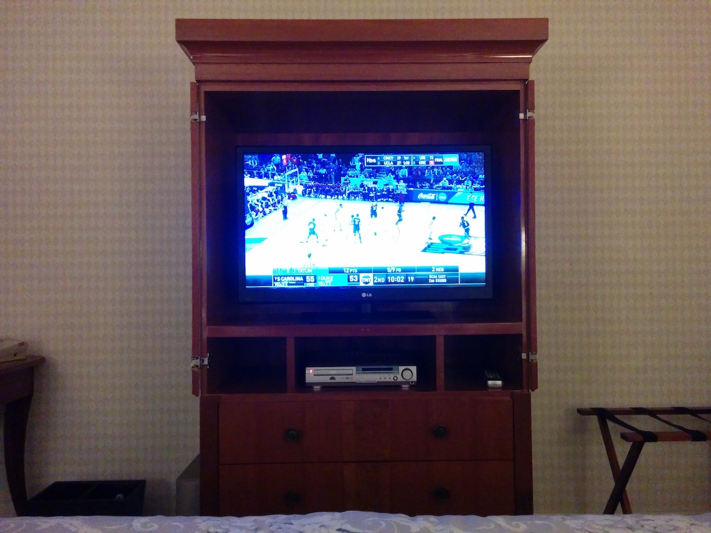
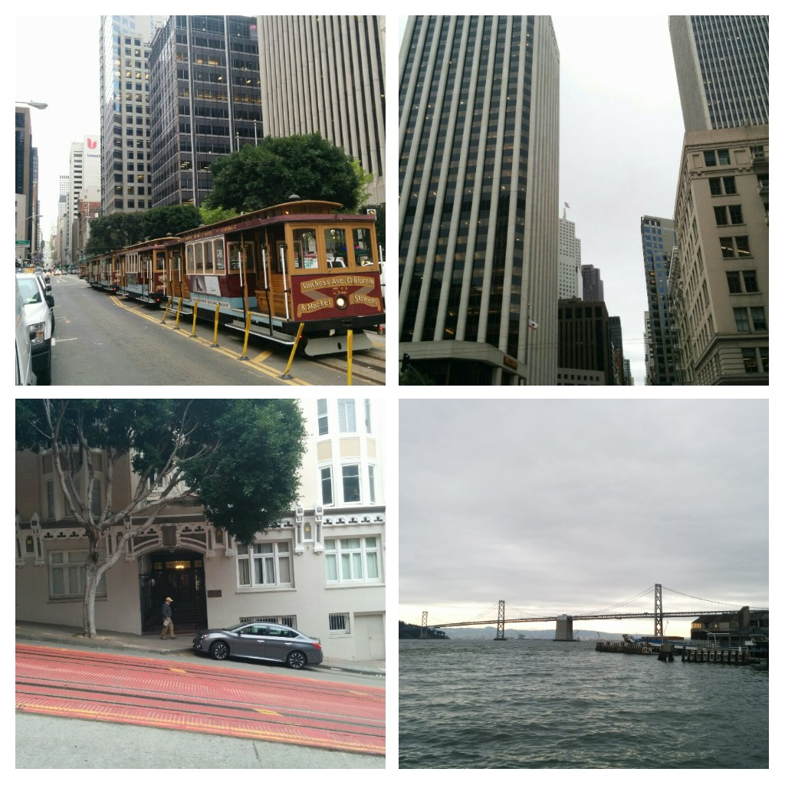
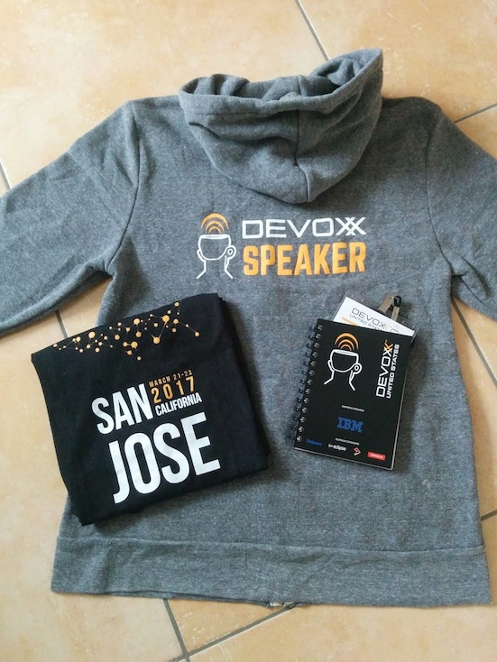
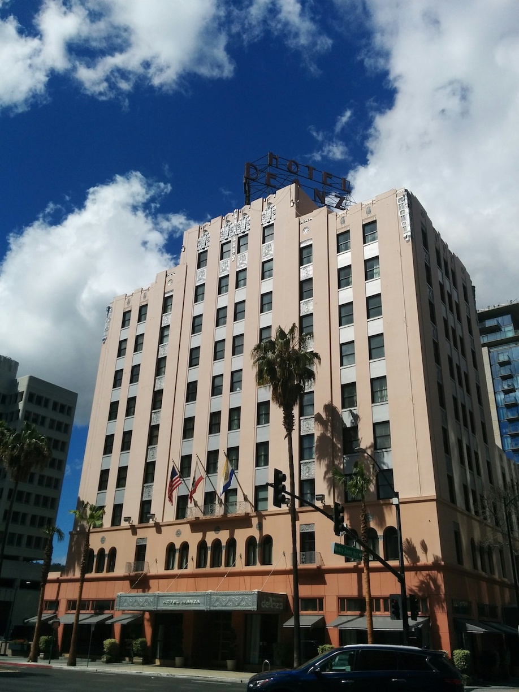
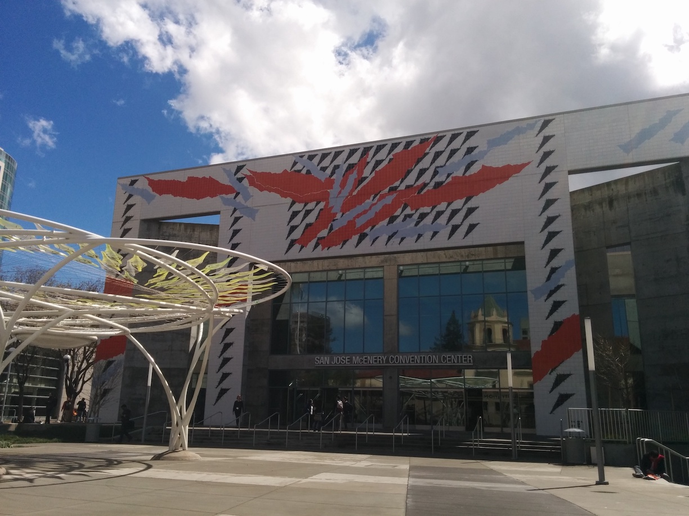
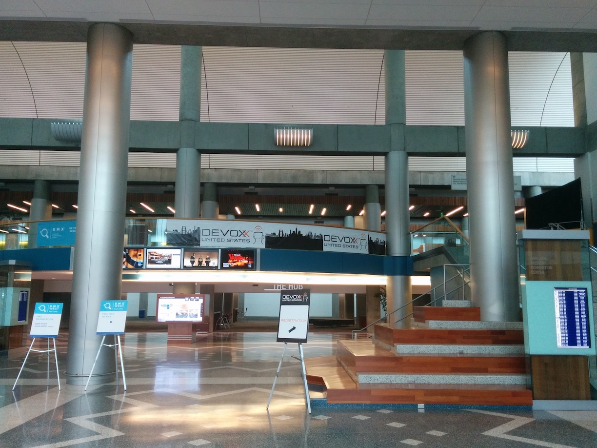
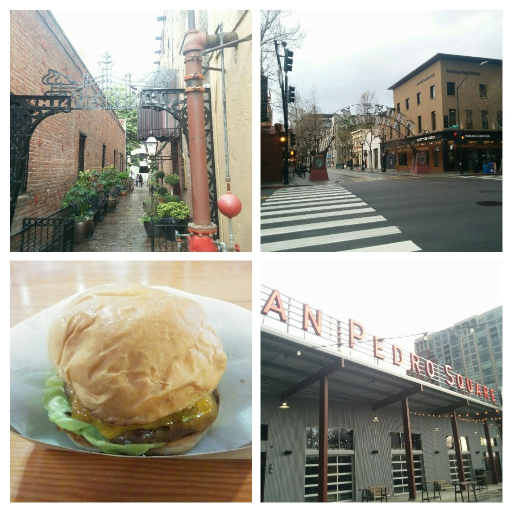

## DevoxxUS 2017

[DevoxxUS](https://devoxx.us) has been my first Devoxx outside of Europe so far. It was a total different Devoxx experience for me compared to the six times in Antwerp Belgium that I have been to in the past years. 
Yet different it has been a great conference! I would like to share some of my adventures and thoughts in this post.   
  
<!--more-->
  
## Trip to California

After catching a 11h direct flight connection from Frankfurt I arrived in San Francisco some days prior to the conference.
Flight has been perfectly on time and pretty calm. I was not able to catch much sleep though as the combination 6'10 height and economy class just does not fit very well for me. So the jetlag hit me hard and I ended up early in my hotel room
trying to keep myself awake somehow till 9:30 pm. Fortunately there was lots of live NCAA Basketball on TV because of [Marchmadness](http://www.ncaa.com/march-madness) tournament. As a born citizen of Würzburg Germany 
my connection to Dirk Nowitzki and the sport in general is very strong.

## San Francisco

The next day I got up early in the morning to do some sight seeing in San Francisco before finally heading to San Jose for the conference. San Francisco is a great city! I did lots of typical tourism activities like riding the  
cable cars, visiting fisherman's wharf, saying *Hello* to the sea lions at Pier39, taking pictures of Alcatraz and the Golden Gate bridge and of course a little bit shopping of America's goods.

In the afternoon that day I took the Caltrain service from San Francisco to San Jose where DevoxxUS conference is about to take place. This is a 1,5h ride along the west coast of the SF bay area. Once arrived in San Jose I managed to do the registration 
and grab my conference pass and other goodies on that evening before DevoxxUS took off the other day.

 
## Conference

The conference started 9.00 am the next day at San Jose convention center. It took me a 5-10 min walk from my Hotel DeAnza which has been a great stay by the way - totally recommend that! 

Now I have to admit that I was a little bit late for the keynote as I arrived just 5 minutes prior to the schedule. From my Devoxx Belgium experience I knew that I would have to take the overflow room. But things were different this time. 
To my surprise the keynote room still had lots of free seats to offer. I managed to grab a coffee and had a first class seat. And this is probably the most significant difference to other Devoxx conferences I have been to so far. 
No queuing, no stress, no crowded areas at all. The venue is huge! In combination with a comparatively small capacity of 700 people attending this creates a total relaxed atmosphere!

Changing rooms becomes more relaxed, lunch is relaxed, exhibition area is relaxed. This was totally new to me as a Devoxx BE veteran. Devoxx Belgium is great and I definitely recommend a stay there but as a visitor I can tell you some stories about queuing 20 minutes 
for grabbing a crab sandwich at lunch. Speaking of *crab sandwiches* - food and beverages have been very good at DevoxxUS. The coffee was probably the best served at any event I have ever been to. I will not advertise the company that is responsible for that but I would 
definitely star the bucks out of that Github repository for them.

Back to the keynotes! Keynotes were also different yet great material! The event started with some warm welcome words by Mike Milinkovich and Stephan Janssen. Here the official attendee numbers of 700 people gave proof to my first impressions that the event will not be too crowded. Also
the program committee had to face a new record of 785 proposed talks during the call for papers. Hearing that number made me even more excited to be a part of this conference as accepted speaker. 
 
Then Chet Haase took over to present [The Business of Technology Business Technology](http://cfp.devoxx.us/2017/talk/OTY-5246/The_Business_of_Technology_Business_Technology) which turned out to be one of his great eloquent speeches about something and nothing were each sentence 
is picked with hidden funny lines and profound marks on the software development universe. After that Janelle Klein closed the series of keynotes for that day with [What is "Identity"?](http://cfp.devoxx.us/2017/talk/NAN-8167/What_is_%22Identity%22%3F) which in my view also had a different yet great and very inspiring tone for a keynote.

So I had that good start to the conference and saw some very good talks in the morning including of course Venkat speaking about [reactive programming in Java](http://cfp.devoxx.us/2017/talk/ZAE-7856/Reactive_Programming_in_Java) in his unique and brilliant way of presenting. Unfortunately I had to go back to the Hotel in order to prepare myself for my talk on
[behavior driven integration](http://cfp.devoxx.us/2017/talk/XZI-2824/Behavior_driven_integration_with_Cucumber_and_Citrus) with [Cucumber](https://cucumber.io/) and [Citrus](http://citrusframework.org/) that has been scheduled at 5:30 pm that day.

Now it was my time to proof that accepting my talk has not been a mistake for the conference committee. From my personal perspective I have to say that everything worked out fine for me that day. Presentation felt good, live demos worked, audience was small but seemed very focused and interested. Good news is that the talk has been recorded and will be available at YouTube
within the next days hopefully. So stay tuned on the [Devoxx YouTube channel](https://www.youtube.com/channel/UCCBVCTuk6uJrN3iFV_3vurg/playlists) for the new DevoxxUS content. Maybe you have time to see my talk someday. I would definitely appreciate any feedback on this!

Besides that I enjoyed lots of great talks about Fabric8, Apache Kafka, Angular2, reactive programming and many more.

## Evening activities
  
As a speaker I had the chance to visit some evening activities like the Google 'Happy Hour' welcoming come together and the speaker reception. Food and drinks served have been extraordinary good and you can connect with people of same interest which is also an important part of visiting a developer conference. I had some nice conversations and felt very comfortable with those people around. 
But also as a non-speaker there are a lot of things to explore in San Jose. Definitely visit the [San Pedro Square Market](http://www.sanpedrosquaremarket.com/). The atmosphere at this market place is fantastic and you can watch some live sports in combination with having great food provided by the many different small kitchens and stands.
  

  
## Summary
  
DevoxxUS has been a different yet great experience! Distance from Europe is quite long and jetlag is brutal but what you get is a very relaxed conference in golden state California with fantastic content that is driven by the community. I definitely recommend visiting this conference in the next years because it feels different and way more relaxed compared to others. Right now I see this conference 
as an insider tip as it is not yet too crowded but still provides excellent speakers and content. So I say thank you DevoxxUS for having me as a speaker and see you next time hopefully.