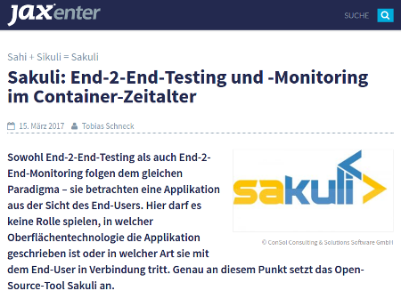

Sowohl End-2-End-Testing als auch End-2-End-Monitoring folgen dem gleichen Paradigma – sie betrachten eine Applikation aus der Sicht des End-Users. Hier darf es keine Rolle spielen, in welcher Oberflächentechnologie die Applikation geschrieben ist oder in welcher Art sie mit dem End-User in Verbindung tritt. Genau an diesem Punkt setzt das Open-Source-Tool Sakuli an. 
 
<!--more-->

Die Anwendungsgebiete des Open-Source-Tools reichen von Web-Clients mit oder ohne Plug-ins (wie zum Beispiel Flash) über generierte PDFs bis hin zu Rich-Clients, die automatisiert abgeprüft werden. Zudem zeigt der Artikel, wie die Container-Technologie genutzt werden kann, um vollständig reproduzierbare End-2-End-Testumgebungen aufzubauen. ...

Der vollständige Artikel ist in der [JAXenter] zu finden:

[JAXenter]: https://jaxenter.de/sakuli-testing-monitoring-container-54374

---

For more posts about Sakuli, view [https://labs.consol.de/tags/sakuli]()