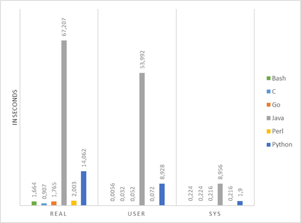
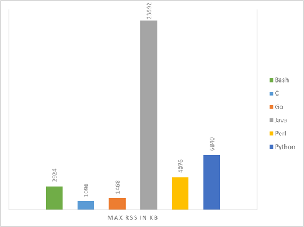
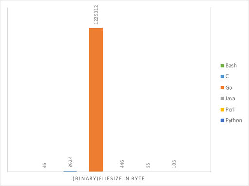

<div style="position: relative; float: right; margin-right: 1em; margin-bottom: 1em; width: 20%; height: 20%;"></div>

Which programming language should we use to write monitoring check_plugins? This question rose some discussion and this post is trying to give some hints.

<!--more-->

This kind of a follow up post to this older [Blogpost](https://labs.consol.de/de/mod-gearman/nagios/omd/2012/10/23/monitoring-core-benchmarks.html). The focus of this post was more on the monitoring core, this post will focus more on the plugin itself.

Currently there are plugins written in Bash, C, Go, Perl and Python that is why this post will focus on these languages. Due to its popularity Java has also been taken into account.

# Setup

The following Virtual Box machine has been used as testsetup:
- 2 Cores: Intel(R) Core(TM) i5-5200U CPU @ 2.20GHz
- SSD
- Debian 9

The following compilers/interpreters has been used:
-	Bash: 4.4.12
-	gcc: 6.3.0
-	Go: 1.9
-	Java: 1.8.0_144
-	Perl: v5.24.1
-	Python 2.7.13

The programs are just simple Hello-World example, because this will show a baseline for the different types of tests. They are at the end of this post.

# Tests

## CPU time

The first test measures the CPU time, with the following command:

```bash
time for i in {1..1000}; do ./$PROGRAM_TO_TEST; done
```



|Language|Real|User|Sys|
|-|-|-|-|
|Bash|1,664|0,0056|0,224|
|C|0,907|0,032|0,224|
|Go|1,765|0,052|0,216|
|Java|67,207|53,992|8,956|
|Perl|2,003|0,072|0,216|
|Python|14,062|8,928|1,9|

## Memory

The second test measures the maximum memory(RSS - Resident set size) usage:

```bash
/usr/bin/time -v ./$PROGRAM_TO_TEST
```



|Language|RSS in KB|
|-|-|
|Bash|2924|
|C|1096|
|Go|1468|
|Java|23592|
|Perl|4076|
|Python|6840|

## Filesize
The last aspect is the filesize of the executable/script:



|Language|Filesize in Bytes|
|-|-|
|Bash|46|
|C|8624|
|Go|1225312|
|Java|446|
|Perl|55|
|Python|105|

# Conclusion
If you want to write your Monitoring Plugin in Java you should maybe think about it twice. If it is just a simple Script which does not require libraries, a simple Bash script should be your choice. Python does also not look like a perfect choice, but it is very easy (most of the time) to accomplish your goal. Go generates the biggest binary files but it is very efficient and it has a nice design. C maybe the choice but you have to like it the hard way.
“We all make choices, but in the end, our choices make us.” (Andrew Ryan, 2007)

# Further information
Due to the fact these test cover only minimalistic programs, there are other sources which cover more complex programs. Like the following [site](https://benchmarksgame.alioth.debian.org/u64q/mandelbrot.html) which compares different languages with a mandelbrot problem. At this problem, the tested languages scored like following:
```
Bash: not tested
C: 1,65s
Go: 5,46s
Java: 7,10s
Perl: 12min!?
Python: 273,43s
```

# Testfiles
Bash:
```bash
#!/bin/bash

echo "simple bash plugin"
exit 0
```

C:
```c
#include <stdio.h>

int main(void) {
    printf("simple c plugin\n");
    return 0;
}
```

Go:
```go
package main

import "fmt"
import "os"

func main() {
    fmt.Println("simple go plugin")
    os.Exit(0)
}
```

Java:
```java
public class Java {
    public static void main(String[] args) {
        System.out.println("simple java plugin");
        System.exit(0);
    }
}
```

Perl:
```perl
#!/usr/bin/perl

print "simple perl plugin\n";
exit 0;
```

Python:
```python
#!/usr/bin/env python
import sys

if __name__ == '__main__':
  print "simple python plugin"
  sys.exit(0)
```