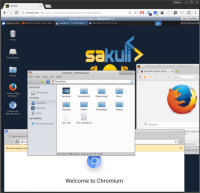

[__Docker Headless VNC Container__](https://github.com/ConSol/docker-headless-vnc-container) 1.2.0 has been released today. The different Docker images contains a complete VNC based, headless UI environment for testautomation like [Sakuli](https://github.com/ConSol/sakuli) does or simply for web browsing and temporary work in a throw-away UI container. The functionality is pretty near to a VM based image, but can be started in seconds instead of minutes. Each Docker image has therefore installed the following components:

<!--more-->

* Desktop environment [**Xfce4**](http://www.xfce.org) or [**IceWM**](http://www.icewm.org/)
* VNC-Server (default VNC port `5901`)
* [**noVNC**](https://github.com/kanaka/noVNC) - HTML5 VNC client (default http port `6901`)
* Browsers:
  * Mozilla Firefox
  * Chromium
  
## Provided Images

`consol/centos-xfce-vnc:1.2.0`  

`consol/ubuntu-xfce-vnc:1.2.0`  

`consol/centos-icewm-vnc:1.2.0`  

`consol/ubuntu-icewm-vnc:1.2.0`  

## Usage
The usage is for all provide images **similar**, for instance see following the usage of the `consol/centos-xfce-vnc` image:

Run command with mapping to local port `5901` (vnc protocol) and `6901` (vnc web access):

    docker run -d -p 5901:5901 -p 6901:6901 consol/centos-xfce-vnc

Now you can connect into the running container through VNC and control the UI:  
* connect via __VNC viewer `localhost:5901`__, default password: `vncpassword`
* connect via __noVNC HTML5 client__: [http://localhost:6901/?password=vncpassword]()

If you want to get a bash into the container use interactive mode `-it` and `bash`:

    docker run -it -p 5901:5901 -p 6901:6901 consol/centos-xfce-vnc bash

For more information about the usage take a look at [github.com/ConSol/docker-headless-vnc-container](https://github.com/ConSol/docker-headless-vnc-container#usage).

### Updates for Version 1.2.0

* Use fixed firefox version `45.9.0esr` ([#39](https://github.com/ConSol/docker-headless-vnc-container/issues/39), [#20](https://github.com/ConSol/docker-headless-vnc-container/issues/20), [#16](https://github.com/ConSol/docker-headless-vnc-container/issues/16)) 
  * fix memory consumption problems in comparison to current firefox 55
  * tested on long term container issues without crashes 
* Add en_US.UTF-8 as default locale ([#27](https://github.com/ConSol/docker-headless-vnc-container/issues/27)) 
* Add enviroment variable `VNC_VIEW_ONLY=true` for view only VNC connections ([#25](https://github.com/ConSol/docker-headless-vnc-container/issues/25))
  * Update to tigervnc version `1.8`
* Use a more stable command for ip determination (PR [#31](https://github.com/ConSol/docker-headless-vnc-container/issues/31), thx to @arnaudveron) 
* Support empty `CMD` values in startup script ([#32](https://github.com/ConSol/docker-headless-vnc-container/issues/32)) 
* Add chromium flag `--disable-gpu` to work for current chromium ([#36](https://github.com/ConSol/docker-headless-vnc-container/issues/36)) 
* Add `TERM=xterm` environment var ([#37](https://github.com/ConSol/docker-headless-vnc-container/issues/37))  

## OpenShift / Kubernetes

It's also possible to run the images in container orchestration platforms like [Kubernetes](https://kubernetes.io) or [OpenShift](https://openshift.io/). For more information how to deploy containers in the cluster, take a look at [OpenShift usage of "headless" VNC Docker images](https://github.com/ConSol/docker-headless-vnc-container/blob/master/openshift/README.md)