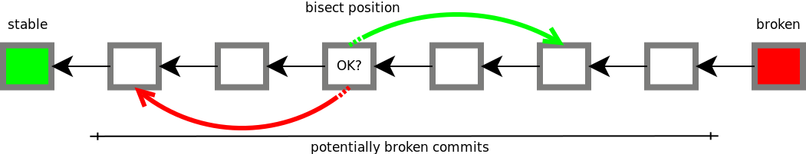
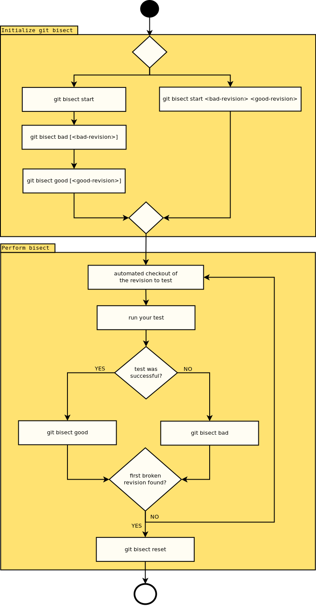
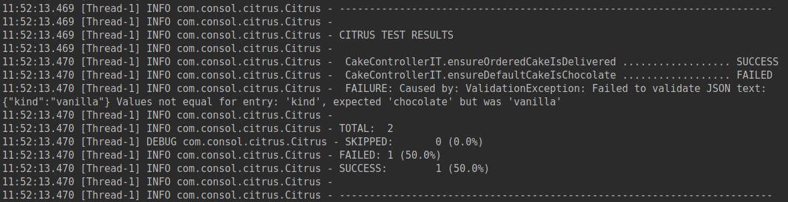
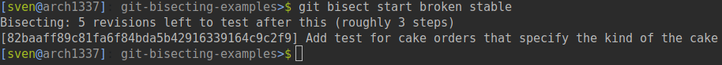
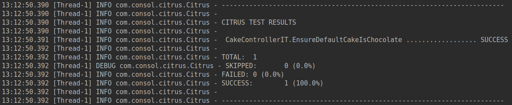
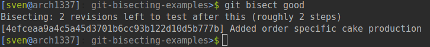
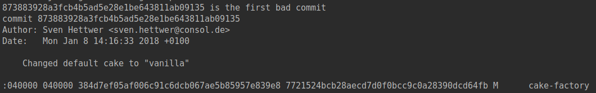
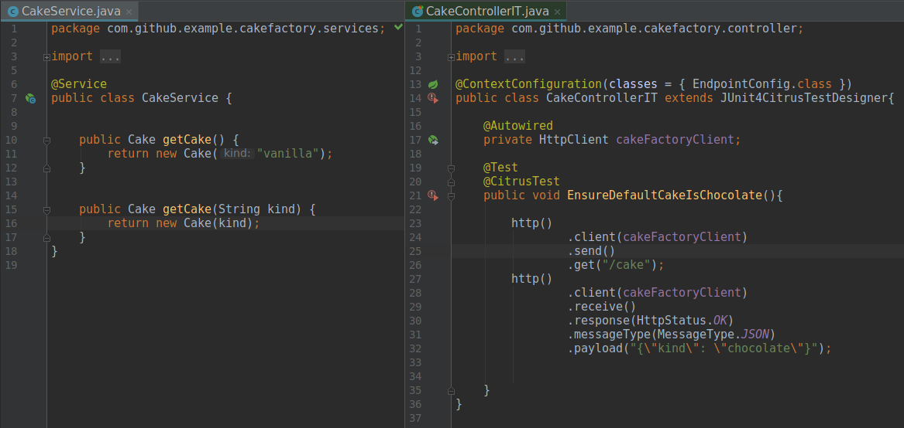
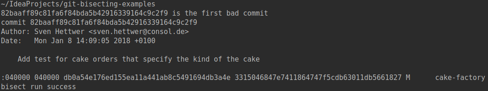

<div style="position: relative; float: right; margin-right: 1em; margin-bottom: 1em;"></div>

Imagine your're working on a bigger feature in a complex piece of software. Your implementation is complete, all tests in scope turned green and you push your changes for integration testing. Then, some integration tests from a completely different module fail and you have no clue which change may have caused this. Now you start analyzing the issue. Probing your commits by hand would end up in a very tedious process for sure. Thankfully *git* can do all the work for you, while you enjoy a cup of coffee.

The high-level command `git bisect` allows you to automatically run a specified test procedure, while it's crawling through your commit history to find the bad revision.

<!--more-->

## Requirements

To do the hands-on part, the following setup is required on your local machine:

* Git
* Java 8
* Maven
* Bash (Cygwin on Windows)

## What is git bisect?

The official description of the [git-bisect documentation](https://git-scm.com/docs/git-bisect) states:
*Use binary search to find the commit that introduced a bug.*

So what does that mean?


Let's say you have a bunch of commits, and you know that, at some point, your software was okay. Now, your software is broken, which means, that you introduced a bug somewhere during your development. What `git bisect` does is, it divides the revision graph into a *good* part and a *bad* part by testing specific commits chosen by a binary search. Based on the result of the tests, git navigates towards the broken commit. After a few iterations, git will be able to identify the revision that introduced the issue.

### The basic git bisect workflow

The workflow of `git bisect` consists of two major steps. At first, you have to specify a range of revisions, limited by a *good* and a *bad* revision. These revisions can be referenced as revision hash, tag or any other git revision selector. At second, the bisect process starts and git automatically performs a checkout of the first revision to test. After passing the result of the test to back to git, by executing `git bisect good` in case of a success or `git bisect bad` in case of a failure, the next revision will be chosen. The second step will be repeated until the first broken revision has been found.


## Manual git bisect

Now that you know about the idea and the workflow, let's continue with the hands-on. At first, checkout the [repository from GitHub](https://github.com/FMAOuroboros/git-bisect-examples) containing the example project. As you can see, the repository contains three folders:
* cake-factory: A sample spring boot web service containing some issues to find
* simple-bisect: A reference how to manually use git-bisect *<- This is what we'll do now*
* automated-bisect: A reference how to use automated bisect including a sample script

Now let's try to build the cake-factory by executing
```bash
mvn -f ./cake-factory/pom.xml clean install
```

You'll recognize, that the build was not successful, because of a failed [Citrus](http://citrusframework.org/) integration test. Now, let's find out, where we introduced the bug.

As shown in the workflow, we've to setup the bisect scenario first. Therefore we have to find a *good* and a *bad* revision to define the borders of the analysis. Both revisions are easy to find. The *good* revision is most likely the revision, you branched from. The *bad* revision is HEAD, due to the fact that your tests are failing now. Nevertheless, for our example we'll use two prepared tags *stable* and *broken* from the repository.
```bash
git bisect start # start the bisect procedure
git bisect bad broken # label the *bad* commit
git bisect good stable # label the *good* commit
```
Or if you want to use the shorter version:
```bash
git bisect start broken stable # start the procedure and label the *good* and *bad* commit
```
Now, that your bisect has been started, git has chosen a commit to test and provides the commit message as well as an estimation of the required iterations.


By not later than now, you should have figured out a test strategy to identify the root cause of your problem. In our case a integration test failed. Therefore we're concentrating our debugging efforts on integration tests. The setup of the cake-factory allows us to skip unit tests and start right away with the integration tests, by setting the property `skip.unit.test=true`.
```bash
mvn clean verify -f ./cake-factory/pom.xml -Dskip.unit.tests=true
```


In this revision, everything is okay and the build was successful. Now we have to report this result to git
```bash
git bisect good # tells git that the current revision is okay
#If the test would have been failed, you would have used 'git bisect bad'
```
Based on our reporting, git has chosen the next revision to check.


Now you have to repeat the testing and reporting procedure. After some iterations, you'll find the following commit causing the problem.

Note the revision hash of the broken commit and don't forget to close your bisect session.
```bash
git bisect reset
```


If you look into the code of that revision, you'll find out that the default cake, delivered by the cake services, has been changed to *vanilla* as stated in the commit message, but the integration test has not been adapted.


## Automated git bisect
As you may have recognized, the manual execution of the bisect steps produces some overhead and is a repetitive task. This increases, if you work in more complex projects with multiple modules involved. Thankfully `git bisect` contains a sub command that allows us to execute a specific command or a scripted test procedure with automated reporting of the result. This does not only reduce the required amount of time but also the possibility of mistakes while repeating the steps by hand.
```bash
git bisect run <command to execute>
```

To report the result of the test to git, your command or script has to fulfill the following contract:
*If the test was successful, the executed command delivers the return code 0, otherwise a return code other that 0 is returned.*
Due to the fact that you just have to fulfill this contract, you could also do some more advanced testing logic using python, or even java. Nevertheless I would suggest to be pragmatic and keep the test simple.

### Example
Let us return to practice. If not already done during the previous section, please checkout the [repository from GitHub](https://github.com/FMAOuroboros/git-bisect-examples) containing the example project. In the "automated-bisect" folder, you'll find a *findBug.sh* bash script, that contains the test procedure from the "Manual git bisect" section as code.
```bash
#!/bin/bash

mvn clean verify -f ./cake-factory/pom.xml -Dskip.unit.tests=true
```

To execute the automated test now, just prepare a bisect environment and pass the script to `git bisect run`.
```bash
git bisect start broken stable
git bisect run sh automated-bisect/findBug.sh
```

Alternatively, if you have a one line command as in *findBug.sh*, you could also pass the command directly to `git bisect run` as long as the passed command fulfills the contract.
```bash
git bisect start broken stable
git bisect run mvn clean verify -f ./cake-factory/pom.xml -Dskip.unit.tests=true
```

When the process has been finished, git will show you the first bad commit as known from the manual part.


## Tips and Tricks

### About git bisect and TDD
If you're following the TDD life cycle to develop your software, you may have some troubles using git-bisect, because your software alternates between a erroneous and a functional sate from a software test perspective. As soon as you specified a new test, your software becomes unstable. If you would execute a simple `mvn clean install` in such a situation, `git bisect` would not find the revision containing the root cause of your problem, because it is confused by the failed builds caused by your TDD tests. This can also be shown with our *cake-factory* example, by removing `skip.unit.tests=true` from the maven instruction.

git bisect start broken stable
git bisect run mvn clean verify -f ./cake-factory/pom.xml

Now `git bisect` will react on every single unit test that is failing. This leads to a result as well, but it has nothing to do with the root cause of the issue we were looking for.


### Setup you test scenario wisely
As you have seen in the section "About git bisect and TDD", a test scenario which is not restrictive enough, returns misleading results. Therefore it's important to create a test scenario, that suites your situation. Here are some bullet points that might help you avoiding pitfalls.

* *Keep your tests small*
Test only what's necessary and relates directly to the issue. This will lead to the correct result and reduces the amount of time for your tests to run.
* *Know your dependencies*
If the failing test depends on a different module, that has changed during development, keep in mind that you have to rebuild the dependency in every iteration before starting the test.
* *Automate your tests*
If you do things more than once, automate them! Don't execute your tests manually. It's a repetitive task that consumes a lot of time. Script you test and let `git bisect run` do the rest.
* *Use common "bad" and "good" candidates*
Don't waste your time on thinking about the most efficient borders for your analysis. Because `git bisect run` will do the job for you, one iteration more or less is not important at all.
  * *bad* candidate: mostly *HEAD*
  * *good* candidates:
    * The revision you branched from
    * The last released version of your software
    * The last revision of your branch that was build successfully. (E.g. last nightly)

## Summary
As you have seen, git bisect is a powerful tool to find broken commits within your git history. You're able to define a range of revisions that will be checked automatically. If you'd like to learn more about *git bisect*, please visit the following links:
* [git-bisect documentation](https://git-scm.com/docs/git-bisect)
* [Debugging with git](https://git-scm.com/book/en/v2/Git-Tools-Debugging-with-Git)

If you have any questions, feel free to email me at [sven(dot)hettwer(at)consol(dot)de](mailto:sven.hettwer@consol.de) or contact me on [twitter](https://twitter.com/SvenHettwer)