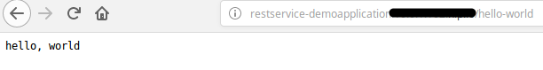
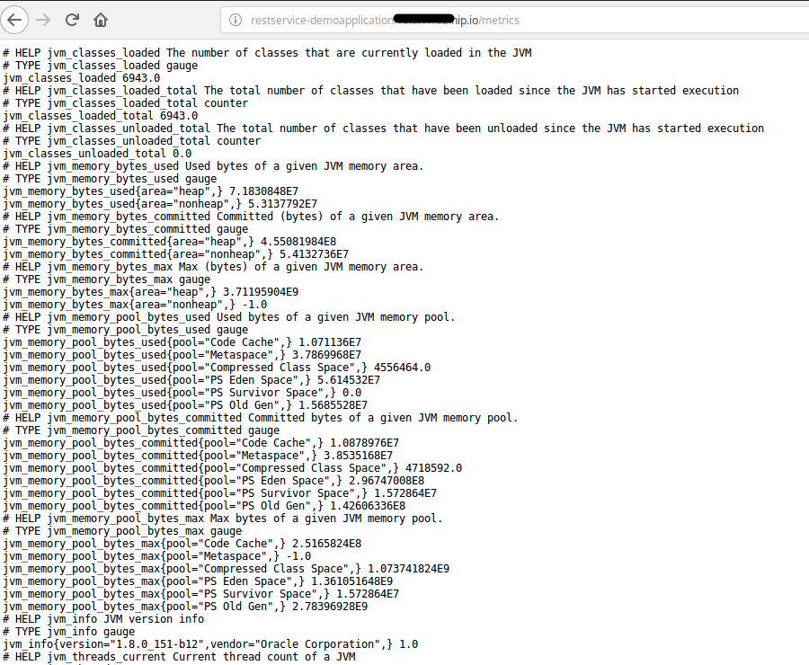
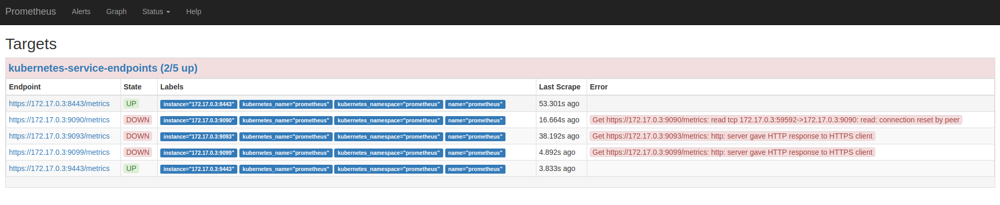
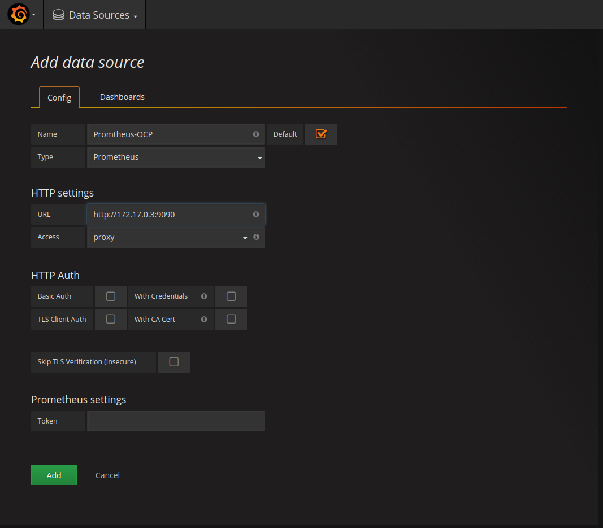
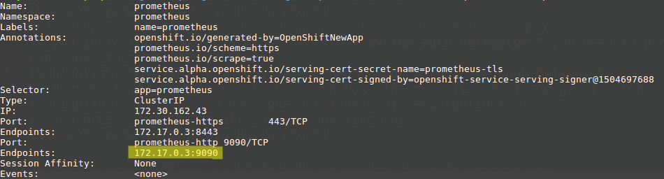
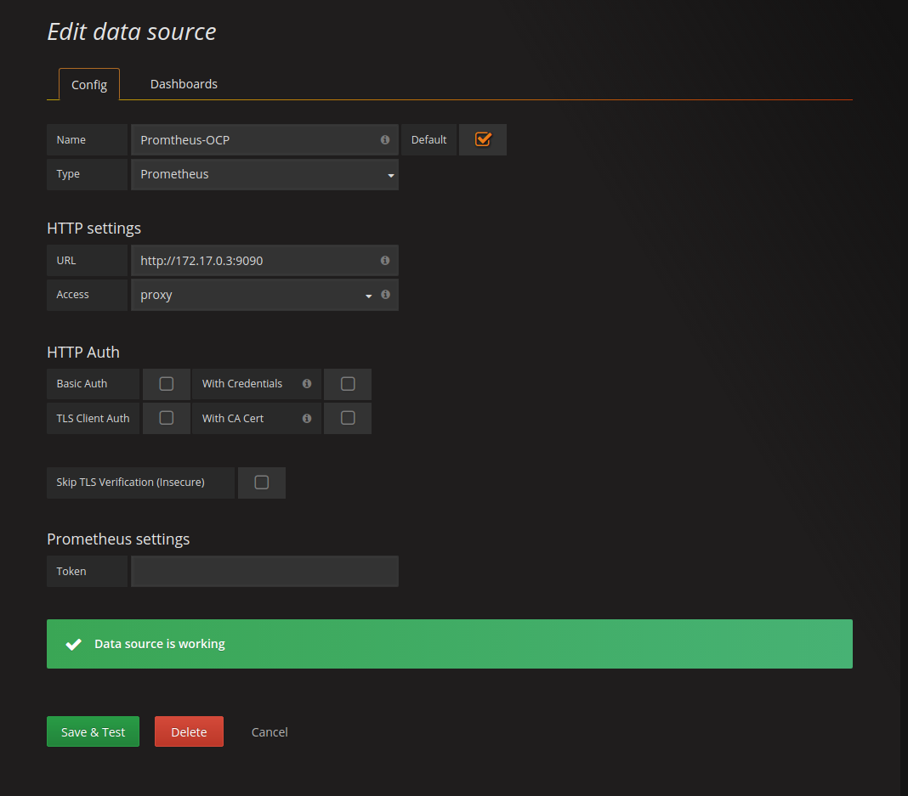
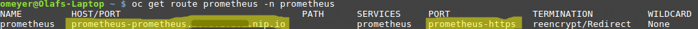
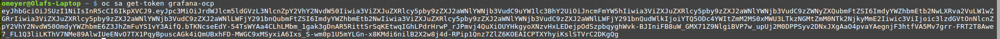
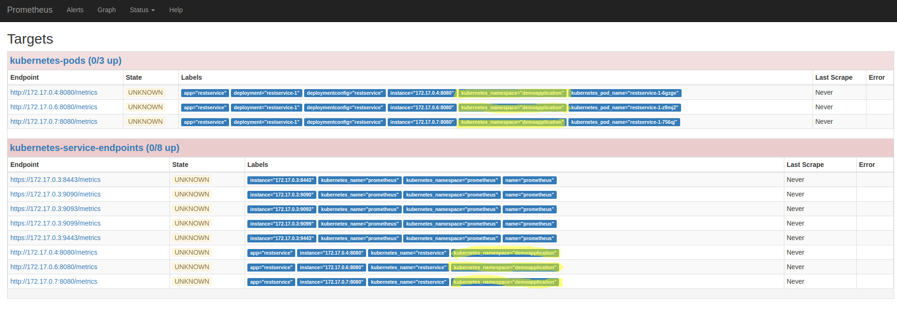
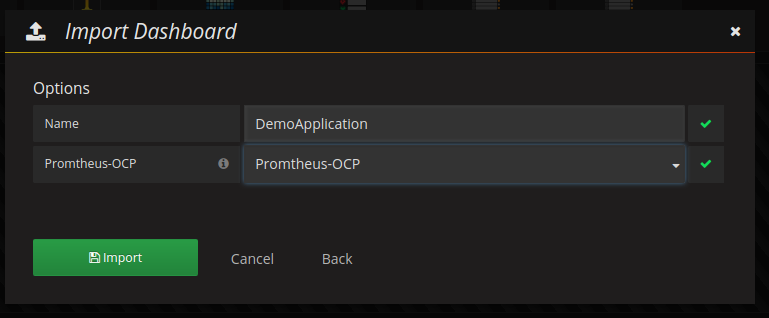

<div style="position: relative; float: right; margin-right: 1em; margin-bottom: 1em;"></div>

There are a lot of articles that show how to monitor an [OpenShift](https://www.openshift.com/) cluster (including the monitoring of Nodes and the underlying hardware) with [Prometheus](https://prometheus.io/) running in the same OpenShift cluster. This article however is based on a different scenario: You are responsible for an application on an [OpenShift](https://www.openshift.org/) cluster and want to monitor just this application, but you don't have any administrative permission on it. The reason for this can be that you are working in a big company where the operation of the OpenShift environment is outsourced or the process to introduce a new monitoring solution takes way too long or the current monitoring solution doesn't match your requirements and so on. 

In this article I'm going to show you how to setup the monitoring of a demo application in 6 easy steps. The example is built in that manner that it will be easy for you to do the same for your application. A side note: If the OpenShift cluster that you are using will be monitored in the future with a different Prometheus setup, you don't need to start from scratch. You might need to tweak the configuration of your scraping a bit and you need to move your dashboard to a different Grafana but that should be it.

<!--more-->

I assume that you have already a good idea what [Prometheus](https://prometheus.io/), [Grafana](https://grafana.com/) and [OpenShift](https://www.openshift.com/) are and that you have access to an OpenShift cluster which allows you to download docker images from the internet. The example has been tested with OpenShift 3.7 and might not work with older OpenShift versions.

## Step 1: Deploy a demo application that should be monitored

The first step will be to deploy a simple demo application. It is a SpringBoot application that provides two RESTful services (_"/hello-world"_ and _"/metrics"_) and already facilitates to be monitored with Prometheus. The demo application provides metrics for the request count of the "hello-world" service as well as Java hotspot metrics. More information how to provide metrics in Java application can be found [**here**](https://github.com/prometheus/client_java). My colleague Dr. Fabian Stäber gave a very good talk, how to provide metrics for a Java application without modifying the source code. An article of the talk can be found [**here**](https://labs.consol.de/monitoring/2017/11/07/prometheus-java.html).

The following code snip it shows how the Prometheus metrics are implemented in the Restful services:


@Component
@Path("/")
public class Metrics {

	private final Logger logger = LogManager.getLogger(Metrics.class);

	private final Counter promRequestsTotal = Counter.build()
					.name("requests_total")
					.help("Total number of requests.")
					.register();

  {
    DefaultExports.initialize();
  }

  @GET()
  @Path("/hello-world")
  @Produces(MediaType.TEXT_PLAIN)
  public String sayHello() {
    promRequestsTotal.inc();
    return "hello, world";
  }

  @GET()
  @Path("/metrics")
  @Produces(MediaType.TEXT_PLAIN)
  public StreamingOutput metrics() {
    logger.info("Starting service for metrics");
    return output -> {
      try (Writer writer = new OutputStreamWriter(output)) {
        TextFormat.write004(writer, CollectorRegistry.defaultRegistry.metricFamilySamples());
      }
    };
  }
}


The highlighted section of the source code marks initialization of the request counter; the java hotspot metrics. The Restful service _"/metrics"_ returns the metrics of the demo application. 

To deploy the demo application we first create a project in OpenShift called _"demoapplication"_ and deploy the demo application in this project. We will do this in the OpenShift command line. To create project demoapplication execute:

```bash
oc new-project demoapplication
```

The deployment of the demo application is done with this command: 
```bash
oc new-app -f https://raw.githubusercontent.com/ConSol/springboot-monitoring-example/master/templates/restservice_template.yaml -n demoapplication
```

If the demo application has been successfully deployed you should be able to open the demo application in a web browser (Hint: you can find the url in the route of the demo application ). You will see two links:


* One link call the _"/hello-world"_ service and displays _"hello, world"_ as the result of the service call

* The other link call the _"/metrics"_ and returns the metrics of the application that will be provided by the application to Prometheus.


If you can see these links and they show similar results if you click on the links then you have successfully deployed the application.

The source code of the used demo application can be found [**here**](https://github.com/ConSol/springboot-monitoring-example) 

## Step 2: Deploy Prometheus in a separate project

We are going to deploy Prometheus with sidecar containers for OAuth (for the browser and "serviceaccounts") and for alerts. The drawback with usage of OAuth at the time being is that service accounts (i.e. from Grafana) can't be authenticated with a token unless the OAuth sidecar service account has the cluster role *"system:auth-delegator"* assigned to it. Unfortunately, the cluster role *"system:auth-delegator"* is by default not assigned to the roles like _admin_ or _view_. Which means that you need to ask the OpenShift Cluster administrators whether they will assign the cluster role to the service account of Prometheus OAuth sidecar. If you are not able to get this role binding then we need to use a workaround. The workaround will bypass the OAuth sidecar for service accounts and will talk directly with Prometheus via the service endpoint. Hence Grafana can query data from Prometheus without authentication. Any other user, group or service account that knows the service endpoint can bypass the authentication as well. For most parts that shouldn't be a problem, because the Grafana service account should only get read access to the project with Prometheus. Otherwise the deployment of Prometheus is straightforward. First we create a project called *"prometheus"* with the following command:
```bash
oc new-project prometheus
```

In the next step you either deploy Prometheus with the role *"system:auth-delegator"* for the service account with the following command:
```bash
oc new-app -f https://raw.githubusercontent.com/ConSol/springboot-monitoring-example/master/templates/prometheus3.7_with_clusterrole.yaml -p NAMESPACE=prometheus
```
or without the role by the command:
```bash
oc new-app -f https://raw.githubusercontent.com/ConSol/springboot-monitoring-example/master/templates/prometheus3.7_without_clusterrole.yaml -p NAMESPACE=prometheus
```

After this you should be able to login to Prometheus with your OpenShift account and see the following screen if you click on **"Status->Targets"**.


So far we only see that Prometheus is scraping pods and services in the project "prometheus". No worries, we are going to change that in step 4.

## Step 3: Deploy Grafana in a separate project

The next step is to install Grafana. For this we first create a new project *"grafana"* with the command:
```bash
oc new-project grafana
```
Now we are going to deploy Grafana with the command:
```bash
oc new-app -f https://raw.githubusercontent.com/ConSol/springboot-monitoring-example/master/templates/grafana.yaml -p NAMESPACE=grafana
```
Next we need to grant the Grafana service account view access to the project *"prometheus"* with the following command, so that Grafana can display data from Prometheus:
```bash
oc policy add-role-to-user view system:serviceaccount:grafana:grafana-ocp -n prometheus
```

After this step you need to open Grafana in a browser. Here we need to create a data source for Prometheus. In order to do that, click on _"Add data source"_. You should see the following screen:


### Setup Prometheus data source without the role *"system:auth-delegator"*
If you installed Prometheus without the role *"system:auth-delegator"* you need to provide a name for the datasource. We are going to use the name "Promtheus-OCP". Set the URL to the endpoint IP address of the Prometheus service. This endpoint IP address can be determined with the following command:
```bash
oc describe service prometheus -n prometheus
```
You need to take the highlighted IP-Address:

If you press **Add** (later called **Save & Test**) the result should look like this:

### Setup Prometheus datasource with the role *"system:auth-delegator"*
If you installed Prometheus with the role *"system:auth-delegator"* you need to provide a name for the datasource. Set the URL to the URL of the prometheus website. You can look it up the with command:
```bash
oc get route prometheus -n prometheus
```


Further more you need to check the check box "Skip TLS Verification (Insecure)" and get the token for the service account grafana-ocp with this command:
```bash
oc sa get-token grafana-ocp
```


If you press save the result should look like this:


## Step 4: Update configuration of Prometheus to scrape the demo application

At the time being the deployed Prometheus will only search for in the project "prometheus". We are going to change that so that the service and the pods of the demo application will be scrapped as well. For this we need to adapt the configuration of Prometheus that is stored in the config map **prometheus** in the file **"prometheus.yaml"** in the project "prometheus". Edit the config map either in the browser or with the command line interface. Add the highlighted lines to the config map:


# A scrape configuration for running Prometheus on a Kubernetes cluster.
# This uses separate scrape configs for cluster components (i.e. API server, node)
# and services to allow each to use different authentication configs.
#
# Kubernetes labels will be added as Prometheus labels on metrics via the
# `labelmap` relabeling action.

# Scrape config for API servers.
#
# Kubernetes exposes API servers as endpoints to the default/kubernetes
# service so this uses `endpoints` role and uses relabelling to only keep
# the endpoints associated with the default/kubernetes service using the
# default named port `https`. This works for single API server deployments as
# well as HA API server deployments.
scrape_configs:

  kubernetes_sd_configs:
  - role: pod
    namespaces:
      names:
      - prometheus
      - demoapplication

  relabel_configs:
  - source_labels: [__meta_kubernetes_pod_annotation_prometheus_io_scrape]
    action: keep
    regex: true
  - source_labels: [__meta_kubernetes_pod_annotation_prometheus_io_path]
    action: replace
    target_label: __metrics_path__
    regex: (.+)
  - source_labels: [__address__, __meta_kubernetes_pod_annotation_prometheus_io_port]
    action: replace
    regex: ([^:]+)(?::\d+)?;(\d+)
    replacement: $1:$2
    target_label: __address__
  - action: labelmap
    regex: __meta_kubernetes_pod_label_(.+)
  - source_labels: [__meta_kubernetes_namespace]
    action: replace
    target_label: kubernetes_namespace
  - source_labels: [__meta_kubernetes_pod_name]
    action: replace
    target_label: kubernetes_pod_name

# Scrape config for service endpoints.
#
# The relabeling allows the actual service scrape endpoint to be configured
# via the following annotations:
#
# * `prometheus.io/scrape`: Only scrape services that have a value of `true`
# * `prometheus.io/scheme`: If the metrics endpoint is secured then you will need
# to set this to `https` & most likely set the `tls_config` of the scrape config.
# * `prometheus.io/path`: If the metrics path is not `/metrics` override this.
# * `prometheus.io/port`: If the metrics are exposed on a different port to the
# service then set this appropriately.
- job_name: 'kubernetes-service-endpoints'

  tls_config:
    ca_file: /var/run/secrets/kubernetes.io/serviceaccount/ca.crt
    insecure_skip_verify: true

  kubernetes_sd_configs:
  - role: endpoints
    namespaces:
      names:
      - prometheus
      - demoapplication

  relabel_configs:
  - source_labels: [__meta_kubernetes_service_annotation_prometheus_io_scrape]
    action: keep
    regex: true
  - source_labels: [__meta_kubernetes_service_annotation_prometheus_io_scheme]
    action: replace
    target_label: __scheme__
    regex: (https?)
  - source_labels: [__meta_kubernetes_service_annotation_prometheus_io_path]
    action: replace
    target_label: __metrics_path__
    regex: (.+)
  - source_labels: [__address__, __meta_kubernetes_service_annotation_prometheus_io_port]
    action: replace
    target_label: __address__
    regex: (.+)(?::\d+);(\d+)
    replacement: $1:$2
  - source_labels: [__meta_kubernetes_service_annotation_prometheus_io_username]
    action: replace
    target_label: __basic_auth_username__
    regex: (.+)
  - source_labels: [__meta_kubernetes_service_annotation_prometheus_io_password]
    action: replace
    target_label: __basic_auth_password__
    regex: (.+)
  - action: labelmap
    regex: __meta_kubernetes_service_label_(.+)
  - source_labels: [__meta_kubernetes_namespace]
    action: replace
    target_label: kubernetes_namespace
  - source_labels: [__meta_kubernetes_service_name]
    action: replace
    target_label: kubernetes_name


A detailed description how applications in OpenShift/Kubernets can be discovered and then scrapped in Prometheus can be found here:
[Kubernetes scrap configuration](https://prometheus.io/docs/prometheus/latest/configuration/configuration/#%3Ckubernetes_sd_config%3E)
The description of the "relabel_configs" can be found here: [relabel_configs](https://prometheus.io/docs/prometheus/latest/configuration/configuration/#%3Crelabel_config%3E)

Now that we have added the project "demoapplication" in **two** places in the config map, we need to grant the prometheus service account access to the project "demoapplication". We do this with the command: 
```bash
oc policy add-role-to-user view system:serviceaccount:prometheus:prometheus -n demoapplication
```

## Step 5: Update the deployment configuration of the demo application to allow Prometheus monitoring
So we updated the Prometheus configuration. Now we need to reload the configuration in Prometheus so that it is able to find the pods and services in the added project. For our test setup we could just kill the Prometheus pod with the command:
```bash
oc delete pod prometheus-0 --grace-period=0 --force
```

For a production environment it is not a good idea just to kill Prometheus in order to reload the configuration, because you interrupt the monitoring. There is an alternative way, for this you need to submit an empty POST to Prometheus URL with the suffix "-/reload". The problem here is that with our OpenShift you can't just submit a POST directly to the Prometheus server, because of the OAuth authentication. Luckily we are able to execute the command within the prometheus pod itself with the following OpenShift CLI command 
```bash
oc exec prometheus-0 -c prometheus -- curl -X POST http://localhost:9090/-/reload
```

After executing this command and some time you should see on the **"Status->Targets"** the pods and the services of the demo application. In case you don't see the services as "Up" you might need to hit refresh a couple of times in the browser.

It should look like this:


### Scrap configuration of pods and services
The scrap configuration used in this article requires annotations in the services and pods so that metrics can be scraped from them (opt-in). This is done with these three lines in scrap configuration for each job:
```yaml
- source_labels: [__meta_kubernetes_service_annotation_prometheus_io_scrape]
    action: keep
    regex: true
```
If you want to scrap all pods respectivly services unless the specifed otherwise in the service or pod (out-out) you need to modify the configuration to this:
```yaml
- source_labels: [__meta_kubernetes_service_annotation_prometheus_io_scrape]
    action: drop
    regex: false
```

For our example we use the opt-in configuration. In case your are wondering, the template of the *"demoapplication"* already contains the setting for scrapping the pods and the service. For the pod's the configuration looks like this:

...
    template:
      metadata:
        annotations:
          openshift.io/generated-by: OpenShiftNewApp
          prometheus.io/path: /metrics
          prometheus.io/port: "8080"
          prometheus.io/scrape: "true"
        labels:
          app: ${APP_NAME}
          deploymentconfig: ${APP_NAME}
      spec:
        containers:
        - image: olafmeyer/${APP_NAME}
          imagePullPolicy: IfNotPresent
          name: ${APP_NAME}
          resources: {}
...


The configurations for the service look like this:

...
- apiVersion: v1
  kind: Service
  metadata:
    annotations:
      prometheus.io/scrape: "true"
      prometheus.io/scheme: http
      prometheus.io/port: "8080"
#      prometheus.io/path: /metrics
    labels:
      app: ${APP_NAME}
    name: ${APP_NAME}
...


With these configurations the pods and services are not only enabled for scrapping, furthermore the port, path and the scheme (http/https) for the metrics can be overwritten. In our case the used port of the demo application is 8080 instead of the default port 80.

## Step 6: Show some example metrics in Grafana

The only part that is missing is to display the collected metrics of the demo application in Grafana. Like in every cooking show on TV, I have already prepared something. In our scenario you just need to import a dashboard to see some metrics. For this, you need first to download this (Grafana dashboard template)[https://raw.githubusercontent.com/ConSol/springboot-monitoring-example/master/templates/grafana_dashboard_template.json] file. In order to use the template, select in the browser with the Grafana the **Grafana-Logo (upper left)->Dashboards->Import**. 


In the next screen upload the **Grafana dashboard template** file. The following screen should look like this:

Here you define the name of the Grafana dashboard and the data source. Please select the data source that you have defined above for Prometheus. After this click the button *"Import"* and you should see something like this:


In order to get some metrics you call the service "hello-world" of the demo application a couple of times either in the browser or by executing the following command:
```bash
for i in {0..1000}; do curl -s  http://restservice-demoapplication.<your server name>/hello-world; done
```
 
Congratulation! You have now installed Prometheus and Grafana on your OpenShift cluster. Furthermore, you have installed a demo application and gathered metrics of it.

## Summary
This article showed you how to deploy Prometheus and Grafana on an OpenShift Cluster without admin permissions. Also it described how to configure Prometheus to collect metrics of an application in a different project. Lastly it showed how to display these metrics in Grafana. This article is only the starting point on the monitoring of applications in OpenShift with Prometheus. The next steps could be to attach persistent volumes to Prometheus and Grafana to store the configuration and other data, extend the monitoring, add alerts, define an archiving of metrics, clustering of Prometheus and so. 


The templates that are used to deploy Prometheus and Grafana are based on templates of these websites:
* [OpenShift Origin Prometheus template](https://github.com/openshift/origin/tree/master/examples/prometheus)
* [Grafana on OpenShift by Eldad Marciano](https://github.com/mrsiano/grafana-ocp)