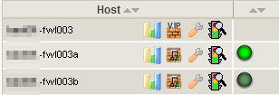
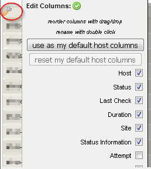

<div style="position: relative; float: right; margin-right: 1em; margin-bottom: 1em;"></div>

In diesem Blogartikel wird gezeigt, wie das Monitoring-Plugin [check_nwc_health](https://labs.consol.de/de/nagios/check_nwc_health/) auf eigene Bedürfnisse angepasst bzw. erweitert werden kann.

Ursprünglich sollte nur die Logik des Modes `ha-role` modifiziert werden, um den Status von Cluster-Nodes nur zu reporten, anstatt zu alarmieren. Heraus kam eine Statusanzeige im Thruk-Frontend auf Basis von Host-Macros...
<!--more-->

## Grundlegendes zur Clusternode-Überwachung bei check_nwc_health

### Der Mode "ha-role"
Zur Überwachung des Cluster-State von Netzwerkdevices (z.b. Firewalls) eignet sich der mode `ha-role` von [check_nwc_health](https://labs.consol.de/de/nagios/check_nwc_health/).
Üblicherweise wird das Plugin wie folgt aufgerufen:

```bash
# Node 1
$ ./check_nwc_health --hostname 172.18.18.8 --community public --mode ha-role --role active
OK - ha started, role is active, status is OK
# Node 2
$ ./check_nwc_health --hostname 172.18.18.9 --community public --mode ha-role  --role standby
OK - ha started, role is standby, status is OK
```

### bekannte SOLL-Zustände als Voraussetzung
Der Parameter `--role` oben gibt den erwarteten SOLL-Zustand an. Dieser muss - und das ist der kleine Haken an der Sache - allerdings vorher bekannt sein, wie das bei dedizierten Active-/Standby-Nodes auch der Fall ist. Aber nicht selten lässt man das HA-Subsystem die Karten mischen und die Rollen verteilen.

In diesem Fall bleibt als Ausweg nur, den Status des gesamten HA-Subsystems im Auge zu überwachen (und diesen Check gegen die VIP des Clusters zu richten) - der jeweils aktive Knoten beantwortet die Frage nach dem Gesundheitszustand des HA-Systems bereitwillig:

```bash
# VIP des Clusters
$ ./check_nwc_health --hostname 172.18.18.10 --community public --mode ha-status -v
OK - ha system has no problems
checking problems
Synchronization has status OK
Filter has status OK
routed has status OK
cphad has status OK
fwd has status OK
```

Na bitte. Ein Schluckauf im Custermanager würde sich also über diesen Check sicher bemerkbar machen.


Auch wenn nun das Firewall-Clustersystem als Ganzes im Monitoring ist, wäre eine Anzeige der Node-Zustände wie im mode `ha-role` als Service im Webfrontend [Thruk](http://thruk.org/) nett, oder?

Doch lässt man den oben erwähnten Parameter für den erwarteten SOLL-Zustand (welchen man ja nicht kennt) weg, wird der aktive Knoten zwar als **OK**, der standby-Knoten aber als **WARNING** angezeigt, weil die per default erwartete Rolle immer "active" ist:

```bash
# Node 1
./check_nwc_health --hostname 172.18.18.8 --community public --mode ha-role
OK - ha started, role is active, status is OK
# Node 2
./check_nwc_health --hostname 172.18.18.9 --community public --mode ha-role
WARNING - ha started, role is standby, status is OK, expected role active
```

Eigentlich *fast* schon der erwartete Output - den wir dank der Erweiterbarkeit von [check_nwc_health](https://labs.consol.de/de/nagios/check_nwc_health/) nun einfach noch etwas modifizieren: **entering `my-modules-dyndir`**...

## Custom module für check_nwc_health

[check_nwc_health](https://labs.consol.de/de/nagios/check_nwc_health/) bietet genauso wie alle Plugins der "check_X_health"-Reihe, die Möglichkeit, zur Laufzeit Perl-Code nachzuladen, der als eigenständiger "mode" aufrufbar ist.

Unser Ziel soll sein, dass wir uns in die Funktionalität von "ha-role" einklinken und die Bewertung des Status´ selbst in die Hand nehmen.

Zunächst erzeugen wir uns in OMD ein Verzeichnis, in dem wir dieses und alle weiteren custom Module für `check_nwc_health` ablegen werden:

```bash
./mkdir ~/etc/check_nwc_health
```

Darin erstellen wir eine `.pm`(Perl-Modul)-Datei namens  `CheckNwcHealthFirewallRole.pm`. Das Namensschema hierfür lautet:

- (beliebiger Name, der die Funktion des Moduls beschreiben sollte)
- `.pm`


package MyFirewall;
our @ISA = qw(Monitoring::GLPlugin::SNMP);

sub init {
  my ($self) = @_;
  if ($self->mode =~ /my::firewall::role/) {
    $self->mode = "device::ha::role";
    $self->analyze_and_check_ha_subsystem("Classes::CheckPoint::Firewall1::Component::HaSubsystem");
    # clear the message stack
    foreach (OK, WARNING, CRITICAL, UNKNOWN) {
        $self->clear_messages($_);
    }
    # node state
    my $state = $self->{components}->{ha_subsystem}->{haState};
    if ( $state =~ /(active|standby|unknown)/ ) {
        $self->add_ok(sprintf "Node status: %s", $state);
    } else {
        $self->add_unknown(sprintf "Weird Node status: %s", $state);
    }
  }
}


Damit `check_nwc_health` weiß, wo custom Module zu finden sind, gibt man den Pfad dorthin beim Aufruf mit dem Parameter `--with-mymodules-dyn-dir` an:

```bash
./check_nwc_health --hostname 172.18.18.8 --community public --with-mymodules-dyn-dir ~/etc/check_nwc_health --mode my-firewall-role
```

Erklärungen:
- Der übergebene Mode `my-firewall-role` wird intern übersetzt in den Mode-Namen `my::firewall::role`
- `if ($self->mode =~ /my::firewall::role/) {` prüft, ob dieser custom Mode ausgeführt werden soll.
- Zunächst einmal soll ja - wie im Original-Mode "ha-role" - der Node-Status ermittelt werden, was wir mit `$self->analyze_and_check_ha_subsystem` von `check_nwc_health` erledigen lassen. Welche Funktionen hier zu verwenden sind, lässt sich entweder durch einen Blick in den Sourcecode ermitteln und/oder indem man das Plugin mit dem Debugger `perl -d` aufruft und ihm bei der Ausführung auf die Finger schaut.
- Das war die Pflicht, jetzt kommt die Kür... wir leeren den Message-Stack, denn er enthält je nach Node u.U. die nicht richtige WARNING-Meldung... Es sind zwar keine anderen Meldungen als WARNING zu erwarten, aber wir gehen auf Nummer sicher und löschen die Meldungen aller vier möglichen Zustände:
```bash
# clear the message stack
foreach (OK, WARNING, CRITICAL, UNKNOWN) {
    $self->clear_messages($_);
}
```
- ...ermitteln den State...
```perl
# node state
my $state = $self->{components}->{ha_subsystem}->{haState};
```
- ...und nehmen die Bewertung selbst in die Hand. Egal ob der Status nun aktiv, standby oder unknown ist, das Plugin wird mit OK enden:   
```perl
if ( $state =~ /(active|standby|unknown)/ ) {
  $self->add_ok(sprintf "Node status: %s", $state);
```

```bash
# Node 1
./check_nwc_health --hostname 172.18.18.8 --community public --with-mymodules-dyn-dir ~/etc/check_nwc_health --mode my-firewall-role
OK - Node status: active
# Node 2
./check_nwc_health --hostname 172.18.18.9 --community public --with-mymodules-dyn-dir ~/etc/check_nwc_health --mode my-firewall-role
OK - Node status: standby
```

## Da geht noch mehr: Host-Icons per Custom Variable setzen
Ist man schon mal so weit, dass man die Funktionalität von `check_nwc_health` beeinflussen kann, juckt es in den Fingern.

[Custom Macros von Hosts zur Laufzeit zu beeinflussen](http://www.naemon.org/documentation/developer/externalcommands/change_custom_host_var.html), ist ein eher selten verwendetes Feature von Nagios/Naemon, kommt an dieser Stelle aber wie gerufen. Denn: die Host-/Service-Spaltenansicht in Thruk ist anpassbar und u.a. [um die Anzeige von Custom Macros erweiterbar](https://www.thruk.org/documentation/dynamic-views.html#_adding-custom-variables). Der Plan: `check_nwc_health` soll die Host-Variable von Firewall-Clusternodes in Abhängigkeit von deren Node-Status ändern. Weil der *Status* des Nodes aber schon im Plugin-Output enthalten ist (s.o.), wird die Variable jeweils mit einem Link auf ein *Status-Icon* versehen, sodass die Varibalen-Spalte keinen Text, sondern das Icon anzeigt:



### Default-Wert der Hostvariable setzen

In der Nagios/Naemon-Config wird das Host-Template für Firewall-Nodes zunächst um die Variable `_NODESTATUS` erweitert, damit es einen Default-Wert hat:

```bash
define host {
  name                           tpl_host_netzwerk_checkpoint_fwclusternode
  use                            tpl_host_netzwerk
  hostgroups                     +hg_netzwerk_checkpoint_fwclusternode
  icon_image                     fwclusternode.png
  register                       0
  _NODESTATUS                    unknown
  _SNMP_COMMUNITY                public
  _TYP                           Checkpoint Firewall Clusternode
}
```

### Icons platzieren

Die drei Icons für die Node-Zustände werden in `$OMD_ROOT/local/share/nagios/htdocs/images/logos/` abgelegt.

`bt_active.png`: 
`bt_standby.png`: 
`bt_unknown.png`: 

### Erweiterung des Modes "my-firewall-role"

Wir erweitern das Modul-File `CheckNwcHealthFirewallRole.pm` wie folgt:


package MyFirewall;
our @ISA = qw(Monitoring::GLPlugin::SNMP);

sub init {
  my ($self) = @_;
  if ($self->mode =~ /my::firewall::role/) {
    $self->mode = "device::ha::role";
    $self->analyze_and_check_ha_subsystem("Classes::CheckPoint::Firewall1::Component::HaSubsystem");
    # clear the message stack
    foreach (OK, WARNING, CRITICAL, UNKNOWN) {
        $self->clear_messages($_);
    }
    # node state
    my $state = $self->{components}->{ha_subsystem}->{haState};
    if ( $state =~ /(active|standby|unknown)/ ) {
        my %statemap = (
            'active'    => 'ok',
            'standby'   => 'ok',
            'unknown'   => 'unknown'
        );
        $self->add_message($statemap{$state}, sprintf "Node status: %s", $state);
        my $cmd = sprintf "%s;%s;NODESTATUS;\\n%s",
            q(printf "COMMAND [$(date +%s)] CHANGE_CUSTOM_HOST_VAR),
            $self->opts->name,
            $ENV{'OMD_SITE'},
            $state,
            '"';
        `$cmd | lq`;
        return;
    } else {
        $self->add_unknown(sprintf "Node status: %s", $state);
        my $cmd = sprintf "%s;%s;NODESTATUS; \\n%s",
            q(printf "COMMAND [$(date +%s)] CHANGE_CUSTOM_HOST_VAR),
            $self->opts->name,
            '"';
        `$cmd | lq`;
        return;
    }
  }
}


Erklärungen:
- Die `statemap` münzt jeden Node-Status auf einen Nagios-Status, den das Plugin ausgeben soll:
```perl
my %statemap = (
    'active'    => 'ok',
    'standby'   => 'ok',
    'unknown'   => 'unknown'
);
```

(Bis jetzt macht der Check noch nichts anders als bisher.)

- Das sprintf-Statement baut einen Kommandozeilenaufruf zusammen, der über das Livestatus-Tool `lq` das Kommando [`CHANGE_CUSTOM_HOST_VAR`](http://www.naemon.org/documentation/developer/externalcommands/change_custom_host_var.html) absetzt. Je nach Status wird dabei das entsprechende Status-Icon referenziert:
```bash
COMMAND [1516896106] CHANGE_CUSTOM_HOST_VAR;fwl003a;NODESTATUS;
```

Übrlicherweise wird Monitoring-Plugins nicht der *Name* des Host-Objektes übergeben, sondern das Makro `$HOSTADDRESS$`, um nicht von der Namensauflösung abzuhängen. Da wir zum Setzen der Host-Variable aber den *Namen* des Hosts brauchen, übergeben wir diesen mit dem Parameter `--name`:

```bash
# Node 1
./check_nwc_health --hostname 172.18.18.8 --community public --with-mymodules-dyn-dir ~/etc/check_nwc_health --mode my-firewall-role --name fwl003a
OK - Node status: active
# Node 2
./check_nwc_health --hostname 172.18.18.9 --community public --with-mymodules-dyn-dir ~/etc/check_nwc_health --mode my-firewall-role --name fwl003b
OK - Node status: standby
```

Die Spalte zur Anzeige der Hostvariable `NODESTATUS` in Thruk lässt sich in der Host-Ansicht über das Schraubenschlüssel-Symbol  einblenden:



Natürlich macht die Einblendung des `NODESTATUS` nicht bei allen Hosts Sinn. `$KUNDE` hat sich hierfür in Thruk eine gefilterte Ansicht gebaut und als Bookmark `Checkpoint Firewall Nodes` abgespeichert.

## Zusammenfassung
Es wurde gezeigt, wie `check_nwc_health` um eigene Funktionalität erweitert werden kann. So lassen sich - wie in diesem Beispiel - bestehende Modes anpassen, aber auch völlig neue Modes entwickeln. Pull-Requests im Github-Repository von `check_nwc_health` sind natürlich gern gesehen (genauso wie Beauftragungen für Weiterentwicklungen...).
Die Änderung von Host- und Servicemacros zur Laufzeit bietet interessante Möglichkeiten. Die dynamische Anzeige von Icons gehört da noch zu den einfacheren Anwendungsfällen. Interessant wird es, wenn andere Checks auf diese Variablen wieder zugreifen. Warum z.B. nicht auch Schwellwerte für Plattenplatz automatisch (z.B per Ansible) ermitteln, als Macro zum Host speichern und von den Disk-Checks verwenden lassen...?  

## Zusatz: Debugging

Ich breche hier mal wieder eine Lanze für den Perl-Commandline-Debugger, mit dem ich gern Perl-Code wie den obigen debugge. M.E. wird der (genauso wie `-m pdb` für Python) viel zu wenig verwendet. Nachfolgend meine Vorgehensweise in aller Kürze (der hier gezeigte Code weicht gering ab):

- Herausfinden, an welcher Stelle in `check_nwc_health` Custom-Module nachgeladen werden. In der von mir benutzten Version ist das Zeile 1624:

```perl
...
1616     foreach my $libpath (split(":", $self->opts->get("with-mymodules-dyn-dir"))) {
1617       foreach my $extmod (glob $libpath."/".$plugin_name."*.pm") {
1618         my $stderrvar;
1619         *SAVEERR = *STDERR;
1620         open OUT ,'>',\$stderrvar;
1621         *STDERR = *OUT;
1622         eval {
1623           $self->debug(sprintf "loading module %s", $extmod);
1624           require $extmod;   <<<<<<<<<<<<<<<<<<<<
```
- Start des Plugins mit `perl -d` und einem hohen Timeout, der einen nicht nach 60 Sekunden wieder rauskegelt:
```perl
perl -d check_nwc_health --hostname 172.18.18.9 --community public --mode my-firewall-role --with-mymodules-dyn-dir ~/etc/check_nwc_health --name fwl003a -t 1200000
```
- Setzen des Breakpoints auf Zeile 1624 (wo unser Modul `require`d wird) mit `b 1624` + Enter (Anzeige von allen gesetzten Breakpoints: `L b`):
```perl
Loading DB routines from perl5db.pl version 1.39_10
Editor support available.

Enter h or 'h h' for help, or 'man perldebug' for more help.

Monitoring::GLPlugin::Commandline::Getopt::(/omd/sites/central/local/lib/nagios/plugins/check_nwc_health:112):
112:    my %DEFAULT = (
113:      timeout => 15,
114:      verbose => 0,
115:      license =>
116:    "This monitoring plugin is free software, and comes with ABSOLUTELY NO WARRANTY.
117:    It may be used, redistributed and/or modified under the terms of the GNU
118:    General Public Licence (see http://www.fsf.org/licensing/licenses/gpl.txt).",
119:    );
  DB<1> b 1624
```
- Script laufen lassen mit `r` (=return from subroutine = laufe bis zur letzten Anweisung der aktuellen Subroutine); es stoppt beim nächsten Breakpoint (zeilenweises Ausführen: `n`)
```perl
DB<3> r
Monitoring::GLPlugin::load_my_extension(/omd/sites/central/local/lib/nagios/plugins/check_nwc_health:1624):
1624:             require $extmod;
```
- In die erste Zeile des Custom Moduls hineinspringen (`s`= step into sub):
```perl
DB<3> s
Monitoring::GLPlugin::load_my_extension(/omd/sites/central/local/lib/nagios/plugins/etc//CheckNwcHealthFirewallRole.pm:4):
4:      our @ISA = qw(Monitoring::GLPlugin::SNMP);
```
- Zeile 32-39 anzeigen lassen:
```perl
DB<3> l 32-39
32:             my $cmd1 = sprintf "%s;%s;NODESTATUS;\\n%s",
33                  q(printf "COMMAND [$(date +%s)] CHANGE_CUSTOM_HOST_VAR),
34                  $self->opts->name,
35                  $fqdn,
36                  $ENV{'OMD_SITE'},
37                  $state,
38                  '"';
39:             `$cmd1 | lq`;
```
- Ausführung in Zeile 39 anhalten:
```perl
DB<3> b 39
```
- Mit `r` (mehrfach) laufen lassen, bis die Ausführung am Breakpoint in Zeile 39 des Moduls stoppt:
```perl
DB<4> r
MyFirewall::init(/omd/sites/central/local/lib/nagios/plugins/etc//CheckNwcHealthFirewallRole.pm:39):
39:             `$cmd1 | lq`;
```
- Was steckt in Variable `$cmd1`? (`p` = print)
```perl
DB<4> p $cmd1
printf "COMMAND [$(date +%s)] CHANGE_CUSTOM_HOST_VAR;fwl003a;NODESTATUS;\n"
```
- Wie sieht das Objekt `$self` aus? (Skalare mit `p`, Datenstrukturen immer mit `x` dumpen, sonst kriegt man nur den Objektzeiger, z.b. `=HASH(0x4eba820)`):
```perl
DB<5> x $self
0  MyFirewall=HASH(0x4eba820)
 'blacklisted' => 0
 'components' => HASH(0x5876ed0)
    'ha_subsystem' => Classes::CheckPoint::Firewall1::Component::HaSubsystem=HASH(0x1cafaf8)
       'blacklisted' => 0
       'extendedinfo' => undef
       'haStarted' => 'yes'
       'haStatLong' => 'Refer to the Notification and Interfaces tables for information about the problem'
       'haStatShort' => 'OK'
       'haState' => 'active'
       'info' => 'ha started, role is active, status is OK'
 'productname' => 'Linux fwl003a 2.6.18-92cp #1 SMP Wed Apr 8 17:12:19 IDT 2015 i686'
 'sysobjectid' => '1.3.6.1.4.1.2620.1.6.123.1.34'
 'uptime' => 49695476
```
- Wie ist der Wert von `haState` in `$self`?
```perl
DB<8> x $self->{'components'}{'ha_subsystem'}{'haState'}
0  'active'
```
- `haState` zum Test ändern:
```perl
DB<8> x $self->{'components'}{'ha_subsystem'}{'haState'}
0  'active'
DB<9> $self->{'components'}{'ha_subsystem'}{'haState'} = 'HARRHARR!!!'
DB<10> x $self->{'components'}{'ha_subsystem'}{'haState'}
0  'HARRHARR!!!'
```

Hat man sich die Kommandos des Perl-Debuggers einmal verinnerlicht, kann man sich incode-Debug-Statements mit `print` und `Data::Dumper` sparen (die mühsam wieder rausgekratzt werden müssen - und einen vergisst man *immer*). Ich habe mir angewohnt, zum Scripten eine *screen*-Session mit zwei Fenstern zu öffnen: im ersten ist das Script zum Editieren in `vim` geöffnet, im zweiten wird debugged. Mit `F5` und `F6` springe ich schnell zwischen den Fenstern hin und her. Die dazu passende `~.screenrc`:

```bash
hardstatus alwayslastline
hardstatus string '%{gk}[ %{G}%H %{g}][%= %{wk}%?%-Lw%?%{=b kR}(%{W}%n*%f %t%?(%u)%?%{=b kR})%{= kw}%?%+Lw%?%?%= %{g}][%{Y}%l%{g}]%{=b C}[ %m/%d %c ]%{W}'
bindkey -k k5 prev # F5 for previous window
bindkey -k k6 next # F6 for next window
```