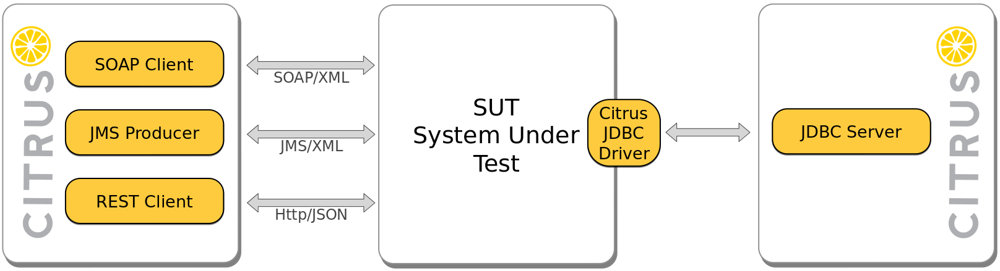

<div style="position: relative; float: right; margin-right: 1em; margin-bottom: 1em;"></div>

Database communication is an essential part of many applications, when persistent data storage is required. May it be orders, customer data, product recommendations or product information, if persistent storage is in place, the data contains a certain business value. Therefore it's important that your software handles your persistent storage the right way.

In this blog post you'll learn how to test your database communication using Citrus. 

<!--more-->

## Why would you test your database with Citrus?
Testing database communication at all is not an easy task. There are a lot of things to consider if you want to use a test database and work with it in an effective, automated way.

* You have to deploy a test database.
* You have costs for additional hardware, licence fees, etc. 
* You have to setup your test schemas.
* You have to ensure that the test schema matches the prod schema and vise versa.
* You have to add comples sample data to your schema to test complex use cases.
* Testing your software offline is impossible.
* Testing your software in case of a database failure is nearly impossible.
* etc.

You'll find way more challenges to cope depending on your individual infrastructure.

We thought that all this has to come to an end, so we developed Citrus JDBC!

## Requirements
To follow this tutorial, your system should fulfill the following requirements:

* git
* maven
* Java 8
* An IDE of your choice

## Introduction
With the upcoming Release of the **citrus framework 2.7.4**, you'll be able to verify the database communication of your application without setting up a test database server or even schemas!

The Citrus JDBC integration consists of two essential parts, the *Citrus-JDBC-Server* and the *Citrus-JDBC-Driver*.


To be able to use the Citrus JDBC integration, you just have to do two things:
1) Exchange the productive JDBC Driver of your application with the Citrus-JDBC-Driver in the test environment.
2) Add the Citrus-JDBC-Server to your test project by adding the `citrus-jdbc` dependency.  

The driver will be available on maven central under `com.consol.citrus.citrus-db-driver` while you can find the dependency in the following snippet.
```xml
<dependency>
  <groupId>com.consol.citrus</groupId>
  <artifactId>citrus-jdbc</artifactId>
  <version>${citrus.version}</version>
  <scope>test</scope>
</dependency>
```

Currently Citrus JDBC supports the following features.

* Validation of:
    * Connections
    * Statements
    * Prepared Statements
    * Callable Statements
    * Transactions
* Simulating database failure
* Simulating timeouts
* Mocking result sets on requests

For detailed information, please have a look at the [citrus user guide](http://citrusframework.org/docs/user-guide/).

*Please note, that it's also possible to obtain [snapshot releases of the documentation](http://christophd.github.io/citrus/) as well as nightly builds of Citrus and it's components from the following repository:*

```xml
<repository>
    <id>consol-labs-snapshots</id>
    <url>http://labs.consol.de/maven/snapshots-repository/</url>
    <snapshots>
      <enabled>true</enabled>
    </snapshots>
    <releases>
      <enabled>false</enabled>
    </releases>
</repository>
```


## Example
*Because this post is about a snapshot version of Citrus, some examples and outputs may look slightly differently, when the version is finally released.*
As for many other use cases, the [citrus-examples](https://github.com/christophd/citrus-samples) project contains examples concerning the jdbc implementation. So in the first step, please clone the citrus-examples project.

```bash
git clone https://github.com/christophd/citrus-samples.git
```

*If you are new to the [citrus-examples](https://github.com/christophd/citrus-samples) project, please have a look at the [Running the examples](http://www.citrusframework.org/samples/run/) guide.* 

Assumed that you performed the examples setup, let's execute the samples!
```bash
mvn clean verify -f citrus-samples/sample-jdbc/pom.xml -Dembedded

[...]

CITRUS TEST RESULTS

ExecuteQueryIT.testCreateTable ................................. SUCCESS
ExecuteQueryIT.testDelete ...................................... SUCCESS
ExecuteQueryIT.testDropTable ................................... SUCCESS
ExecuteQueryIT.testSelect ...................................... SUCCESS
TodoListIT.selectTodoEntry ..................................... SUCCESS
TodoListIT.testAddTodoEntry .................................... SUCCESS
TodoListIT.testException ....................................... SUCCESS
TodoListIT.testIndexPage ....................................... SUCCESS

TOTAL: 8
SKIPPED:       0 (0.0%)
FAILED:        0 (0.0%)
SUCCESS:       8 (100.0%)

------------------------------------------------------------------------
```

Now that you've executed your first database integration tests, lets have a look on how they're written.
*If you're completely new to Citrus, it might be helpful to start with the setup guides on [citrusframework.org](http://citrusframework.org/) to understand the basic concepts before you proceed.*

This test performs a `GET` request to our SUT API, asking for the list of todo entries. Afterwards, when the `SELECT` statement hits the database, a result set is generated and sent to the SUT as query result. Finally the receive step of the http client verifies, that the SUT produces the correct data representation - here in XHTML. 

public class TodoListIT extends TestNGCitrusTestDesigner {

    @Autowired
    private JdbcServer jdbcServer;

    @Autowired
    private HttpClient todoClient;
    
    @Test
    @CitrusTest
    public void selectTodoEntry(){
        variable("todoName", "citrus:concat('todo_', citrus:randomNumber(4))");
        variable("todoDescription", "Description: ${todoName}");

        http()
            .client(todoClient)
            .send()
            .get("/todolist")
            .fork(true)
            .accept("text/html");

        receive(jdbcServer)
            .message(JdbcMessage.execute("SELECT id, title, description FROM todo_entries"));

        send(jdbcServer)
            .messageType(MessageType.JSON)
            .message(JdbcMessage.success().dataSet("[ {" +
                    "\"id\": \"" + UUID.randomUUID().toString() + "\"," +
                    "\"title\": \"${todoName}\"," +
                    "\"description\": \"${todoDescription}\"," +
                    "\"done\": \"false\"" +
                    "} ]"));

        http()
            .client(todoClient)
            .receive()
            .response(HttpStatus.OK)
            .messageType(MessageType.XHTML)
            .xpath("(//xh:li[@class='list-group-item']/xh:span)[last()]", "${todoName}");
    }
}

As you can see in the highlighted sections, you're able to configure the database behavior, including the returned result sets, using the `receive` and `send` actions of the JDBC-Server endpoint. This empowers you to test your system without additional test-database deployments, test-schemas or other operative overhead. 

You may ask yourself, where the `todoClient` and the `jdbcServer` are coming from. These components are specified in a spring configuration class.
```java
@Configuration
public class EndpointConfig {

    @Bean
    public HttpClient todoClient() {
        return CitrusEndpoints.http()
                .client()
                .requestUrl("http://localhost:8080")
                .build();
    }
    
    @Bean
    public JdbcServer jdbcServer() {
        return CitrusEndpoints.jdbc()
                .server()
                .host("localhost")
                .databaseName("testdb")
                .port(3306)
                .timeout(10000L)
                .autoStart(true)
                .build();
    }
}
``` 

## Citrus-JDBC Features
Now that you know how these kind of tests are setup, lets talk about the feature set you receive by adding the `citrus-jdbc` dependency to your project. Due to the fact that all tests are setup similarly, I'll leave the redundant part out of the examples and focus on the feature related parts.
*All features are also available in the Citrus XML DSL. You can find the related examples in the [Citrus XML DSL examples](https://github.com/christophd/citrus-samples-xml) project.*

### Simulating database failures
One of the core concepts of Citrus JDBC is the distinction between a `success` and an `error` concerning database operations. This concept makes it incredibly easy to simulate a database failure after a certain message has been received by the `jdbcServer`.


receive(jdbcServer)
        .message(JdbcMessage.execute("@startsWith(" +
                "'INSERT INTO todo_entries (id, title, description, done) " +
                "VALUES (?, ?, ?, ?)')@"));

send(jdbcServer)
        .message(JdbcMessage.error().exception("Something went wrong"));


After the message has been sent from the Citrus-JDBC-Server to the Citrus-JDBC-Driver, the SUT receives the database failure as an `SQLException` and is then in charge to handle it. Afterwards you're able to validate the behavior of your SUT by using other Citrus components such as a Citrus HTTP Client.  

### Prepared/Callable Statements
Even if prepared statements and callable statements are for different database operations and use cases, they share a similar workflow from the API perspective.

```java
connection.prepareStatement("INSERT INTO todo_entries (id, title, description, done) VALUES (?, ?, ?, ?)");
connection.prepareCall("{CALL limitedToDoList(?)}");
```
Both kinds of statements are created from a JDBC connection with a SQL command expression as `String` parameter. Because of that, we're able to verify them in the same way as regular statements. The only difference between prepared and callable statements compared to regular statements is, that the parameters for the concrete call are attached to the query string for validation purposes.


http()
        .client(todoClient)
        .send()
        .get("api/todolist/1")
        .fork(true);

receive(jdbcServer)
        .message(JdbcMessage.execute("{CALL limitedToDoList(?)} - (1)"));

send(jdbcServer)
        .messageType(MessageType.JSON)
        .message(JdbcMessage.success().dataSet("[ {" +
                "\"id\": \"${todoId}\"," +
                "\"title\": \"${todoName}\"," +
                "\"description\": \"${todoDescription}\"," +
                "\"done\": \"false\"" +
                "} ]"));

As you can see, the API call path parameter `api/todolist/1` is reflected within the statement execution validation `"{CALL limitedToDoList(?)} - (1)"`. Multiple parameters would look as following `"{CALL limitedToDoList(?, ?, ?)} - (1,2,3)"`. Of course you're also able to work with the regular Citrus matcher as always. 

### Transaction handling
When it comes to complex modifications of your database, transactions are commonly used. Citrus is able to verify the behavior of your system under test concerning start, commit and rollback actions of transactions. The verification of transactions has to be enabled in the server Citrus-JDBC-Server configuration.

@Configuration
public class EndpointConfig {
    @Bean
    public JdbcServer jdbcServer() {
        return CitrusEndpoints.jdbc()
                .server()
                .host("localhost")
                .databaseName("testdb")
                .port(3306)
                .timeout(10000L)
                .autoStart(true)
                .autoTransactionHandling(false)
                .build();
    }
}


With a `JdbcServer` endpoint configured that way, you are able to state and verify the transactional behavior of your SUT within your test cases. 


receive(jdbcServer)
        .message(JdbcMessage.startTransaction());

receive(jdbcServer)
        .message(JdbcMessage.execute("@startsWith('INSERT INTO todo_entries (id, title, description, done) VALUES (?, ?, ?, ?)')@"));

send(jdbcServer)
        .message(JdbcMessage.success().rowsUpdated(1));

receive(jdbcServer)
        .message(JdbcMessage.commitTransaction());


Because of the ease of creating database failures, you could also cause failed transactions and check whether your SUT performs a proper rollback.


receive(jdbcServer)
        .message(JdbcMessage.startTransaction());

receive(jdbcServer)
        .message(JdbcMessage.execute("@startsWith('INSERT INTO todo_entries (id, title, description, done) VALUES (?, ?, ?, ?)')@"));

send(jdbcServer)
        .message(JdbcMessage.error().exception("Could not execute something"));

receive(jdbcServer)
        .message(JdbcMessage.rollbackTransaction());


Even the absolute worst case, a rollback failure, could be simulated with nothing more than another send statement.


receive(jdbcServer)
        .message(JdbcMessage.startTransaction());

receive(jdbcServer)
        .message(JdbcMessage.execute("@startsWith('INSERT INTO todo_entries (id, title, description, done) VALUES (?, ?, ?, ?)')@"));

send(jdbcServer)
        .message(JdbcMessage.error().exception("Could not execute something"));

receive(jdbcServer)
        .message(JdbcMessage.rollbackTransaction());
        
send(jdbcServer)
        .message(JdbcMessage.error().exception("Could not perform database rollback"));


### Timeout simulation
Simulating timeouts with a real database can be tricky if not impossible to achieve. With Citrus, you just configure your server to validate connection statements but leave them out of the test.

Here is a server configuration enforcing connection validation.

@Bean
public JdbcServer jdbcServer() {
    return CitrusEndpoints.jdbc()
            .server()
            .host("localhost")
            .databaseName("testdb")
            .port(3306)
            .timeout(1000L)
            .autoStart(true)
            .autoConnect(false)
            .build();
}


The following test does not accept the connection attempt from the driver because the receive instruction for the server is missing. Therefore the connection will timeout, because no answer will be sent to the SUT. Nevertheless the Citrus HTTP client expects that the SUT responds as expected. 
```java
http()
    .client(todoClient)
    .send()
    .post("/todolist")
    .fork(true)
    .contentType("application/x-www-form-urlencoded")
    .payload("title=${todoName}&description=${todoDescription}");

http()
    .client(todoClient)
    .receive()
    .response(HttpStatus.I_AM_A_TEAPOT);
```


### Advanced validations
There are some advanced validation options to verify the very basic behavior of your SUT concerning database operations like:

* Opening and closing connection
* Creating and closing statements
* Performing transactions (seen in the previous section)

Because most modern application use some kind of framework for their database operations, one as a developer is not responsible for managing these basic JDBC driver interactions, but in case you want to be sure, you're absolutely able to! As for transactions, connection and statement validation has to be activated via configuration of the `JdbcServer` endpoint.


@Configuration
public class EndpointConfig {
    @Bean
    public JdbcServer jdbcServer() {
        return CitrusEndpoints.jdbc()
                .server()
                .host("localhost")
                .databaseName("testdb")
                .port(3306)
                .timeout(10000L)
                .autoStart(true)
                .autoConnect(false)
                .autoCreateStatement(false)
                .build();
    }
}


Now the `JdbcServer` instance will validate the connection related operations including statement creation. 

receive(jdbcServer)
        .message(JdbcMessage.openConnection());

receive(jdbcServer)
        .message(JdbcMessage.createCallableStatement("{CALL limitedToDoList(?)}"));

receive(jdbcServer)
        .message(JdbcMessage.execute("{CALL limitedToDoList(?)} - (1)"));

send(jdbcServer)
        .messageType(MessageType.JSON)
        .message(JdbcMessage.success().dataSet("[]"));

receive(jdbcServer)
        .message(JdbcMessage.closeStatement());

receive(jdbcServer)
        .message(JdbcMessage.closeConnection());


## Summary
In this blog post you have executed your first citrus database tests, learned how these tests are setup, how to verify your database communication using the features of `citrus-jdbc` including low level JDBC driver related operations. This empowers you to get rid of most of your test database deployments by using Citrus. If you are interested in further readings, I highly recommend you to visit the following links. 

* [Citrus](http://citrusframework.org/)
* [Citrus documentation snapshots](http://christophd.github.io/citrus/)
* [Citrus on GitHub](https://github.com/christophd/citrus)
* [Citrus Java DSL examples](https://github.com/christophd/citrus-samples)
* [Citrus XML DSL examples](https://github.com/christophd/citrus-samples-xml)
* [Running Citrus examples](http://www.citrusframework.org/samples/run/)

If you have any questions, feel free to email me at [sven(dot)hettwer(at)consol(dot)de](mailto:sven.hettwer@consol.de) or contact me on [twitter](https://twitter.com/SvenHettwer)