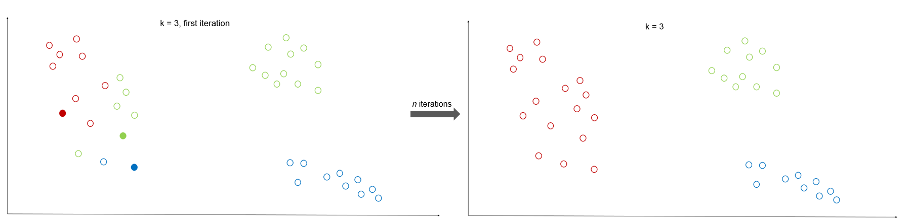
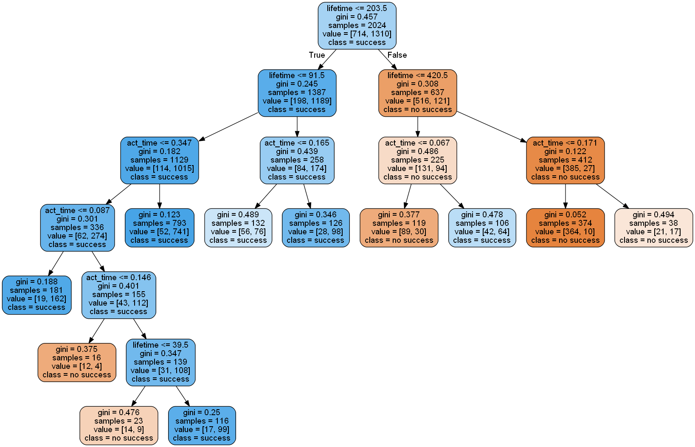

<span style="float: right; padding: 1em;" width="40%"></span> 

ConSol CM brings BPM to a CRM system. In-house ConSol CM is used to process cases of a wide range of types. Amongst others it also maps the sales process. For that purpose a new sales case is created automatically or manually every time a sales opportunity or lead comes up. To these cases, information can be added concerning the communication with the customer, the origin of the opportunities and others.


Within a research and development project the scope was to predict the success for open sales cases, using machine learning algorithms. This way, sales employees would know already in an early stage if the opportunity most probably will be successful or how to adapt their strategy during the sales process to increase the chances for success.

<!--more-->

At the end of the sales process, the employee closes the case either marked as "successful" or "unsuccessful". In a successful, case a new case for the internal division which will work on the project will be created. All that data is stored inside a Data Warehouse and can be used for reports and further analysis. To train and test the machine learning algorithms the closed sales cases were used.

To find out whether a sales case will be closed as successful or not, the features of the cases need to be analysed. Therefore, the following features were exported for every sales case:
-	Lifetime: The time between the creation date of the case and the date when it was closed or the current date, if the case is still open

-	Activity: This simply counts the amount of communication with the customer of any kind, like phone calls, mails and meetings.

-	Activity per time: While activity counts the communication over the whole lifetime of a case, the activity per time indicates how many communications there have been within a week.

-	Customer status: Whether the potential customer is a new customer or an existing one.

-	Division: The division inside the company, which would work on the project.

-	Origin: Gives information where the opportunity is coming from, for example an already known customer, an event or a request for proposals.

-	Sales volume 

-	sales volume for licenses 

-	proportional marketing costs

All these features were exported from the Data Warehouse as csv and then processed with Python. Therefore, a Jupyter Notebook was used. These notebooks are very flexible since they can run on your local machine or they can even connect to a Hadoop cluster, using PySpark, where they can be used by several users via the WebUI.


## K - Means

A first step is to search for clusters within the given data, in this example the already closed sales cases. Using K-Means, it is possible to find out if a certain combination of features more likely leads to a successful closing of the sales case. 

For that approach, the K – Means algorithm is a good option. It is an unsupervised machine learning algorithm that needs no labels. It finds k clusters within the data, where k is a number of your choice. The algorithm starts with k randomly picked data points and chooses them as the centers for the k clusters. Then, all other data points are assigned to the cluster where the center is nearest to them. In the next step for the now existing clusters the centers are newly calculated. Then again, every data point is assigned to the cluster with the nearest center. This procedure goes on until the centers don't really change their positions anymore.



The K - Means algorithm is already included in the python package "sklearn". Further information can be found at the [scikit-learn documentation.](http://scikit-learn.org/stable/modules/generated/sklearn.cluster.KMeans.html) 
But it is also no big deal to implement that algorithm yourself. If your data is stored in a Hadoop cluster, you can connect the Jupyter Notebook to Spark and use the following PySpark code to run the algorithm on the cluster:

```python
import numpy as np

def closestPoint(p, centers):
    bestIndex = 0
    closest = float("+inf")
    for i in range(len(centers)):
        Dist = np.sum((p - centers[i]) ** 2)
        if Dist < closest:
            closest = Dist
            bestIndex = i
    return bestIndex

data = ...
K = 3
convergeDist = 0.1

kPoints = data.takeSample(False, K, 1)
Dist = 1.0

while Dist > convergeDist:
    closest = data.map(lambda p: (closestPoint(p, kPoints), (p, 1)))
    pointStats = closest.reduceByKey(lambda p1, p2: (p1[0] + p2[0], p1[1] + p2[1]))
    newPoints = pointStats.map(lambda st: (st[0], st[1][0] / st[1][1])).collect()
    Dist = sum(np.sum((kPoints[i] - p) ** 2) for (i, p) in newPoints)
    for (i, p) in newPoints:
        kPoints[i] = p
```

This snippet calculates the final coordinates for the centers for each cluster. In the end each data point has to be assigned to its closest center which can easily be done with the function "closestPoint".

## Decision Tree

So far, no prediction for the open sales cases has been generated. For that purpose, a supervised machine learning algorithm is used. A more simple one is the decision tree algorithm. The decision tree algorithm splits the data into groups at every branch until the final decision is made. The paths from root to leaf represent classification rules. This tree-like structure can be plotted as seen in the example picture below.



Supervised algorithms generate knowledge based on training data, here the already closed sales cases were used for that purpose. After the training phase the model needs to be tested. Therefore 20 percent of the closed sales cases were used, while the other 80 percent were training data. A good choice is to split the data with a random component.

```python
df['is_train'] = np.random.uniform(0, 1, len(df)) <= .8
train, test = df[df['is_train']==True], df[df['is_train']==False]
```


## Random Forest

For the decision tree it is possible to visualize the decisions as seen above. This is a good way to get a first impression of the data. In the next step, the random forest algorithm was used because it is more reliable. Random forest consists of several uncorrelated decision trees, where every tree had grown with a random component during its learning process. The features are always randomly permuted at each split. In default, random forest grows 10 trees. This can be changed with the variable n_estimators. For the final classification of the data every tree has a vote. The class with most votes will be the one assigned to the data. This algorithm has many advantages:

-	The training time for each decision tree is quite short and the training time rises linear with the number of decision trees. 
-	Every tree evaluates the data separately which makes the whole process parallelizable. That's why this algorithm is efficient for very large data sets, many classes, features and training data. 
-	Furthermore, it detects correlations between classes and also the importance of classes as well as important features. 
-	Due to its parallelizablity it also runs efficiently on hadoop clusters.

In Python it's quite simple to use that algorithm.

```python
import sklearn
from sklearn.ensemble import RandomForestClassifier
data = ...
features = df.columns[:9]
clf = RandomForestClassifier(n_jobs=2, random_state=0)
clf.fit(train[features], train['success'])
clf.predict(test[features])[0:10]
```

To evaluate the prediction on the test data you can create a confusion matrix.

```python
M=pd.crosstab(test['success'], clf.predict(test[features]), rownames=['Actual success'], colnames=['Predicted success'])
```

The random forest algorithm gives you also the ability to view a list of the features and their importance scores.

```python
sorted(list(zip(train[features], clf.feature_importances_)),key=itemgetter(1), reverse=True)
```

Finally, the algorithm was used on the open sales cases to predict their success.

## Summary

It turns out that multiple features are important to predict the success of an open sales case. And of course the right balance between these features makes a sales opportunity successful.
The most important features are:

-	Lifetime
-	Activity
-	Sales volume
-	Customer

The results can be integrated in the existing reporting by pushing them back as a table into the Data Warehouse. 

Analysing data from ConSol CM with Machine Learning algorithms can also be used to optimise complaint management, for fraud detection, to cluster customers into groups and many more.