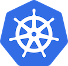

<div style="float: right; margin-left: 1em; margin-bottom: 1em;"></div>

[Prometheus][prometheus] is a popular monitoring tool based on time series data. One of the strengths of Prometheus is its deep integration with [Kubernetes][kubernetes]. Kubernetes components provide Prometheus metrics out of the box, and Prometheus's service discovery integrates well with dynamic deployments in Kubernetes.

There are multiple ways how to set up Prometheus in a Kubernetes cluster. There's an official [Prometheus Docker image][promdock], so you could use that and create the Kubernetes YAML files from scratch (which according to Joe Beda is [not totally crazy][crazy]). There is also a [helm chart][helmchart]. And there is the [Prometheus Operator][promop], which is built on top of the CoreOS [operator framework][operator].

This blog post shows how to get the [Prometheus Operator][promop] up and running in a Kubernetes cluster set up with [kubeadm][kubeadm]. We use [Ansible][ansible] to automate the deployment.

<!--more-->

kube-prometheus
---------------

In order to get the Prometheus Operator up and running, [kube-prometheus][kubeprom] provides a collection of manifests for monitoring Kubernetes itself and applications running on top of it. How to set up kube-prometheus differs slightly depending on the Kubernetes environment. This blog post focuses on Kubernetes clusters set up with [kubeadm][kubeadm].

[kube-prometheus][kubeprom] is experimental and may change significantly at any time. While Joe Beda's [Prometheus as a noob][video] is a great introduction on the topic, set-up instructions have changed significantly in the last six months since the video was published. The set-up described in this post works today, but you might need to adapt it to future changes in the way kube-prometheus is deployed.

Prerequisites
-------------

We assume that the Kubernetes cluster is up and running, `kubectl` is working, and `go` is installed, for example using Ubuntu's [golang-go][golang-go] package.

Reconfigure the Kubelet Service
-------------------------------

Kubelet is a systemd service running on the Kubernetes master and on each of the Kubernetes nodes. As of version 1.10, kubeadm configures the kubelet service via command line arguments defined in `/etc/systemd/system/kubelet.service.d/10-kubeadm.conf`.

As shown in the [kube-prometheus-on-kubeadm][kube-prometheus-on-kubeadm] documentation, we need two changes:

* Remove the `cadvisor-port=0` flag in order to enable the cadvisor.
* Add the `--authentication-token-webhook=true` flag.

Instead of modifying the file `10-kubeadm.conf`, we create a new file `11-kube-prometheus.conf`. These files are applied in alphabetical order, so settings in the our file will overwrite the original settings from `10-kubeadm.conf`.

Our `11-kube-prometheus.conf` file looks like this:

```ini
[Service]
# Remove the cadvisor-port=0 setting to expose the cadvisor metrics
Environment="KUBELET_CADVISOR_ARGS="
# allow webhook token authentication.
Environment="KUBELET_AUTH_TOKEN_WEBHOOK=--authentication-token-webhook=true"
ExecStart=
ExecStart=/usr/bin/kubelet $KUBELET_KUBECONFIG_ARGS $KUBELET_SYSTEM_PODS_ARGS $KUBELET_NETWORK_ARGS $KUBELET_DNS_ARGS $KUBELET_AUTH_TOKEN_WEBHOOK $KUBELET_AUTHZ_ARGS $KUBELET_CGROUP_ARGS $KUBELET_CADVISOR_ARGS $KUBELET_CERTIFICATE_ARGS $KUBELET_EXTRA_ARGS
```

Note that in order to override `ExecStart`, we first need to make it empty and then re-define it. Otherwise we would just be adding an additional command instead of replacing the command.

Upload `11-kube-prometheus.conf` with Ansible and trigger the handler to reload and restart the kubelet service:

```yaml
  copy:
    src: ../files/12-kube-prometheus.conf
    dest: /etc/systemd/system/kubelet.service.d/12-kube-prometheus.conf
  notify:
    - enable, reload, and restart kubelet
```

The handler to reload and restart the kubelet service is defined as follows:

```yaml
- name: enable, reload, and restart kubelet
  systemd:
    name: kubelet
    state: restarted
    enabled: yes
    daemon_reload: yes
```

To check if this worked, run `systemctl status kubelet.service` and make sure that the parameter `--cadvisor-port=0` is missing and the parameter `--authentication-token-webhook=true` is present.

Note that you have to run this **on the Kubernetes master and on each of the Kubernetes nodes**. All other tasks described in the rest of this blog post need to be run only on the master.

Reconfigure the kube-controller-manager and kube-scheduler to listen on non-local addresses
-------------------------------------------------------------------------------------------

The `kube-controller-manager` and the `kube-scheduler` are static pods running on the Kubernetes master. These pods are defined in `/etc/kubernetes/manifests/kube-controller-manager.yaml` and `/etc/kubernetes/manifests/kube-scheduler.yaml`.

Kubeadm configures these pods to listen only on the local address 127.0.0.1. In order to allow Prometheus to access them, we need to change this to 0.0.0.0, as described in the [kube-prometheus-on-kubeadm][kube-prometheus-on-kubeadm] documentation.

```yaml
- name: Reconfigure kube-controller-manager and kube-scheduler to listen on non-local addresses
  replace:
    path: "/etc/kubernetes/manifests/{{ item }}"
    regexp: "--address=127.0.0.1"
    replace: "--address=0.0.0.0"
  with_items:
    - "kube-controller-manager.yaml"
    - "kube-scheduler.yaml"
```

The master will restart the pods automatically as soon as the configuration files are changed.

Install jsonnet and jsonnet-bundler
-----------------------------------

[Jsonnet][jsonnet] is a templating language for creating JSON files. The [jsonnet-bundler][jsonnet-bundler] is a package manager for jsonnet templates. Kube-prometheus uses these tools to create the manifests for our kube-prometheus deployment. Install both tools:

```yaml
- name: Install jsonnet and jsonnet-bundler
  shell: 'go get {{ item.source }} && go install {{ item.source }}'
  args:
    creates: '/root/go/bin/{{ item.binary }}'
  with_items:
    - { source: 'github.com/google/go-jsonnet/jsonnet', binary: 'jsonnet' }
    - { source: 'github.com/jsonnet-bundler/jsonnet-bundler/cmd/jb', binary: 'jb' }
```

This should create the executable programs `/root/go/bin/jsonnet` and `/root/go/bin/jb`.

Get the jsonnet templates
-------------------------

We can now use the jsonnet-bundler to download the latest version of the jsonnet templates.

```yaml
- name: Create directory for the jsonnet templates
  file:
    path: /root/my-kube-prometheus
    state: directory

- name: Get the jsonnet templates
  shell: '/root/go/bin/jb init && /root/go/bin/jb install github.com/coreos/prometheus-operator/contrib/kube-prometheus/jsonnet/kube-prometheus'
  args:
    chdir: /root/my-kube-prometheus
    creates: /root/my-kube-prometheus/jsonnetfile.json
```

This should create a directory `/root/my-kube-prometheus` containing a bunch of `*.libsonnet` files in its subdirectories.

Upload our deployment definition
--------------------------------

We have to create a jsonnet template to import and configure the kube-operator templates. Our template also includes customizations necessary for [kubeadm][kubeadm] clusters, as described [here][kubeprom].

Our `example.jsonnet` file looks as follows:

```text
// Modified version of:
// https://github.com/coreos/prometheus-operator/blob/master/contrib/kube-prometheus/example.jsonnet

local kp = (import 'kube-prometheus/kube-prometheus.libsonnet') +
           (import 'kube-prometheus/kube-prometheus-kubeadm.libsonnet') +
           (import 'kube-prometheus/kube-prometheus-node-ports.libsonnet') {
  _config+:: {
    namespace: 'monitoring',
  },
};

{ ['00namespace-' + name + '.json']: kp.kubePrometheus[name] for name in std.objectFields(kp.kubePrometheus) } +
{ ['0prometheus-operator-' + name + '.json']: kp.prometheusOperator[name] for name in std.objectFields(kp.prometheusOperator) } +
{ ['node-exporter-' + name + '.json']: kp.nodeExporter[name] for name in std.objectFields(kp.nodeExporter) } +
{ ['kube-state-metrics-' + name + '.json']: kp.kubeStateMetrics[name] for name in std.objectFields(kp.kubeStateMetrics) } +
{ ['alertmanager-' + name + '.json']: kp.alertmanager[name] for name in std.objectFields(kp.alertmanager) } +
{ ['prometheus-' + name + '.json']: kp.prometheus[name] for name in std.objectFields(kp.prometheus) } +
{ ['grafana-' + name + '.json']: kp.grafana[name] for name in std.objectFields(kp.grafana) }
```

We use Ansible to upload this file into the `/root/my-kube-prometheus` directory:

```yaml
- name: Upload the jsonnet definition
  copy:
    src: ../files/example.jsonnet
    dest: /root/my-kube-prometheus/example.jsonnet
```

Create the manifests
--------------------

Now we can generate the manifest file from the jsonnet template:

```yaml
- name: Create output directory for the manifests
  file:
    path: /root/my-kube-prometheus/manifests
    state: directory

- name: Generate the manifests
  shell: '/root/go/bin/jsonnet -J vendor -m manifests example.jsonnet'
  args:
    chdir: /root/my-kube-prometheus
    creates: /root/my-kube-prometheus/jsonnetfile.json
```

This should create a directory `/root/my-kube-prometheus/manifests` containing a bunch of JSON manifest files.

Apply the manifests
-------------------

As the last step, we `kubectl apply` each of the manifest files in alphabetical order.

```yaml
- name: Create list of kube-prometheus json files
  find:
    path: /root/my-kube-prometheus/manifests
    patterns: "*.json"
  register: find_kube_prometheus_json
  changed_when: False

- name: Apply kube-prometheus json files
  shell: "kubectl apply -f {{ item }}"
  register: kubectl_apply_prometheus
  changed_when: "kubectl_apply_prometheus.stdout.find('created') != -1"
  with_items: "{{ find_kube_prometheus_json.files | map(attribute='path') | sort }}"
```

Test if it worked
-----------------

kube-prometheus exposes the following [node ports][nodeport]:

* Prometheus UI on node port 30900
* Alertmanager UI on node port 30903
* Grafana on node port 30902

You can use ssh port forwarding to test this:

```bash
ssh -L 30900:localhost:30900 -L 30902:localhost:30902 -L 30903:localhost:30903 root@k8s-master.example.com
```

On [http://localhost:30900][http://localhost:30900] you should now see Prometheus up and running. Click on *status* -> *targets* and make sure that the kube-controller-manager, the kube-scheduler, and all kubelets are up and running.

Where to go from here?
----------------------

The Prometheus Operator documentation is hosted on the CoreOS site: [https://coreos.com/operators/prometheus/docs/latest/][https://coreos.com/operators/prometheus/docs/latest/]


[prometheus]: https://prometheus.io/
[kubernetes]: https://kubernetes.io
[promdock]: https://hub.docker.com/r/prom/prometheus/
[crazy]: https://youtu.be/pDb2psNcvKU?t=29m5s
[helmchart]: https://github.com/kubernetes/charts/tree/master/stable/prometheus
[promop]: https://coreos.com/operators/prometheus/docs/latest/
[operator]: https://coreos.com/operators/
[ansible]: https://www.ansible.com/
[kubeprom]: https://github.com/coreos/prometheus-operator/tree/master/contrib/kube-prometheus
[kubeadm]: https://kubernetes.io/docs/setup/independent/create-cluster-kubeadm/
[golang-go]: https://packages.ubuntu.com/bionic/golang-go
[video]: https://youtu.be/pDb2psNcvKU
[kube-prometheus-on-kubeadm]: https://github.com/coreos/prometheus-operator/blob/master/contrib/kube-prometheus/docs/kube-prometheus-on-kubeadm.md
[jsonnet]: https://jsonnet.org/
[jsonnet-bundler]: https://github.com/jsonnet-bundler/jsonnet-bundler
[nodeport]: https://kubernetes.io/docs/concepts/services-networking/service/#type-nodeport
[http://localhost:30900]: http://localhost:30900
[https://coreos.com/operators/prometheus/docs/latest/]: https://coreos.com/operators/prometheus/docs/latest/