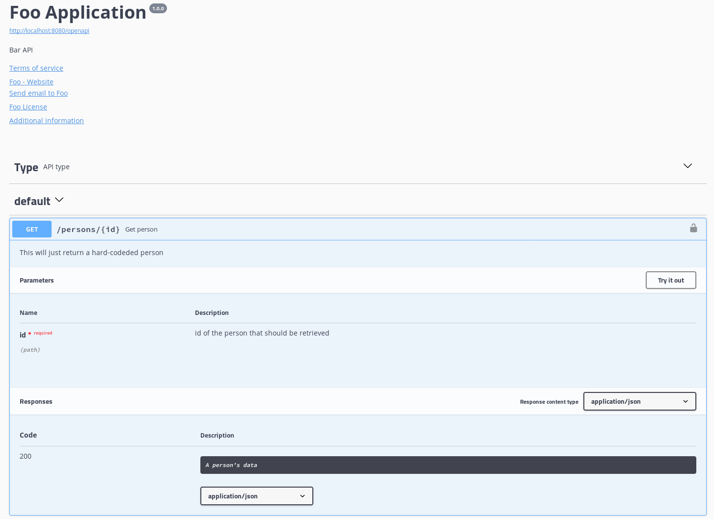

<div style="position: relative; float: right; margin-right: 1em; margin-bottom: 1em;"></div>

As the number of microservice based architectures continues to grow, development teams are facing new challenges when choosing the adequate tools for the job. At the technical level, the decisions need to be made considering the features of both: the cloud or container platform that is going to be used for the deployment and the runtime that will be used by the software. The infrastructure needs to be aware of the health and metrics of the software and the software itself must make the most of the infrastructure by tolerating failures and being able to handle configuration changes. There are numerous solutions for the individual challenges but the lack of an enterprise level blueprint actually paved the way for Eclipse Microprofile.

<!--more-->

Eclipse Microprofile is an open source initiative that aims to define a standard for developing microservices based on Java EE. It currently comes in the form of a Bill-Of-Materials and consists of a healthy mixture between already matured Java EE APIs as JAX-RS, CDI or Bean Validation and additional specifications for Health, Metrics, Fault Tolerance or Configuration Management. In order to encourage contribution, the specifications are being defined within an open forum and their implementation is left alone to the application server vendors. Microprofile does not only put together standard technologies for developing software but also offers a backbone for a better integration with the underlying infrastructure: the Health endpoint can be used in Kubernetes based platforms like Google Cloud Engine or Openshift for liveness checks and data fetched from the Metrics endpoint can be used to define how the software should scale.

In order to quickly get through the features that MicroProfile has to offer we'll use Thorntail/Wildfly either by adding the needed fractions in the POM by hand or by using the [project generator](http://wildfly-swarm.io/generator/). 

When doing so we won't actually use the MicroProfile BOM but the one provided by Thorntail:
```xml
<properties>
    <version.thorntail>2.2.0.Final</version.thorntail>
</properties>

<dependencyManagement>
    <dependencies>
        <dependency>
            <groupId>io.thorntail</groupId>
            <artifactId>bom-all</artifactId>
            <version>${version.thorntail}</version>
            <scope>import</scope>
            <type>pom</type>
        </dependency>
    </dependencies>
</dependencyManagement>
```

### Microprofile - Java EE

MicroProfile leverages the features of Java SE 8 along with a limited set of Java EE APIs such as: CDI, JAX-RS, JSON-B and JSON-P. In terms of compatibility, MicroProfile can be used with Java EE 7 but also with Java EE 8 starting with version 2.0. For getting all those APIs in an application one just needs to add the following dependency to the POM file. 
```xml
<dependency>
    <groupId>io.thorntail</groupId>
    <artifactId>microprofile</artifactId>
</dependency>
```

### MicroProfile Config

The need of externalizing configuration is not just a challenge that new software has but something that existed well before the 'microservice' age. The config module of MicroProfile solves this by providing three standard configuration sources and also the possibility of registing additional custom sources.

To make use of the config module in our microservice, there is no need for writing code or configuring things. All that has to be done is to include the following dependency:
```xml
<dependency>
    <groupId>io.thorntail</groupId>
    <artifactId>microprofile-config</artifactId>
</dependency>
```

After having done so we can use the follwing Class to test it:


@ApplicationScoped
@Path("/config")
public class ConfigEndpoint {

    @Inject
    @ConfigProperty(name = "foo", defaultValue = "foobar")
    private String foo;

    @GET
    public Response getProperty() {
        return Response.ok(foo).build();
    }

}


When making a call to the `/config` endpoint, we'll get a response with either the value of the `foo` property of the defaultValue if no value could be found. As there is currently no property defined we would just end up seeing the default value: `foobar`.

For defining the properties there are three default sources we can use:
* the system properties
* the environment variables
* the configuration file: `META-INF/microprofile-config.properties`

Once the property is set in any of those locations it will be get picked up at runtime.

### MicroProfile Fault Tolerance

One important aspect when developing microservices is having a strategy for gracefully handling failures and not letting them propagate throughout the system. The fault tolerance module of MicroProfile provides several mechanisms for handling such issues, providing a set of easy to use annotations:`@Timeout`, `@Retry`, `@Fallback`, `@CircuitBreaker`, `@Bulkhead`, `@Asynchronous`. Before using them the following dependency should be added:

```xml
<dependency>
    <groupId>io.thorntail</groupId>
    <artifactId>microprofile-fault-tolerance</artifactId>
</dependency>
```

#### Fallback

One way for tolerating failures when making a method call is to use a fallback method or handler. This can be simply done by annotating the method that is expected to fail with `@Fallback` and specifying either a method or a implementation of `org.eclipse.microprofile.faulttolerance.FallbackHandler` that should be called if the initial call fails:


@Timeout(1000)
@Fallback(fallbackMethod = "doSomethingElse")
public String doSomething() {
    try {
        Thread.sleep(3000);
    } catch (InterruptedException e) {
    }
    return "Success!";
}

public String doSomethingElse() {
    return "Fallback";
}


In the example it's also worth noticing that the fault tolerance annotation can be actually combined. In this case the `doSomething` method will trigger the fallback mechanism (the `doSomethingElse` method) if the execution of the method does not finish within 3000 ms.

#### Retry

Another fault tolerance mechanism is to have a retry policy. Using the snippet bellow we'll notice that all the calls to `doSomething` will actually return `Success!` even if in the 1st run the code should actually throw an `IOException`. The reason for which that is not happening is the presence of the `@Retry` annotation that will trigger a subsequent call the the method every time an `IOException` occurs. The `@Retry` annotation can be used not only for detecting when an exception occurred but also with additional parameters such as: `maxRetries`, `delay`, etc.


AtomicBoolean flag = new AtomicBoolean(true);

@Retry(retryOn = IOException.class)
public String doSomething() throws IOException {
    if (flag.compareAndSet(true, false)) {
        throw new IOException();
    }
    return "Success!";
}


#### Circuit Breaker

A Circuit Breaker helps limit the number of requests being sent to a faulty service. It can have three states that decide whenever a message should go through or not. In a positive scenario, where everything works well, the circuit broker will be in the "closed" state, allowing all messages to reach their intended target. Once one or multiple errors occur the circuit, depending on its configuration, might close and therefore limit the number of requests that would hit the faulty service. From this state the circuit can switch to a "half-open" state, where only probing requests will be allowed to pass in order to check if the targeted system is working again.

For testing purposes we'll use the snippet bellow, that will actually show how the circuit behaves. When calling the "doSomething" method for the 1st time we'll notice that no exceptions are being thrown and the circuit remains closed. The 2nd call however will cause a IOException, leading to the circuit to be open, and causing the next call to throw an `org.eclipse.microprofile.faulttolerance.exceptions.CircuitBreakerOpenException`. Given the the small value that we used for the sucessThresshold, the circuit will be closed again when making additional calls.


private AtomicInteger counter = new AtomicInteger(0);

@CircuitBreaker(requestVolumeThreshold = 2, failureRatio = 0.5, successThreshold = 2)
public String doSomething() throws IOException {
    if (2 == counter.incrementAndGet()) {
        throw new IOException();
    }
    return "circuit is closed";
}


#### Bulkhead

A Bulkhead comes in handy when sensitive or costly code needs to be protected from being accessed by multiple threads at the same time. We can either configure the Bulkhead to act as a semaphore, disallowing futher access to the code once a threshold was reached, or to allow call queuing.


@Bulkhead(2)
public String doSomething() {
    try {
        Thread.sleep(30000);
    } catch (InterruptedException e) {
    }
    return "Success!";
}


In the previous snippet we can that only two invocations of the `doSomething` method will be allowed to be active at a certain time. As long as the bulkhead limit is reached, any further calls will end up receiving an `org.eclipse.microprofile.faulttolerance.exceptions.BulkheadException`.

### MicroProfile Health Check

When deploying microservices in the cloud or on on-premises container management platforms, health checks should be configured in order to make the platform aware of the service health. A health-check would usually be a request initiated by the platform that hits a an endpoint and depending on the result it gets, can determine if the software is running well or not. Enabling health checks in an MicroProfile application requires just adding the dependency in the POM and writing an the check as follows:

```xml
<dependency>
    <groupId>io.thorntail</groupId>
    <artifactId>microprofile-health</artifactId>
</dependency>
```


@Health
@ApplicationScoped
public class MyHealthCheck implements HealthCheck {

    @Override
    public HealthCheckResponse call() {
        return HealthCheckResponse.named("MicroThornHealth").up().build();
    }

}


Once configured we can head up to `/health` where we can see the result of our freshly written check: `{"outcome":"UP","checks":[{"name":"MicroThornHealth","state":"UP"}]}`. Additional health checks can be easily added by extending the `org.eclipse.microprofile.health.HealthCheck` interface and annotating the class with `@Health`.

### MicroProfile JWT Authentication

OpenID Connect makes use of both OAuth 2.0 and JSON Web Tokens to securing web endpoints. It also splits the responsibilities and has well defined processes for covering authentication but also authorization needs. The JWT module from MicroProfile seeks to hide the implementation efforts of securing a web endpoint behind several annotations. 

```xml
<dependency>
    <groupId>io.thorntail</groupId>
    <artifactId>microprofile-jwt</artifactId>
</dependency>
```

After having the dependency added to the POM we can start making the needed code adjustments.


@LoginConfig(authMethod = "MP-JWT", realmName = "my-domain")
@ApplicationPath("/")
public class MicroThornApplication extends Application {

}

@DeclareRoles({ "user", "admin" })
@DenyAll
@Path("/jwt")
@RequestScoped
public class JwtEndpoint {

    @Inject
    private JsonWebToken jwt;

    @GET
    @Path("/user")
    @RolesAllowed("user")
    public String testRole() {
        return jwt.getName();
    }

}


Further on, we would need to annotate the class extending `javax.ws.rs.core.Application` with `@LoginConfig` and set the `authMethod` to `MP-JWT` and the `realmName` to that of our configured security domain. After having this done, we can write an endpoint and inject the `JsonWebToken` which implements the `javax.security.Principal` interface. From this point we can use our newly injected principal to get information such as claims and groups. Claims can not only be retrieved from the `JsonWebToken` instance but also with the help of the `@Claim` annotation.

### MicroProfile Metrics

Metrics come in handy as soon as we decide to set up monitoring for our systems. Those that come with MicroProfile can be split in three categories:
* base metrics - these will always be provided and hold information regarding the memory usage, thread count and garbage collection.
* vendor metrics - are optional and will be defined by the application server vendor.
* application metrics - are also optional and they allow the software to expose its own data.

After addind the following dependency in the POM we can check out the out-of-box metrics or even start writing custom metrics and annotating the methods with `@Timed`, `@Counted`, `@Gauge` or `@Metric`.

```xml
<dependency>
    <groupId>io.thorntail</groupId>
    <artifactId>microprofile-metrics</artifactId>
</dependency>
```

The data can be reached by calling the metrics endpoint at `/metrics` and it can be obtained in a `text/plain` format that is actually Prometheus compatible or `application/json`. Fetching individual metrics is also possibile just by navigating through the endpoint: e.g  `/metrics/base/memory.maxHeap`

### MicroProfile OpenAPI

The OpenAPI Specification is a standard for describing REST APIs in a vendor neutral way. The API description can be used with various tooling either for visualizing the API structure or for generating clients for it. The OpenAPI module of Microprofile enables developers to generate such descriptions by simply annotating code.

```xml
<dependency>
    <groupId>io.thorntail</groupId>
    <artifactId>microprofile-openapi</artifactId>
</dependency>
```

Given that we added the previous dependency we can begin adding meta data to our application:

```java
@ApplicationPath("/")
@OpenAPIDefinition(
        info = @Info(
                title = "Foo Application",
                version = "1.0.0",
                description = "Bar API",
                license = @License(
                        name = "Foo License",
                        url = "https://foo.bar/license"),
                contact = @Contact(
                        email = "foobar@foo.bar",
                        name = "Foo",
                        url = "https://foo.bar"),
                termsOfService = "https://foo.bar/terms"),
        security = @SecurityRequirement(
                name = "oauth2",
                scopes = "read:foobar"),
        externalDocs = @ExternalDocumentation(
                description = "Additional information",
                url = "https://bar.foo/info"),
        servers = @Server(
                description = "Foo description",
                url = "http://localhost:8080/{env}",
                variables = @ServerVariable(
                        name = "env",
                        description = "Server variable",
                        enumeration = {"dev", "prod"},
                        defaultValue = "dev")
                ),
        tags = @Tag(
                name = "Type",
                description = "API type")
        )
public class RestApplication extends Application {
}

@ApplicationScoped
@Path("/persons")
@Schema(name = "/persons")
@Produces(MediaType.APPLICATION_JSON)
public class PersonEndpoint {

    @GET
    @Path("/{id}")
    @Operation(
            summary = "Get person",
            description = "This will just return a hard-coded person")
    @APIResponse(
            responseCode = "200",
            description = "A person's data",
            content = @Content(
                    schema = @Schema(implementation = Person.class))
            )
    public Person getPerson(
            @Parameter(
                    name = "id",
                    description = "id of the person that should be retrieved",
                    schema = @Schema(type = SchemaType.STRING),
                    required = true
                )
            @PathParam("id") String id) {
        return new Person("Foo Bar", 42);
    }

}
```

We can add a great level of detail to the interface description, since the MicroProfile annotations can be used on classes, methods and even fields. After we're done with the code we can move on and have a look at how the API description looks in an OpenAPI compatible viewer such as Swagger:




### MicroProfile OpenTracing

Distributed tracing is a way of tracking a request flow through multiple services and OpenTracing is an initiative for standardizing application tracing in a vendor neutral way. The MicroProfile fraction adheres to the OpenTracing movement by enabling tracing of JAX-RS applications. By just including the dependency in out POM we would automatically enable tracing without having to write any code:

```xml
<dependency>
    <groupId>io.thorntail</groupId>
    <artifactId>microprofile-opentracing</artifactId>
</dependency>
```

However, the standard configuration will default to a `NoOp`-Tracer and therefore we would still need to use an OpenTracing client of our choice (e.g jaeger). Having everything set up we can make the first calls to our API and then head to a Tracing UI to see the result. Even if most of the configuration is happening behind the scene, explicit tracing can also be configured by using the `@Traced` annotation.


### MicroProfile Rest Client

The REST Client enables developers to make HTTP calls between services in an type-safe manner. For exemplifying this we'll need to build two services, one acting as Producer and the other one as a Consumer, both making use of a simple structure such as `Person` class:

```java
public class Person {

    private String name;

    private int age;

    // getters and setters omitted for brevity
}
```

On the producer side we'll stick to a basic JAX-RS application and write a simple endpoint that will just return a hard-coded list containing one `Person`. A call to `/persons` would then return `[{"name":"Arthur Dent","age":42}]`

```java
@ApplicationScoped
@Path("/persons")
public class PersonEndpoint {

    @GET
    @Produces(MediaType.APPLICATION_JSON)
    public List<Person> doGet() {
        return Collections.singletonList(new Person("Arthur Dent", 42));
    }
}
```

On the consumer side, we'll also use a JAX-RS application but also include the MicroProfile dependency:

```xml
<dependency>
    <groupId>io.thorntail</groupId>
    <artifactId>microprofile-restclient</artifactId>
</dependency>
```

For testing purposes we'll write a small interface that matches the previous endpoint and another endpoint that will help us see the received.

```java
@Path("/persons")
public interface PersonService {

    @GET
    @Produces(MediaType.APPLICATION_JSON)
    List<Person> getPersons();

}

@Path("/rest-client/persons")
public class RestClientEndpoint {

    @GET
    @Produces(MediaType.APPLICATION_JSON)
    public Response getPersons() throws MalformedURLException {
        URL url = new URL("http://localhost:8081");
        PersonService dataService = RestClientBuilder.newBuilder().baseUrl(url).build(PersonService.class);

        List<Person> persons = dataService.getPersons();

        return Response.ok(persons).build();
    }

}
```

As expected, we'll receive the same output (`[{"name":"Arthur Dent","age":42}]`) on the consumer side. Overall, the rest client reduces the boilerplate code one would write when accessing another microservice, and makes it look like a simple local method call.

## Final thoughts
In the last year MicroProfile continued to gain momentum, by introducing new features and updating existing ones, and application server vendors also kept up the pace by releasing compliant releases. Even if the IDE support is not perfect and the vendors might have their differences, MicroProfile is still worth considering when dealing with microservices.