<div style="position: relative; float: right; margin-right: 1em; margin-bottom: 1em;"></div>

Some time ago, I did a webinar about the RedHat Service Mesh, which is based on Istio. For this webinar, I prepared a demo application. Among other things, I wanted to show how to do the authentication with JWT token in general and, more specific, with Keycloak. This article will describe how to configure Keycloak. In the second article, I will show you what problems I encountered running the application in Istio and how I figured out what was wrong in my configuration. You can find the article [here](/blog/2020/05/07/debugging-istio/)
<!--more-->
<br/>

## Set up the demo application

As basis for my demo application I used the application of the awesome [Red Hat Istio tutorial](https://redhat-developer-demos.github.io/istio-tutorial/istio-tutorial/1.3.x/index.html). The only exception I made was to use my own docker repo and to create a single yaml file to setup the application along with the Istio configuration. The yaml with the OpenShift resources and with the Istio configuration file can be found [here](https://raw.githubusercontent.com/olaf-meyer/openshift-talks/master/setup_demo_app.yaml). The demo application consists of four services. The entry point is the customer service. The customer service calls the recommendation service. Which calls version 1 and version 2 of preference services. The following picture shows an overview of the demo application.

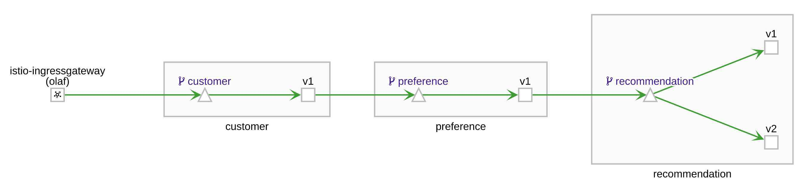

Istio configuration for the demo application is done in that manner that it enforces mTLS and RBAC. With the current policy, the communication between the services is always encrypted. Furthermore, this configuration ensures that the services can only communicate the designated endpoints and all other communication will be blocked. Also, I wanted to secure the entry point of the application so that it can only be called by users that have been authenticated by a Keycloak instance. The bearer/access token and the public key of other Istio examples that I found were almost exclusively hard coded. Furthermore, the authorization was done by the `audience` attribute in the JWT token and not by the roles assigned to the user. To be a bit closer to a real world setup, I decided to use roles instead of hard coded `audience`. To do this, I configured a realm, client, role and a user in Keycloak. As a starting point for my Keycloak configuration I used a previous version of the Red Hat Istio tutorial. The example can be found [here](https://github.com/redhat-developer-demos/istio-tutorial/blob/1a46e933f0c78f007cabb67b6b9ff079e3300fda/documentation/modules/advanced/pages/jwt.adoc). In a newer version of the tutorial, it used a hard coded access token and a public key.

## Deploy Keycloak

For my webinar I used a Keycloak which was deployed on an OpenShift 4.3 cluster. However, you should be able to use RedHat SSO instead of Keycloak as well. To deploy Keycloak to my OpenShift cluster I used a template provided by Keycloak. Please notice that this template is ephemeral and the used password should not be used in production!

```bash
oc process \
  -f https://raw.githubusercontent.com/keycloak/keycloak-containers/master/openshift-examples/keycloak-https.json \
  -p NAMESPACE=olaf-sso \
  -p KEYCLOAK_USER=admin \
  -p KEYCLOAK_PASSWORD=admin \
  | oc create -f -
```

## Setup Keycloak as an identity provider

Let's start with log into Keycloak and setup the Istio configuration.
<!-- If you setup the security realm, clientid, role and user(s) Keycloak returns an valid access token for the user. However I wanted to have modify the value of the attribute `audience` so that it contains the value that I want instead of a default value. Also Istio (at least in the current version of the Red Hat Service Mesh) is not able to find roles that are embedded in other attributes. So we need to add the roles as a top level attribute with a mapper that can be used in Istio.  -->

### Create a security realm

The first step is to create a security realm. In order to do this, press "Add realm" and enter the name "customer", then press "Create". Piece of cake, so far.

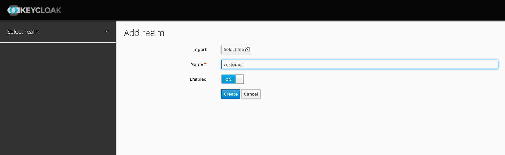

### Create a custom client

Next, create a client with the name "istio". You do not need to add more information and leave the `Client Protocol` as `openid-connect`. At least, not at the moment.

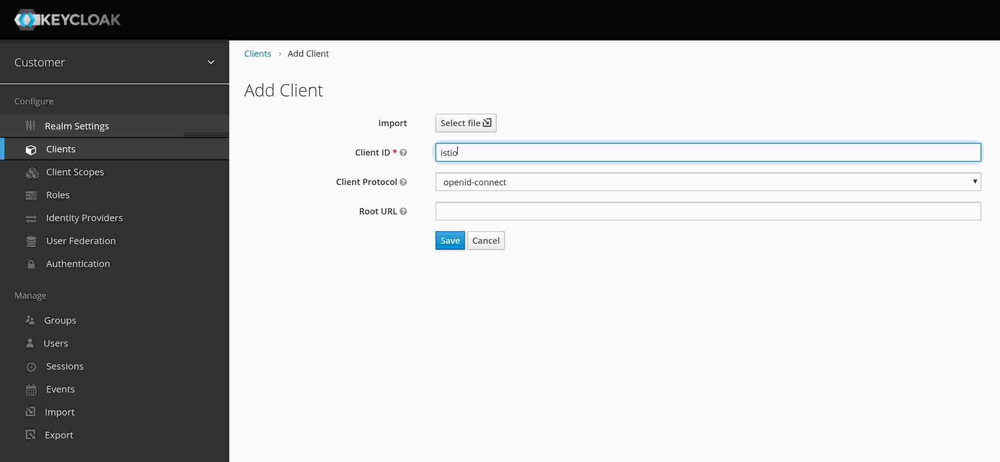

### Create a role

To be able to select user by roles, we need to create at least one role. Create a role called "customer". If you want, you can create another role for test purpose.

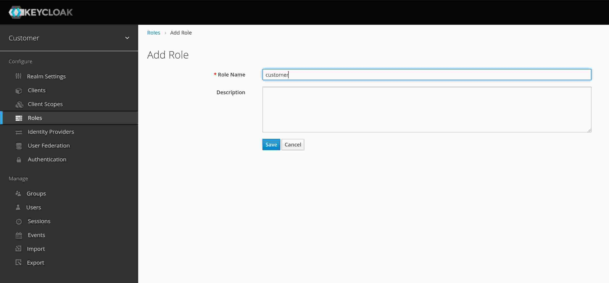

### Create a test user

We are almost there; we just need to create a user. Which is pretty straightforward. In the view "Users" press the button "Add user". In my case, I added the following values in the form and pressed save.

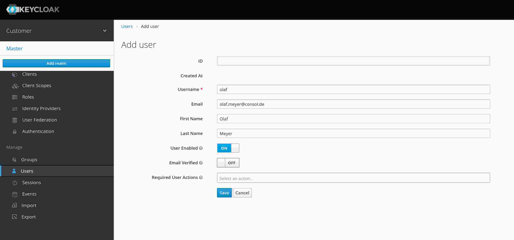

In the user we need to do two more things:

- In the next step, we need to assign a role to the user. For this, select the tab "Role Mappings" and assign the realm role "customer" to the new user.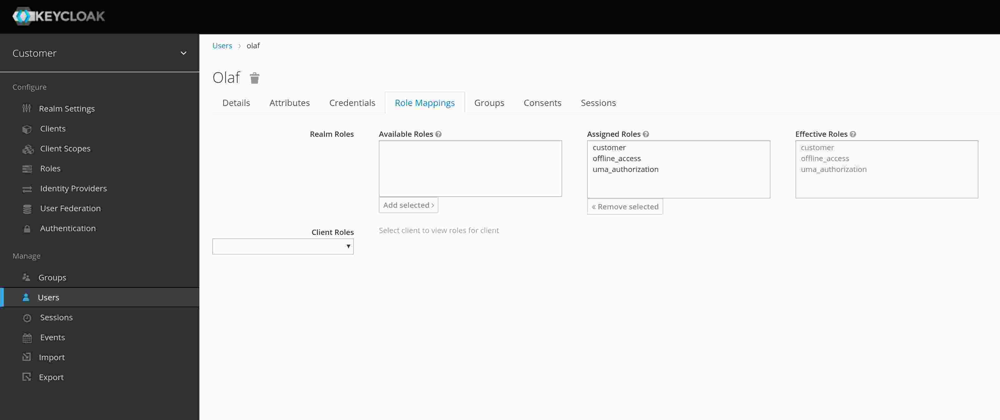

### Verify the result

Sow far, we created everything that we need to get an access_token from Keycloak. To do exactly this, I called this script in the bash (The URL and the values may vary in your environment):

```bash
curl \
  -sk \
  --data "username=olaf&password=olaf&grant_type=password&client_id=istio" \
  https://secure-keycloak-olaf-sso.apps.poc2.int.consol.de/auth/realms/customer/protocol/openid-connect/token \
  | jq ".access_token"
"eyJhbGciOiJSUzI1NiIsInR5cCIgOiAiSldUIiwia2lkIiA6ICJZQlNMT3V1VkdMWkpDaXVQUUVrQTRTTzZEWE5qTGJKNkgyV0tSOXh2LUhRIn0.eyJqdGkiOiJiOWVjOTg4Yy05MmFhLTQ4YzUtOGQxOS00YWQ1NDgyMTgxOTkiLCJleHAiOjE1ODQxMTM1OTMsIm5iZiI6MCwiaWF0IjoxNTg0MTEzMjkzLCJpc3MiOiJodHRwczovL3NlY3VyZS1rZXljbG9hay1vbGFmLXNzby5hcHBzLnBvYzIuaW50LmNvbnNvbC5kZS9hdXRoL3JlYWxtcy9jdXN0b21lciIsImF1ZCI6ImFjY291bnQiLCJzdWIiOiJjZDEwYTMyZC1iMGVhLTRhZWMtYTViNi0yNzFjMWExNGEwOWQiLCJ0eXAiOiJCZWFyZXIiLCJhenAiOiJpc3RpbyIsImF1dGhfdGltZSI6MCwic2Vzc2lvbl9zdGF0ZSI6ImZlYTdjMDlmLTA1ZDUtNDNiOS05MmJhLTVjNGY0NGJiYzhkMyIsImFjciI6IjEiLCJyZWFsbV9hY2Nlc3MiOnsicm9sZXMiOlsib2ZmbGluZV9hY2Nlc3MiLCJ1bWFfYXV0aG9yaXphdGlvbiIsImN1c3RvbWVyIl19LCJyZXNvdXJjZV9hY2Nlc3MiOnsiYWNjb3VudCI6eyJyb2xlcyI6WyJtYW5hZ2UtYWNjb3VudCIsIm1hbmFnZS1hY2NvdW50LWxpbmtzIiwidmlldy1wcm9maWxlIl19fSwic2NvcGUiOiJlbWFpbCBwcm9maWxlIiwiZW1haWxfdmVyaWZpZWQiOnRydWUsIm5hbWUiOiJPbGFmIE1leWVyIiwicHJlZmVycmVkX3VzZXJuYW1lIjoib2xhZiIsImdpdmVuX25hbWUiOiJPbGFmIiwiZmFtaWx5X25hbWUiOiJNZXllciIsImVtYWlsIjoib2xhZi5tZXllckBjb25zb2wuZGUifQ.Qec8ywW7fhYGOFzh3YfmJsSWZm96GnJg0XZWjjBwAp1Zap8UfUQaFpkSl-ey2-k12nptpYMuKU9PXPIXq8dnfuLUNYK5mZHLxEx77-giFls-mdIJ0LVvcZHqVDvQKWyr_l--zCGsxd4fmKhWdT85FrA0mcMOwJbzE547fQJ8ooNCx4VUo0O1bzR2f-gnX22Whf00Il9esvX8-HllXbBP3_t32OticXWySeOKI2oaVz1f4h38DTK0q22Cdnb-4IsZypGPUe24DR0ZGQUSkhM05ZPX232FKenC1bHOVBV6cXCqVhH2rbs8zcURPIq70txL5aOf31PEhidSwb4VZ2IuPA"
```

My preference to view the content of access_token is the website [https://jwt.io/](https://jwt.io/). Of course, this is not recommended for productive token. The returned access token looks like this:

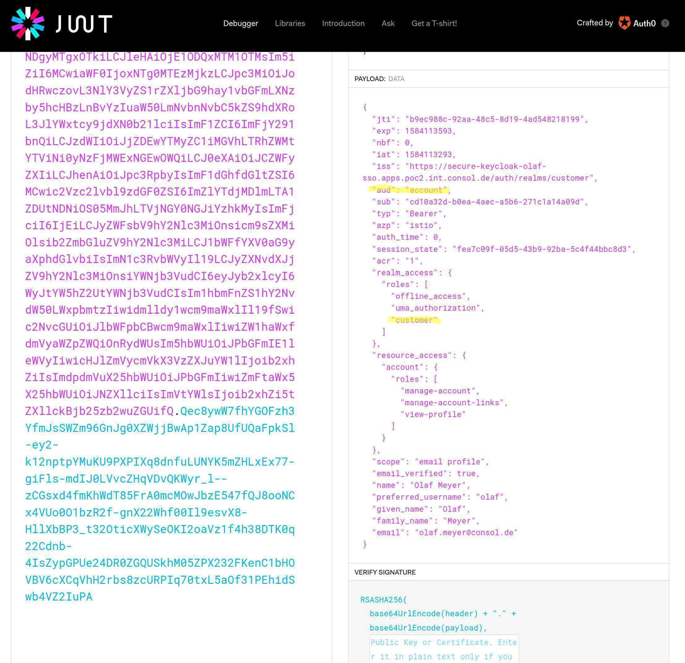

There are two points in the JWT token that need to be changed. The first point is that the audience of the token is "account". This value is caused by adding the role "roles" to the access_token. There are many examples that show how to use Istio with JWT, containing almost exclusive checks of the audience in the token. To check if the JWT contains the value "account" is not helpful, so let's modify it. Second, Istio (at least with the version 1.1.7 or Red Hat Service Mesh 1.0.9) can't handle nested attributes. Unfortunately, Keycloak is using by default nested attributes for the assigned roles of the user. This means that we have to create a root level attribute for the roles that are assigned to a user.

### Adjusting the values returned in attribute `aud` / `audience`

To replace the complete value of the attribute `aud` (`audience`) is not that easy and could bring side effects with it. So let's add just a value to the `audience`. To do this, open client `istio` and select the tab `Mappers` and press on the button `Create`. In the next form, we create a mapper that adds a hard coded value to the audience. My mapping looks like this:
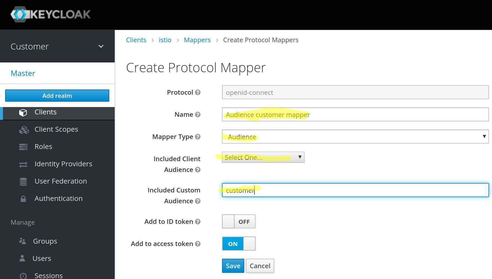

After I added the mapping to the Istio client, the resulting access token looks like this:

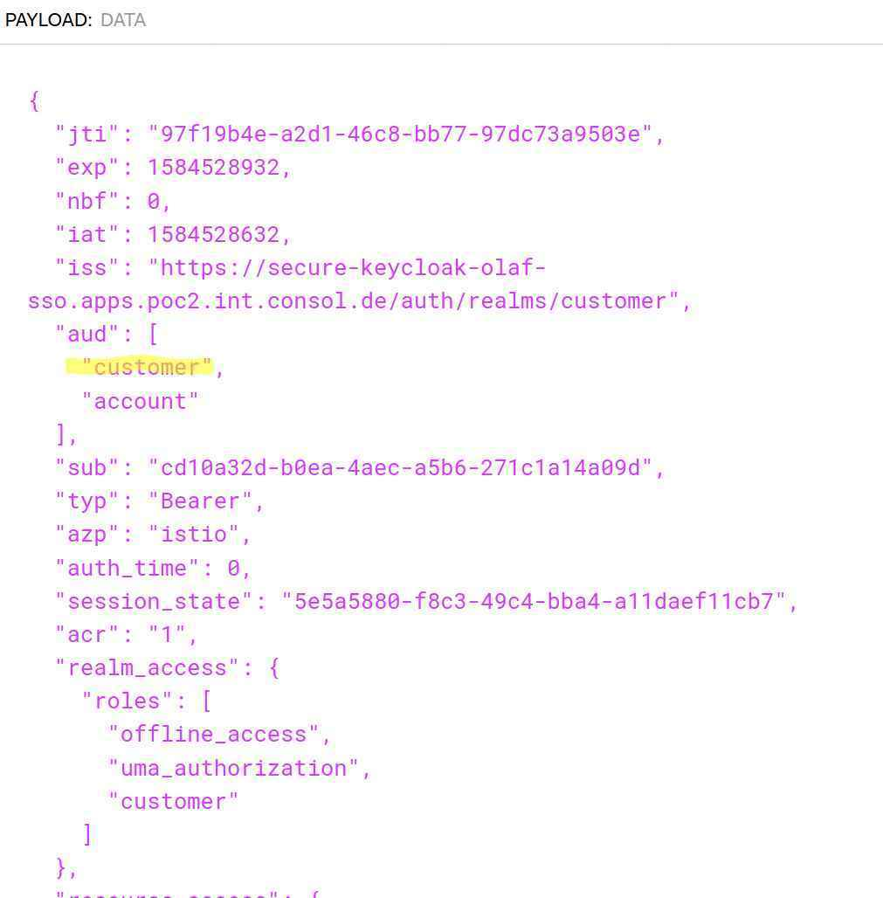

As you can see, the attribute `audience` now contains two values `customer` and `account`. Now we can do a check in Istio whether the audience contains the value `customer`. The audience `customer` is only returned, if the client "istio" has been used; but not for other clients. So only one more problem to solve.

### Change location were roles of the user are returned

The final change in Keycloak is to make the user roles a top-level attribute. Which is not hard. Like for the `audience` we add a mapper in the client. This time, we are going to use a mapper of the type `User realm role`. With this, the user realm roles will be duplicated to a custom attribute. In my case I create a top level attribute called `roles`. The role mapper that I created looks like this:

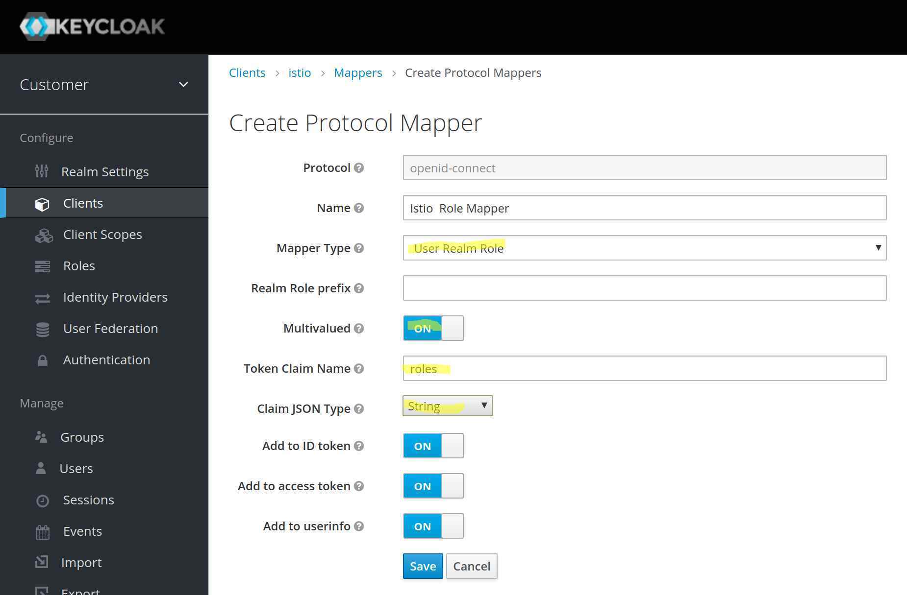

The access token of my user looks like this:

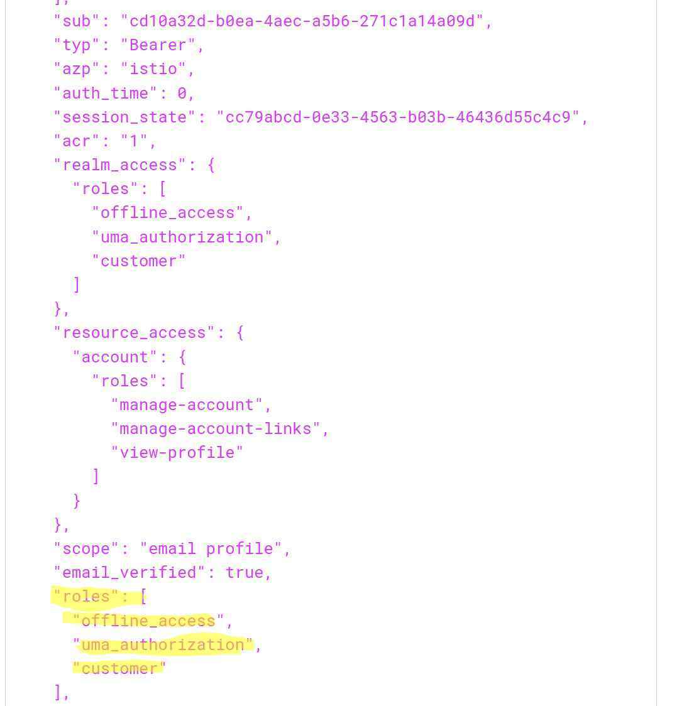

As you can see, the access token has a new attribute `roles` with `offline_access`,`uma_authorization` and `customer`. With theses changes, we should able to log into Istio with the access token. In the second article, I will show you what problems I encountered running the application in Istio and how I figured out what was wrong in my configuration.You can find the article [here](/blog/2020/05/07/debugging-istio/)