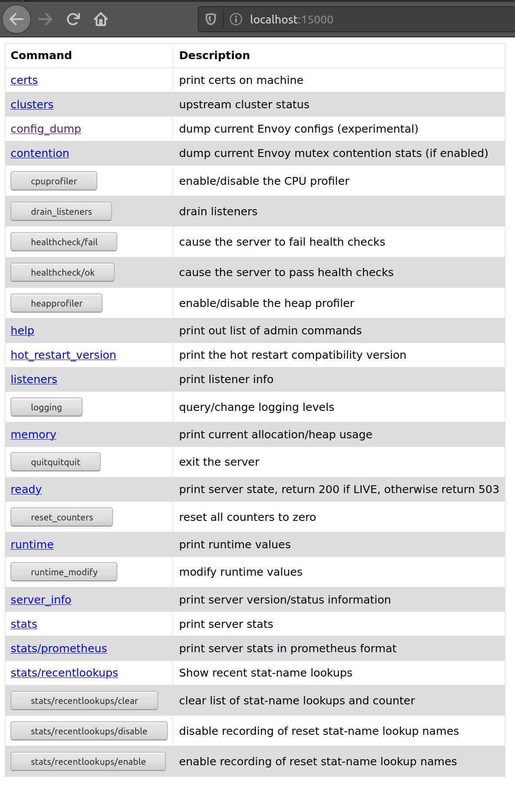
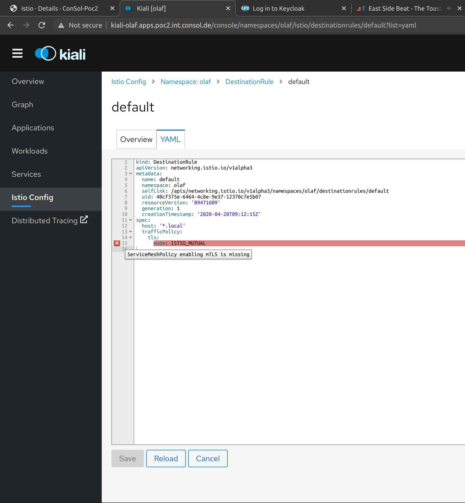

<div style="position: relative; float: right; margin-right: 1em; margin-bottom: 1em;"></div>

In the article, I'm going to describe what we can do, if we configured our application to use Istio, but it is not working like intended. Originally, I wanted to give a detailed description what problems I encountered during the creation of my webinar and how I fixed them. However, I came to a point where this would be a very long one. I hope that you don't mind that I shortened it and just describe which tools are available to `debug` the Istio configuration. In my previous [article](/blog/2020/05/07/simple-example-how-to-use-istio-and-keycloak/) I described how to configure Keycloak for my webinar. So without further ado, let's start.
<!--more-->
<br/>

## Certificate problem

After deploying my application and the Istio configuration, everything seemed to run. There were no errors in the logs of my pods. I ran a small script to call my demo application in a loop with the access_token from Keycloak. Instead of successful response, I got the following error:

```bash
Origin authentication failed.
```

The reason for that error is the policy that enforces a JWT authentication and which looks like this:

```yaml
- apiVersion: authentication.istio.io/v1alpha1
  kind: Policy
  metadata:
    name: customerjwt
    namespace: olaf-customer
  spec:
    targets:
      - name: customer
      - name: preference
      - name: recommendation
    peers:
      - mtls: {}
    peerIsOptional: ~
    origins:
      - jwt:
          audiences:
            - customer
          issuer: 'https://skeycloak-olaf-sso.apps.acme.de/auth/realms/customer'
          jwksUri: 'https://skeycloak-olaf-sso.apps.acme.de/auth/realms/customer/protocol/openid-connect/certs'
    principalBinding: USE_ORIGIN
```

After verifying three times that my access token and the Keycloak url were correct, it dawned slowly on me, that there might be a problem with my Istio infrastructure configuration. After checking the Istio Ingress Gateway and the istio-proxy in the customer pod, I found these log entries in the discovery container of the Istio Pilot pod:

```bash
2020-02-17T12:57:34.675759Z error model Failed to fetch public key from "https://keycloak-olaf-sso.apps.acme.de/auth/realms/customer/protocol/openid-connect/certs": Get https://keycloak-olaf-sso.apps.acme.de/auth/realms/customer/protocol/openid-connect/certs: x509: certificate signed by unknown authority
2020-02-17T12:57:34.675778Z warn Failed to fetch jwt public key from "https://keycloak-olaf-sso.apps.acme.de/auth/realms/customer/protocol/openid-connect/certs"
```

So why is the error in the Istio pilot pod and not in the Istio Ingress Gateway, for example? The reason is that the JWT is validated by the public key that is provided by the jksURI. It is sufficient to get this key before the first request. After this, Istio can cache the public key and save network calls. All this is done in Pilot, which then "caches" the result values in the Envoy configuration of the Istio-Proxy container. A stored configuration looks like this:

``` json
"http_filters": [
{
  "name": "jwt-auth",
  "config": {
  "allow_missing_or_failed": true,
  "rules": [
    {
    "forward": true,
    "audiences": [
      "customer1"
    ],
    "issuer": "https://keycloak-olaf-sso.apps.acme.de/auth/realms/customer",
    "local_jwks": {
      "inline_string": "{\"keys\":[{\"kid\":\"Ek-wxUoZGSSp5eePlJBMuAGzyolk6aI5HSyB0gceFZY\",\"kty\":\"RSA\",\"alg\":\"RS256\",\"use\":\"sig\",\"n\":\"jXNMZfp-AI2LpnTuSAD6mG5Kkv390YAqJF0Y3OOeDqAYDI-t4glGHku_nVPqdn2_LNNxumMPY94ytsoWYJDiHlIvmmnQukYL0kVE5DmdbYhiJ0djh0K6E4WePcmKhBugxukY1N9zmQZjvly0EenyTrZFnLLdsZpyupCzdhdL6xZrxXX3Gjr1JlC1-2BgvHkyg_a3tPHmcL559KLuJk-darJentwJEi3B5RYIyYLKmX-1cC3GUeRSnhnaRlSUUnY5XKFpMt2W636XOmRY77HL90PyoIU-7FjnIV0PenWlxdq_nGJ5YBZqGKJTJmKcquhO4WkSn0PPZx_KRiwjub-MgQ\",\"e\":\"AQAB\"}]}"
    },
    "forward_payload_header": "istio-sec-544a41081254dc82aed9a0d81261fdc6f8cdd75d"
    }
  ]
  }
},
```

So we know what is causing the problem. Let's fix it! There are two options:

1.  Instead of `jwksUri`, in the Policy we could use an attribute called `jwks`. You can get the content from the `jwksUri`. Just paste the value in the policy with the correct indentation. An example looks like this:

    ``` yaml
    jwks: {"keys":[{"kid":"WyXEwTpUURQsNanFbktq-KIHRM1io_0","kty":"RSA","alg":"RS256","use":"sig",
    "n":"yQRHyWzFqXZ5DegUpf_9QA2kr5Ys2N6XXUhNdAHTh_CjQT_YfhvFKfQOYdbQH4pzLPSlBoOaADVqIgE55qrvoysft_
    KgAvUr2W7b4vWy13PKzBdcec6EDxxod3MmphT0K_9bit-KPMXEeLKlKfRVYAYEdM8FQJpUuO4HQv-xCP-KhYcR_Yvipxhpt
    hDkQqmZiAn6b4QffK-9brDlnhgCsQjP92GMPUU9AZ-","e":"AQAB"}]}
    ```

1.  Add the signer certificates in the pilot pod, which is a bit more complex.

    1.  (Optional) Download the wildcard certificate of your OpenShift cluster with the following command:

        ```bash
        openssl s_client \
          -showcerts \
          -servername console-openshift-console.apps.acme.de \
          -connect console-openshift-console.apps.acme.de:443 </dev/null 2>/dev/null \
          | openssl x509 -outform PEM >openshift-wildcard.pem
        ```

    1.  Create a secret with the certificate. The filename in the secret has to be `extra.pem`:

        ```bash
        oc create secret generic openshift-wildcard \
          --from-file=extra.pem=openshift-wildcard.pem \
          -n olaf
        ```

    1.  The last step is to use the volume discovery container of the Istio Pilot pod. The easiest way to do that is with the command:

        ```bash
        oc set volumes deployment/istio-pilot \
          --add \
          --name=extracacerts \
          --mount-path=/cacerts \
          --secret-name=openshift-wildcard \
          --containers=discovery
        ```

One remark on the second solution: When I started writing this article, OpenShift Istio (Maistra 1.0.x) didn't support addition CA certificates. With Openshift Istio (Maistra 1.1.x) it is possible to define addition CA certificates in the ServiceMeshControlPlane before installing OpenShift Istio. At the time being, it is not possible to add additional CA certificates after the installation out of the box. So for now after the installation of OpenShift Istio, you need to choose between option 1 and 2. Also, keep in mind that after updates of the Istio operator you might need to mount the secret again in the deployment because Istio Operator might overwrite it.

## How to analyze problems of the Istio configuration

The previous problem that I encountered was a rather specific one with respect to the Istio version used and the OpenShift operator. The other techniques that I will describe are more generic and not so much specific for the Istio and OpenShift environment.

### Get the configuration of the Envoy proxy of a pod

During the creation of my sample application, I encountered a scenario were I needed to verify the configuration of an Envoy proxy in a pod. To a certain degree, the Istio configuration will end up in an Envoy proxy as its configuration. A look at the Envoy configuration helps us to verify, if our Istio configuration has been translated to to the desired Envoy configuration. Furthermore, by looking at the Envoy configuration we gain a deeper understanding of the Istio internal behavior. Okay, enough talk, how can we get the configuration of an Istio-proxy (Envoy proxy) for a pod? The answer is very simple. By using this command:

```bash
oc exec <pod name> -c istio-proxy -- curl -kv localhost:15000/config_dump> <podname>_Envoy_config.json
```

If we take a look at the written file, we will get e.g. the jwk config (like seen above), the retries for endpoints, the routing and many more. At this point I have to admit that I could not create the Envoy configuration from scratch. However I find the configuration easy enough to understand when focusing on certain aspects.

### Increase the logging level of the Envoy proxy

Besides, the configuration there is a nice feature that I started to appreciate very much: To increase the logging for certain features of the Envoy proxy without increase the log output for other components. Let's have a look which components are available:

|admin|aws|assert|backtrace|client|config|connection|conn_handler|
|dubbo|file|filter|forward_proxy|grpc|hc|health_checker|http|
|http2|hystrix|init|io|jwt|kafka|lua|main|
|misc|mongo|quic|pool|rbac|redis|router|runtime|
|stats|secret|tap|testing|thrift|tracing|upstream|udp|
|wasm|||||||

There are quite a lot of components from which we can choose, if we want to increase the log level. To change the level for only the RBAC component, we can execute the following command:

```bash
oc exec -it <pod name> -c istio-proxy -- sh -c 'curl -k -X POST localhost:15000/logging?rbac=debug'
```

We should get a response like this from the pod:

```bash
active loggers:
  admin: warning
  aws: warning
  assert: warning
  backtrace: warning
  client: warning
  config: warning
  ...
  pool: warning
  rbac: debug
  redis: warning
  router: warning
  runtime: warning
  stats: warning
  secret: warning
  tap: warning
  testing: warning
  thrift: warning
  tracing: warning
  upstream: warning
  udp: warning
  wasm: warning
```

If we really wanted, we could set the log level for all components of envy proxy to `debug` with this command:

```bash
oc exec -it <pod name> -c istio-proxy -- sh -c 'curl -k -X POST localhost:15000/logging?level=debug'
```

The output should look like this:

```bash
active loggers:
  admin: debug
  aws: debug
  assert: debug
  backtrace: debug
  client: debug
  config: debug
  ...
  pool: debug
  rbac: debug
  redis: debug
  router: debug
  runtime: debug
  stats: debug
  secret: debug
  tap: debug
  testing: debug
  thrift: debug
  tracing: debug
  upstream: debug
  udp: debug
  wasm: debug
```

Hint: Be careful when changing the log level of all components for an Envoy proxy, because this is generating quite a lot of log entries (even in a test environment).

The Envoy proxy offers a minimal UI. We can have a look at the UI, if we do a port-forward to our local computer from an istio-proxy with either:

```bash
oc port-forward <pod name> 15000
```

or

```bash
istioctl dashboard envoy <pod name>
```

If we open this web-site [`https://localhost:15000`](https://localhost:15000) in our browser we see the following website:



We get quite some options here, what we can see or even change in the Envoy proxy.

### Increase the logging of an Istio component

So far, now I have showed you, what we can do to get more information from the Envoy proxy. I have not touched the control plane of Istio so far. It took me some time to find it, however, each Istio control plane component has a built in GUI (at least for Mixer, Pilot, Citadel, and Galley that is). We can have a look at it by forwarding the port of the Istio pod to our local computer. Again, we do a port-forward this time but instead of the port 15000 the port is now 9876:

```bash
oc port-forward <istio pod name> 9876
```

For the Istio pilot it looks like this:

```bash
oc port-forward istio-pilot-775d8bfc6b-zb25d 9876
```

If we open this website [`http://localhost:9876/scopez/`](http://localhost:9876/scopez/) in our browser, we see the following GUI:


So, this time we have a GUI to change the logging setting of a component, which is quite nice. Also, we can get more information about the memory usage, the metrics and much more.

## Check the Istio configuration

Besides changing the logging level, Istio offers another powerful tool to see if something is wrong. WE can use the command line or Kiali to verify our Istio configuration. It might not be perfect, but it still can save us from a lot of trouble.

### Option a): the command line tool

#### Get proxy configuration of a specific pod

As I have pointed out above, we can get the complete Envoy configuration using `oc exec`. There is another way we can use `istioctl proxy-config`. This command allows us to get subset of the proxy configuration like `endpoints` or `clusters` for example. To get a list of all end points for a proxy, we can run the following command:

```bash
istioctl proxy-config endpoints <pod name>
```

This can be quite useful, as it shows us which endpoints are available for the pod and whether they are healthy. For one of my pods, it looks like this:

```bash
 $ istioctl proxy-config endpoints customer-56d65d78d9-n5sq9
ENDPOINT                 STATUS      OUTLIER CHECK     CLUSTER
10.10.10.39:8060         HEALTHY     OK                outbound|8060||istio-citadel.olaf.svc.cluster.local
10.10.10.39:15014        HEALTHY     OK                outbound|15014||istio-citadel.olaf.svc.cluster.local
10.10.10.40:3001         HEALTHY     OK                outbound|9090||prometheus.olaf.svc.cluster.local
10.10.10.41:8443         HEALTHY     OK                outbound|443||istio-galley.olaf.svc.cluster.local
10.10.10.41:9901         HEALTHY     OK                outbound|9901||istio-galley.olaf.svc.cluster.local
10.10.10.41:15014        HEALTHY     OK                outbound|15014||istio-galley.olaf.svc.cluster.local
10.10.10.42:9091         HEALTHY     OK                outbound|9091||istio-policy.olaf.svc.cluster.local
10.10.10.42:15004        HEALTHY     OK                outbound|15004||istio-policy.olaf.svc.cluster.local
10.10.10.42:15014        HEALTHY     OK                outbound|15014||istio-policy.olaf.svc.cluster.local
10.10.10.43:8080         HEALTHY     OK                outbound|80||istio-ingressgateway.olaf.svc.cluster.local
10.10.10.43:8443         HEALTHY     OK                outbound|443||istio-ingressgateway.olaf.svc.cluster.local
10.10.10.43:15020        HEALTHY     OK                outbound|15020||istio-ingressgateway.olaf.svc.cluster.local
10.10.10.43:15443        HEALTHY     OK                outbound|15443||istio-ingressgateway.olaf.svc.cluster.local
10.10.10.45:20001        HEALTHY     OK                outbound|20001||kiali.olaf.svc.cluster.local
10.10.10.51:8080         HEALTHY     OK                outbound|8080|version-v1|customer.olaf-customer.svc.cluster.local
10.10.10.51:8080         HEALTHY     OK                outbound|8080||customer.olaf-customer.svc.cluster.local
10.10.10.53:8080         HEALTHY     OK                outbound|8080|version-v1|recommendation.olaf-customer.svc.cluster.local
10.10.10.53:8080         HEALTHY     OK                outbound|8080||recommendation.olaf-customer.svc.cluster.local
10.10.11.100:8080        HEALTHY     OK                outbound|8080|version-v2|recommendation.olaf-customer.svc.cluster.local
10.10.11.100:8080        HEALTHY     OK                outbound|8080||recommendation.olaf-customer.svc.cluster.local
10.10.11.35:8443         HEALTHY     OK                outbound|443||jaeger-query.olaf.svc.cluster.local
10.10.11.35:9411         HEALTHY     OK                outbound|9411||jaeger-collector.olaf.svc.cluster.local
10.10.11.35:9411         HEALTHY     OK                outbound|9411||zipkin.olaf.svc.cluster.local
10.10.11.35:14250        HEALTHY     OK                outbound|14250||jaeger-collector.olaf.svc.cluster.local
10.10.11.35:14267        HEALTHY     OK                outbound|14267||jaeger-collector.olaf.svc.cluster.local
10.10.11.35:14268        HEALTHY     OK                outbound|14268||jaeger-collector.olaf.svc.cluster.local
10.10.11.94:9091         HEALTHY     OK                outbound|9091||istio-telemetry.olaf.svc.cluster.local
10.10.11.94:15004        HEALTHY     OK                outbound|15004||istio-telemetry.olaf.svc.cluster.local
10.10.11.94:15014        HEALTHY     OK                outbound|15014||istio-telemetry.olaf.svc.cluster.local
10.10.11.94:42422        HEALTHY     OK                outbound|42422||istio-telemetry.olaf.svc.cluster.local
10.10.11.95:8080         HEALTHY     OK                outbound|8080||istio-pilot.olaf.svc.cluster.local
10.10.11.95:15010        HEALTHY     OK                outbound|15010||istio-pilot.olaf.svc.cluster.local
10.10.11.95:15011        HEALTHY     OK                outbound|15011||istio-pilot.olaf.svc.cluster.local
10.10.11.95:15014        HEALTHY     OK                outbound|15014||istio-pilot.olaf.svc.cluster.local
10.10.11.96:8080         HEALTHY     OK                outbound|80||istio-egressgateway.olaf.svc.cluster.local
10.10.11.96:8443         HEALTHY     OK                outbound|443||istio-egressgateway.olaf.svc.cluster.local
10.10.11.96:15443        HEALTHY     OK                outbound|15443||istio-egressgateway.olaf.svc.cluster.local
10.10.11.98:8443         HEALTHY     OK                outbound|443||istio-sidecar-injector.olaf.svc.cluster.local
10.10.11.98:15014        HEALTHY     OK                outbound|15014||istio-sidecar-injector.olaf.svc.cluster.local
10.10.11.99:3001         HEALTHY     OK                outbound|3000||grafana.olaf.svc.cluster.local
10.131.1.60:8080         HEALTHY     OK                outbound|8080|version-v1|preference.olaf-customer.svc.cluster.local
10.131.1.60:8080         HEALTHY     OK                outbound|8080||preference.olaf-customer.svc.cluster.local
127.0.0.1:8080           HEALTHY     OK                inbound|8080|http-customer|customer.olaf-customer.svc.cluster.local
127.0.0.1:15000          HEALTHY     OK                prometheus_stats
127.0.0.1:15020          HEALTHY     OK                inbound|15020|mgmt-15020|mgmtCluster
172.30.1.216:9411        HEALTHY     OK                zipkin
172.30.174.171:15010     HEALTHY     OK                xds-grpc
```

To get a list of all available sub-command, run:

``` bash
istioctl proxy-config --help
```

#### Proxy status in istio

Another useful command is `istioctl proxy-status`. This command returns the sync status of the pod with respect to the central configuration of Istio (pilot). If a problem with the proxy configuration occurs, it is a good starting point to check whether the proxies are in sync with pilot. For my cluster, the result of the proxy status looks like this:

```bash
$ istioctl proxy-status -i olaf
NAME                                                 CDS        LDS        EDS        RDS          PILOT                          VERSION
customer-56d65d78d9-n5sq9.olaf-customer              SYNCED     SYNCED     SYNCED     SYNCED       istio-pilot-fbd4b6b5-48b7r     maistra-1.1.0
istio-egressgateway-85cd64f885-q99ml.olaf            SYNCED     SYNCED     SYNCED     NOT SENT     istio-pilot-fbd4b6b5-48b7r     maistra-1.1.0
istio-ingressgateway-bf6644dd5-bdjwc.olaf            SYNCED     SYNCED     SYNCED     SYNCED       istio-pilot-fbd4b6b5-48b7r     maistra-1.1.0
preference-v1-6f449bc44-82l4d.olaf-customer          SYNCED     SYNCED     SYNCED     SYNCED       istio-pilot-fbd4b6b5-48b7r     maistra-1.1.0
recommendation-v1-56ddb779f-lw9hb.olaf-customer      SYNCED     SYNCED     SYNCED     SYNCED       istio-pilot-fbd4b6b5-48b7r     maistra-1.1.0
recommendation-v2-5d85578cbf-49tx4.olaf-customer     SYNCED     SYNCED     SYNCED     SYNCED       istio-pilot-fbd4b6b5-48b7r     maistra-1.1.0
```

This looks good so far. Don't worry about the value `NOT SENT` for the egress proxy, because there are no services defined for the egress, so no need to sync anything. The meaning of the columns CDS, LDS, EDS and RDS are here:

> - CDS: [Envoy Cluster Discovery Service](https://www.envoyproxy.io/docs/envoy/latest/configuration/upstream/cluster_manager/cds.html). Envoy defines a “cluster” as a group of hosts that accept traffic for a given endpoint or service. Don’t confuse an Envoy cluster with a Kubernetes cluster – in a Kubernetes cluster, an Envoy “cluster” will typically, though not always, be a Kubernetes deployment or other replica set.
> - LDS: [Envoy Listener Discovery Service](https://www.envoyproxy.io/docs/envoy/latest/configuration/listeners/lds). Envoy defines a “listener” for each configured host:port endpoint. A Kubernetes cluster will typically have an Envoy listener for each target service port in an Envoy cluster.
> - EDS: Envoy Endpoint Discovery Service. Envoy defines an “endpoint” as a member of an Envoy cluster, to which it can connect for a service. In a Kubernetes cluster, an Envoy endpoint would be a pod backing the destination service.
> - RDS: [Envoy Route Discovery Service](https://www.envoyproxy.io/docs/envoy/latest/configuration/http/http_conn_man/rds.html). Envoy defines a “route” as the set of Envoy rules that match a service or virtual host to an Envoy “cluster.”

(Quote from [How to make Istio work with your app](https://securityboulevard.com/2019/11/how-to-make-istio-work-with-your-apps))

#### False positives

If we run the command `istioctl experimental analyze -k` it will analyze the Istio configuration for our cluster. In my case, I use OpenShift 4.3. This will return an error because the injection of an Istio sidecar container can only be done in the deployment etc. and it is not possible base on setting in the namespace. So do not worry, if you see this error message on an OpenShift cluster:

```bash
istioctl experimental analyze -k
Warn [IST0102] (Namespace olaf-customer) The namespace is not enabled for Istio injection. Run 'kubectl label namespace olaf-customer istio-injection=enabled' to enable it, or 'kubectl label namespace olaf-customer istio-injection=disabled' to explicitly mark it as not needing injection
```

### Option b): Kiali

Here is an example how Kiali is verifying a Istio configuration. When setting up my demo application, I wanted to make sure that the traffic between the pods is using mTLS by default. To ensure this, I created a default Destination Route that enables mTLS. When I look at the `Istio Config`, I notice the following error.


When I opened the YAML file, I got a detail description what went wrong.



In my case, I forgot to create a global ServiceMeshPolicy. Please note, that this is only a fraction of the tests that Kiali does; but to show all of them would go beyond the scope of the article. A complete list of the validation can be found [here](https://kiali.io/documentation/validations/).

In general, I like the combination of Kiali and Jaeger a lot to debug configuration issues. We either get a visual feedback that something is not working like intended (i.e. mTLS is not switched on) or we get a validation error.

## Summary and further reading material

When I started with Istio, I was wondering what the purpose of the `istioctl` was, because we can setup the istio configuration by only using `oc` or `kubectl`. After some playing around with applications that were using Istio features, I notice that the strength of `istioctl` is analysis of the Istio runtime environment. Istioctl together with Kiali and Jaeger, it forms a very good team if we need to hunt down errors and this is something, that we all know, happens often sooner than we like.

- [More information on the logging of the Envoy proxy](https://www.envoyproxy.io/docs/envoy/latest/operations/admin#post--logging)
- [More info about the REST admin API of the Envoy proxy](https://www.envoyproxy.io/docs/envoy/latest/operations/admin)
- [Istio documentation about the Web-GUI for the Istio Components](https://istio.io/docs/ops/diagnostic-tools/controlz/)
- [How to make Istio work with your app](https://securityboulevard.com/2019/11/how-to-make-istio-work-with-your-apps)