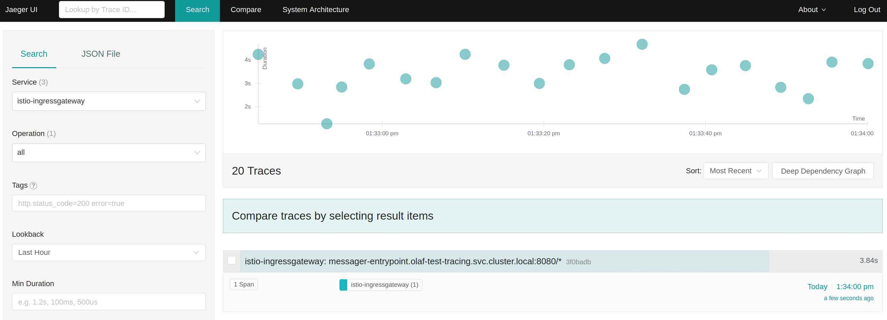
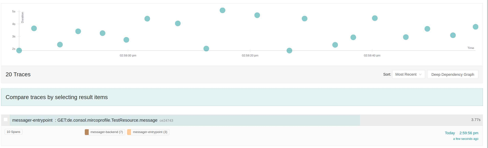

<div style="position: relative; float: right; margin-right: 1em; margin-bottom: 1em;"></div>

During a discussion with a customer, we talked about which steps are necessary to add an application to a services mesh. Which should be no big deal. Unfortunately, there is not a simple guideline how to do that for the Red Hat OpenShift Service Mesh. Furthermore, I was not sure how the requests for the application would look like in Jaeger. To clarify these points, I created a small application. Which I then deployed on OpenShift and added it to a service mesh control plane. This is the documentation of the steps that I have done.
<!--more-->
<br/>

## The demo application

The created demo application can call other applications and mocks internal processing. Hence, I'm fluent in Java, I created a Java REST-Service that takes a message and a counter. The response returns the message. The counter determines the number of recursive method calls. The environment variable `BACKEND_SERVICE_URL` points to a demo application instance that serves as a backend. If the environment variable is not defined, then a method is called recursively. The request flow of the application looks like this:


The source code of the REST-API looks like this:
```java
@Path("/")
public class TestResource {

    @Inject
    WorkerService worker;

    @GET
    @Path("message/{message}")
    @Produces(MediaType.TEXT_PLAIN)
    public String message(@PathParam String message, @QueryParam Integer counter) {
        if(message== null){
            message="hello";
        }
        if(counter== null){
            counter=10;
        }
        return worker.doStuff(message,counter);
    }
}
```

The source code of the service looks like this:
```java
@ApplicationScoped
public class WorkerService {

  @Inject
  @RestClient
  BackendService backendService;

  private static final Logger log = LoggerFactory.getLogger(WorkerService.class);

  public String doStuff(String message, int counter) {

    log.debug("Message: {}, counter: {}", message, counter);
    try {
      Thread.sleep((long) (Math.random() * 1000));
    } catch (InterruptedException e) {
    }
    if (counter == 0) {
      log.debug("Counter is zero, do nothing", message, counter);
      return message;
    }
    message = message + " " + counter;
    counter--;
    if (System.getenv("BACKEND_SERVICE_URL") != null) {
      log.debug("URL for backend service is: " + System.getenv("BACKEND_SERVICE_URL"));
      message = backendService.getMessage(message, counter);
    } else {
      log.debug("Call doStuff recursively");
      message = doStuff(message, counter);
    }
    return message;
  }
}
```

The source code of the backend service looks like this:
```java
@RegisterRestClient(configKey = "backend-service")
@RegisterProvider(LogClientRequestFilter.class)
public interface BackendService {

    @Path("/message/{message}")
    @GET
    @Produces("text/plain")
    public String getMessage(@PathParam String message,@QueryParam Integer counter);
}
```

As you can see, it is pretty straight forward and involves no magic. It is standard Java code using Quarkus as an Eclipse MicroProfile framework.

## Current setup of the application

The current setup of the application consists of two deployments. The first is the frontend, which takes the request and calls the backend application. This backend application is performing some calculations (calling recursively the function `doStuff`) and returning the result to the frontend. A route is exposing the frontend application.

A typical request and response looks like this:

```bash
$ curl messager-entrypoint-test-tracing.apps.ocp.acme.com/message/Hello%20World?counter=10
Hello World 10 9 8 7 6 5 4 3 2 1
```

## Add application to service mesh

We are at a point where we have an existing application up and running in one project. The Service mesh control plane is installed in another project. Let's bring them together by creating a resource of the type ServiceMeshMemberRoll. It contains the name of the service mesh control plane project and the projects of the service mesh data plane. The data plane consists only of the project with the demo application. Our setup looks like this:


apiVersion: maistra.io/v1
kind: ServiceMeshMemberRoll
metadata:
  name: default
  namespace: olaf-smcp
spec:
  members:
    - test-tracing


Line 5 contains the project for the control plane. The project of the data plane is defined in line 8. So far, so good. Let's call the demo application to test if everything still works. The result looks like this:

```bash
$ curl -v messager-entrypoint-test-tracing.apps.ocp.acme.com/message/Hello%20World?counter=10
*   Trying 10.4.10.20...
* TCP_NODELAY set
* Connected to messager-entrypoint-test-tracing.apps.ocp.acme.com (10.4.10.20) port 80 (#0)
> GET /message/Hello%20World?counter=10 HTTP/1.1
> Host: messager-entrypoint-test-tracing.apps.ocp.acme.com
> User-Agent: curl/7.58.0
> Accept: */*
> 
* HTTP 1.0, assume close after body
< HTTP/1.0 503 Service Unavailable
< pragma: no-cache
< cache-control: private, max-age=0, no-cache, no-store
< content-type: text/html
< 
....
```

So, what happened? When adding a project to the data plane, then the Istio Operator adds networks rules to the project. One rule allows pods from the control plane to access the project, which makes perfect sense. How else should Istio instrument the pods, if it doesn't have access to them? Another rule defines that namespaces with the label `network.openshift.io/policy-group: ingress` can access pods with the label `maistra.io/expose-route: "true"`. An example of this is the namespace with the OpenShift Router or ingress pods (`openshift-ingress`). Our deployments of the demo application don't have this label. Hence, the route can't access the demo application.

## Add labels to deployment and pod for route

To fix this, add the label `maistra.io/expose-route: "true"` to the deployments of the demo application. Do this with these commands:

```bash
$ oc patch deployment messager-backend -p '{"spec":{"template":{"metadata":{"labels":{"maistra.io/expose-route":"true"}}}}}'
deployment.apps/messager-backend patched
$ oc patch deployment messager-entrypoint -p '{"spec":{"template":{"metadata":{"labels":{"maistra.io/expose-route":"true"}}}}}'
deployment.apps/messager-backend patched
```

If the Router/Ingress controllers of your OpenShift cluster are running on the host network, you need to add the label `network.openshift.io/policy-group: ingress` to the default project as well. A detailed explanation for this is [here](https://docs.openshift.com/container-platform/4.4/networking/configuring-networkpolicy.html).

After this, our demo application can be called via the defined route.

---

*Remark:* Labeling the pods with `maistra.io/expose-route: "true"` is an optional step. If it is not required to access applications via a route, then you don't need to label the pods. In this case, I recommend to remove the routes of the application from the project as well.

---

## Add annotation for sidecar auto injection to deployment

Now we adjust the deployments, so that if a pod gets deployed then the Istio sidecar container is injected as well. Execute the following command to do this:

```bash
$ oc patch deployment messager-backend -p '{"spec":{"template":{"metadata":{"annotations":{"sidecar.istio.io/inject":"true"}}}}}'
deployment.apps/messager-backend patched
$ oc patch deployment messager-entrypoint -p '{"spec":{"template":{"metadata":{"annotations":{"sidecar.istio.io/inject":"true"}}}}}'
deployment.apps/messager-backend patched
```

This command will add an annotation `sidecar.istio.io/inject: "true"` to the pod template of the deployment. With this annotation, the service mesh control plane will inject Istio sidecar container in the pod. If you want, you can of course use `istioctl` to do this. After adding the annotation, a new deployment should be started. If this is not the case, delete the replica sets. After the restart of the pods they should contain the Istio sidecar. To verify this, get a list of all pods.

```bash
oc get po 
NAME                                   READY   STATUS    RESTARTS   AGE
messager-backend-85cc85d87-hsx8d       2/2     Running   0          4m26s
messager-entrypoint-7f75457fcc-f7qc7   2/2     Running   0          11s
```

The number of containers is increased from one (only our application container) to two (Istio sidecar plus application container).

## Create ingress gateway with new route

It is good practice to use the Istio ingress gateway instead of calling the application pod via route. For this, we need to add two resources:

1. A gateway: This determines the ingress point. Whether it is using HTTP or HTTPS, the hostname certificates and so on ...
1. A virtual service which routes the incoming traffic to a service.

The demo application looks like this:

```yaml
---
apiVersion: networking.istio.io/v1alpha3
kind: Gateway
metadata:
  name: tracingdemo-entrypoint
  namespace: test-tracing
spec:
  selector:
    istio: ingressgateway
  servers:
  - hosts:
    - messager-entrypoint2-test-tracing.apps.ocp.acme.com
    port:
      name: http
      number: 80
      protocol: HTTP
---
apiVersion: networking.istio.io/v1alpha3
kind: VirtualService
metadata:
  name: tracingdemo-entrypoint-vs
  namespace: test-tracing
spec:
  gateways:
  - tracingdemo-entrypoint
  hosts:
  - messager-entrypoint2-test-tracing.apps.ocp.acme.com
  http:
  - route:
    - destination:
        host: messager-entrypoint
        port:
          number: 8080
```

So lets add these two resources to the demo application namespaces:

```bash
oc create -f setup_gateway.yml
```

---

*Remark:* If your service mesh control plane hasn't enabled IOR, then you need to create a route that uses the defined hostname of the gateway and points to the ingress service of the service mesh control plane.

---

So, finally, the demo application can be called with the bare minimum Istio setup. Let's try to call the application URL from the command line:

```bash
$ curl messager-entrypoint2-test-tracing.apps.ocp.acme.com/message/Hello%20World?counter=10
Hello World 10 9 8 7 6 5 4 3 2 1
```

This looks good. The request and response is as expected.

## Display calls in Kiali and Jaeger

To view only a single request in Kiali is not feasible, let's put the previous command in a loop and run it:

```bash
$ while :; do curl messager-entrypoint2-test-tracing.apps.ocp.acme.com/message/Hello%20World?counter=10; sleep 1; done
Hello World 10 9 8 7 6 5 4 3 2 1Hello World 10 9 8 7 6 5 4 3 2 1Hello World 10 9 8 7 6 5 4 3 2 1
```

The graph for our demo in Kiali looks like this:


This matches the request flow described above. This is the point to start exploring more features of Istio and extent the configuration bit by bit. Let's have a look at Jaeger to see how an initial application without tracing support looks like. For a single request the graph looks like this in Jaeger:



The screenshot above shows that Jaeger gets only information about the request to the ingress gateway. It doesn't show any information about the frontend or backend application. This is not helpful for debugging an application call flow. Istio is generating HTTP headers for tracing. These headers are not processed by the Java application and used in calls of subsequent applications. So, Jaeger gets only information about the incoming request to the container and not how the applications are actually connected.

## How to fix the Jaeger issue?

How can we fix this issue? After some try and error, I came up with this modification in my source code, which will add the tracing HTTP header to outgoing calls as well as sent tracing information about internal calls to Jaeger:
The source code of the REST-API look like this:

@Traced
@Path("/")
public class TestResource {

    @Inject
    WorkerService worker;

    @GET
    @Path("message/{message}")
    @Produces(MediaType.TEXT_PLAIN)
    public String message(@PathParam String message, @QueryParam Integer counter) {
        if(message== null){
            message="hello";
        }
        if(counter== null){
            counter=10;
        }
        return worker.doStuff(message,counter);
    }
}


The source code of the service looks like this

@Traced
@ApplicationScoped
public class WorkerService {

  @Inject
  @RestClient
  BackendService backendService;

  private static final Logger log = LoggerFactory.getLogger(WorkerService.class);

  public String doStuff(String message, int counter) {

    log.debug("Message: {}, counter: {}", message, counter);
    try {
      Thread.sleep((long) (Math.random() * 1000));
    } catch (InterruptedException e) {
    }
    if (counter == 0) {
      log.debug("Counter is zero, do nothing", message, counter);
      return message;
    }
    message = message + " " + counter;
    counter--;
    if (System.getenv("BACKEND_SERVICE_URL") != null) {
      log.debug("URL for backend service is: " + System.getenv("BACKEND_SERVICE_URL"));
      message = backendService.getMessage(message, counter);
    } else {
      log.debug("Call doStuff recursively");
      message = doStuff(message, counter);
    }
    return message;
  }
}


The source code of the backend service looks like this:

@RegisterRestClient(configKey = "backend-service")
@RegisterProvider(LogClientRequestFilter.class)
@Traced
public interface BackendService {

    @Path("/message/{message}")
    @GET
    @Produces("text/plain")
    public String getMessage(@PathParam String message,@QueryParam Integer counter);
}


To submit the tracing information, we need to provide the application, the Jaeger Endpoint (URL of the Jaeger server) and the name of the service in Jaeger. Environment variables are providing these values. The `application.properties` looks like this:


quarkus.log.level=INFO
quarkus.log.category."de.consol".level=DEBUG
quarkus.log.console.format=%d{HH:mm:ss} %-5p traceId=%X{traceId}, spanId=%X{spanId}, sampled=%X{sampled} [%c{2.}] (%t{id}) %s%e%n
backend-service/mp-rest/url=${BACKEND_SERVICE_URL:http://localhost:8080} 
backend-service/mp-rest/scope=javax.inject.Singleton
quarkus.jaeger.service-name=${JAEGER_SERVICE_NAME:default-tracing-test}  
quarkus.jaeger.sampler-param=1


The OpenTracing annotations will take the tracing header parameter from request and add them to the outgoing request call. With this information, Jaeger can build a complete graph of the request, called application and Java methods.

After the changes in the source code, the Jaeger graph looks like this:



The graph for a single requests looks like this:


As you can see, the name of the spans has changed and also the number of spans (the number in the brackets).

## Summary

At this point in the article, you should have a sound idea of how to add an application to a control plane. We went through a couple of steps to instrument your applications in Istio and to take full advantage of Jaeger.

You can find more about the touched topic here:

* [Quarkus](https://quarkus.io/)
* [OpenTracing with Quarkus](https://quarkus.io/guides/opentracing)
* [Kiali](https://kiali.io/)
* [Jaeger](https://www.jaegertracing.io/)