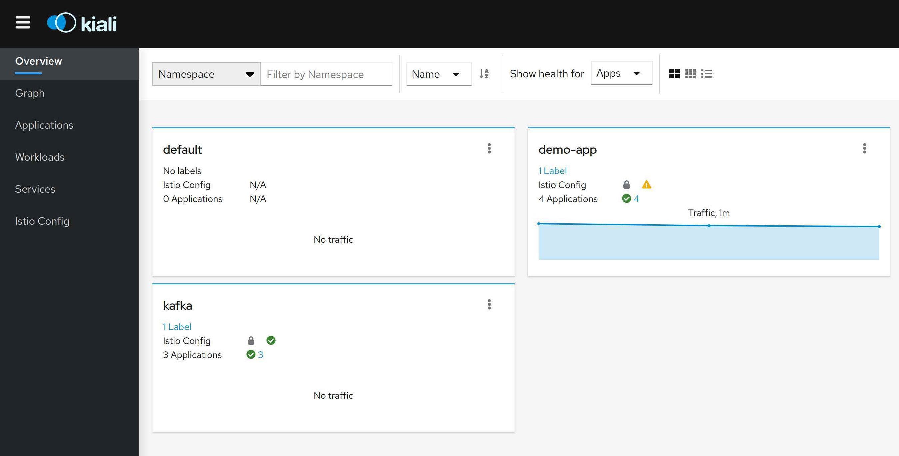

<div style="position: relative; float: right; margin-right: 1em; margin-bottom: 1em;"></div>

Last summer I watched the Red Hat master course about Kafka from <a href="https://twitter.com/sebi2706" target="blank">Sébastien Blanc</a>. The Kafka setup in Kubernetes presented in the course looked pretty easy. The Kafka client implementation for Java seemed to be easy as well. Furthermore, I wanted to use Kafka for a long time, so I got the idea to extend my Istio example. Each time a service is called, a message is sent to a topic. The service (implemented in Quarkus), as well as the Kafka cluster should be in an Istio Service Mesh and secured with mTLS. I found descriptions of <a href="https://twitter.com/jotak" target="blank">Joel Takvorian</a> that Kafka works with Istio, so I knew (or at least hoped) that my plan should work.

This article will describe the overall architecture of the example and which obstacles I encountered during deployment.
<!--more-->

## The demo application and Istio setup

The first step was to set up the environment for the demo application and for Istio. I forked the Red Hat Istio tutorial and added a bunch of yaml files that:

- deploy Istio and the demo application and the Istio configuration
  
for the demo application. This Istio configuration will make sure that every connection between the application is secured with mTLS by a set of `DestinationRule`s and `VirtualService`s. The configuration locks down undefined service calls by a bunch of `AuthorizationPolicy`s. This should be a more or less simplified setup for a real live application.

The yaml-files and scripts for the setup can be found in my fork of the Red Hat Istio tutorial. The details are left out for brevity.

## Setup of the Kafka cluster

To set up the Kafka cluster I used the <a href="https://strimzi.io/" target="blank">Strimzi project</a>. The setup was pretty straight forward. I configured the listener for the Broker that the Kafka traffic is not encrypted. The next step was to set up the Kafka cluster in a way that the Istio sidecar was injected to the Kafka Broker and Zookeeper. I added a couple of labels to the Kafka Broker, Zookeeper and Entity Operator to be compliant to the Istio notation. I also added the annotation `sidecar.istio.io/inject: "true"` to the Kafka Broker, Zookeeper and Entity Operator. With this annotation, the Istio sidecar container is injected to the pod in OpenShift. From my experience, to inject the Istio sidecar container to the Entity Operator is not causing any problems. The final configuration looks like this:


- apiVersion: kafka.strimzi.io/v1beta1
  kind: Kafka
  metadata:
    name: demo-app-log-cluster
    labels: {}
    namespace: ${DEPLOYMENT_NAMESPACE}
  spec:
    kafka:
      config:
        offsets.topic.replication.factor: 1
        transaction.state.log.replication.factor: 1
        transaction.state.log.min.isr: 1
        log.message.format.version: '2.5'
      version: 2.5.0
      storage:
        type: ephemeral
      replicas: 1
      listeners:
        plain: {}
        tls: {}
      authorization:
        type: simple
      template:
        statefulset:
          metadata:
            labels:
              app: kafka-cluster-demo-app-log
              version: 1.0
        pod:
          metadata:
            labels:
              app: kafka-cluster-demo-app-log
              version: 1.0
            annotations:
              sidecar.istio.io/inject: "true"
    entityOperator:
      topicOperator:
        reconciliationIntervalSeconds: 90
      userOperator:
        reconciliationIntervalSeconds: 120
      template:
        deployment:
          metadata:
            labels:
              app: kafka-entity-operator-demo-app-log
              version: 1.0
              app-type: entity-operator
        pod:
          metadata:
            labels:
              app: kafka-entity-operator-demo-app-log
              version: 1.0
              app-type: entity-operator
            annotations:
              sidecar.istio.io/inject: "true"
    zookeeper:
      storage:
        type: ephemeral
      replicas: 1
      template:
        statefulset:
          metadata:
            labels:
              app: kafka-zookeeper-demo-app-log
              version: 1.0
        pod:
          metadata:
            labels:
              app: kafka-zookeeper-demo-app-log
              version: 1.0
            annotations:
              sidecar.istio.io/inject: "true"


The highlighted sections are included to deploy Istio-compliant pods and to inject the sidecar container. The service of the Kafka Broker can only be used from within the OpenShift cluster. The configuration is not intended for a production use case, but only for testing purposes.

## Extend the demo application with a Kafka client

The next steps were to extend the customer-, preference- and the three recommendation-services that each time they are called, they send out messages to Kafka topics. I added a helper Pojo containing the information about the service calls. These changes to the services are all very similar. Here is the source code of the Pojo helper class:


@RegisterForReflection
public class RestServiceCall {

  public enum Services {
    CUSTOMER, PREFERENCE, RECOMMENDATION
  }

  private Services origin;
  private Services destination;
  private String originVersion;
  private String comment;

  public RestServiceCall() {

  }

  public RestServiceCall(final Services origin, final Services destination, final String originVersion,
      final String comment) {
    this.origin = origin;
    this.destination = destination;
    this.originVersion = originVersion;
    this.comment = comment;
  }

... getter and setter for the fields ...

}


As you can see, the helper class contains an origin, a destination, the version of the origin service and a comment.

Let us have a look at what has been changed in the customer service, for example:


@Path("/")
public class CustomerResource {

    private static final String VERSION="v1";

    private static final String RESPONSE_STRING_FORMAT = "customer => %s\n";

    private final Logger logger = LoggerFactory.getLogger(getClass());

    @Inject
    @RestClient
    PreferenceService preferenceService;

    @Inject
    @Channel("restServiceCall")
    Emitter<String> restServiceCall;

    @GET
    @Produces(MediaType.TEXT_PLAIN)
    public Response getCustomer() {
        try {
            String response = preferenceService.getPreference().trim();
            writeLogMessage(response);
            return Response.ok(String.format(RESPONSE_STRING_FORMAT, response)).build();
        } catch (WebApplicationException ex) {
            Response response = ex.getResponse();
            logger.warn("Non HTTP 20x trying to get the response from preference service: " + response.getStatus());
            return Response
                    .status(Response.Status.SERVICE_UNAVAILABLE)
                    .entity(String.format(RESPONSE_STRING_FORMAT,
                            String.format("Error: %d - %s", response.getStatus(), response.readEntity(String.class)))
                    )
                    .build();

        } catch (ProcessingException ex) {
            logger.warn("Exception trying to get the response from preference service.", ex);
            return Response
                    .status(Response.Status.SERVICE_UNAVAILABLE)
                    .entity(String.format(RESPONSE_STRING_FORMAT, ex.getCause().getClass().getSimpleName() + ": " + ex.getCause().getMessage()))
                    .build();
        }
    }

    private void writeLogMessage(String comment) {
        RestServiceCall serviceCall= new RestServiceCall(Services.CUSTOMER,Services.PREFERENCE,VERSION,comment);
        String out = JsonbBuilder.create().toJson(serviceCall);
        logger.info("RestServiceCall"+ out);
        KafkaRecord<Integer, String> msg = KafkaRecord.of(1, out);
        restServiceCall.send(msg);
    }
}


I added a field `restServiceCall` which is linked to a Kafka topic. The next change is the new method `writeLogMessage` which creates a `RestServiceCall` object, serializes it to JSON, creates a Kafka message with the key `1` and the value of the serialized RestServiceCall object. Finally, this message is sent to the Kafka Broker.

The configuration for the Kafka integration is done in the `application.properties`. The file looks like this:


com.redhat.developer.demos.customer.rest.PreferenceService/mp-rest/url=http://preference:8080

mp.messaging.outgoing.restServiceCall.connector=smallrye-kafka
mp.messaging.outgoing.restServiceCall.topic=demo-application-log-customer
mp.messaging.outgoing.restServiceCall.key.serializer=org.apache.kafka.common.serialization.IntegerSerializer
mp.messaging.outgoing.restServiceCall.value.serializer=org.apache.kafka.common.serialization.StringSerializer
mp.messaging.outgoing.restServiceCall.bootstrap.servers=${KAFKA_BOOTSTRAP_SERVER:demo-app-log-cluster-kafka-bootstrap.kafka.svc.cluster.local:9092}

quarkus.log.level=INFO
quarkus.log.category."de.consol".level=DEBUG
quarkus.log.console.format=%d{HH:mm:ss} %-5p traceId=%X{traceId}, spanId=%X{spanId}, sampled=%X{sampled} [%c{2.}] (%t{id}) %s%e%n
quarkus.jaeger.service-name=${JAEGER_SERVICE_NAME:customer}
quarkus.jaeger.propagation=${JAEGER_PROPAGATION:b3}
quarkus.jaeger.sampler-type=const
quarkus.jaeger.sampler-param=1
quarkus.jaeger.endpoint=${JAEGER_ENDPOINT:http://jaeger-collector.istio-system.svc:14268/api/traces}


 I just needed to define and configure the connector `smallrye-kafka`, which is the Kafka framework that I am using. In the next line is the topic to which the message is sent, followed by the used classes for serializing the key and value. Finally, the service or URL of the Kafka bootstrap server, which is the service of my Kafka cluster.

The changes in the other services look similar. With these changes I was able to connect my demo application to a Kafka cluster. Both were in the same Istio data plane. So far, so good. Let us add a consumer to the Kafka cluster.

## Add a Kafka consumer to the demo application

Just writing a message to a topic is a bit boring, so I decided to create a consumer printing out a small report, showing which services were used in the last couple of minutes. For this, I created a new service. The consumer service contains the class `RestServiceCall` and the actual Kafka consumer.

It looks like this:


@Traced
@ApplicationScoped
public class ConsumerResource {

    @ConfigProperty(name = "stream-topics")
    List<String> topics;

    @Produces
    public Topology getCalledServices() {
        Duration windowSizeMs = Duration.ofMinutes(5);
        Duration gracePeriodMs = Duration.ofMinutes(1);

        final StreamsBuilder builder = new StreamsBuilder();
            JsonbSerde<RestServiceCall> restServiceCallSerde = new JsonbSerde<>(RestServiceCall.class);

        builder.stream(
            topics,
            Consumed.with(Serdes.Integer(), restServiceCallSerde)
        )
        .groupBy(
            (key, value) -> value.emptyComment().getKey(),
            Grouped.with(
                Serdes.String(), /* key (note: type was modified) */
                restServiceCallSerde) /* value */)
        .windowedBy(TimeWindows.of(windowSizeMs).grace(gracePeriodMs).advanceBy(windowSizeMs))
        .reduce((aggValue, newValue) -> aggValue /* adder */)
        .suppress(Suppressed.untilWindowCloses(BufferConfig.unbounded()))
        .toStream()
        .print(Printed.toSysOut());
        // .to("demo-application-log-aggregated");
        return builder.build();

    }
}


The class is using KafkaStream to process the data. The processing is done in the method `getCalledServices`. In this method the messages for previous defined topics are grouped and aggregated with a duration of 5 minutes based on the new key (origin service + origin version + destination) and printed to system out.

When I made some requests the result looked liked this:

``` bash
│ 2021-01-13 16:17:44,674 INFO  [org.apa.kaf.str.sta.int.RocksDBTimestampedStore] (demo-application-log-consumer-aa8c2dec-5045-464d-a83d-40217651bb2e-StreamThread-1) Opening store KSTREAM-REDUCE-STATE-STORE-0000000002.1610539200000 in r │
│ [KTABLE-TOSTREAM-0000000009]: [CUSTOMER:v1:PREFERENCE@1610472600000/1610472900000], RestServiceCall [origin=CUSTOMER, destination=PREFERENCE, originVersion=v1, comment=]                                                                  │
│ [KTABLE-TOSTREAM-0000000009]: [PREFERENCE:v1:RECOMMENDATION@1610472600000/1610472900000], RestServiceCall [origin=PREFERENCE, destination=RECOMMENDATION, originVersion=v1, comment=]                                                      │
│ [KTABLE-TOSTREAM-0000000009]: [RECOMMENDATION:v1:@1610472600000/1610472900000], RestServiceCall [origin=RECOMMENDATION, destination=null, originVersion=v1, comment=] 
```

## Use mTLS for the complete data plane

With these changes the demo application is now using Kafka. The next step was to turn on mTLS for the connection between the demo application (including the new consumer service) and the Kafka cluster. I tried several configurations with `DestinationRule`s and `VirtualService`s which did not work. Enforcing mTLS via `PeerAuthentication` (one for each namespace), however, worked like a charm. The `PeerAuthentication`s look like this for my namespaces/projects:


...
- kind: PeerAuthentication
  apiVersion: security.istio.io/v1beta1
  metadata:
    name: demo-app
    namespace: demo-app
  spec:
    mtls:
      mode: STRICT
- kind: PeerAuthentication
  apiVersion: security.istio.io/v1beta1
  metadata:
    name: kafka
    namespace: kafka
  spec:
    mtls:
      mode: STRICT
...


I used `STRICT` mode to prohibit non-encrypted connections between the services and Kafka.
As I looked at Kiali, I could see that the two namespaces demo-app and Kafka are marked to be secure. This is indicated by the padlock in the row `Istio Config`. However, the connection (the blue arrows) between the services and the Kafka Broker seemed to be insecure (the padlock is missing). Are these connections secured or not?




My first check was to look at the envoy metrics of the customer (as an example) and see if they contain any indication if the Kafka messages were using mTLS. Here are the results:


...
# TYPE istio_tcp_connections_closed_total counter
istio_tcp_connections_closed_total{reporter="source",source_workload="consumer",
source_workload_namespace="demo-app",source_principal="spiffe://cluster.local/ns/demo-app/sa/consumer",
source_app="consumer",source_version="v1",destination_workload="demo-app-log-cluster-kafka",
destination_workload_namespace="kafka",destination_principal="spiffe://cluster.local/ns/kafka/sa/demo-app-log-cluster-kafka",
destination_app="kafka-cluster-demo-app-log",destination_version="1",
destination_service="demo-app-log-cluster-kafka-bootstrap.kafka.svc.cluster.local",
destination_service_name="demo-app-log-cluster-kafka-bootstrap",destination_service_namespace="kafka",
request_protocol="tcp",response_flags="-",connection_security_policy="unknown",
source_canonical_service="consumer",destination_canonical_service="kafka",
source_canonical_revision="v1",destination_canonical_revision="1"} 4
istio_tcp_connections_closed_total{reporter="source",source_workload="consumer",
source_workload_namespace="demo-app",source_principal="spiffe://cluster.local/ns/demo-app/sa/consumer",
source_app="consumer",source_version="v1",destination_workload="demo-app-log-cluster-kafka",
destination_workload_namespace="kafka",destination_principal="spiffe://cluster.local/ns/kafka/sa/demo-app-log-cluster-kafka",
destination_app="kafka-cluster-demo-app-log",destination_version="1",
destination_service="demo-app-log-cluster-kafka-brokers.kafka.svc.cluster.local",
destination_service_name="demo-app-log-cluster-kafka-brokers",destination_service_namespace="kafka",
request_protocol="tcp",response_flags="-",connection_security_policy="unknown",
source_canonical_service="consumer",destination_canonical_service="kafka",
source_canonical_revision="v1",destination_canonical_revision="1"} 0
...


This does not look like the connections with Kafka are using mTLS, otherwise the attribute `connection_security_policy` should have the value `mutual_tls`. Why it is not working would be speculation on my side. It is something that I need to investigate later on. I found another way to verify that the connection is secured or at least provides a strong indication. I opened a shell on one of the envoy proxies and queried the SSL certificate of the Kafka cluster. For the strict mode I got this reply:

``` bash
istio-proxy@customer-6794675f5-gkqxm:/$ openssl s_client -showcerts -servername \
-connect demo-app-log-cluster-kafka-bootstrap.kafka.svc.cluster.local:9092 </dev/null
CONNECTED(00000005)
depth=1 O = cluster.local
verify error:num=19:self signed certificate in certificate chain
---
Certificate chain
 0 s:
   i:O = cluster.local
-----BEGIN CERTIFICATE-----
MIIDMDCCAhigAwIBAgIQPx0b7hJGq1MYB/5IDwfNujANBgkqhkiG9w0BAQsFADAY
MRYwFAYDVQQKEw1jbHVzdGVyLmxvY2FsMB4XDTIxMDExMjEwMDQxNVoXDTIxMDEx
MzEwMDQxNVowADCCASIwDQYJKoZIhvcNAQEBBQADggEPADCCAQoCggEBALp5vGCo
fDvMFAwfMvL12yjM6kOuv+YW0fd2oijp7LyT44sxg9RO3twymcFSjrMQEQ4+wmKW
IAlWIATQ3ZZLuLIccsEl75rhrlc+yDLjuEt6IxSlGH6gDtV6jSZqZOqya/T3o590
k6nDmm8sgX6TqiJ5QE9sskwtHm9lorCGsPyNRzD73KcqaGKYE+SSQsqhtW6LeVTX
KOtDbEyKWG+OfRO4xLRgJ+D6zoXci4VFy2pgbNhdmLTej20Eqx4m/w3l4YXlb+qq
26SyF/SmEQJ73U8wDyz4qVCvz1/NAmHfundr9gUfUL+ilpwsmGonEalMa6TXP4pC
tqwjhoRcY07c3JMCAwEAAaOBjTCBijAOBgNVHQ8BAf8EBAMCBaAwHQYDVR0lBBYw
FAYIKwYBBQUHAwEGCCsGAQUFBwMCMAwGA1UdEwEB/wQCMAAwSwYDVR0RAQH/BEEw
P4Y9c3BpZmZlOi8vY2x1c3Rlci5sb2NhbC9ucy9rYWZrYS9zYS9kZW1vLWFwcC1s
b2ctY2x1c3Rlci1rYWZrYTANBgkqhkiG9w0BAQsFAAOCAQEAkmHbcSu3xBf4skvj
dI963zYKH58xa7RNIaMj15Abgz5yu1tMa/8LucKA0HidLeXhm4QZQxaHvZc2UQ1W
rjaSmkLbQ/fhgCTpsdU7zxRzIqbDw6nzFu8jtpYGLfmAk4gDvBA29/LwKons5/Sc
h3WA72gSxW4sRbEMtxYiclcokGf3inOBwPQabHVnjoerD1w4VKXjUuL3AZlPi3tm
wy67HPWcUqnk7D22db688g9C/PvyDbxI5jYsW6p0zxXpX8UQtdiAUvkxxSnWLY+8
l+Ly/PnADNA3bAFhriJHG5ho1J9mO8Ljj3wjg//pgWwoGDm5dFCpcp82yJh9c/qD
0Cy6sQ==
-----END CERTIFICATE-----
 1 s:O = cluster.local
   i:O = cluster.local
-----BEGIN CERTIFICATE-----
MIIC3TCCAcWgAwIBAgIQNdCHtNRWZoQ1es6cCrHtozANBgkqhkiG9w0BAQsFADAY
MRYwFAYDVQQKEw1jbHVzdGVyLmxvY2FsMB4XDTIxMDExMDEzNTU0NloXDTMxMDEw
ODEzNTU0NlowGDEWMBQGA1UEChMNY2x1c3Rlci5sb2NhbDCCASIwDQYJKoZIhvcN
AQEBBQADggEPADCCAQoCggEBALRo4wyHVqM0x7Qq0ECZCfMFi7rwnmhm3/DgHk9o
DDXMCXAWRLnBsW0RH2bfPahXyR/woXsEQTXrDRPTF2GaX0EiIJbC6YESR5gNeGe7
lqdMDzpe5q77F2hV2oXK5Y0fb+mEUOVRWXwtAqVuXtGemFSI+q3RP2/7JrSRcwnm
9qIri/6T6LNnYALQ9EiZ4WOEO8ojiizWQdlb1ms9RdVmsysLhvflqz+Dot40Z45y
IpJzKCLuOcrJ19rdTDHoVeQqXJlFjnQD9c8mRyzvB82u9LttjgapH+4YB+wlL6lg
flVysy2Fd2mzUXZl1vrBHpWBLGfuZsxBtnUU5CXnIAVOaOsCAwEAAaMjMCEwDgYD
VR0PAQH/BAQDAgIEMA8GA1UdEwEB/wQFMAMBAf8wDQYJKoZIhvcNAQELBQADggEB
ADNAer4bBVBgaUAK9xAeNdiIGEEg+v4cpb6b0Ncl5U7qbtbFYkp3YY4j5WBF5PdW
YX7aIDu1tPnQCSjIrvHl91FxnAezRVwbVo8vRA0tIs7PvGqibudlE6axCAnZxVUR
8IaVMki+TrzB83slJFSekAlJQW0BXotxquGMns6uOftsmkr/p//Cwi1m7hsxQZc7
6VvI8UE8Zh1McTV3jJF9N6DUmpzYocsPXedvSHxOL+8MLWX8rYgq61lUULTXDvpi
I2ssbw+MmsQ1ewnqjQwWgWJx2+3XB+tHo4fJbdR8nDqTQR880OZgsRaYsqEvXxRW
zZrPBTKarKdnmNXv/BYvrjA=
-----END CERTIFICATE-----
---
Server certificate
subject=

issuer=O = cluster.local

---
Acceptable client certificate CA names
O = cluster.local
Requested Signature Algorithms: ECDSA+SHA256:RSA-PSS+SHA256:RSA+SHA256:ECDSA+SHA384:RSA-PSS+SHA384:RSA+SHA384:RSA-PSS+SHA512:RSA+SHA512:RSA+SHA1
Shared Requested Signature Algorithms: ECDSA+SHA256:RSA-PSS+SHA256:RSA+SHA256:ECDSA+SHA384:RSA-PSS+SHA384:RSA+SHA384:RSA-PSS+SHA512:RSA+SHA512
Peer signing digest: SHA256
Peer signature type: RSA-PSS
Server Temp Key: X25519, 253 bits
---
SSL handshake has read 2117 bytes and written 420 bytes
Verification error: self signed certificate in certificate chain
---
New, TLSv1.3, Cipher is TLS_AES_256_GCM_SHA384
Server public key is 2048 bit
Secure Renegotiation IS NOT supported
Compression: NONE
Expansion: NONE
No ALPN negotiated
Early data was not sent
Verify return code: 19 (self signed certificate in certificate chain)
---
140430820438464:error:1409445C:SSL routines:ssl3_read_bytes:tlsv13 alert certificate required:../ssl/record/rec_layer_s3.c:1528:SSL alert number 116
```

The result shows the SSL certificate of the envoy proxy at the Kafka cluster. When I deleted the `PeerAuthentication` from the namespaces and ran the same query again, the result looked like this:

``` bash
istio-proxy@customer-6794675f5-gkqxm:/$ openssl s_client -showcerts -servername \
-connect demo-app-log-cluster-kafka-bootstrap.kafka.svc.cluster.local:9092 </dev/null
CONNECTED(00000005)
write:errno=0
---
no peer certificate available
---
No client certificate CA names sent
---
SSL handshake has read 0 bytes and written 310 bytes
Verification: OK
---
New, (NONE), Cipher is (NONE)
Secure Renegotiation IS NOT supported
Compression: NONE
Expansion: NONE
No ALPN negotiated
Early data was not sent
Verify return code: 0 (ok)
---
```

From my point of view, the connections to Kafka are really secured. Another way to verify this is to run `tcpdump` for the Kafka connections and search for bytes that indicate that an SSL handshake happened. To do that, I opened a shell in one of the envoy proxies and executed the following command:

``` bash
istio-proxy@customer-6794675f5-rggq9:/$ sudo tcpdump -ni eth0 \
 "tcp port 9092 and (tcp[((tcp[12] & 0xf0) >> 2)] = 0x16)"
tcpdump: verbose output suppressed, use -v or -vv for full protocol decode
listening on eth0, link-type EN10MB (Ethernet), capture size 262144 bytes
17:15:46.667232 IP 172.17.0.24.44050 > 172.17.0.11.9092: Flags [P.], seq 3560243409:3560245459, ack 1817826881, win 502, options [nop,nop,TS val 221777789 ecr 3018265579], length 2050
17:15:46.667727 IP 172.17.0.11.9092 > 172.17.0.24.44050: Flags [P.], seq 1:174, ack 2050, win 501, options [nop,nop,TS val 3018265579 ecr 221777789], length 173
```

The results show that an SSL handshake happened, when I started sending messages to the Kafka Broker. The best way, of course, would be to store a `tcpdump` in the envoy proxy and analyse it with Wireshark, for example. IMHO, the recording of the SSL handshake was proof enough that the connection is secure.

---

*Remark:* In order to execute `tcpdump`, you need to allow `allowPrivilegeEscalation` in the configmap `istio-sidecar-injector`.

---

## Add Kafka's RBAC to the application

From what I know, the Istio sidecar proxy is not forwarding the client certificate to Kafka, so I cannot use this option to combine Istio's `AuthorizationPolicy` with Kafka's RBAC. <a href="https://banzaicloud.com/products/supertubes/" target="blank">Banzai Cloud's Supertubes</a> provide a solution, but I wanted to stick to plain Kafka and Istio. I used the `plain` RBAC without transport encryption. The transport encryption is handled by Istio via mTLS. So, I settled with using `scram-sha-512` for authentication and added KafkaUser-resources to handle the authorization. Please note, that this is the definition of Strimzi. In other Kafka distributions the definition for this might look different.

The definition of the Kafka cluster including authentication looks like this:


  kind: Kafka
  metadata:
    name: demo-app-log-cluster
  spec:
...
      listeners:
        plain:
          authentication:
            type: scram-sha-512
      authorization:
        type: simple
      template:
      ...


The plain authentication is now using `scram-sha-512`. I did not need to specify an external ingress since the messages are generated from the same cluster. The authorization is `simple` with using ACLs in KafkaUsers. This is fine for my use case, because I do not need authorization via KeyCloak or Open Policy Agent.

I created one KafkaUser for each topic and a separate KafkaUser for the consumer. I only show one KafkaUser because the definition is quite long and similar for the other users.

``` yaml
- apiVersion: kafka.strimzi.io/v1beta1
  kind: KafkaUser
  metadata:
    name: customer-writer
    namespace: ${DEPLOYMENT_NAMESPACE}
    labels:
      strimzi.io/cluster: demo-app-log-cluster
  spec:
    authentication:
      type: scram-sha-512
    authorization:
      type: simple
      acls:
        # Example Producer Acls for topic demo-application-log-customer
        - resource:
            type: topic
            name: demo-application-log-customer
            patternType: literal
          operation: Write
          host: "*"
        - resource:
            type: topic
            name: demo-application-log-customer
            patternType: literal
          operation: Create
          host: "*"
        - resource:
            type: topic
            name: demo-application-log-customer
            patternType: literal
          operation: Describe
          host: "*"
```

This definition contains the authentication and authorization for the user, as well as the definition which operations it can perform on which topic.

## Extend demo application for Kafka authentication and authorization

So, I have set up the Kafka RBAC on my Kafka cluster. The next step is to configure the services of the demo application so that it knows which KafkaUser to use and where to get the credentials.
When creating a KafkaUser like above, Strimzi will create Kubernetes secrets with the credentials for the KafkaUser in the Kafka namespace. The first step is to copy the KafkaUser secrets in our demo-app namespace with this command:

``` bash
kubectl get secret --namespace kafka -l \
 strimzi.io/cluster=demo-app-log-cluster,strimzi.io/kind=KafkaUser \
 -o json | sed 's/"namespace"\:\s*"kafka"/"namespace": "demo-app"/g' | \
 jq 'del(.items[].metadata.ownerReferences)'| \
 kubectl apply -f - -n demo-app
```

---

Side note: If you have an easier command, please let me know.

---

The next step is to extend our Kafka configuration in the demo app to use the correct authentication and authorization with these properties. The result looks like this:


mp.messaging.outgoing.restServiceCall.connector=smallrye-kafka
mp.messaging.outgoing.restServiceCall.topic=demo-application-log-customer
mp.messaging.outgoing.restServiceCall.key.serializer=org.apache.kafka.common.serialization.IntegerSerializer
mp.messaging.outgoing.restServiceCall.value.serializer=org.apache.kafka.common.serialization.StringSerializer
mp.messaging.outgoing.restServiceCall.bootstrap.servers=${KAFKA_BOOTSTRAP_SERVER:demo-app-log-cluster-kafka-bootstrap.kafka.svc.cluster.local:9092}
mp.messaging.outgoing.restServiceCall.security.protocol=SASL_PLAINTEXT
mp.messaging.outgoing.restServiceCall.sasl.mechanism=SCRAM-SHA-512
mp.messaging.outgoing.restServiceCall.sasl.jaas.config=org.apache.kafka.common.security.scram.ScramLoginModule required \
	username="${KAFKA_USER_NAME:customer-writer}" \
	password="${KAFKA_PASSWORD}";


By this, I defined that I want to use `SASL_PLAINTEXT` as the protocol, and the mechanism to be `SCRAM-SHA-512`. Last but not least, which class should be used and what the user and password is. I am not a big fan of hard coding username and password in an application, so they are read from the environment variables of the container.

For the last step, I needed to modify the deployment to use the copied secret in an environment variable. With the necessary changes, the deployment looks like this:


...
        containers:
        - env:
          - name: JAVA_OPTIONS
            value: -Xms15m -Xmx15m -Xmn15m
          - name: KAFKA_BOOTSTRAP_SERVER
            value: demo-app-log-cluster-kafka-bootstrap.kafka.svc.cluster.local:9092
          - name: JAEGER_ENDPOINT
            value: http://jaeger-collector.istio-system.svc:14268/api/traces
          - name: KAFKA_PASSWORD
            valueFrom:
              secretKeyRef:
                name: customer-writer
                key: password
          image: quay.io/omeyer/istio-tutorial-customer:v1.0-kafka
...


This was the final setting. Now the demo application is using Kafka with RBAC. Both are in one data plane and are using mTLS for the communication.

## Pitfalls on the way

I first started the example on Red Hat OpenShift Service Mesh v1.12. This is based on Istio 1.4.6 and Kiali 1.17. The Istio version did not include a Kafka filter. The result was that the basic integration between Istio and Kafka with mTLS was not working. I found examples to use Kafka's mTLS instead of Istio's mTLS, by excluding Kafka traffic from Istio. I did not want to do this. I switched from OpenShift to minikube 1.19, deployed Istio 1.7.4 and the latest Kiali. I translated the OpenShift templates to plain yaml files. I did not encounter any problem with the basic setup in Kubernetes. I needed to adjust the configuration for the Istio sidecar since Kubernetes supports auto injection for all pods in a namespace, whereas in OpenShift we need to add an annotation for all pods where a sidecar should be injected. For some reason, I was not able to enforce mTLS with `DestinationRule`s between the namespaces of the demo-application and Kafka. I assume, that this has to do with the fact that the Kafka client is calling the pod directly via the `StateFullSet`'s `PodDNS`. When I enforced mTLS via `PeerAuthentication` between the projects, it worked as expected.

---

Update: Red Hat OpenShift Service Mesh v2.0 is using a newer version of Istio (1.6), but I still cannot enable mTLS for Kafka provided by Istio.

---

## Summary

I learned a lot about Kafka and Istio as I extended the demo application. I used only a small subset of Kafka's features, for example I did not tweak the sending and receiving of messages in the Kafka client. The integration between Kafka and Istio is possible, but it is not as easy as with applications that use HTTP or HTTPS. When using TCP based protocols, make sure that Istio is supporting them, otherwise the integration becomes challenging.

You can find the changes in my fork of the Red Hat tutorial. I created a document how to set up the environment for OpenShift and Kubernetes. The fork also contains a `Makefile` to build the applications and branches for each version of the recommendation service.

Following is a list of tutorials I used or that I found interesting:

- [Red Hat Istio tutorial](https://redhat-scholars.github.io/istio-tutorial/)
- [Link to my fork of the Red Hat Istio tutorial](https://github.com/olaf-meyer/istio-tutorial/tree/olaf-meyer-kafka-recommendation-v1)
- [Banzai SuperTubes](https://banzaicloud.com/products/supertubes/)
- [Capture SSL handshake](https://stackoverflow.com/questions/39624745/capture-only-ssl-handshake-with-tcpdump)