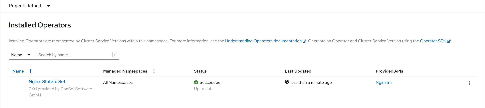
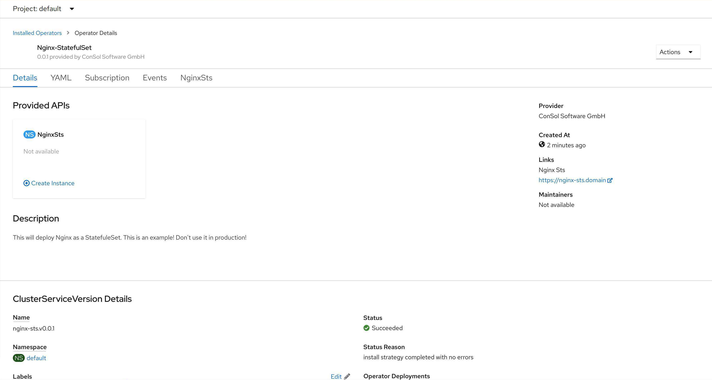
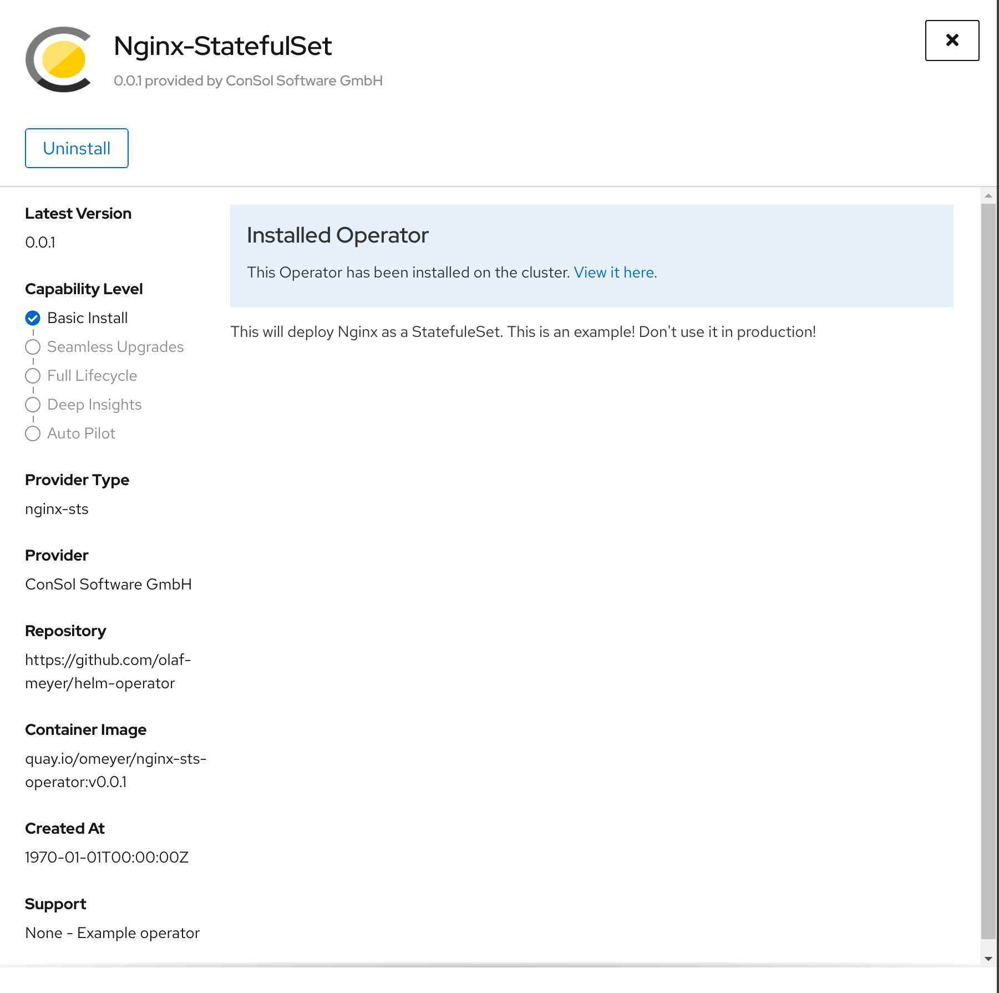
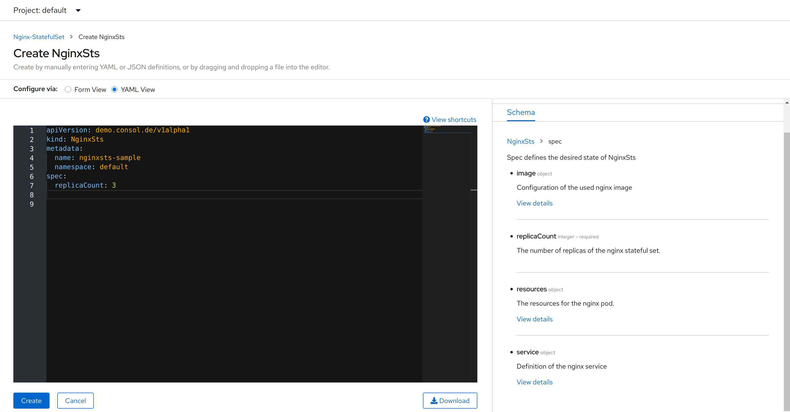

<div style="position: relative; float: right; margin-right: 1em; margin-bottom: 1em;"></div>

Some time ago, I started a project to create a Helm based operator for an OpenShift application. I used the Operator SDK to create the Helm operator. The Operator SDK documentation describes the parameters  pretty good, and it contains a simple tutorial. it does not, however, describe the complete development cycle. This article aims to describe everything from creating the operator to the point where you can upload your operator to <a href="https://operatorhub.io/" target="blank">OperatorHub.io</a>. We start with a basic Helm Chart. With this, you can install <a href="https://www.nginx.com/" target="blank">Nginx</a> as a <a href="https://docs.openshift.com/container-platform/4.7/rest_api/workloads_apis/statefulset-apps-v1.html" target="blank">StatefulSet</a>. You can find the source code in my github repo. Before we can start with creating an operator, we need to fulfill some prerequisites.
<!--more-->

## Prerequisite

In order to develop the operator, the following applications need to be installed:

- [git](https://git-scm.com/)
- [oc](https://docs.openshift.com/container-platform/4.7/cli_reference/openshift_cli/getting-started-cli.html#cli-installing-cli_cli-developer-commands)/[kubectl](https://kubernetes.io/docs/tasks/tools/) tool
- Connection to running OpenShift (4.x)/Kubernetes cluster
- Be logged in to a docker repository like quay.io
- [Helm (optional)](https://helm.sh/docs/intro/install/)

I spare you the details of how to download the applications and set them up. There are a lot of articles describing just that.

## Create the initial operator

We have everything set up and we got a <a href="https://github.com/olaf-meyer/helm-operator/tree/source-helm-chart" target="_blank">Nginx Helm Chart</a>. With this Chart, Nginx can be installed as a StatefulSet. But wouldn't it be much cooler to define a Nginx CRD and Kubernetes/OpenShift installs Nginx for us? If we change something in the CRD, the operator should take care of applying the changes, and it should make sure that a user can only change limited properties in the application. Of course, we could create an ansible- or go operator, but creating a Helm based operator might be more sufficient for a lot of use cases. Our source Helm Chart is in the subfolder `nginx-sts` of the current directory. Let's create the initial Helm operator. We do this with the command `operator-sdk init` and add the reference to the used source Helm Chart `--helm-chart=nginx-sts` and some metadata (For some reason it is not possible to describe the location of the Helm Chart like this `--helm-chart=./nginx-sts`.). In our case the command looks like this:

``` bash
$>operator-sdk init --plugins=helm.sdk.operatorframework.io/v1 --group=demo --domain=consol.de --helm-chart=nginx-sts --project-name=nginx-sts
Created helm-charts/nginx-sts
Generating RBAC rules
I0315 16:08:14.986191  199443 request.go:655] Throttling request took 1.004878088s, request: GET:https://api.crc.testing:6443/apis/coordination.k8s.io/v1beta1?timeout=32s
WARN[0004] The RBAC rules generated in config/rbac/role.yaml are based on the Chart's default manifest. Some rules may be missing for resources that are only enabled with custom values, and some existing rules may be overly broad. Double check the rules generated in config/rbac/role.yaml to ensure they meet the operator's permission requirements.
```

The Operator SDK is expecting that the (source) Helm Chart is located in a different folder than where this operator files will be generated. Because of this, we need to delete the original Helm Chart folder (`nginx-sts`). Don't worry, a copy of the Helm Chart has been created in the folder `helmcharts/nginx-sts`. We get a warning that we should double check the created roles and rolebinding. In our case, we don't need to worry about that. You can, however, check it if you want to.

The created file structure of the operator looks like this:

``` bash
$>tree
.
├── config
│   ├── crd
│   │   ├── bases
│   │   │   └── demo.consol.de_nginxsts.yaml
│   │   └── kustomization.yaml
│   ├── default
│   │   ├── kustomization.yaml
│   │   └── manager_auth_proxy_patch.yaml
│   ├── manager
│   │   ├── kustomization.yaml
│   │   └── manager.yaml
│   ├── prometheus
│   │   ├── kustomization.yaml
│   │   └── monitor.yaml
│   ├── rbac
│   │   ├── auth_proxy_client_clusterrole.yaml
│   │   ├── auth_proxy_role_binding.yaml
│   │   ├── auth_proxy_role.yaml
│   │   ├── auth_proxy_service.yaml
│   │   ├── kustomization.yaml
│   │   ├── leader_election_role_binding.yaml
│   │   ├── leader_election_role.yaml
│   │   ├── nginxsts_editor_role.yaml
│   │   ├── nginxsts_viewer_role.yaml
│   │   ├── role_binding.yaml
│   │   └── role.yaml
│   ├── samples
│   │   ├── demo_v1alpha1_nginxsts.yaml
│   │   └── kustomization.yaml
│   └── scorecard
│       ├── bases
│       │   └── config.yaml
│       ├── kustomization.yaml
│       └── patches
│           ├── basic.config.yaml
│           └── olm.config.yaml
├── Dockerfile
├── helm-charts
│   └── nginx-sts
│       ├── Chart.yaml
│       ├── templates
│       │   ├── configmap.yaml
│       │   ├── _helpers.tpl
│       │   ├── NOTES.txt
│       │   ├── route.yaml
│       │   ├── service.yaml
│       │   ├── stateful_sets.yaml
│       │   └── tests
│       │       └── test-connection.yaml
│       └── values.yaml
├── Makefile
├── PROJECT
├── README.md
└── watches.yaml

15 directories, 39 files
```

With these files, we will be able to create and deploy the operator in an OpenShift or Kubernetes cluster. First, let us modify the created CRD (config/crd/bases/demo.consol.de_nginxsts.yaml) to be more strict. By this, we can use input validation of Kubernetes when we create a resource. Also, we provide the end-user with a speaking documentation, so that we can focus on the fun parts, instead of working on support tickets. Anyhow, we are going to change the generated yaml from:

```yaml
---
apiVersion: apiextensions.k8s.io/v1
kind: CustomResourceDefinition
metadata:
  name: nginxsts.demo.consol.de
spec:
  group: demo.consol.de
  names:
    kind: NginxSts
    listKind: NginxStsList
    plural: nginxsts
    singular: nginxsts
  scope: Namespaced
  versions:
  - name: v1alpha1
    schema:
      openAPIV3Schema:
        description: NginxSts is the Schema for the nginxsts API
        properties:
          apiVersion:
            description: 'APIVersion defines the versioned schema of this representation
              of an object. Servers should convert recognized schemas to the latest
              internal value, and may reject unrecognized values. More info: https://git.k8s.io/community/contributors/devel/sig-architecture/api-conventions.md#resources'
            type: string
          kind:
            description: 'Kind is a string value representing the REST resource this
              object represents. Servers may infer this from the endpoint the client
              submits requests to. Cannot be updated. In CamelCase. More info: https://git.k8s.io/community/contributors/devel/sig-architecture/api-conventions.md#types-kinds'
            type: string
          metadata:
            type: object
          spec:
            description: Spec defines the desired state of NginxSts
            type: object
            x-kubernetes-preserve-unknown-fields: true
          status:
            description: Status defines the observed state of NginxSts
            type: object
            x-kubernetes-preserve-unknown-fields: true
        type: object
    served: true
    storage: true
    subresources:
      status: {}
```

To this strict and descriptive version (changes are highlighted):



---
apiVersion: apiextensions.k8s.io/v1
kind: CustomResourceDefinition
metadata:
  name: nginxsts.demo.consol.de
spec:
  group: demo.consol.de
  names:
    kind: NginxSts
    listKind: NginxStsList
    plural: nginxsts
    singular: nginxsts
  scope: Namespaced
  versions:
  - name: v1alpha1
    schema:
      openAPIV3Schema:
        description: NginxSts is the Schema for the nginxsts API
        properties:
          apiVersion:
            description: 'APIVersion defines the versioned schema of this representation
              of an object. Servers should convert recognized schemas to the latest
              internal value, and may reject unrecognized values. More info: https://git.k8s.io/community/contributors/devel/sig-architecture/api-conventions.md#resources'
            type: string
          kind:
            description: 'Kind is a string value representing the REST resource this
              object represents. Servers may infer this from the endpoint the client
              submits requests to. Cannot be updated. In CamelCase. More info: https://git.k8s.io/community/contributors/devel/sig-architecture/api-conventions.md#types-kinds'
            type: string
          metadata:
            type: object
          spec:
            description: Spec defines the desired state of NginxSts
            type: object
            required:
              - replicaCount
            properties:
              image:
                description: Configuration of the used Nginx image
                type: object
                properties:
                  pullPolicy:
                    description: 'Image pull policy. One of Always, Never, IfNotPresent. Defaults to Always if :latest tag is specified, or IfNotPresent otherwise. Cannot be updated. More info: https://kubernetes.io/docs/concepts/containers/images#updating-images'
                    type: string
                    pattern: '^(Always|Never|IfNotPresent)$'
                  repository:
                    description: The alternative image repository that should be used.
                    type: string
                  tag:
                    description: The alternative image tag that should be used.
                    type: string
              replicaCount:
                description: The number of replicas of the Nginx StatefulSet.
                type: integer
                default: 1
              resources:
                description: The resources for the Nginx pod.
                type: object
                properties:
                  limits: 
                    description: 'Limits describes the maximum amount of compute resources allowed. More info: https://kubernetes.io/docs/concepts/configuration/manage-compute-resources-container/'
                    type: object
                    properties:
                      cpu:
                        type: string
                        pattern: '^(\d+m|\d+(\.\d{1,3})?)$'
                      memory:
                        type: string
                        pattern: '^(\d+(e\d+)?|\d+(\.\d+)?(e\d+)?[EPTGMK]i?)$'
                  requests: 
                    description: 'Requests describes the minimum amount of compute
                          resources required. If Requests is omitted for a container,
                          it defaults to Limits if that is explicitly specified, otherwise
                          to an implementation-defined value. More info: https://kubernetes.io/docs/concepts/configuration/manage-compute-resources-container/'
                    type: object
                    properties:
                      cpu:
                        type: string
                        pattern: '^(\d+m|\d+(\.\d{1,3})?)$'
                      memory:
                        type: string
                        pattern: '^(\d+(e\d+)?|\d+(\.\d+)?(e\d+)?[EPTGMK]i?)$'
              service:
                description: Definition of the Nginx service
                type: object
                properties:
                  port:
                    description: The port that will be used for the Nginx container. The defined port number must be greater than 1024.
                    type: integer
                    minimum: 1024
                  type:
                    description: type determines how the Service is exposed. Defaults to ClusterIP. Valid options are ExternalName, ClusterIP, NodePort, and LoadBalancer
                    type: string
                    pattern: '^(ExternalName|ClusterIP|NodePort|LoadBalancer)$'
          status:
            description: Status defines the observed state of NginxSts
            type: object
            x-kubernetes-preserve-unknown-fields: true
        type: object
    served: true
    storage: true
    subresources:
      status: {}


Looks much better, doesn't it? A description about how to define CRD can be found [here](https://kubernetes.io/docs/tasks/extend-kubernetes/custom-resources/custom-resource-definitions/).

## Build and run the operator

Building and running the operator is fairly easy. We just need to execute the following command:

``` bash
export USERNAME=<quay-namespace>
make docker-build docker-push IMG=quay.io/$USERNAME/nginx-operator:v0.0.1
```

In my case it looks like this:

``` bash
export USERNAME=omeyer
make docker-build docker-push IMG=quay.io/$USERNAME/nginx-sts-operator:v0.0.1
```

After the upload is finished, run this command to deploy the operator manually:

``` bash
make deploy IMG=quay.io/$USERNAME/nginx-sts-operator:v0.0.1
```

---

**Hint**
Make sure that the destination registry is public and can be accessed without password. Also, note that the deployment of the operator has the `ImagePullPolicy: IfNotPresent`, which means that the operator image might not be reloaded when the operator images change. For changes in the operator, you either need to create new tags for each change or change the `ImagePullPolicy` to `Always`. I prefer the latter.

---

## Test the operator

To test the operator, we create a Nginx CRD in the cluster. This should, in return, cause the operator to deploy a new nginx-sts application. We can use the sample CRD in the folder `config/samples/demo_v1alpha1_nginxsts.yaml` to create the CRD. The file's content looks like this:

``` yaml
apiVersion: demo.consol.de/v1alpha1
kind: NginxSts
metadata:
  name: nginxsts-sample
spec:
  replicaCount: 3
```

To create the resource, we execute:

``` bash
oc apply -f config/samples/demo_v1alpha1_nginxsts.yaml
```

---

**Hint**
I modified the samples file, so that it contains only the replicas and not all other attributes from Helm's `values.yaml`. You can look up the complete CRD file in my GitHub repo.

---

As you can see, 3 replicas of the Nginx StatefulSet have been started, and I am able to connect to it. I call this a success.

``` bash
$> oc get pod -n default
NAME                          READY   STATUS    RESTARTS   AGE
nginxsts-sample-nginx-sts-0   1/1     Running   0          3h17m
nginxsts-sample-nginx-sts-1   1/1     Running   0          3h17m
nginxsts-sample-nginx-sts-2   1/1     Running   0          3h17m
$> oc get routes
NAME                        HOST/PORT                                            PATH   SERVICES                    PORT   TERMINATION   WILDCARD
nginxsts-sample-nginx-sts   nginxsts-sample-nginx-sts-default.apps-crc.testing          nginxsts-sample-nginx-sts   http                 None
$> curl -v nginxsts-sample-nginx-sts-default.apps-crc.testing
...
* Connected to nginxsts-sample-nginx-sts-default.apps-crc.testing (192.168.130.11) port 80 (#0)
> GET / HTTP/1.1
> Host: nginxsts-sample-nginx-sts-default.apps-crc.testing
> User-Agent: curl/7.68.0
> Accept: */*
> 
* Mark bundle as not supporting multiuse
< HTTP/1.1 200 OK
< Server: nginx/1.19.7
< Date: Thu, 18 Mar 2021 12:09:25 GMT
< Content-Type: text/html
< Content-Length: 612
< Last-Modified: Tue, 16 Feb 2021 16:25:34 GMT
< ETag: "602bf1fe-264"
< X-PodName: nginxsts-sample-nginx-sts-0
< Accept-Ranges: bytes
< Set-Cookie: 25f93612584c1f45a174dd9568118c21=b331a06e7f6d6d15096677f0cf1b21fe; path=/; HttpOnly
< Cache-control: private
...
```

## Create an operator bundle

So far, we created all resources to deploy the operator. Based on our CRD this operator is able to deploy applications. If we just need that, we can wrap everything up and call it a day. But wouldn't it be nice, if our customers could use OLM (Operator Lifecycle Manager) to find our operator in the <a href="https://operatorhub.io/" target="blank">OperatorHub.io</a> and install it on their cluster through just some clicks? I think so, too. Let's get it done and let's create the resources needed .

---

**Hint** 
If you are using an OpenShift 4.x cluster you do not need to install OLM (Operator Lifecycle Manager) on your cluster (otherwise you can find a description of how to do that [here](https://sdk.operatorframework.io/docs/olm-integration/quickstart-bundle/#enabling-olm)). It comes with the OLM included and configured. To test that it works properly, run:

``` bash
$>operator-sdk olm status --olm-namespace openshift-operator-lifecycle-manager
INFO[0002] Fetching CRDs for version "0.16.1"           
INFO[0002] Using locally stored resource manifests      
INFO[0002] Successfully got OLM status for version "0.16.1" 

NAME                                            NAMESPACE    KIND                        STATUS
operators.operators.coreos.com                               CustomResourceDefinition    Installed
operatorgroups.operators.coreos.com                          CustomResourceDefinition    Installed
installplans.operators.coreos.com                            CustomResourceDefinition    Installed
clusterserviceversions.operators.coreos.com                  CustomResourceDefinition    Installed
subscriptions.operators.coreos.com                           CustomResourceDefinition    Installed
system:controller:operator-lifecycle-manager                 ClusterRole                 Installed
aggregate-olm-edit                                           ClusterRole                 Installed
aggregate-olm-view                                           ClusterRole                 Installed
catalogsources.operators.coreos.com                          CustomResourceDefinition    Installed
olm                                                          Namespace                   namespaces "olm" not found
olm-operator-binding-olm                                     ClusterRoleBinding          clusterrolebindings.rbac.authorization.k8s.io "olm-operator-binding-olm" not found
olm-operator                                    olm          Deployment                  deployments.apps "olm-operator" not found
catalog-operator                                olm          Deployment                  deployments.apps "catalog-operator" not found
olm-operator-serviceaccount                     olm          ServiceAccount              serviceaccounts "olm-operator-serviceaccount" not found
operators                                                    Namespace                   namespaces "operators" not found
global-operators                                operators    OperatorGroup               operatorgroups.operators.coreos.com "global-operators" not found
olm-operators                                   olm          OperatorGroup               operatorgroups.operators.coreos.com "olm-operators" not found
packageserver                                   olm          ClusterServiceVersion       clusterserviceversions.operators.coreos.com "packageserver" not found
operatorhubio-catalog                           olm          CatalogSource               catalogsources.operators.coreos.com "operatorhubio-catalog" not found

```

---

Let's initialize the resources that are needed to add our operator to <a href="https://operatorhub.io/" target="blank">OperatorHub.io</a> by executing this command

``` bash
make bundle IMG=quay.io/$USERNAME/nginx-sts-operator:v0.0.1
operator-sdk generate kustomize manifests -q

Display name for the operator (required): 
> Nginx-StatefulSet

Description for the operator (required): 
> This will deploy Nginx as a StatefulSet. This is an example! Don't use it in production!

Provider's name for the operator (required): 
> ConSol Software GmbH

Any relevant URL for the provider name (optional): 
> https://www.consol.de/                                

Comma-separated list of keywords for your operator (required): 
> example,nginx

Comma-separated list of maintainers and their emails (e.g. 'name1:email1, name2:email2') (required): 
> olaf.meyer@consol.de
cd config/manager && /home/olaf/Projects/operator/helm_operator/bin/kustomize edit set image controller=quay.io/omeyer/nginx-sts-operator:v0.0.1
/home/olaf/Projects/operator/helm_operator/bin/kustomize build config/manifests | operator-sdk generate bundle -q --overwrite --version 0.0.1  
operator-sdk bundle validate ./bundle
INFO[0000] Found annotations file                        bundle-dir=bundle container-tool=docker
INFO[0000] Could not find optional dependencies file     bundle-dir=bundle container-tool=docker
INFO[0000] All validation tests have completed successfully
```

What happened after we have executed this command? Let's have a look

``` bash
$>tree
...
├── bundle
│   ├── manifests
│   │   ├── demo.consol.de_nginxsts.yaml
│   │   ├── nginx-sts.clusterserviceversion.yaml
│   │   ├── nginx-sts-controller-manager-metrics-service_v1_service.yaml
│   │   └── nginx-sts-metrics-reader_rbac.authorization.k8s.io_v1_clusterrole.yaml
│   ├── metadata
│   │   └── annotations.yaml
│   └── tests
│       └── scorecard
│           └── config.yaml
├── bundle.Dockerfile
├── config
│   ├── crd
...
```

A new directory `bundle` and a file `bundle.Dockerfile` have been created. Before we have a closer look at these files, let's build and deploy the bundle operator and see how it looks like in OpenShift.

To build the bundle operator, we run these commands:

``` bash
export BUNDLE_IMG="quay.io/$USERNAME/nginx-sts-operator-bundle:v0.0.1"
make bundle-build BUNDLE_IMG=$BUNDLE_IMG
make docker-push IMG=$BUNDLE_IMG
```

After this, the bundle operator has been uploaded to the specified quay.io repo. Now we need to deploy it with this command:

``` bash
$>operator-sdk run bundle $BUNDLE_IMG
INFO[0040] Successfully created registry pod: quay-io-omeyer-nginx-sts-operator-bundle-v0-0-1 
INFO[0040] Created CatalogSource: nginx-sts-catalog     
INFO[0040] OperatorGroup "operator-sdk-og" created      
INFO[0040] Created Subscription: nginx-sts-v0-0-1-sub   
INFO[0045] Approved InstallPlan install-8j9wf for the Subscription: nginx-sts-v0-0-1-sub 
INFO[0045] Waiting for ClusterServiceVersion "default/nginx-sts.v0.0.1" to reach 'Succeeded' phase 
INFO[0045]   Waiting for ClusterServiceVersion "default/nginx-sts.v0.0.1" to appear 
FATA[0120] Failed to run bundle: error waiting for CSV to install: timed out waiting for the condition 
```

It has failed?! Let's see for ourselves.

Looks like the operator has successfully been installed. It might just have taken a bit too long.





We are now able to create a new CRD. The form and yaml view look very good for a starting point.


Let's do a couple of changes:

- The url `https://nginx-sts.domain` and description for it is not correct.
- There is no short description for the operator.
- And so on ...

To do these changes, let us have a look at the folder `bundle/manifests`. It contains 4 files:

1. `demo.consol.de_nginxsts.yaml` is the file for the definition of the `nginxsts.demo.consol.de` CRD.
1. `nginx-sts.clusterserviceversion.yaml` is the ClusterServiceVersion (like stated in the name) and is used by the OLM to set up the `nginx-sts` operator. Furthermore, it contains all information that is used when installing and / or modifying the operator.
1. The other two files are used to monitor the operator.

## Modify the cluster service version

To change the information that is displayed in OpenShift, we need to modify the cluster service version file. However, there are two cluster service versions in the project. The file `bundle/manifests/nginx-sts.clusterserviceversion.yaml` has been created by the file `config/manifests/bases/nginx-sts.clusterserviceversion.yaml`. If we modify the latter and run `make bundle IMG=quay.io/$USERNAME/nginx-sts-operator:v0.0.1` again, the changes will be transferred to bundle file. So let us to this.

I added the highlighted lines to the `nginx-sts.clusterserviceversion.yaml`:


apiVersion: operators.coreos.com/v1alpha1
kind: ClusterServiceVersion
metadata:
  annotations:
    alm-examples: '[]'
    capabilities: Basic Install
    categories: Example operator
    containerImage: quay.io/omeyer/nginx-sts-operator:v0.0.1
    createdAt: "1970-01-01T00:00:00Z"
    description: This will deploy Nginx as a StatefulSet. This is an example! Don't use it in production!
    repository: https://github.com/olaf-meyer/helm-operator
    support: None - Example operator
  name: nginx-sts.v0.0.0
  namespace: placeholder
spec:
  apiservicedefinitions: {}
  customresourcedefinitions:
    owned:
    - description: Definition how to setup the Nginx as a StatefulSet.
      displayName: Nginx-StatefulSet
      kind: NginxSts
      name: nginxsts.demo.consol.de
      resources:
      - kind: Route
        name: ""
        version: route.openshift.io/v1
      - kind: Service
        name: ""
        version: v1
      - kind: StatefulSet
        name: ""
        version: v1
      - kind: Pod
        name: ""
        version: v1
      specDescriptors:
      - description: Limits describes the minimum/maximum amount of compute resources required/allowed
        displayName: Resource Requirements
        path: resources
        x-descriptors:
        - urn:alm:descriptor:com.tectonic.ui:resourceRequirements
      version: v1alpha1
  description: This will deploy Nginx as a StatefulSet. This is an example! Don't use it in production!
  displayName: Nginx-StatefulSet
  icon:
  - base64data: iVBORw0KGgoAAAANSUhEUgAAAQIAAAEsCAYAAAAo6b0WAAAxjUlEQVR42u19CXxU5dX+C8gmLrjUqkVFRcg6EVGUoi1arSKuVepn60JdoqIhMyEkM3dJxr1KP1Ra6x+1tlY/9Qv6uS
  .....
    mediatype: image/png
  install:
    spec:
      deployments: null
    strategy: ""
  installModes:
  - supported: false
    type: OwnNamespace
  - supported: false
    type: SingleNamespace
  - supported: false
    type: MultiNamespace
  - supported: true
    type: AllNamespaces
  keywords:
  - example
  - nginx
  links:
  - name: ConSol Software GmbH
    url: https://www.consol.de/
  maintainers:
  - email: olaf.meyer@consol.de
    name: Olaf Meyer
  maturity: alpha
  provider:
    name: ConSol Software GmbH
    url: https://www.consol.de/
  version: 0.0.0


Most changes are self explaining. There are a couple of changes that I want to talk about:

1. The whole attribute `customresourcedefinitions` is used for displaying the defined CRD in the Web-GUI. It is not intended as a replacement of the CRD definition. The list of resources doesn't have to be complete, but should contain the most import resources for your application. Also, you can define which kinds of controls should be used. With this we can use the OpenShift resource form for entering the limits and requests.
1. The icon attribute is truncated because even a small image can become too long for demo purposes. You can find the complete definition in my GitHub Repo for this article.
1. In a production scenario I would calculate the attribute `createdAt` and `containerImage` in a CI/CD pipeline.

There is one more point that I would like to change in the generated `ClusterServiceVersion` file. The deployment is using the default service account, which can lead to some problems. We are going to change that.

For this, we need to create a service account `nginx-sts-controller-manager` in the file `service_account.yaml` in the folder `config/rbac`. The next step is to add this service account to the `kustomization.yaml`, so that it will be processed when we update the bundle files. After this, we replace the `default` service account with `nginx-sts-controller-manager` in the files `config/rbac/auth_proxy_role_binding.yaml`, `config/rbac/leader_election_role_binding.yaml` and `config/rbac/role_binding.yaml`. The last part is to use this service account in the deployment of the operator. For this, we add the line `serviceAccountName: nginx-sts-controller-manager` to the file `config/manager/manager.yaml`.

If we now run the command `make bundle IMG=quay.io/$USERNAME/nginx-sts-operator:v0.0.1`, the files in the folder `bundle/manifests` will contain our changes and we are ready to test the latest version.

Because we have changed a lot, we need to `uninstall` the current operator. The `cleanup` command requires a parameter `operatorPackageName`. You can find this value i.e. in the file `bundle/metadata/annotations.yaml` in the value `operators.operatorframework.io.bundle.package.v1`. In our case this is `nginx-sts`. So the cleanup command looks like this:

``` bash
operator-sdk cleanup nginx-sts
```

After this, we can rebuild the container image and deploy it

``` bash
export USERNAME=omeyer
export BUNDLE_IMG="quay.io/$USERNAME/nginx-sts-operator-bundle:v0.0.1"
make bundle IMG=quay.io/$USERNAME/nginx-sts-operator:v0.0.1
make bundle-build BUNDLE_IMG=$BUNDLE_IMG
make docker-push IMG=$BUNDLE_IMG
operator-sdk run bundle $BUNDLE_IMG
```

## Verify the new version

Let's have a look at the new version of the operator. From my point of view the open points are closed. In the installed operator overview there are neither empty fields nor fields filled with dummy values.



On the operator overview page the description looks fine as well and shows the ConSol Logo.


The last point is the changed editor for entering the resources of the pod. On the right hand side we get a documentation of the CRD. Even if it is not shown in the image, we have an auto completion in the editor as well.



All looks good ...

## Create Scorecard tests

Almost! We should add tests to the operator to further automate the build and deployment of the operator.

Basic tests are already included. We can execute them with the command:

``` bash
operator-sdk scorecard bundle
--------------------------------------------------------------------------------
Image:      quay.io/operator-framework/scorecard-test:v1.5.0
Entrypoint: [scorecard-test olm-crds-have-validation]
Labels:
	"suite":"olm"
	"test":"olm-crds-have-validation-test"
Results:
	Name: olm-crds-have-validation
	State: pass

	Log:
		Loaded 1 Custom Resources from alm-examples
		Loaded CustomresourceDefinitions: [&CustomResourceDefinition{...}]


--------------------------------------------------------------------------------
Image:      quay.io/operator-framework/scorecard-test:v1.5.0
Entrypoint: [scorecard-test basic-check-spec]
Labels:
	"suite":"basic"
	"test":"basic-check-spec-test"
Results:
	Name: basic-check-spec
	State: pass


--------------------------------------------------------------------------------
Image:      quay.io/operator-framework/scorecard-test:v1.5.0
Entrypoint: [scorecard-test olm-crds-have-resources]
Labels:
	"suite":"olm"
	"test":"olm-crds-have-resources-test"
Results:
	Name: olm-crds-have-resources
	State: pass

	Log:
		Loaded ClusterServiceVersion: nginx-sts.v0.0.1


--------------------------------------------------------------------------------
Image:      quay.io/operator-framework/scorecard-test:v1.5.0
Entrypoint: [scorecard-test olm-status-descriptors]
Labels:
	"suite":"olm"
	"test":"olm-status-descriptors-test"
Results:
	Name: olm-status-descriptors
	State: fail

	Errors:
		nginxsts.demo.consol.de does not have a status descriptor
	Log:
		Loaded ClusterServiceVersion: nginx-sts.v0.0.1
		Loaded 1 Custom Resources from alm-examples


--------------------------------------------------------------------------------
Image:      quay.io/operator-framework/scorecard-test:v1.5.0
Entrypoint: [scorecard-test olm-spec-descriptors]
Labels:
	"suite":"olm"
	"test":"olm-spec-descriptors-test"
Results:
	Name: olm-spec-descriptors
	State: fail

	Suggestions:
		Add a spec descriptor for replicaCount
	Errors:
		replicaCount does not have a spec descriptor
	Log:
		Loaded ClusterServiceVersion: nginx-sts.v0.0.1
		Loaded 1 Custom Resources from alm-examples


--------------------------------------------------------------------------------
Image:      quay.io/operator-framework/scorecard-test:v1.5.0
Entrypoint: [scorecard-test olm-bundle-validation]
Labels:
	"suite":"olm"
	"test":"olm-bundle-validation-test"
Results:
	Name: olm-bundle-validation
	State: pass

	Log:
		time="2021-03-22T16:33:04Z" level=debug msg="Found manifests directory" name=bundle-test
		time="2021-03-22T16:33:04Z" level=debug msg="Found metadata directory" name=bundle-test
		time="2021-03-22T16:33:04Z" level=debug msg="Getting mediaType info from manifests directory" name=bundle-test
		time="2021-03-22T16:33:04Z" level=info msg="Found annotations file" name=bundle-test
		time="2021-03-22T16:33:04Z" level=info msg="Could not find optional dependencies file" name=bundle-test

```

Looks like there are two errors. It seems that we should provide a description for replicaCount and for the status in the cluster service version. Let's fix that.

To provide a description for replicaCount, add the following section to `config/manifests/bases/nginx-sts.clusterserviceversion.yaml`

``` yaml
...
      specDescriptors:
      - description: The number of replicas of the Nginx StatefulSet.
        displayName: Replicas
        path: replicaCount
        x-descriptors:
        - urn:alm:descriptor:com.tectonic.ui:podCount
      - description: Limits describes the minimum/maximum amount of compute resources required/allowed
        displayName: Resource Requirements
        path: resources
        x-descriptors:
        - urn:alm:descriptor:com.tectonic.ui:resourceRequirements
      version: v1alpha1
...
```

With this change we do not only resolve the error but also change the style of the input field. This is quite neat.


Originally, I was under the impression that the second error `nginxsts.demo.consol.de does not have a status descriptor` could not be fixed. In the status descriptor we can define which values will be used in the status attribute. Also, we define which attribute and how it is displayed on the first tab (Display view). The values in the status attribute are written by the Helm operator and at the time being, it is not possible to change them. The Helm operator writes the attributes `conditions`, `manifest` and `name` to the status. Using the attribute `conditions` in the `statusDescriptors` is not working, because the condition is already displayed at the end of the page. The content of the attribute `manifest` is too long. Let's use the attribute `name` in the `statusDescriptors`:

``` yaml
...
      statusDescriptors:
      - description: Name of the created application
        displayName: My-Application name
        path: deployedRelease.name
        x-descriptors:
          - 'urn:alm:descriptor:text'
...
```

The result looks like this:


If we rerun the Scorecard tests, all tests pass.

---

Hint: To test the changes, we deleted the operator. After this, I recreated the bundle definition and rebuilt the operator and deployed it. The following commands were used:

``` bash
operator-sdk cleanup nginx-sts
export USERNAME=omeyer
export BUNDLE_IMG="quay.io/$USERNAME/nginx-sts-operator-bundle:v0.0.1"
make bundle IMG=quay.io/$USERNAME/nginx-sts-operator:v0.0.1
make bundle-build BUNDLE_IMG=$BUNDLE_IMG
make docker-push IMG=$BUNDLE_IMG
operator-sdk run bundle $BUNDLE_IMG
```

---

## Create example integration test

So far, the tests verified only the cluster service version. What is missing is a test to check whether the operator itself is working. For this kind of tests the Operator SDK offers an integration of the KUTTL test framework.

At the time being, it is required to make the changes for the KUTTL test directly in folder `bundle` and not in the folder `config`. If we run the command `make bundle` our changes for the KUTTL test are not overwritten.

Let's create a simple KUTTL test case. First we need to create a KUTTL configuration file `kuttl-test.yaml` in a new folder `bundle/tests/scorecard/kuttl`. The content of the configuration file `kuttl-test.yaml` looks like this:

``` yaml
apiVersion: kudo.dev/v1beta1
kind: TestSuite
parallel: 4
timeout: 120
startControlPlane: false
```

This is the default configuration of the Operator SDK. It just configures the number of parallel test executions, and the amount of time the KUTTL test is allowed to take. Next, we create a folder `install-nginx-sts` for grouping the tests. In this folder we add two files. With the first file `00-install-nginx-sts.yaml` we set up the test case. In our case this is an Nginx StatefulSet with 4 replicas. It looks like this:

```yaml
apiVersion: demo.consol.de/v1alpha1
kind: NginxSts
metadata:
  name: nginxsts-sample
  namespace: default
spec:
  replicaCount: 4
```

In the second file `00-assert.yaml` we defined how the result should look like. This means that the StatefulSet with 4 replicas is running. The file looks like this:

```yaml
apiVersion: apps/v1
kind: StatefulSet
metadata:
  name: nginxsts-sample-nginx-sts
  namespace: default
status:
  readyReplicas: 4
```

In the last step we need to add the KUTTL tests to the Scorecard tests by adding the following line to the file `bundle/tests/scorecard/config.yaml`:


...
  - entrypoint:
    - scorecard-test
    - olm-status-descriptors
    image: quay.io/operator-framework/scorecard-test:v1.5.0
    labels:
      suite: olm
      test: olm-status-descriptors-test
  - image: quay.io/operator-framework/scorecard-test-kuttl:v1.5.0
    labels:
      suite: kuttlsuite
      test: kuttltest1


When calling the Scorecard tests, we need to provide the service account with sufficient permissions to create the nginx-sts CRD. Additionally, we need to add the attribute `--wait-time=60s` in order to wait a bit longer till Nginx is deployed (It is deploying quite quick, but not that quick that it passes the test). So the command to run the Scorecard and KUTTL tests looks like this:

``` bash
operator-sdk scorecard bundle --service-account=nginx-sts-nginx-sts-controller-manager --wait-time=60s
```

## How to upload operator to OperatorHub.io

My initial plan was to  add a section how to upload our operator to <a href="https://operatorhub.io/" target="blank">OperatorHub.io</a>. After reviewing the documentation, however, I came to the conclusion that the details with all hooks and cranks need to be explained in a separate article. Even that would only rephrase the documentation, and it does not give much benefit.

You can find the documentation, how to commit a community Kubernetes or OpenShift operator, here: [Community operators](https://operator-framework.github.io/community-operators/contributing-prerequisites/).
If you want to create an OpenShift operator that is certified by Red Hat, the documentation for this can be found here: [Certified operator build guide](https://redhat-connect.gitbook.io/certified-operator-guide/what-if-ive-already-published-a-community-operator)

## Best practice

I do not want to get into the details of best practice for Helm Charts. For a productive operator, we would create more test cases which verify that installations with different settings still work. If the operator is using stateful data, we would also spend some time thinking about how an update of this data can be handled. These are all application-centric best practices. There are some points that you should consider for your operator:

1. Some clusters may have very little access to the outside or have poor network connectivity. Because of this, the operator might be pulled from a different repository. The created operator should support the modification of the image repository. You can find more information on this topic <a href="https://sdk.operatorframework.io/docs/building-operators/helm/reference/advanced_features/annotations/" target="blank">here</a>.
1. Add support for http/https proxies to the operator and to the application itself. In the enterprise environment (at least in Germany) it is not uncommon to use a proxy to connect to resources that are located outside the cluster.
1. This is not a best practice per se, but always check the log of the operator and the content of the status attribute of the CRD. It happened to me that everything seemed to work, however, the operator was missing certain permissions or the Helm Chart had a small bug.
1. Create custom goals in the makefile to save you from executing a couple of commands each time you have changed something and need to redeploy the operator.

## Summary

To create an operator based on a Helm Chart is quite easy. There are some details that require some testing and not all error messages are self-explanatory. I must admit that I was quite skeptical, whether it makes sense for self written applications to create operators. After the current experience, however, I find myself thinking about a lot of situations where an operator could make my life much easier. In further articles I might go deeper, e.g. how operators can be used in a CI/CD pipeline and which advantages this might have.

## Further references

- [Documentation of the Operator SDK](https://sdk.operatorframework.io/docs/)
- [Introduction to Helm operators from Daniel Messer](https://youtu.be/N9QVJk6kjwg)
- [Requirements to upload operators to OperatorHub.io](https://operatorhub.io/contribute)
- [Preview of your operator at OperatorHub.io](https://operatorhub.io/preview)
- [Definition of available UI components in the consol form view](https://github.com/openshift/console/blob/master/frontend/packages/operator-lifecycle-manager/src/components/descriptors/reference/reference.md)
- [Definition of available UI components in the consol form view (part 2)](https://www.openshift.com/blog/openshift-4-2-declarative-dynamic-ui-for-your-operator)
- [Homepage of KUTTL framework](https://kuttl.dev/docs/#pre-requisites)
- [Source code of the OperatorHub.io](https://github.com/operator-framework)
- [Requirements to add operators to OperatorHub.io](https://operator-framework.github.io/community-operators/contributing-where-to/)