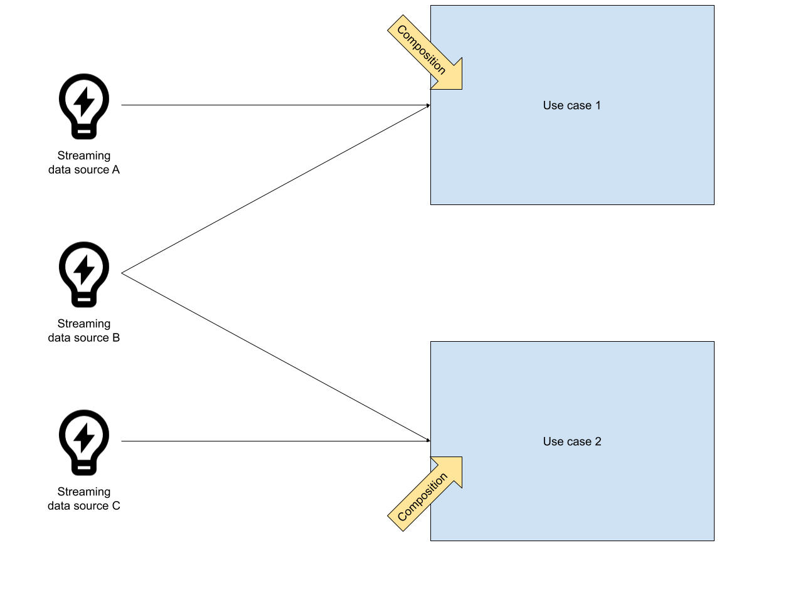
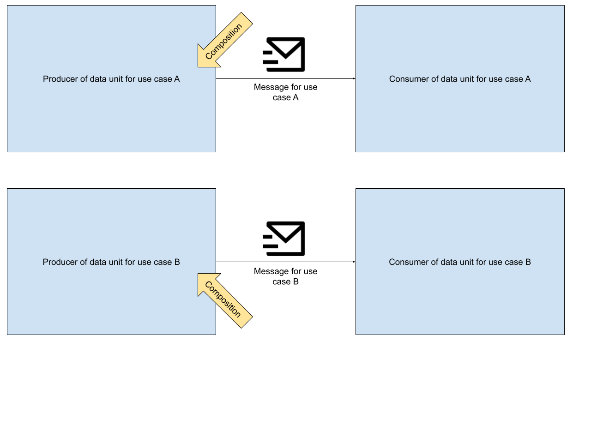

## Disclaimer
This article is the author’s opinion on similarities and differences between Streaming and Messaging.

## Streaming and Messaging
The first time I was busy with the terms *messaging* and *streaming* was during my master thesis in 2016. Among other things, the thesis was about different strategies of microservices integration. During that time, the term messaging was popular. Moroever, Kafka, which is a streaming platform, was popular, too. From a high-level perspective, messaging, kafka and streaming seem to be the same thing... but I never understood, why we have these two terms which are used synonymously in many contexts: messaging and streaming. This article is my answer to that question.
<!--more-->
I start with aspects that both have in common.

### Infrastructure
Communication flows through a separate infrastructural component, e.g., RabbitMQ, Kafka, ActiveMQ... even an FTP server is a valid candidate.

### Temporal decoupling
Producer and consumer can be available (online) at different times - just like it works with instant messaging on smartphones. 

### Location transparency
Producer and consumer do not have to know about each other’s location (IP address  and port). They know only the infrastructural component in between.

Heads up: These properties also apply to databases!

Now, let’s have a look at aspects that are different between messaging and streaming.

## Data Unit
In general, the size of a data unit, both in streaming and messaging tends to be small. Bytes up to a few megabytes. The transport of bigger files via a file storage could also be seen as a sort of messaging - however, this will not be part of this article.
When it comes to the difference between streaming and messaging, streaming data units tend to be smaller, because they are just raw information without context - e.g. a temperature measurement. In messaging, this is typically vice versa. Data units are compositions of multiple facts, designed for a specific use case. Consequently, they tend to be bigger than data units in the context of streaming.

### Data unit production & processing flow: Streaming

### Data unit production & processing flow: Messaging

## Responsibilities of Producers and Consumers
In streaming applications, producers define the structure of data units and publish them. Consequently, the consumers have to implement the processing logic on top of these data units. In messaging applications, data units are composed with a use case in mind. This composition is already a sort of processing. In summary it can be said that in streaming applications, the data units are post-processed while in messaging applications data units are pre-processed. In the real world, in most use cases, it will be somewhere in between.

## Data Rate
In a streaming application, data sources publish all of their data. Consequently, the data rate will be higher than in messaging applications, because the data is not drilled down to particular use cases. If data is available, it will be published. This is not a strict law, more my impression of the typical use cases.

## Data Unit Durability & Consumption Rate
In messaging applications, data units are typically consumed once. Most message brokers are also built with that in mind. E.g. RabbitMQ performs best, when no data units are stored inside the broker (“A happy rabbit is an empty rabbit”). In contrast, the streaming platform Kafka is *built for keeping* data in order to support use cases that need the data units to be consumed multiple times.

## Data Durability
As said before, typical streaming platforms such as Apache Kafka are built for keeping data. Thus, the data can be stored longer. With messaging, data units are something that should be consumed, as soon as possible. Therefore, message brokers are built to get rid of data instead of keeping it.

## Broker/Consumer Relationship
Streaming platforms are focused on collecting and providing data. Business logic is usually the responsibility of consumers. In contrast, messaging systems tend to be smarter. They provide features such as priority queues, message delays, message routing, filtering etc. In streaming platforms, all of this can be done as well - however, usually this has to be implemented by hand on the consumer side.

##  Integration with data mining use cases
When it comes to data mining and analytics, streaming applications provide great support out of the box, because the data units can be consumed multiple times and be re-composed at any time - no matter what the data is already been used for. With messaging, this tends to be not that easy, because the pre-composed data units have to be aggregated for the new data minig use cases and you will probably over-fetch data.

## Scalability
Storage capacity and data throughput: nowadays streaming platforms are built to be scalable for these aspects while keeping a low latency. If the concrete use case of your streaming application is not that demanding, a messaging system can be sufficient as well.

## Summary

|               | Streaming           | Messaging  |
| ------------- | ------------- | ----- |
| Data Unit content     | defined by data source | defined by the use case |
| Processing | post      |    pre |
| Data Unit size | smaller      |    bigger |
| Data Rate      | higher      |   lower |
| Data Unit Durability & Consumption Rate | Consume-Once --> infinitiy      |    Consume-Once |
| Broker/Consumer relationship | simple broker, smart consumers      |    smart broker, simple consumers |
| Integration with data mining use cases | easy      |    might be harder |
| Scalability | easier|    harder |

[newest posts on ConSol Labs]: https://labs.consol.de