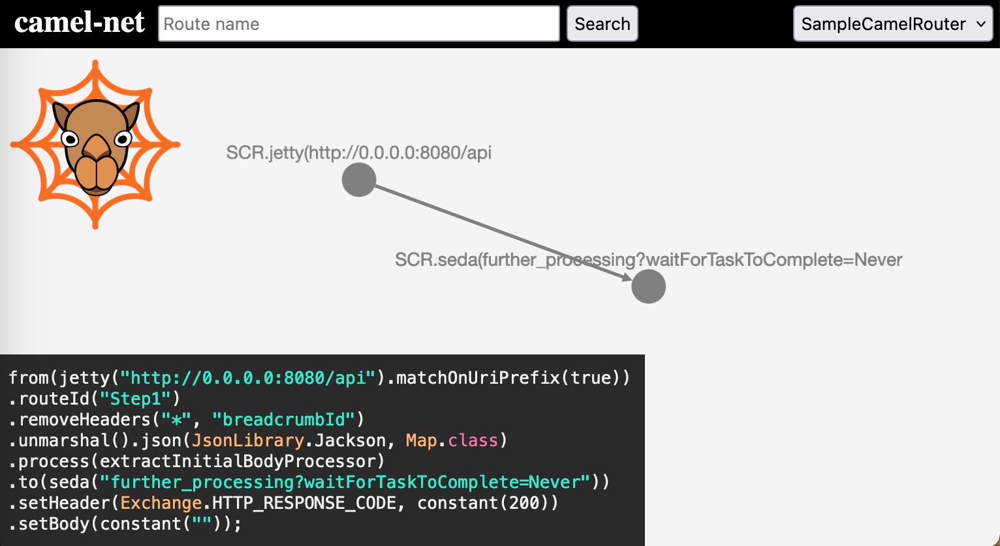
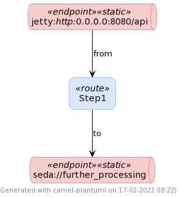
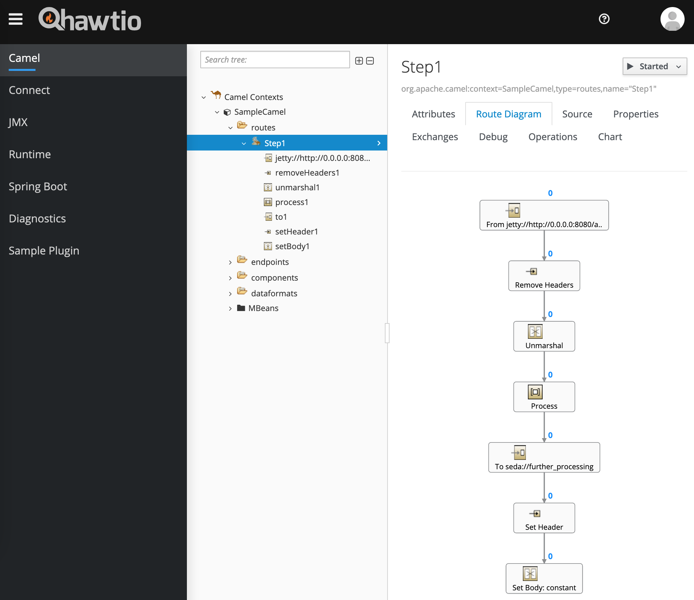
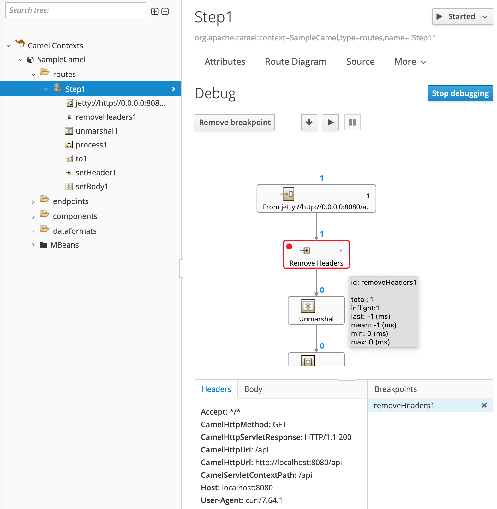
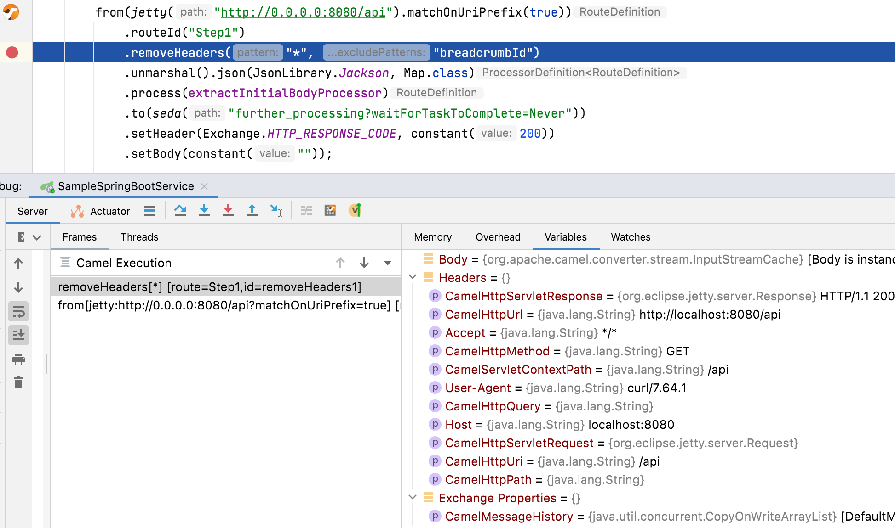
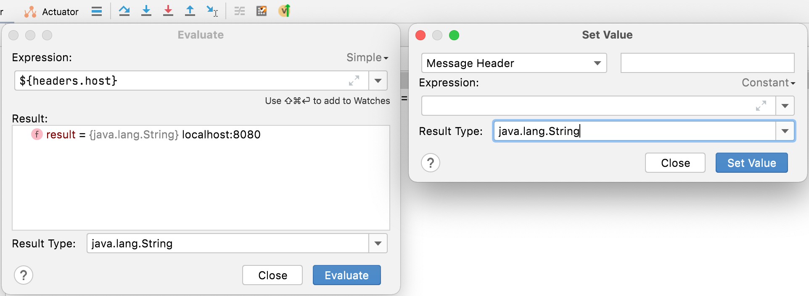

<div style="position: relative; float: right; margin-right: 1em; margin-bottom: 1em;"></div>

The documentation of software is an everyday business of a software developer and engineer. Especially for integration scenarios a diagram on the flow of a message through the system or the whole landscape is an essential illustration. Fortunately there are [standardised messaging patterns](https://www.enterpriseintegrationpatterns.com/patterns/messaging/toc.html){:target="_blank"} which can be used. Unfortunately, however, there is no tool which can create such visualizations out of the box directly of source code. In this article we will have a look at [Apache Camel](https://camel.apache.org/){:target="_blank"} and how it is possible to get a graphical representation of an integration route. We will also discuss about debugging it, as some tools have the feature to do this.
<!--more-->


## About Apache Camel and Enterprise Integration Patterns (EIPs)

The integration framework Apache Camel was created in [2008](https://projects.apache.org/json/projects/camel.json){:target="_blank"}. Since then it was continuously developed and maintained. At the moment it is versatile useable not only in standard java applications, also on Quarkus or natively on Kubernetes. The [documentation](https://camel.apache.org/docs/){:target="_blank"} is quite good and a large community available on [Zulip](https://camel.zulipchat.com/){:target="_blank"}, [stackoverflow.com](https://stackoverflow.com/questions/tagged/apache-camel){:target="_blank"} or [GitHub](https://github.com/apache/camel/){:target="_blank"} can help you if any challenge occurs.

As the framework is based on [Enterprise Integration Patterns](https://camel.apache.org/components/latest/eips/enterprise-integration-patterns.html){:target="_blank"} it is easy to find the best solution for nearly every integration scenario. Additionally, the implementation is straight forward as the documentation keeps an example for each pattern to be used with Apache Camel.

Here is a sample for a Apache Camel route:

```java
from("jetty:http://0.0.0.0:8080/api").matchOnUriPrefix(true))
    .routeId("Step1")
    .removeHeaders("*", "breadcrumbId")
    .unmarshal().json(JsonLibrary.Jackson, Map.class)
    .process(extractInitialBodyProcessor)
    .to(seda("further_processing?waitForTaskToComplete=Never"))
    .setHeader(Exchange.HTTP_RESPONSE_CODE, constant(200))
    .setBody(constant(""));
```

For manual documentation purposes you can then either use the [EIP icons in one of this diagramming applications](https://camel.apache.org/components/latest/eips/enterprise-integration-patterns.html#_eip_icons){:target="_blank"} or a web-based tool like [Visual Paradigm Online](https://online.visual-paradigm.com/de/diagrams/templates/enterprise-integration-patterns/camel-route/){:target="_blank"}.

## Available solutions to visualize Apache Camel routes

Starting with tools to only create a diagram of a Camel route we will end up with more powerful.


### [camel-net](https://github.com/BenjaminBrandmeier/camel-net){:target="_blank"}



Camel-net parses the source code of an application and creates an interactive graph of the found routes which can be accessed through the started webserver.

Pros
+ complete decoupled of the application
+ you can see the route behind an element

Cons
- the graph contains the same data, but always looks slightly different


### [camel-plantuml](https://camel.apache.org/blog/2021/05/plantuml-diagram/){:target="_blank"}



As the name already suggests a PlantUML code for a diagram will be generated with this tool. In order to use it you can either embed it to your application or connect remotely to it [see detailed instructions on Github](https://github.com/ncasaux/camel-plantuml){:target="_blank"}. No matter which way you use, you get the PlantUML code through a get request to the configured endpoint.

Pros
+ lightweight solution
+ you can add the resulting PlantUML code to your version control
+ possibility to connect remotely

Cons
- some other tool must be used to render the PlantUML code

The generated code for the image above was this:

<details><summary><i>- click to expand / collapse code section -</i></summary>

```text
@startuml SampleCamel

skinparam ArrowColor #Black

skinparam rectangle {
  RoundCorner 20
}

skinparam rectangle<<route>> {
  BorderColor #6C8EBF
  BackgroundColor #DAE8FC
}

skinparam queue<<endpoint>> {
}

skinparam queue<<static>> {
  BorderColor #B85450
  BackgroundColor #F8CECC
}

skinparam queue<<dynamic>> {
  BorderColor #82B366
  BackgroundColor #D5E8D4
}

footer Generated with camel-plantuml on %date("dd-MM-yyyy HH:mm")

' === Some useful settings for tweaking diagram layout ===
'left to right direction
'hide stereotype
'skinparam nodesep 50
'skinparam ranksep 50
'skinparam wrapWidth 250

rectangle route_1 <<route>> as "
Step1
"

queue endpoint_1 <<endpoint>><<static>> as "
jetty://http://0.0.0.0:8080/api
"

queue endpoint_2 <<endpoint>><<static>> as "
seda://further_processing
"

endpoint_1 --> route_1 : from

route_1 --> endpoint_2 : to

@enduml
```
</details>


### [Hawtio](https://hawt.io/){:target="_blank"}



The more powerful tool called Hawtio offers a web-based management interface like the JDK's binary `jconsole`. There are [several ways to get started](http://hawt.io/docs/get-started/){:target="_blank"}. If you embed it to your application and add the following to the `RouteBuilder` class, you can simply debug the Camel routes of the application in your browser (very useful in cases where the application is running somewhere else):

```java
getContext().setDebugging(true);
```

The web interface shows directly a reached breakpoint and displays the headers and the body of the current message:



Pros
+ nice visualisation of the routes 
+ offers many additional features
+ security of interface included
+ possibility to connect remotely
+ write our own or [use available](http://hawt.io/docs/plugins/){:target="_blank"} plugins to get additional features

Cons
- not as lightweight as other solutions

If you want to try hawtio with [Quarkus](https://quarkus.io/){:target="_blank"}, maybe take a look at [this Github issue](https://github.com/hawtio/hawtio/issues/2643){:target="_blank"}.


## Textual debugging of Camel routes

The Camel Route debugger is an IDE plugin and offers a textual solution to debug Camel routes. It is available for [IntelliJ](https://camel.apache.org/blog/2021/12/camelDebuggerForIntelliJ/){:target="_blank"}, [VS Code, Eclipse Desktop](https://camel.apache.org/blog/2022/02/camel-textual-debug-eclipse-vscode/){:target="_blank"} and [other IDEs](https://microsoft.github.io/debug-adapter-protocol/implementors/tools/){:target="_blank"}. Starting with Apache Camel version 3.15.0 a breakpoint in the IDE can be set and used for interaction directly in the route (a missing feature in the past).



It also allows some evaluations and manipulations:




# Conclusion

There are very interesting developments like the recently released IDE plugins and of course experienced tools like Hawtio. Mainly it depends on the requirements what to use. In my point of view, if you would like to

- take a brief look on the routing **[camel-net](https://github.com/BenjaminBrandmeier/camel-net){:target="_blank"}** is just fine
- add the results into version control **[camel-plantuml](https://camel.apache.org/blog/2021/05/plantuml-diagram/){:target="_blank"}** is a good choice 
- only debug your routes locally **[Camel Route debugger](https://camel.apache.org/blog/2022/02/camel-textual-debug-eclipse-vscode/){:target="_blank"}** will fit
- debug your routes and get additional information about your JVM then you can best use **[Hawtio](https://hawt.io/){:target="_blank"}**

For my purpose the documentation of Camel routes, as described in the beginning, the tool of choice is Hawtio. Especially for automation enthusiasts (as I am) the manual steps can be decreased with the usage of a (GUI) testing tool. The steps to implement would be in general: start the application, connect to the web interface, navigate to the route diagram page and take a screenshot ... but that is a topic for another article.

Finally, from my point of view the new debugging features of Apache Camel itself allows newcomers to easily get started with debugging and prevent experienced users from adding inline [processors](https://camel.apache.org/manual/processor.html){:target="_blank"} only for debugging purposes.