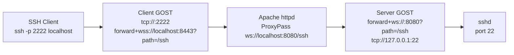

# Tunneling SSH over WebSocket with GOST in an OMD server:

In this blog post, we'll walk through a proof-of-concept (POC) setup for tunneling SSH traffic over WebSocket using the GOST tool. This configuration runs inside an OMD (Open Monitoring Distribution) container, leveraging Apache as a reverse proxy for the WebSocket connection. The goal is to securely forward SSH requests from a local client to the container's SSH daemon (sshd) via an encrypted tunnel.

This setup is useful for scenarios where direct SSH access is restricted, but HTTP/HTTPS ports are open (e.g., behind firewalls or in cloud environments). We'll use Podman to manage the container, self-signed certificates for TLS, and GOST for the tunneling logic.

## Overview

The architecture involves:

- **Client-side (outside the container)**: An SSH client connects to a local GOST listener, which forwards the traffic over secure WebSocket (WSS) to the container's Apache server.
- **Server-side (inside the container)**: Apache proxies the WebSocket connection to a GOST server instance, which then forwards the traffic to the local sshd on port 22.

Here's a high-level diagram of the flow:



## Prerequisites

- Podman installed on the host machine.
- GOST binary available both on the host and inside the container (download from [gost.run](https://gost.run/)).
- Basic knowledge of container management, Apache configuration, and SSH.

## Step-by-Step Setup

### 1. Start the OMD Container

On the host machine, run the OMD container with Podman, mapping the external port 8443 to the container's internal HTTPS port 443:

```bash
podman run -it -p 8443:443 --entrypoint bash docker.io/consol/omd-labs-rocky:nightly
```

This drops you into a bash shell inside the container.

### 2. Configure Certificates and SSH Inside the Container

Generate a self-signed certificate for TLS using `sscg`:

```bash
sscg -q \
    --cert-file /etc/pki/tls/certs/localhost.crt \
    --cert-key-file /etc/pki/tls/private/localhost.key \
    --ca-file /etc/pki/tls/certs/localhost.crt \
    --lifetime 365 \
    --hostname localhost \
    --email root@localhost
```

Generate SSH host keys and start the SSH daemon:

```bash
/usr/libexec/openssh/sshd-keygen rsa
/usr/sbin/sshd
```

Create a password for the user *demo*

```bash
passwd demo
```


### 3. Configure Apache for WebSocket Proxying

Edit the Apache configuration file `/omd/apache/ssh.conf` to enable WebSocket proxying:

```apache
<IfModule !mod_proxy.c>
    LoadModule proxy_module modules/mod_proxy.so
</IfModule>

<IfModule !mod_proxy_http.c>
    LoadModule proxy_http_module modules/mod_proxy_http.so
</IfModule>

<IfModule !mod_proxy_wstunnel.c>
    LoadModule proxy_wstunnel_module modules/mod_proxy_wstunnel.so
</IfModule>

<IfModule !mod_rewrite.c>
    LoadModule rewrite_module modules/mod_rewrite.so
</IfModule>

<Location "/ssh">
    RewriteEngine On
    RewriteCond %{HTTP:Upgrade} websocket [NC]
    RewriteCond %{HTTP:Connection} upgrade [NC]
    RewriteRule ^/ssh$ ws://localhost:8080/ssh [P,L]
    ProxyPass ws://localhost:8080/ssh retry=0 disablereuse=On
    ProxyPassReverse ws://localhost:8080/ssh
</Location>
```

Start Apache:

```bash
httpd
```

### 4. Run Server-Side GOST

Inside the container, start the GOST server to listen on WebSocket and forward to local SSH:

```bash
gost -DD -L forward+ws://:8080?path=/ssh -F tcp://127.0.0.1:22
```

### 5. Run Client-Side GOST and Test SSH

Back on the host machine (outside the container), start the client-side GOST:

```bash
gost -DD -L tcp://:2222 -F forward+wss://localhost:8443?path=/ssh
```

Now, connect via SSH to the tunneled port:

```bash
ssh -p 2222 -l demo localhost
```

You should be prompted for authentication and connected to the container's sshd as user 'demo'.

## Potential Issues and Troubleshooting

- **Self-Signed Certs**: Use `-k` in curl tests or add the cert to your trust store for production.
- **Port Mapping**: Ensure Podman's port mapping (8443:443) is correct; adjust if using a different external port.
- **Logs**: Check GOST logs with `-DD` for debug info, and Apache error logs for proxy issues.
- **Security**: This POC uses no authentication on the WebSocket path—add Basic Auth or other mechanisms for real-world use.

## Conclusion

This setup demonstrates how to tunnel traditional protocols like SSH over modern web technologies, making it firewall-friendly and scalable. Experiment with adding authentication or multiple forwards for more advanced scenarios!

If you have questions or improvements, drop a comment below.
